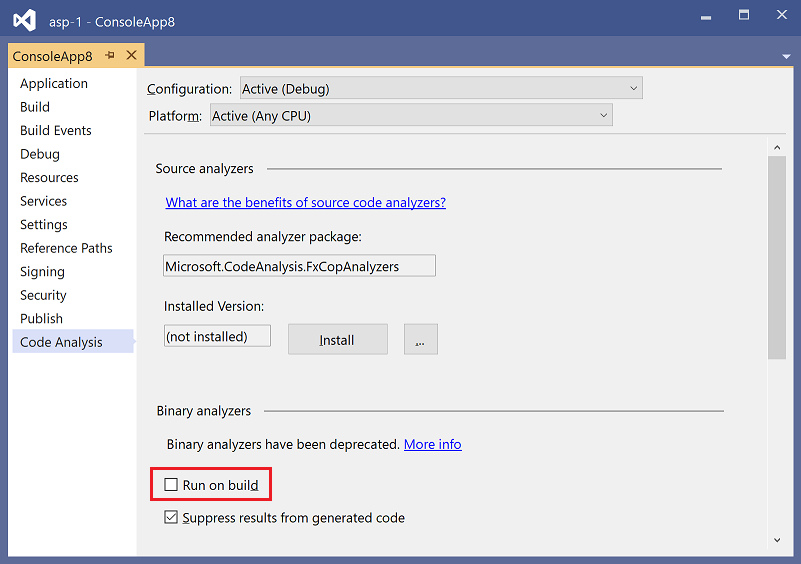

# How to: Enable and disable binary code analysis for managed code

You can configure legacy code analysis (binary analysis) to run after each build of a managed code project. You can also have different settings for each build configuration, for example, debug and release.

> [!NOTE]
> Legacy analysis is not available for newer project types such as .NET Core and .NET Standard apps. These projects use [.NET Compiler Platform-based code analyzers](roslyn-analyzers-overview.md) to analyze code, both live and at build time. For information about disabling source code analysis in these projects, see [How to disable source code analysis](disable-code-analysis.md).

To enable or disable legacy code analysis:

1. In **Solution Explorer**, select and hold (or right-click) the project, and then select **Properties**.

2. In the properties dialog box for the project, go to the **Code Analysis** tab.

3. Specify the build type in **Configuration** and the target platform in **Platform**. (Non-.NET Core/.NET Standard projects only.)

::: moniker range="vs-2017"

4. To enable or disable automatic code analysis, select or clear the **Enable Code Analysis on Build** check box.

::: moniker-end

::: moniker range=">=vs-2019"

4. To enable or disable automatic code analysis, select or clear the **Run on build** check box in the **Binary analyzers** section.

   

5. If you need to disable legacy analysis, verify that legacy code analysis is disabled in the project file. Set the `RunCodeAnalysis` property to false:

   `<RunCodeAnalysis>false</RunCodeAnalysis>`

::: moniker-end

> [!NOTE]
> Disabling binary code analysis on build does not affect [.NET Compiler Platform-based code analyzers](roslyn-analyzers-overview.md), which always execute at build if you installed them as a NuGet package. For information about disabling analysis from these analyzers, see [How to disable source code analysis](disable-code-analysis.md).
