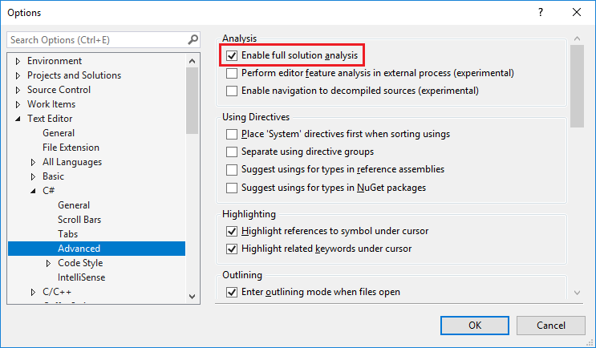

# How to: Enable and disable full solution analysis for managed code

*Full solution analysis* means that code analysis examines all the C# or Visual Basic files in the solution, regardless of whether they are open in the editor or not. By default, full solution analysis is *enabled* for Visual Basic and *disabled* for C#.

It can be useful to see all issues in all files, but it can also be distracting. It slows Visual Studio down if your solution is very large or has many files. To limit the number of issues shown and improve Visual Studio performance, you can disable full solution analysis. You can easily reenable this feature if necessary.

In the following image, full solution analysis is enabled. Compiler and code analysis issues in all of the files in the solution are shown, even if they're not open.

The following image shows the results from the same solution after disabling full solution analysis. Only compiler errors and code analysis issues in open solution files appear in the Error List.

## Toggle full solution analysis

1. To open the **Options** dialog box, on the menu bar in Visual Studio choose **Tools** > **Options**.

1. In the **Options** dialog box, choose **Text Editor** > **C#** or **Basic** > **Advanced**.

1. Select the **Enable full solution analysis** check box to enable full solution analysis, or clear the box to disable it. Choose **OK** when you're done.

   

## Automatically disable full solution analysis

If Visual Studio detects that 200 MB or less of system memory is available to it, it automatically disables full solution analysis (and some other features) if it's enabled. If this occurs, an alert appears informing you that Visual Studio has disabled some features. A button lets you reenable full solution analysis if you want.

