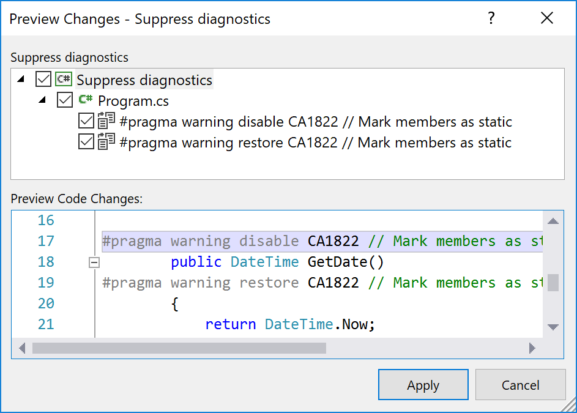
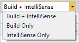
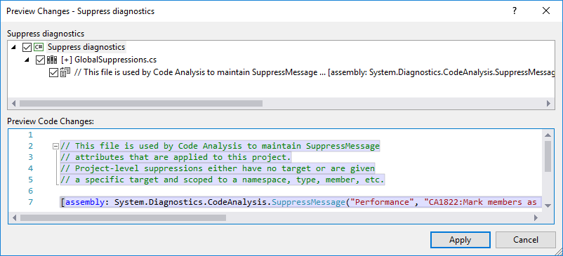

# Suppress code analysis violations

If you collaborate with your team as you create code, it's often useful to indicate that a warning isn't applicable. Suppressing code analysis violations indicates to team members that the code was reviewed, and the warning can be suppressed. The following sections describe the different ways to suppress code analysis violations using the Visual Studio IDE.

## Suppress violations using the EditorConfig file

In the EditorConfig file for your solution or project, add an entry for each rule you want to configure and set its severity to `none`. For example, `dotnet_diagnostic.CA1822.severity = none`. For more information, see [Manually configure rule severity in an EditorConfig file](../code-quality/use-roslyn-analyzers.md#set-rule-severity-in-an-editorconfig-file). To add an EditorConfig file, see [Add an EditorConfig file to a project](../ide/create-portable-custom-editor-options.md#add-and-remove-editorconfig-files).

## Suppress violations in source code

You can suppress violations in your source code using a preprocessor directive, which suppresses violations for a specific line of code:

- C#: [#pragma warning](/dotnet/csharp/language-reference/preprocessor-directives#pragma-warning)
- Visual Basic: [Disable warning](/dotnet/visual-basic/language-reference/directives/disable-enable)

Or, you can use the [SuppressMessageAttribute attribute](#in-source-suppression-and-the-suppressmessageattribute-attribute) to suppress a warning in your C# and Visual Basic code.

### Suppress violations using the code editor

To suppress violations using the code editor, follow these steps:

1. Place the cursor in the line of code with the violation and press **Ctrl**+**Period (.)** or **Alt+Enter** to open the **Quick Actions** menu.

1. Select **Suppress or configure issues** > **Suppress \<rule number>**, and then choose either **in Source** or **in Source (attribute)**.

   - If you choose **in Source**, you see a preview of the preprocessor directive added to your code.

     :::image type="content" source="media/suppress-diagnostic-from-editor.png" alt-text="Screenshot that shows in Source selection from the Quick Actions Suppress menu." lightbox="media/suppress-diagnostic-from-editor.png":::

   - If you choose **in Source (attribute)**, you see a preview of the [SuppressMessageAttribute attribute](#in-source-suppression-and-the-suppressmessageattribute-attribute) added to your code.

      :::image type="content" source="media/suppress-diagnostic-from-editor-attribute.png" alt-text="Screenshot that shows in Source (attribute) selection from the Quick Actions Suppress menu." lightbox="media/suppress-diagnostic-from-editor-attribute.png":::

::: moniker range="vs-2019"
### Suppress violations using the Error List

To suppress violations using the **Error List** window, follow these steps:

1. From the **Error List** window, select the rules you want to suppress.

1. Right-click, and then select **Suppress** > **In Source**.

   The **Preview Changes** dialog opens and shows a preview of the C# [#pragma warning directive](/dotnet/csharp/language-reference/preprocessor-directives/preprocessor-pragma-warning) or Visual Basic [#Disable warning directive](/dotnet/visual-basic/language-reference/directives/directives) added to the source code.

    

1. Select **Apply** to save the changes to your code file.

#### Exclude Error List build diagnostics

If you don't see the **Suppress** menu option in the **Error List** window, the violation is likely from a build and not live analysis. The **Error List** window displays diagnostics, or rule violations, from both live code analysis and builds. Because build diagnostics can be stale, for example, if you edited the code to fix the violation but didn't rebuild it, you can't always suppress these diagnostics from the **Error List**.

Diagnostics from live analysis, or IntelliSense, are always up-to-date with current sources and can always be suppressed from the **Error List**. To exclude build diagnostics from your selection, follow these steps:

1. From the **Error List** source filter dropdown list, change the selection from **Build + IntelliSense** to **IntelliSense Only**.

   

1. Select the diagnostics you want to suppress and proceed as described previously.
::: moniker-end

## Suppress violations using a global suppression file

The [global suppression file](#global-level-suppressions) uses the [SuppressMessageAttribute attribute](#in-source-suppression-and-the-suppressmessageattribute-attribute) to suppress code violations.

### Use a global suppression file from the code editor

To suppress violations with a global suppression file by using the code editor, follow these steps:

1. In the code editor, place the cursor on a line of code with a violation and press **Ctrl**+**Period (.)** or **Alt+Enter** to open the **Quick Actions** menu.

1. Select **Suppress \<rule number>**, and then choose **in Suppression File**.

    Visual Studio creates a tab in the code editor containing the new global suppression file.

::: moniker range="vs-2019"
### Use a global suppression file from the Error List

To suppress violations with a global suppression file by using the **Error List** window, follow these steps:

1. From the **Error List** window, select the rules you want to suppress.

1. Right-click, and then select **Suppress** > **In Suppression File**.

   The **Preview Changes** dialog box opens and shows a preview of the <xref:System.Diagnostics.CodeAnalysis.SuppressMessageAttribute> attribute added to the global suppression file.

   

1. Select **Apply** to save the global suppression file.
::: moniker-end

## Suppress all current violations

Suppressing all current violations is sometimes referred to as *baselining*. To suppress all current violations in a solution or project, follow these steps:

1. From the Visual Studio menu bar, select **Analyze** > **Build and Suppress Active Issues**.

1. Select **For solution** to suppress violations for the entire solution, or select **For \<project name>** to suppress violations for your project only.

## Suppress violations using project settings

To suppress violations by using Solution Explorer project settings, follow these steps:

1. From **Solution Explorer**, select your project.

1. Right-click, and then select **Properties** (or press **Alt + Enter**).

1. From the **Properties** window, select **Code Analysis** from the left pane, and then clear **Suppress results from generated code**.

::: moniker range="vs-2019"

## Suppress violations using a rule set

From the rule set editor, clear the checkbox next to its name or set **Action** to **None**.

::: moniker-end

## In-source suppression and the SuppressMessageAttribute attribute

In-source suppression (ISS) uses the <xref:System.Diagnostics.CodeAnalysis.SuppressMessageAttribute> attribute to suppress a warning. You can add the `SuppressMessageAttribute` attribute to the source file near the code segment that generated the warning.

You can either enter the attribute manually in the code editor, or add the attribute automatically as follows:

1. In the code editor, place the cursor on a line of code with a violation and press **Ctrl**+**Period (.)** or **Alt+Enter** to open the **Quick Actions** menu.

1. Select **Suppress or configure issues** > **Suppress \<rule number>** from the **Quick Actions** menu.

1. Do one of the following steps:

   - Select **in Source (attribute)**.

     Visual Studio adds a `SuppressMessageAttribute` attribute to your code.

   - Select **in Suppression File**.

     Visual Studio creates a tab in the code editor containing a new global suppression file with `SuppressMessageAttribute` attributes.

The `SuppressMessageAttribute` attribute is a conditional attribute, which is included in the metadata of your managed code assembly. This attribute is included only if the `CODE_ANALYSIS` compilation symbol is defined at compile time.

In C++ and CLI code only, use the macros `CA_SUPPRESS_MESSAGE` or `CA_GLOBAL_SUPPRESS_MESSAGE` in the header file to add the attribute.

If you migrate a project to the latest version of Visual Studio, you might see a large number of code analysis warnings. If you aren't ready to fix the warnings, you can suppress all of them by selecting **Analyze** > **Build and Suppress Active Issues**.

> [!NOTE]
> Don't use in-source suppressions on release builds, to prevent shipping the in-source suppression metadata accidentally.

### SuppressMessageAttribute attribute format

The `SuppressMessageAttribute` attribute has the following format:

### [C#](#tab/csharp)

```csharp
[Scope:SuppressMessage("Rule Category", "Rule Id", Justification = "Justification", MessageId = "MessageId", Scope = "Scope", Target = "Target")]
```

### [VB](#tab/vb)

```vb
<Scope:SuppressMessage("Rule Category", "Rule Id", Justification = "Justification", MessageId = "MessageId", Scope = "Scope", Target = "Target")>
```

---

The properties of the attribute include:

- `Category`: The category of the rule. For more information about code analysis rule categories, see [Code quality rules](/dotnet/fundamentals/code-analysis/quality-rules/index).

- `CheckId:` The identifier of the rule. Support includes both a short and long name for the rule identifier. The short name is `CAXXXX`; the long name is `CAXXXX:FriendlyTypeName`.

- `Justification`: The text used to document the reason for suppressing the message.

- `MessageId`: The unique identifier of the problem for each message.

- `Scope`: The target on which the warning is being suppressed. If the target isn't specified, the system sets it to the target of the attribute. Supported [scopes](xref:System.Diagnostics.CodeAnalysis.SuppressMessageAttribute.Scope) include:

  - [`module`](#module-suppression-scope): This scope suppresses warnings against an assembly. It's a global suppression that applies to the entire project.

  - `resource`: ([Legacy FxCop](../code-quality/static-code-analysis-for-managed-code-overview.md) only) This scope suppresses warnings in diagnostic info written to resource files that are part of the module (assembly). This scope isn't read or respected in C#/VB compilers for Roslyn analyzer diagnostics, which only analyze source files.

  - `type`: This scope suppresses warnings against a type.

  - `member`: This scope suppresses warnings against a member.

  - `namespace`: This scope suppresses warnings against the namespace itself. It doesn't suppress warnings against types within the namespace.

  - `namespaceanddescendants`: (Requires compiler version 3.x or higher and Visual Studio 2019 or later) This scope suppresses warnings in a namespace and all its descendant symbols. Legacy analysis ignores the `namespaceanddescendants` value.

- `Target`: An identifier that specifies the target on which the warning is being suppressed. It must contain a fully qualified component name.

When you see warnings in Visual Studio, you can view examples of `SuppressMessageAttribute` by [adding a suppression to the global suppression file](../code-quality/use-roslyn-analyzers.md#suppress-violations). The suppression attribute and its required properties appear in a preview window.

### SuppressMessageAttribute usage

Code analysis warnings are suppressed at the level to which the <xref:System.Diagnostics.CodeAnalysis.SuppressMessageAttribute> attribute is applied. For example, the attribute can be applied at the assembly, module, type, member, or parameter level. The purpose of applying this attribute is to tightly couple the suppression information to the code where the violation occurs.

The general form of suppression includes the rule category and a rule identifier, which contains an optional human-readable representation of the rule name. For example:

`[SuppressMessage("Microsoft.Design", "CA1039:ListsAreStrongTyped")]`

If there are strict performance reasons for minimizing in-source suppression metadata, the rule name can be omitted. The rule category and its rule ID together form a sufficiently unique rule identifier. For example:

`[SuppressMessage("Microsoft.Design", "CA1039")]`

For maintainability reasons, omitting the rule name isn't recommended.

### Suppress selective violations within a method body

Suppression attributes can be applied to a method, but can't be embedded within a method body. All violations of a particular rule are suppressed if you add the <xref:System.Diagnostics.CodeAnalysis.SuppressMessageAttribute> attribute to the method.

In some cases, you might want to suppress a particular instance of the violation. Consider the example where future code isn't automatically exempt from the code analysis rule. Certain code analysis rules allow you to suppress a particular instance of the violation by using the `MessageId` property of the `SuppressMessageAttribute` attribute. In general, legacy rules for violations on a particular symbol (a local variable or parameter) respect the `MessageId` property. [CA1500:VariableNamesShouldNotMatchFieldNames](../code-quality/ca1500.md) is an example of such a rule. However, legacy rules for violations on executable code (non-symbol) don't respect the `MessageId` property. Also, .NET Compiler Platform ("Roslyn") analyzers don't respect the `MessageId` property.

To suppress a particular symbol violation of a rule, specify the symbol name for the `MessageId` property of the `SuppressMessageAttribute` attribute. The following example shows code with two violations of [CA1500:VariableNamesShouldNotMatchFieldNames](../code-quality/ca1500.md): one violation for the `name` variable and another violation for the `age` variable. Only the violation for the `age` symbol is suppressed.

### [C#](#tab/csharp)

```csharp
public class Animal
{
    int age;
    string name;

    [System.Diagnostics.CodeAnalysis.SuppressMessage("Microsoft.Maintainability", "CA1500:VariableNamesShouldNotMatchFieldNames", MessageId = "age")]
    private void PrintInfo()
    {
        int age = 5;
        string name = "Charlie";

        Console.WriteLine($"Age {age}, Name {name}");
    }
}
```

### [VB](#tab/vb)

```vb
Public Class Animal
    Dim age As Integer
    Dim name As String

    <CodeAnalysis.SuppressMessage("Microsoft.Maintainability", "CA1500:VariableNamesShouldNotMatchFieldNames", MessageId:="age")>
    Sub PrintInfo()
        Dim age As Integer = 5
        Dim name As String = "Charlie"

        Console.WriteLine("Age {0}, Name {1}", age, name)
    End Sub

End Class
```

---

### Global-level suppressions

The managed code analysis tool examines the `SuppressMessageAttribute` attributes that are applied at the assembly, module, type, member, or parameter level. It also submits violations against resources and namespaces. These violations must be applied at the global level and are scoped and targeted. For example, the following message suppresses a namespace violation:

`[module: SuppressMessage("Microsoft.Design", "CA1020:AvoidNamespacesWithFewTypes", Scope = "namespace", Target = "MyNamespace")]`

For global-level suppressions:

- When you suppress a warning with a `namespace` scope, it suppresses the warning against the namespace itself. It doesn't suppress the warning against types within the namespace.

- `Target` always contains the fully qualified item name.

- Any suppression can be expressed by specifying an explicit scope. These suppressions must live at the global level. You can't specify member-level suppression by modifying a type.

- Global-level suppressions are the only way to suppress messages that refer to compiler-generated code that doesn't map to explicitly provided user source. For example, the following code suppresses a violation against a compiler-emitted constructor:

   `[module: SuppressMessage("Microsoft.Design", "CA1055:AbstractTypesDoNotHavePublicConstructors", Scope="member", Target="Microsoft.Tools.FxCop.Type..ctor()")]`

#### Global suppression file

The global suppression file maintains suppressions that are either global-level suppressions or suppressions that don't specify a target. For example, suppressions for assembly-level violations are stored in this file. Additionally, some ASP.NET suppressions are stored in this file because project-level settings aren't available for code behind a form. Visual Studio creates and adds a global suppression file to your project the first time you select the **In Project Suppression File** option of the **Suppress** command in the **Error List** window.

#### Module suppression scope

You can suppress code quality violations for the entire assembly by using the `module` scope.

For example, the following attribute in your *GlobalSuppressions* project file suppresses the ConfigureAwait violation for an ASP.NET Core project:

`[assembly: System.Diagnostics.CodeAnalysis.SuppressMessage("Reliability", "CA2007:Consider calling ConfigureAwait on the awaited task", Justification = "ASP.NET Core doesn't use thread context to store request context.", Scope = "module")]`

### Generated code

Managed code compilers and some external tools generate code to help rapid code development. Compiler-generated code that appears in source files is marked with the `GeneratedCodeAttribute` attribute.

For source code analysis, you can suppress messages in generated code in an *.editorconfig* file. For more information, see [Exclude generated code](/dotnet/fundamentals/code-analysis/configuration-options#exclude-generated-code).

For legacy code analysis, you can choose whether to suppress code analysis warnings and errors for generated code. For information about how to suppress such warnings and errors, see [Suppress code analysis warnings for generated code](../code-quality/how-to-suppress-code-analysis-warnings-for-generated-code.md).

> [!NOTE]
> Code analysis ignores `GeneratedCodeAttribute` when it is applied to either an entire assembly or a single parameter.

## Related content

- <xref:System.Diagnostics.CodeAnalysis.SuppressMessageAttribute.Scope>
- <xref:System.Diagnostics.CodeAnalysis>
- [Customize Roslyn analyzer rules](../code-quality/use-roslyn-analyzers.md)
