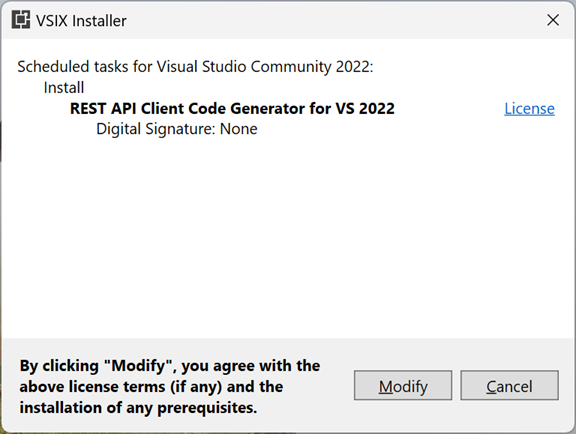

# Install external analyzers

Visual Studio includes a built-in core set of .NET Compiler Platform (*Roslyn*) analyzers, which are always on. If you need more analyzers, you can install external analyzers either as a NuGet package, or as a Visual Studio extension (*.vsix* file).

## Install NuGet analyzer packages

To install a NuGet analyzer package, follow these steps:

1. Find the analyzer package you want to install on [NuGet](https://www.nuget.org).

   For example, you might want to install [StyleCop.Analyzers](https://www.nuget.org/packages/stylecop.analyzers/) to search for style issues in your codebase.

2. Install the package in Visual Studio, using either the [NuGet Package Manager](/nuget/quickstart/install-and-use-a-package-in-visual-studio#nuget-package-manager) or the [Package Manager Console](/nuget/quickstart/install-and-use-a-package-in-visual-studio#package-manager-console).

   The analyzer assemblies are installed and appear in **Solution Explorer** under **References** > **Analyzers**.

## Install VSIX analyzers

To install a Visual Studio Extension-based analyzer, follow these steps:

1. In Visual Studio, select **Extensions** > **Manage Extensions**.

   The **Manage Extensions** dialog box opens.

   > [!NOTE]
   > Alternatively, you can find and download the analyzer extension directly from [Visual Studio Marketplace](https://marketplace.visualstudio.com).

1. Expand **Online** in the left pane, and then select **Visual Studio Marketplace**.

1. In the search box, enter the name of the analyzer extension you want to install, and then select it.

1. Select **Download**.

   The extension is downloaded.

1. Select **Close** to close the dialog box, and then close all instances of Visual Studio to launch the **VSIX Installer**.

   The **VSIX Installer** dialog box opens.

   

1. Select **Modify** to start the installation.

1. After a minute or two, the installation completes. Select **Close**.

1. Reopen Visual Studio.

1. To verify whether the extension is installed, select **Extensions** > **Manage Extensions**. In the **Manage Extensions** dialog box, select **Installed** in the left pane, and then search for the extension by name.

## Related content

- [Customize Roslyn analyzer rules](../code-quality/use-roslyn-analyzers.md)
- [Code analysis using .NET compiler platform (Roslyn) analyzers](../code-quality/roslyn-analyzers-overview.md)
- [Install .NET analyzers](../code-quality/install-net-analyzers.md)
