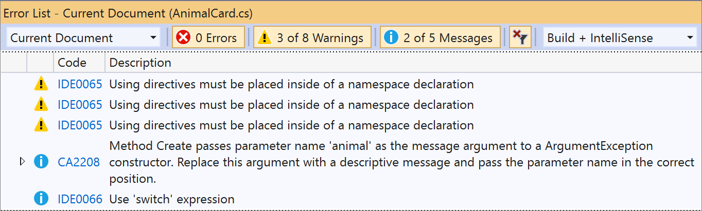

# Overview of source code analysis

.NET Compiler Platform (Roslyn) Analyzers inspect your C# or Visual Basic code for style, quality, maintainability, design, and other issues. This inspection or analysis is done during design time in all open files.

Analyzers can be divided into the following groups:

- [Code style](/dotnet/fundamentals/code-analysis/code-style-rule-options?preserve-view=true&view=vs-2019#convention-categories) analyzers are built in to Visual Studio. The diagnostic ID, or code, for these analyzers is of the format IDExxxx, for example, IDE0067. You can configure preferences in the [text editor options page](../ide/code-styles-and-code-cleanup.md) or in an [EditorConfig file](/dotnet/fundamentals/code-analysis/code-style-rule-options). Starting in .NET 5.0, code style analyzers are included with the .NET SDK and can be strictly enforced as build warnings or errors. For more information, see [here](/dotnet/fundamentals/productivity/code-analysis#code-style-analysis).

- [Code quality](/dotnet/fundamentals/code-analysis/quality-rules/index) analyzers are now included starting with the .NET 5 SDK and enabled by default. The diagnostic ID, or code, for these analyzers is of the format CAxxxx, for example, CA1822. For more information, see [Overview of .NET code quality analysis](/dotnet/fundamentals/productivity/code-analysis#code-quality-analysis).

- Third party analyzers can be installed as a NuGet package or a Visual Studio extension. Third party analyzers, such as [StyleCop](https://www.nuget.org/packages/StyleCop.Analyzers/), [Roslynator](https://www.nuget.org/packages/Roslynator.Analyzers/), [XUnit Analyzers](https://www.nuget.org/packages/xunit.analyzers/), and [Sonar Analyzer](https://www.nuget.org/packages/SonarAnalyzer.CSharp/).

## Severity levels of analyzers

Each analyzer has one of the following severity levels:

| Severity (Solution Explorer) | Severity (EditorConfig file) | Build-time behavior | Editor behavior |
|-|-|-|
| Error | `error` | Violations appear as *Errors* in the Error List and in command-line build output, and cause builds to fail.| Offending code is underlined with a red squiggle and marked by a small red box in the scroll bar. |
| Warning | `warning` | Violations appear as *Warnings* in the Error List and in command-line build output, but do not cause builds to fail. | Offending code is underlined with a green squiggle and marked by a small green box in the scroll bar. |
| Info | `suggestion` | Violations appear as *Messages* in the Error List, and not at all in command-line build output. | Offending code is underlined with a gray squiggle and marked by a small gray box in the scroll bar. |
| Hidden | `silent` | Non-visible to user. | Non-visible to user. The diagnostic is reported to the IDE diagnostic engine, however. |
| None | `none` | Suppressed completely. | Suppressed completely. |
| Default | `default` | Corresponds to the default severity of the rule. To determine what the default value for a rule is, look in the Properties window. | Corresponds to the default severity of the rule. |

If rule violations are found by an analyzer, they're reported in the code editor (as a *squiggle* under the offending code) and in the Error List window.

The analyzer violations reported in the error list match the [severity level setting](../code-quality/use-roslyn-analyzers.md#configure-severity-levels) of the rule. Analyzer violations also show up in the code editor as squiggles under the offending code. The following image shows three violations&mdash;one error (red squiggle), one warning (green squiggle), and one suggestion (three grey dots):

Many analyzer rules, or *diagnostics*, have one or more associated *code fixes* that you can apply to correct the rule violation. Code fixes are shown in the light bulb icon menu along with other types of [Quick Actions](../ide/quick-actions.md). For information about these code fixes, see [Common Quick Actions](../ide/quick-actions.md).

## Configure analyzer severity levels

You can configure the severity of analyzer rules, or *diagnostics*, in an [EditorConfig file](../code-quality/use-roslyn-analyzers.md#set-rule-severity-in-an-editorconfig-file) or from the [light bulb menu](../code-quality/use-roslyn-analyzers.md#set-rule-severity-from-the-light-bulb-menu).

Analyzers can also be configured to inspect code at build time and live as you type. You can configure the scope of live code analysis to execute for the current document only, all open documents, or the entire solution. See [How to: Configure the scope of live code analysis](./configure-live-code-analysis-scope-managed-code.md).

> [!TIP]
> Build-time errors and warnings from code analyzers are shown only if the analyzers are installed as a NuGet package. The built-in analyzers (for example, IDE0067 and IDE0068) never run during build.

## NuGet package versus VSIX extension

Third party analyzers can be installed per-project via a NuGet package. Some are also available as a Visual Studio extension, in which case they apply to any solution you open in Visual Studio. There are some key behavior differences between these two methods of [installing analyzers](../code-quality/install-roslyn-analyzers.md).

### Scope

If you install analyzers as a Visual Studio extension, they apply at the solution level and to all instances of Visual Studio. If you install the analyzers as a NuGet package, which is the preferred method, they apply only to the project where the NuGet package was installed. In team environments, analyzers installed as NuGet packages are in scope for *all developers* that work on that project.

### Build errors

To have rules enforced at build time, including through the command line or as part of a continuous integration (CI) build you can choose from one of the following options:

- Create a .NET 5.0 or later project which includes analyzers by default in the .NET SDK. Code analysis is enabled, by default, for projects that target .NET 5.0 or later. You can enable code analysis on projects that target earlier .NET versions by setting the [EnableNETAnalyzers](/dotnet/core/project-sdk/msbuild-props#enablenetanalyzers) property to true.

- Install analyzers as a NuGet package. Analyzer warnings and errors don't show up in the build report if you install the analyzers as an extension.

The following image shows the command-line build output from building a project that contains an analyzer rule violation:

### Rule severity

You cannot configure the severity of rules from analyzers that were installed as a Visual Studio extension. To configure [rule severity](../code-quality/use-roslyn-analyzers.md#configure-severity-levels), install the analyzers as a NuGet package.

## Next steps

> [!div class="nextstepaction"]
> [Install code analyzers in Visual Studio](../code-quality/install-roslyn-analyzers.md)

> [!div class="nextstepaction"]
> [Use code analyzers in Visual Studio](../code-quality/use-roslyn-analyzers.md)

## See also

- [Analyzers FAQ](analyzers-faq.yml)
- [Write your own code analyzer](../extensibility/getting-started-with-roslyn-analyzers.md)
- [.NET Compiler Platform SDK](/dotnet/csharp/roslyn-sdk/)