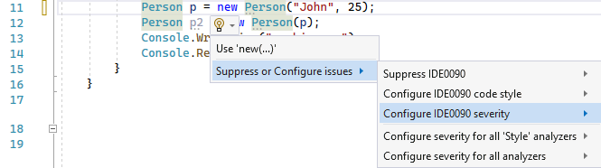
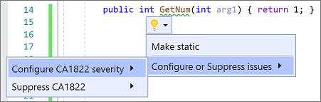
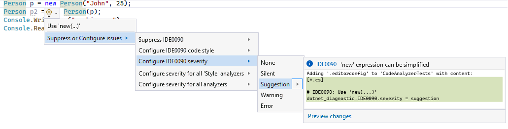
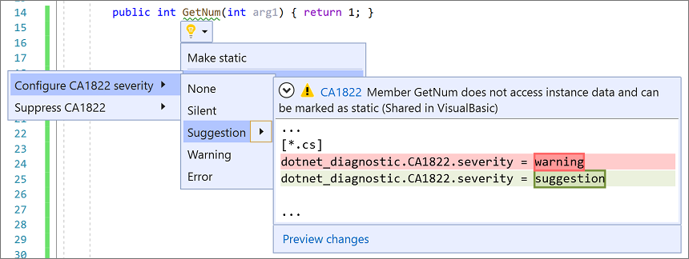
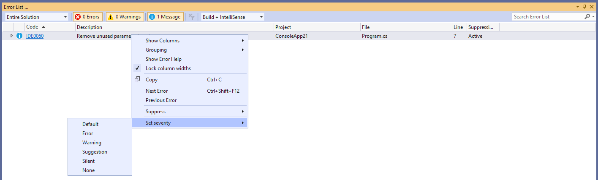
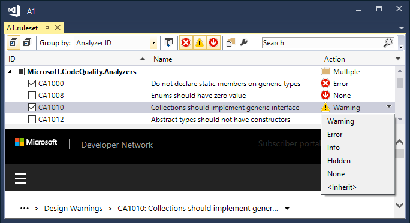
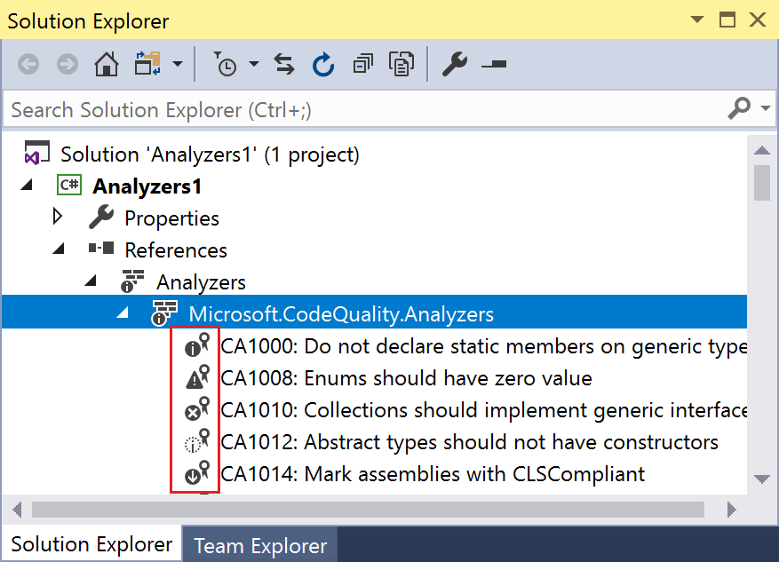
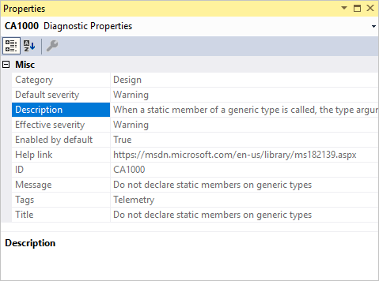
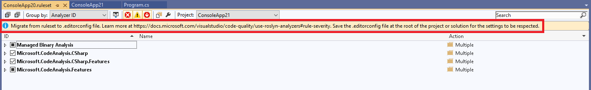
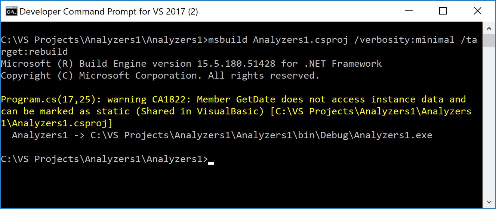

# Customize Roslyn analyzer rules

Each Roslyn analyzer rule, or *diagnostic*, has a default severity and suppression state that you can customize for your project. This article covers setting analyzer severities and suppressing analyzer violations.

## Severity levels

::: moniker range=">=vs-2022"
You can configure the severity of analyzer rules in an [EditorConfig file](#set-rule-severity-in-an-editorconfig-file) and from the [light bulb menu](#set-rule-severity-from-the-light-bulb-menu).
::: moniker-end

::: moniker range="vs-2019"
In Visual Studio 2019 version 16.3 and later, you can configure the severity of analyzer rules in an [EditorConfig file](#set-rule-severity-in-an-editorconfig-file), from the [light bulb menu](#set-rule-severity-from-the-light-bulb-menu), and from the **Error List** window.
::: moniker-end

In Visual Studio 2019 version 16.3 and later, you can configure the severity of analyzer rules in an [EditorConfig file](#set-rule-severity-in-an-editorconfig-file), from the [light bulb menu](#set-rule-severity-from-the-light-bulb-menu), and from the **Error List** window.

The following table shows the different severity options that you can configure for a diagnostic:

| Severity (Solution Explorer) | Severity (EditorConfig file) | Build-time behavior | Editor behavior |
|-|-|-|-|
| Error | `error` | Violations appear in the **Error** tab in the **Error List**  window and in command-line build output, and cause builds to fail.| The offending code is underlined with a red squiggle line, and marked by a small red box in the scrollbar. |
| Warning | `warning` | Violations appear in the **Warning** tab in the **Error List** window and in command-line build output, but don't cause builds to fail. | The offending code is underlined with a green squiggle line and marked by a small green box in the scrollbar. |
| Suggestion | `suggestion` | Violations appear in the **Message** tab in the **Error List** window but not in command-line build output. | The affected code is underlined with a gray squiggle line and marked by a small gray box in the scrollbar. |
| Silent | `silent` | Invisible to the user. | Invisible to the user, but the diagnostic is reported to the IDE diagnostic engine. |
| None | `none` | Suppressed completely. | Suppressed completely. |
| Default | `default` | Corresponds to the default severity of the rule. To determine the default value for a rule, view its [Properties window](#set-rule-severity-from-solution-explorer). | Corresponds to the default severity of the rule. |

## View rule violations

If an analyzer finds any analyzer rule violations, it reports them in the **Error List** window and in the code editor.

The following screenshot shows rule violations reported in the **Error List** window. The analyzer violations reported in the error list match the [severity level setting](../code-quality/use-roslyn-analyzers.md#configure-severity-levels) of the rule:

:::image type="content" source="media/code-analysis-error-list.png" alt-text="Screenshot that shows analyzer violations in the Error List window." lightbox="media/code-analysis-error-list.png":::

The analyzer rule violations also appear in the code editor as squiggle lines under the offending code. For example, the following screenshot shows three violations: one error (red squiggle line), one warning (green squiggle line), and one suggestion (three gray dots):

:::image type="content" source="media/diagnostics-severity-colors.png" alt-text="Screenshot that shows error, warning, and suggestion marks in the code editor.":::

Many diagnostics have one or more associated *code fixes* that you can apply to correct the rule violation. Code fixes are shown in the light bulb icon menu along with other types of [Quick Actions](../ide/quick-actions.md). For more information about code fixes, see [Common Quick Actions](../ide/quick-actions.md).

## Configure severity levels

You can set the rule severity using any of the following methods:

::: moniker range=">=vs-2022"
- [EditorConfig](#set-rule-severity-in-an-editorconfig-file)
- [Light bulb menu](#set-rule-severity-from-the-light-bulb-menu)
- [Solution Explorer](#set-rule-severity-from-solution-explorer)
::: moniker-end

::: moniker range="vs-2019"
- [EditorConfig](#set-rule-severity-in-an-editorconfig-file)
- [Light bulb menu](#set-rule-severity-from-the-light-bulb-menu)
- [Error List window](#set-rule-severity-from-the-error-list-window)
- [Solution Explorer](#set-rule-severity-from-solution-explorer)
- [Rule set file](#set-rule-severity-in-a-rule-set-file)
::: moniker-end

### Silent vs. None severity

`Silent` severity rules that are enabled by default differ from disabled or `None` severity rules:

- If a code fix is registered for a `Silent` severity rule, Visual Studio offers the code fix as a light bulb code-refactoring action even if the hidden diagnostic isn't visible to the user. If the severity rule is disabled as `None`, the code fix isn't offered.
- Entries that [set the severity of multiple analyzer rules at once in an EditorConfig file](#set-the-severity-of-multiple-analyzer-rules-at-once-in-an-editorconfig-file) can bulk configure `Silent` severity rules. `None` severity rules can't be configured this way. Instead, they must be configured through entries that [set the severity in an EditorConfig file for each rule ID](#set-rule-severity-in-an-editorconfig-file).

### Set rule severity in an EditorConfig file

EditorConfig files are available in Visual Studio 2019 version 16.3 and later.

Setting a rule's severity in an EditorConfig file takes precedence over any severity set in a rule set or in Solution Explorer. You can configure severity either [manually](#manually-configure-rule-severity-in-an-editorconfig-file) in an EditorConfig file or [automatically](#set-rule-severity-from-the-light-bulb-menu) through the light bulb that appears next to a violation.

#### Manually configure rule severity in an EditorConfig file

To configure rule severity, follow these steps:

1. [Add an EditorConfig file to your project](../ide/create-portable-custom-editor-options.md#add-an-editorconfig-file-to-a-project), if you don't already have one.

1. Add an entry for each rule you want to configure under the corresponding file extension.

   For example, the entry to set the severity for [CA1822](/dotnet/fundamentals/code-analysis/quality-rules/ca1822) to `error` for C# files is as follows:

   ```ini
   [*.cs]
   dotnet_diagnostic.CA1822.severity = error
   ```

1. You can set the rule severity for each diagnostic rule ID in an EditorConfig file with the following syntax:

   `dotnet_diagnostic.<rule ID>.severity = <severity>`

1. For IDE code-style analyzers, you can also configure them in an EditorConfig file by using a different syntax.

   For example, `dotnet_style_qualification_for_field = false:suggestion`. However, if you set a severity using the `dotnet_diagnostic` syntax, it takes precedence. For more information, see [Language conventions for EditorConfig](/dotnet/fundamentals/code-analysis/style-rules/language-rules).

#### Set the severity of multiple analyzer rules at once in an EditorConfig file

The ability to set multiple analyzer rules at once in an EditorConfig file is available in Visual Studio 2019 version 16.5 and later.

You can set the severity for a specific category of analyzer rules or for all analyzer rules with a single entry in an EditorConfig file:

- Set the rule severity for a category of analyzer rules:

   `dotnet_analyzer_diagnostic.category-<rule category>.severity = <severity>`

- Set the rule severity for all analyzer rules:

   `dotnet_analyzer_diagnostic.severity = <severity>`

Entries that configure multiple analyzer rules at once apply only to rules that are *enabled by default*. Analyzer rules that are marked as disabled by default in the analyzer package must be enabled through explicit `dotnet_diagnostic.<rule ID>.severity = <severity>` entries.

If you have multiple entries that are applicable to a specific rule ID, the order of precedence for the applicable entry is as follows:

- A severity entry for an individual rule by ID takes precedence over a severity entry for a category.
- A severity entry for a category takes precedence over a severity entry for all analyzer rules.

Consider the following EditorConfig example, where [CA1822](/dotnet/fundamentals/code-analysis/quality-rules/ca1822) is a performance rule:

   ```ini
   [*.cs]
   dotnet_diagnostic.CA1822.severity = error
   dotnet_analyzer_diagnostic.category-performance.severity = warning
   dotnet_analyzer_diagnostic.severity = suggestion
   ```

In this example, all three entries apply to the performance rule CA1822. However, using the specified precedence rules, the first rule ID-based severity entry takes precedence over the next entries. In this example, CA1822 has an effective severity of `error`. The remaining performance rules have a severity of `warning`. The analyzer rules that aren't performance rules have a severity of `suggestion`.

### Set rule severity from the light bulb menu

Visual Studio provides a convenient way to configure a rule's severity from the [Quick Actions](../ide/quick-actions.md) light bulb menu. Follow these steps:

1. After a violation occurs, hover over the violation squiggle line in the editor and choose **Show potential fixes** to open the light bulb menu. Or, place your cursor on the line and press **Ctrl**+**.** (period).

1. From the light bulb menu, hover over a severity level for a preview of the change, and then configure the severity according to the following options:

   - **Configure \<rule ID> severity.** Set the [severity](#configure-severity-levels) for the specific rule.
   - **Configure severity for all \<style> analyzers.** Set the severity for all rules in the specific [rule category](/dotnet/fundamentals/code-analysis/categories).
   - **Configure severity for all analyzers.** Set the severity for all categories of analyzer rules.

      ::: moniker range=">=vs-2022"
      In the following example, select **Suppress or configure issues** > **Configure \<rule ID> severity**.

      
      ::: moniker-end

      ::: moniker range="vs-2019"
      In the following example, select **Configure or Suppress issues** > **Configure \<rule ID> severity**.

      
      ::: moniker-end

1. Choose one of the severity options.

   ::: moniker range=">=vs-2022"
   
   ::: moniker-end
   ::: moniker range="vs-2019"
   
   ::: moniker-end

   Visual Studio adds an entry to the EditorConfig file to configure the rule to the requested severity level, as shown in the preview box.

   If you don't already have an EditorConfig file in the project, Visual Studio creates one for you.

::: moniker range=">=vs-2022"
### Set rule severity from the Error List window

Visual Studio also provides a convenient way to configure a rule's severity from the error list context menu. Follow these steps:

1. After a violation occurs, right-click the diagnostic entry in the error list.

1. From the context menu, select **Set severity**, and then select one of the severity options.

   

   Visual Studio adds an entry to the EditorConfig file to configure the rule to the requested level.

   If you don't already have an EditorConfig file in the project, Visual Studio creates one for you.
::: moniker-end

### Set rule severity from Solution Explorer

To set rule severity from Solution Explorer, follow these steps:

1. In Solution Explorer, expand **References** > **Analyzers** (or **Dependencies** > **Analyzers** for .NET Core projects).

1. Expand the assembly that contains the rule you want to set the severity for.

1. Right-click the rule and select **Set severity**. In the context menu, choose one of the severity options.

   Visual Studio adds an entry to the EditorConfig file to configure the rule to the requested level. If your project uses a rule set file instead of an EditorConfig file, the severity entry is added to the rule set file.

   If you don't already have an EditorConfig file or rule set file in the project, Visual Studio creates a new EditorConfig file for you.

::: moniker range="vs-2019"

### Set rule severity in a rule set file

To set rule severity from a rule set file, follow these steps:

1. Open the active rule set file in one of the following ways:

    - In Solution Explorer, expand the file, and then expand **References**. Right-click **Analyzers**, and then select **Open Active Rule Set**.

    - On the **Code Analysis** property page for the project, select **Open**.

    If you're editing the rule set for the first time, Visual Studio makes a copy of the default rule set file, names it *\<projectname>.ruleset*, and then adds it to your project. This custom rule set also becomes the active rule set for your project.

    > [!NOTE]
    > .NET Core and .NET Standard projects don't support the menu commands for rule sets in Solution Explorer, for example, **Open Active Rule Set**. To specify a non-default rule set for a .NET Core or .NET Standard project, manually [add the **CodeAnalysisRuleSet** property](using-rule-sets-to-group-code-analysis-rules.md#specify-a-rule-set-for-a-project) to the project file. You can still configure the rules within the rule set in the rule set editor.

1. Browse to the rule by expanding its containing assembly and select it.

1. In the **Action** column of the selected rule, select the value to open a dropdown list, and then choose a severity level from the list.

   

::: moniker-end

## View analyzers and diagnostics from Solution Explorer

You can do much of the customization of analyzer diagnostics from Solution Explorer. If you [install an analyzer](../code-quality/install-roslyn-analyzers.md) as a NuGet package, an **Analyzers** node appears under the **References** node (or **Dependencies** node for .NET Core projects) in Solution Explorer. Follow these steps to view the analyzers and diagnostics:

1. In Solution Explorer, expand your project, expand **References** or **Dependencies**, and then expand **Analyzers**. Expand one of the analyzer assemblies to see the diagnostics in the assembly.

   The icon next to each diagnostic indicates its [severity level](#configure-severity-levels):

   - `x` in a circle indicates a severity of **Error**
   - `!` in a triangle indicates a severity of **Warning**
   - `i` in a solid circle indicates a severity of **Suggestion**
   - `i` in a dotted circle indicates a severity of **Silent**
   - Downward-pointing arrow in a solid circle indicates a severity of **None**

   

1. To view the properties of a diagnostic, including its description and default severity, right-click the diagnostic, and then select **Properties**. Or, select the diagnostic, and then press **Alt**+**Enter**.

   The **Properties** window appears.

   

1. To view properties for code style rules (IDE prefix) in the **Properties** window, such as default severity, set the [EnforceCodeStyleInBuild](/dotnet/fundamentals/code-analysis/overview#enable-on-build) property to `true`.

1. For online documentation for a diagnostic, right-click the diagnostic, and then select **View Help**.

## Convert an existing rule set file to an EditorConfig file

In Visual Studio 2019 version 16.5 and later, rule set files are deprecated in favor of EditorConfig files for analyzer configuration for managed code. EditorConfig files are more flexible and let you configure both analyzer rule severities and analyzer options, including Visual Studio IDE code style options. Because the Visual Studio tools for analyzer rules severity configuration are now optimized to work with EditorConfig files instead of rule set files, you're encouraged to convert any existing projects that still use rule set files.

When you convert your existing rule set file to an EditorConfig file, save it at the root of your repo or in the solution folder. Doing so ensures that the severity settings from this file automatically apply to the entire repo or solution, respectively.

You can convert an existing rule set file to an EditorConfig file by using either the rule set editor or the command line.

> [!NOTE]
> .NET Core and .NET Standard projects don't support the menu commands for rule sets in Solution Explorer, for example, **Open Active Rule Set**. To specify a non-default rule set for a .NET Core or .NET Standard project, manually [add the **CodeAnalysisRuleSet** property](using-rule-sets-to-group-code-analysis-rules.md#specify-a-rule-set-for-a-project) to the project file. You can still configure the rules within the rule set in the rule set editor.

To use the rule set editor, follow these steps. If your project already uses a specific rule set file for its `CodeAnalysisRuleSet` property value, you can convert it to an equivalent EditorConfig file from the rule set editor:

1. Double-click the rule set file in Solution Explorer.

   The rule set file opens in the rule set editor with a clickable **infobar** at the top.

   

1. Select the **infobar** link to migrate the rule set editor file.

1. From the **Save As** dialog, select the directory where you want to generate the EditorConfig file, and then select **Save**.

   The generated EditorConfig opens in the editor. Additionally, the MSBuild property `CodeAnalysisRuleSet` is updated in the project file so that it no longer references the original rule set file.

To use the command line, follow these steps:

1. Install the NuGet package [Microsoft.CodeAnalysis.RulesetToEditorconfigConverter](https://www.nuget.org/packages/Microsoft.CodeAnalysis.RulesetToEditorconfigConverter).

1. Execute *RulesetToEditorconfigConverter.exe* from the installed package, with paths to the rule set file and the EditorConfig file as command-line arguments.

   For example:

   ```cmd
   Usage: RulesetToEditorconfigConverter.exe <%ruleset_file%> [<%path_to_editorconfig%>]
   ```

The following example shows a rule set file to convert to an EditorConfig file:

```xml
<?xml version="1.0" encoding="utf-8"?>
<RuleSet Name="Rules for ConsoleApp" Description="Code analysis rules for ConsoleApp.csproj." ToolsVersion="16.0">
  <Rules AnalyzerId="Microsoft.Analyzers.ManagedCodeAnalysis" RuleNamespace="Microsoft.Rules.Managed">
    <Rule Id="CA1001" Action="Warning" />
    <Rule Id="CA1821" Action="Warning" />
    <Rule Id="CA2213" Action="Warning" />
    <Rule Id="CA2231" Action="Warning" />
  </Rules>
</RuleSet>
```

The following example shows the resulting EditorConfig file after the conversion:

```ini
# NOTE: Requires **VS2019 16.3** or later

# Rules for ConsoleApp
# Description: Code analysis rules for ConsoleApp.csproj.

# Code files
[*.{cs,vb}]

dotnet_diagnostic.CA1001.severity = warning
dotnet_diagnostic.CA1821.severity = warning
dotnet_diagnostic.CA2213.severity = warning
dotnet_diagnostic.CA2231.severity = warning
```

## Configure generated code

Analyzers run on source files in a project and report any violations they find. However, these violations aren't useful for system-generated files. Examples are generated code files, such as designer-generated code files, temporary source files generated by the build system, and so on. For these types of files, users can't manually edit the files and aren't concerned about fixing any violations.

Therefore, by default, the analyzer driver examines only files with certain names, file extensions, or autogenerated file headers as generated code files. For example, a file name ending with *.designer.cs* or *.generated.cs* is considered generated code. However, these heuristics might not be able to identify all the custom generated code files in the user's source code.

In Visual Studio 2019 version 16.5 and later, end users can configure specific files and folders to be treated as generated code in an [EditorConfig file](https://editorconfig.org/).

To add such a configuration, follow these steps:

1. If you don't already have an EditorConfig file for your project, [add one](../ide/create-portable-custom-editor-options.md#add-an-editorconfig-file-to-a-project).

1. Add the `generated_code = true | false` entry for specific files and folders. For example, to treat all files whose name ends with `.MyGenerated.cs` as generated code, use this entry:

   ```ini
   [*.MyGenerated.cs]
   generated_code = true
   ```

## Suppress violations

You can suppress rule violations using various methods. For information, see [Suppress code analysis violations](../code-quality/in-source-suppression-overview.md).

## Command-line usage

When you build your project at the command line, rule violations appear in the build output if the following conditions are met:

- The analyzers are installed with the .NET SDK or as a NuGet package, and not as a *.vsix* extension.

  For analyzers installed using the .NET SDK, you might need to [enable the analyzers](../code-quality/install-net-analyzers.md). For code styles, you can also [enforce code styles on builds](/dotnet/fundamentals/code-analysis/overview#code-style-analysis) by setting an MSBuild property.

- One or more rules are violated in the project's code.

- The [severity level](#configure-severity-levels) of a violated rule is set to either **warning**, in which case violations don't cause the build to fail, or **error**, in which case violations cause the build to fail.

The verbosity of the build output doesn't affect whether rule violations are shown. Even with **quiet** verbosity, rule violations appear in the build output.

If you're accustomed to running legacy analysis from the command line, either with *FxCopCmd.exe* or through msbuild with the `RunCodeAnalysis` flag, you can do it with code analyzers instead.

To see analyzer violations at the command line when you build your project using msbuild, run a command similar to:

```cmd
msbuild myproject.csproj /target:rebuild /verbosity:minimal
```

The following screenshot shows the command-line build output from building a project that contains an analyzer rule violation:



## Dependent projects

In a .NET Core project, if you add a reference to a project that has NuGet analyzers, Visual Studio automatically adds those analyzers to the dependent project. To disable this behavior (for example, if the dependent project is a unit test project), mark the NuGet package as private by setting the `PrivateAssets` attribute in the *.csproj* or *.vbproj* file of the referenced project:

```xml
<PackageReference Include="Microsoft.CodeAnalysis.NetAnalyzers" Version="5.0.0" PrivateAssets="all" />
```

## Related content

- [Overview of code analyzers in Visual Studio](../code-quality/roslyn-analyzers-overview.md)
- [Submit a code analyzer bug](https://github.com/dotnet/roslyn-analyzers/issues)
- [Use rule sets](../code-quality/using-rule-sets-to-group-code-analysis-rules.md)
- [Suppress code analysis violations](../code-quality/in-source-suppression-overview.md)
- [Configuration options for code analysis](/dotnet/fundamentals/code-analysis/configuration-options)
