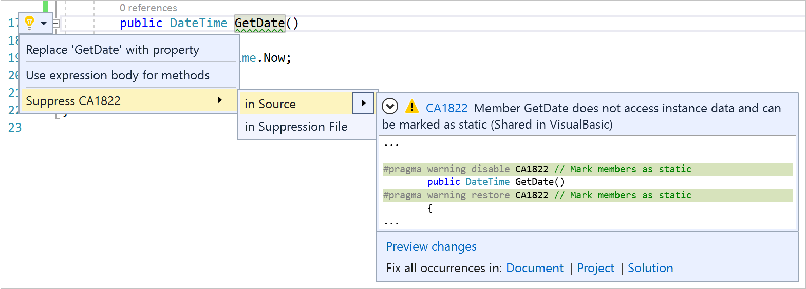

# Use code analyzers

.NET Compiler Platform ("Roslyn") code analyzers analyze your C# or Visual Basic code as you type. Each *diagnostic* or rule has a default severity and suppression state that can be overwritten for your project. This article covers setting rule severity, using rule sets, and suppressing violations.

## Analyzers in Solution Explorer

You can do much of the customization of analyzer diagnostics from **Solution Explorer**. If you [install analyzers](../code-quality/install-roslyn-analyzers.md) as a NuGet package, an **Analyzers** node appears under the **References** or **Dependencies** node in **Solution Explorer**. If you expand **Analyzers**, and then expand one of the analyzer assemblies, you see all the diagnostics in the assembly.


You can view the properties of a diagnostic, including its description and default severity, in the **Properties** window. To view the properties, right-click on the rule and select **Properties**, or select the rule and then press **Alt**+**Enter**.


To see online documentation for a diagnostic, right-click on the diagnostic and select **View Help**.

The icons next to each diagnostic in **Solution Explorer** correspond to the icons you see in the rule set when you open it in the editor:

- the "x" in a circle indicates a [severity](#rule-severity) of **Error**
- the "!" in a triangle indicates a [severity](#rule-severity) of **Warning**
- the "i" in a circle indicates a [severity](#rule-severity) of **Info**
- the "i" in a circle on a light-colored background indicates a [severity](#rule-severity) of **Hidden**
- the downward-pointing arrow in a circle indicates that the diagnostic is suppressed


## Rule severity

::: moniker range=">=vs-2019"

You can configure the severity of analyzer rules, or *diagnostics*, if you [install the analyzers](../code-quality/install-roslyn-analyzers.md) as a NuGet package. Starting in Visual Studio 2019 version 16.3, you can configure the severity of a rule [in an EditorConfig file](#set-rule-severity-in-an-editorconfig-file). You can also change the severity of a rule [from Solution Explorer](#set-rule-severity-from-solution-explorer) or [in a rule set file](#set-rule-severity-in-the-rule-set-file).

::: moniker-end

::: moniker range="vs-2017"

You can configure the severity of analyzer rules, or *diagnostics*, if you [install the analyzers](../code-quality/install-roslyn-analyzers.md) as a NuGet package. You can change the severity of a rule [from Solution Explorer](#set-rule-severity-from-solution-explorer) or [in a rule set file](#set-rule-severity-in-the-rule-set-file).

::: moniker-end

The following table shows the different severity options:

| Severity (Solution Explorer) | Severity (EditorConfig file) | Build-time behavior | Editor behavior |
|-|-|-|
| Error | `error` | Violations appear as *Errors* in the Error List and in command-line build output, and cause builds to fail.| Offending code is underlined with a red squiggle and marked by a small red box in the scroll bar. |
| Warning | `warning` | Violations appear as *Warnings* in the Error List and in command-line build output, but do not cause builds to fail. | Offending code is underlined with a green squiggle and marked by a small green box in the scroll bar. |
| Info | `suggestion` | Violations appear as *Messages* in the Error List, and not at all in command-line build output. | Offending code is underlined with a gray squiggle and marked by a small gray box in the scroll bar. |
| Hidden | `silent` | Non-visible to user. | Non-visible to user. The diagnostic is reported to the IDE diagnostic engine, however. |
| None | `none` | Suppressed completely. | Suppressed completely. |
| Default | `default` | Corresponds to the default severity of the rule. To determine what the default value for a rule is, look in the Properties window. | Corresponds to the default severity of the rule. |

The following screenshot of the code editor shows three different violations with different severities. Notice the color of the squiggle and the small, colored square in the scroll bar on the right.


The following screenshot shows the same three violations as they appear in the Error List:


::: moniker range=">=vs-2019"

### Set rule severity in an EditorConfig file

(Visual Studio 2019 version 16.3 and later)

The general syntax for specifying the severity of a rule in an EditorConfig file is as follows:

`dotnet_diagnostic.<rule ID>.severity = <severity>`

Setting a rule's severity in an EditorConfig file takes precedence over any severity that's set in a rule set or in Solution Explorer. You can [manually](#manually-configure-rule-severity) configure severity in an EditorConfig file or [automatically](#automatically-configure-rule-severity) through the light bulb that appears next to a violation.

#### Manually configure rule severity

1. If you don't already have an EditorConfig file for your project, [add one](../ide/create-portable-custom-editor-options.md#add-an-editorconfig-file-to-a-project).

2. Add an entry for each rule you want to configure under the corresponding file extension. For example, to set the severity for [CA1822](ca1822.md) to `error` for C# files, the entry looks as follows:

   ```ini
   [*.cs]
   dotnet_diagnostic.CA1822.severity = error
   ```

> [!NOTE]
> For IDE code-style analyzers, you can also configure them in an EditorConfig file using a different syntax, for example, `dotnet_style_qualification_for_field = false:suggestion`. However, if you set a severity using the `dotnet_diagnostic` syntax, it takes precedence. For more information, see [Language conventions for EditorConfig](../ide/editorconfig-language-conventions.md).

#### Automatically configure rule severity

Visual Studio provides a convenient way to configure a rule's severity from the [Quick Actions](../ide/quick-actions.md) light bulb menu.

1. After a violation occurs, hover over the violation squiggle in the editor and open the light bulb menu. Or, put your cursor on the line and press **Ctrl**+**.** (period).

2. From the light bulb menu, select **Configure or Suppress issues** > **Configure \<rule ID> severity**.

   

3. From there, select one of the severity options.

   

   Visual Studio adds an entry to the EditorConfig file to configure the rule to the requested level, as shown in the preview box.

   > [!TIP]
   > If you don't already have an EditorConfig file in the project, Visual Studio creates one for you.

::: moniker-end

### Set rule severity from Solution Explorer

1. In **Solution Explorer**, expand **References** > **Analyzers** (or **Dependencies** > **Analyzers** for .NET Core projects).

1. Expand the assembly that contains the rule you want to set severity for.

1. Right-click on the rule and select **Set Rule Set Severity**. In the fly-out menu, select one of the severity options.

   The severity for the rule is saved in the active rule set file.

### Set rule severity in the rule set file


1. Open the active rule set file by double-clicking it in **Solution Explorer**, selecting **Open Active Rule Set** on the right-click menu of the **References** > **Analyzers** node, or by selecting **Open** on the **Code Analysis** property page for the project.

   If this is the first time you're editing the rule set, Visual Studio makes a copy of the default rule set file, names it *\<projectname>.ruleset*, and adds it to your project. This custom rule set also becomes the active rule set for your project.

   > [!NOTE]
   > .NET Core and .NET Standard projects do not support the menu commands for rule sets in **Solution Explorer**, for example, **Open Active Rule Set**. To specify a non-default rule set for a .NET Core or .NET Standard project, manually [add the **CodeAnalysisRuleSet** property](using-rule-sets-to-group-code-analysis-rules.md#specify-a-rule-set-for-a-project) to the project file. You can still configure the rules within the rule set in the Visual Studio rule set editor UI.

1. Browse to the rule by expanding its containing assembly.

1. In the **Action** column, select the value to open a drop-down list, and select the desired severity from the list.

   

## Suppress violations

There are multiple ways to suppress rule violations:

::: moniker range=">=vs-2019"

- In an **EditorConfig file**

  Set the severity to `none`, for example, `dotnet_diagnostic.CA1822.severity = none`.

- From the **Analyze** menu

  Select **Analyze** > **Build and Suppress Active Issues** on the menu bar to suppress all current violations. This is sometimes referred to as "baselining".

::: moniker-end

::: moniker range="vs-2017"

- From the **Analyze** menu

  Select **Analyze** > **Run Code Analysis and Suppress Active Issues** on the menu bar to suppress all current violations. This is sometimes referred to as "baselining".

::: moniker-end

- From **Solution Explorer**

  Set the rule's severity to **None**.

- From the **rule set editor**

  Uncheck the box next to its name or set **Action** to **None**.

- From the **code editor**

  Place the cursor in the line of code with the violation and press **Ctrl**+**Period (.)** to open the **Quick Actions** menu. Select **Suppress CAXXXX** > **in Source/in Suppression File**.

  

- From the **Error List**

  Select the rules you want to suppress, and then right-click and select **Suppress** > **In Source/In Suppression File**.

  - If you suppress **In Source**, the **Preview Changes** dialog opens and shows a preview of the C# [#pragma warning](/dotnet/csharp/language-reference/preprocessor-directives/preprocessor-pragma-warning) or Visual Basic [#Disable warning](/dotnet/visual-basic/language-reference/directives/directives) directive that's added to the source code.

    

  - If you select **In Suppression File**, the **Preview Changes** dialog opens and shows a preview of the <xref:System.Diagnostics.CodeAnalysis.SuppressMessageAttribute> attribute that's added to the global suppressions file.

    

  In the **Preview Changes** dialog, select **Apply**.

  > [!NOTE]
  > If you don't see the **Suppress** menu option in **Solution Explorer**, the violation is likely coming from build and not live analysis. The **Error List** displays diagnostics, or rule violations, from both live code analysis and build. Since the build diagnostics can be stale, for example, if you've edited the code to fix the violation but haven't rebuilt, you cannot suppress these diagnostics from the **Error List**. Diagnostics from live analysis, or IntelliSense, are always up-to-date with current sources and can be suppressed from the **Error List**. To exclude *build* diagnostics from your selection, switch the **Error List** source filter from **Build + IntelliSense** to **IntelliSense Only**. Then, select the diagnostics you want to suppress and proceed as described previously.
  >
  > 

## Command-line usage

When you build your project at the command line, rule violations appear in the build output if the following conditions are met:

- The analyzers are installed as a Nuget package and not as a VSIX extension.

- One or more rules are violated in the project's code.

- The [severity](#rule-severity) of a violated rule is set to either **warning**, in which case violations don't cause build to fail, or **error**, in which case violations cause build to fail.

The verbosity of the build output does not affect whether rule violations are shown. Even with **quiet** verbosity, rule violations appear in the build output.

> [!TIP]
> If you're accustomed to running legacy analysis from the command line, either with *FxCopCmd.exe* or through msbuild with the **RunCodeAnalysis** flag, here's how to do that with code analyzers.

To see analyzer violations at the command line when you build your project using msbuild, run a command like this:

```cmd
msbuild myproject.csproj /target:rebuild /verbosity:minimal
```

The following image shows the command-line build output from building a project that contains an analyzer rule violation:


## Dependent projects

In a .NET Core project, if you add a reference to a project that has NuGet analyzers, those analyzers are automatically added to the dependent project too. To disable this behavior, for example if the dependent project is a unit test project, mark the NuGet package as private in the *.csproj* or *.vbproj* file of the referenced project by setting the **PrivateAssets** attribute:

```xml
<PackageReference Include="Microsoft.CodeAnalysis.FxCopAnalyzers" Version="2.9.0" PrivateAssets="all" />
```

## See also

- [Overview of code analyzers in Visual Studio](../code-quality/roslyn-analyzers-overview.md)
- [Submit a code analyzer bug](https://github.com/dotnet/roslyn-analyzers/issues)
- [Use rule sets](../code-quality/using-rule-sets-to-group-code-analysis-rules.md)
- [Suppress code analysis warnings](../code-quality/in-source-suppression-overview.md)
