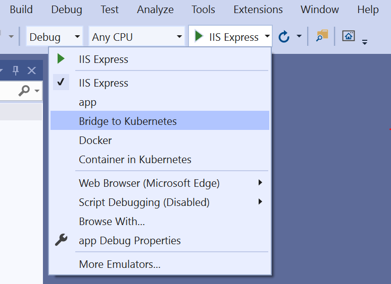
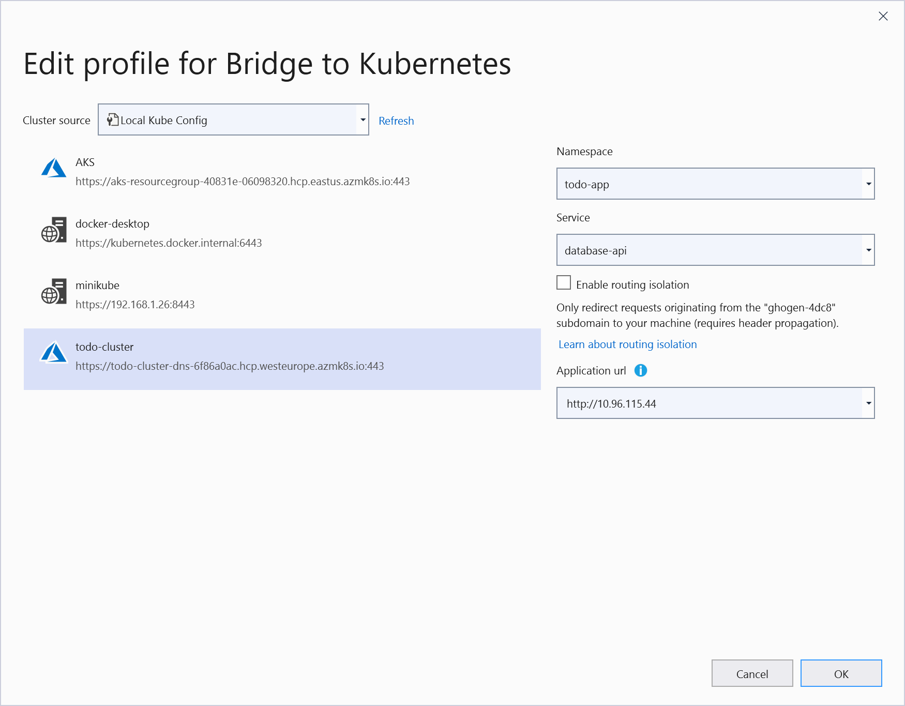
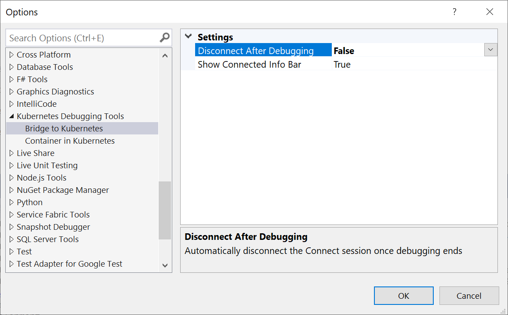

# Use Bridge to Kubernetes

You can use Bridge to Kubernetes to redirect traffic between your Kubernetes cluster and code running on your development computer. This guide also provides a script for deploying a large sample application with multiple microservices on a Kubernetes cluster.

## Before you begin

This guide uses the [TODO App sample application][todo-app-github] to demonstrate connecting your development computer to a Kubernetes cluster. If you already have your own application running on a Kubernetes cluster, you can still follow the steps below and use the names of your own services.

This sample illustrates how Bridge to Kubernetes can be used to develop a microservice version of a simple TODO application on any Kubernetes cluster. This sample, using Visual Studio, has been adapted from code provided by [TodoMVC](http://todomvc.com). These steps should work with any Kubernetes cluster.

The TODO application sample is composed of a frontend and a backend that provides persistent storage. This extended sample adds a statistics component and breaks the application into a number of microservices, specifically:

- The frontend calls the database-api to persist and update TODO items;
- The database-api service relies on a Mongo database to persist TODO items;
- The frontend writes add, complete, and delete events to a RabbitMQ queue;
- A statistics worker receives events from the RabbitMQ queue and updates a Redis cache;
- A statistics API exposes the cached statistics for the frontend to show.

In all, this extended TODO application is composed of six interrelated components.

### Prerequisites

- a Kubernetes cluster 
- On Windows 10, [Hyper-V](https://docs.microsoft.com/virtualization/hyper-v-on-windows)
- [Visual Studio 2019][visual-studio] version 16.7 Preview 4 or greater running on Windows 10.
- [Bridge to Kubernetes extension installed][btk-extension].

## Check the cluster

Open a command prompt, and check that the kubectl is installed and on the path, the cluster you want to use is available and ready, and set the context to that cluster.

```cmd
kubectl cluster-info
kubectl config use-context todo-cluster
```

## Deploy the application

Clone the [mindaro repo](https://github.com/Microsoft/mindaro) and open a command window with the current working folder to *samples/todo-app*.

Create a namespace for the sample.

```cmd
kubectl create namespace todo-app
```

Then, apply the deployment manifest:

```cmd
kubectl apply -n todo-app -f deployment.yaml
```

This is a simple deployment that exposes the frontend using a service of type `LoadBalancer`. Wait for all the pods to be running and for the external IP of the `frontend` service to become available.

If you are testing with MiniKube, you will need to use `minikube tunnel` to resolve an external IP. If you're using AKS, an external IP is assigned automatically. Use the following command to monitor the `frontend` service to wait until it's up and running:

```output
kubectl get service -n todo-app frontend --watch

NAME       TYPE           CLUSTER-IP    EXTERNAL-IP     PORT(S)        AGE
frontend   LoadBalancer   10.0.245.78   20.73.226.228   80:31910/TCP   6m26s
```

Browse to the application using the external IP and local port (the first number in the PORT(S) column).

```
http://{external-ip}:{local-port}
```

Test the running app in the browser. As you add, complete and delete todo items, notice that the stats page updates with the expected metrics.

## Connect to your cluster and debug a service

Open the .csproj in Visual Studio. In the project, select **Bridge to Kubernetes** from the launch settings dropdown as shown below.



Click on the start button next to *Bridge to Kubernetes*. In the **Create profile for Bridge to Kubernetes** dialog:

- Select your cluster name.
- Select *todo-app* for your namespace.
- Select *database-api* for the service to redirect.
- Select *app* for the launch profile.
- Select the same URL you used previously to launch your browser, http://{external-ip}:{local-port}



Choose whether or not you want to run isolated, meaning that others who are using the cluster won't be affected by your changes. This isolation mode is accomplished by routing your requests to your copy of each affected service, but routing all other traffic normally. More explanation on how this is done can be found at [How Bridge to Kubernetes Works][btk-overview-routing].

Click **OK**. All traffic in the Kubernetes cluster is redirected for the *database-api* service to the version of your application running in your development computer. Bridge to Kubernetes also routes all outbound traffic from the application back to your Kubernetes cluster.

To edit these settings later, for example, if you want to test with a different Kubernetes service, choose **Debug** > {SolutionName} **Debug Properties**, and click the **Change** button.

> [!NOTE]
> You will be prompted to allow the *EndpointManager* to run elevated and modify your hosts file.

Your development computer is connected when the status bar shows you are connected to the `database-api` service.


> [!NOTE]
> On subsequent launches, you will not be prompted with the **Create profile for Bridge to Kubernetes** dialog. You update these settings in the **Debug** in the project properties.

Once your development computer is connected, traffic starts redirecting to your development computer for the service you are replacing.

## Set a break point

Open MongoHelper.cs and click somewhere on line 68 to put your cursor there. Set a breakpoint by hitting *F9* or selecting **Debug** > **Toggle Breakpoint**.

Navigate to the sample application by opening the public URL (the external IP address for the frontend service). To resume the service, hit **F5** or click **Debug** > **Continue**. Return to your browser and verify the page shows you have rented the bike.

Remove the breakpoint by putting your cursor on line 68 and hitting **F9**.

> [!NOTE]
> By default, stopping the debugging task also disconnects your development computer from your Kubernetes cluster. You can change this behavior by changing **Disconnect after debugging** to `false` in the **Kubernetes Debugging Tools** section of the **Tools** > **Options** dialog. After updating this setting, your development computer will remain connected when you stop and start debugging. To disconnect your development computer from you cluster click on the **Disconnect** button on the toolbar.
>
>

## Additional configuration

Bridge to Kubernetes can handle routing traffic and replicating environment variables without any additional configuration. If you need to download any files that are mounted to the container in your Kubernetes cluster, such as a ConfigMap file, you can create a `KubernetesLocalProcessConfig.yaml` to download those files to your development computer. For more information, see [Using KubernetesLocalProcessConfig.yaml for additional configuration with for Bridge to Kubernetes][kubernetesLocalProcessConfig-yaml].

## Using logging and diagnostics

You can find the diagnostic logs in `Bridge to Kubernetes` directory in your development computer's *TEMP* directory. 

## Next steps

Learn how Bridge to Kubernetes works.

> [!div class="nextstepaction"]
> [How Bridge to Kubernetes works](overview-bridge-to-kubernetes.md)

[todo-app-github]: https://github.com/Microsoft/mindaro
[supported-regions]: https://azure.microsoft.com/global-infrastructure/services/?products=kubernetes-service
[troubleshooting]: /azure/dev-spaces/troubleshooting#fail-to-restore-original-configuration-of-deployment-on-cluster
[visual-studio]: https://www.visualstudio.com/vs/
[btk-extension]: https://marketplace.visualstudio.com/items?itemName=ms-azuretools.mindaro
[kubernetesLocalProcessConfig-yaml]: configure-bridge-to-kubernetes.md
[btk-overview-routing]: overview-bridge-to-kubernetes.md#using-routing-capabilities-for-developing-in-isolation