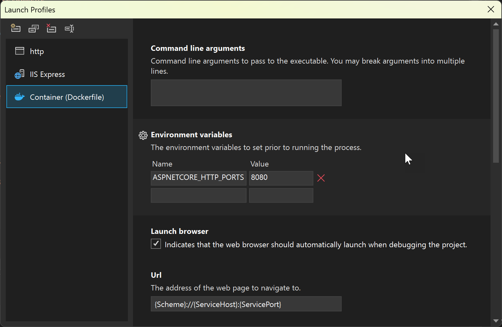

# Container Tools launch settings

In the *Properties* folder in an ASP.NET Core project, you can find the `launchSettings.json` file, which contains settings that control how your web app is started on your development machine. For detailed information on how this file is used in ASP.NET development, see [Use multiple environments in ASP.NET Core](/aspnet/core/fundamentals/environments?view=aspnetcore-2.2&preserve-view=true).

You can edit this file directly, but in Visual Studio IDE, you can also edit the properties in this file through the UI. Choose the dropdown list next to the launch option (for example, `Docker` or `.NET SDK`), and then choose **Debug Properties** for a single-container project.



For Docker Compose, choose **Manage Docker Compose Launch Settings**, and see [Launch a subset of compose services](launch-profiles.md).

In *launchSettings.json*, the settings in the **Docker** section are related to how Visual Studio handles containerized apps.

:::moniker range="<=vs-2022"

```json
    "Docker": {
      "commandName": "Docker",
      "launchBrowser": true,
      "launchUrl": "{Scheme}://{ServiceHost}:{ServicePort}",
      "DockerfileRunArguments": "-l mylabel=value",
      "environmentVariables": {
        "ASPNETCORE_URLS": "https://+:443;http://+:80",
        "ASPNETCORE_HTTPS_PORT": "44360"
      },
      "httpPort": 51803,
      "useSSL": true,
      "sslPort": 44360
    }
```

:::moniker-end

:::moniker range="visualstudio"

```json
    "Container (Dockerfile)": {
      "commandName": "Docker",
      "launchBrowser": true,
      "launchUrl": "{Scheme}://{ServiceHost}:{ServicePort}",
      "environmentVariables": {
        "ASPNETCORE_HTTPS_PORTS": "8081",
        "ASPNETCORE_HTTP_PORTS": "8080"
      },
      "publishAllPorts": true,
      "useSSL": true
    }
```

:::moniker-end

The commandName setting identifies that this section applies to Container Tools.

:::moniker range=">=vs-2022"
Most of the settings in `launchSettings.json` are available and applicable whether you're using a Dockerfile, or using the .NET SDK's built-in container build support (available for .NET 7 and later).
:::moniker-end

The following table shows the properties that can be set in this section:

::: moniker range="vs-2019"

| Setting name         | Example                                               | Description                                                                                                             |
| -------------------- | ----------------------------------------------------- | ----------------------------------------------------------------------------------------------------------------------- |
| commandLineArgs      | `"commandLineArgs": "--mysetting myvalue"`              | These command-line arguments for starting your app are used when launching your project in the container.                                     |
|DockerfileRunArguments|`"dockerfileRunArguments": "-l mylabel=value"`|Additional arguments to pass to the [`docker run`](https://docs.docker.com/engine/reference/commandline/run/) command.|
| environmentVariables | `"environmentVariables":` `{`<br/>   `"ASPNETCORE_URLS": "https://+:443;http://+:80"``, <br/>   `"ASPNETCORE_HTTPS_PORT": "44381"`` <br/> `}`                    | These environment variable values are passed to the process when it's launched in the container.                       |
| httpPort             | `"httpPort": 24051`                                     | This port on the host is mapped to the container's port 80 when launching the container. |
| launchBrowser        | `"launchBrowser": true`                                 | Indicates whether to launch the browser after successfully launching the project.                                       |
| launchBrowserTimeout | `"launchBrowserTimeout": 1`                             | The maximum amount of time (in seconds) to wait for the app to be ready before launching the browser. |
| launchUrl            | `"launchUrl": "{Scheme}://{ServiceHost}:{ServicePort}"` | This URL is used when launching the browser. Supported replacement tokens for this string are: <br/><br/> - `{Scheme}` - Replaced with either `http` or `https` depending on whether SSL is used. <br/><br/> - `{ServiceHost}` - Usually replaced with `localhost`. <br/> When you're targeting Windows containers on Windows 10 RS3 or older, though, it's replaced with the container's IP. <br/><br/> - `{ServicePort}` - Usually replaced with either `sslPort` or `httpPort`, depending on whether SSL is used. <br/> When you're targeting Windows containers on Windows 10 RS3 or older, though, it's replaced with either `443` or `80`, depending on whether SSL is used. |
| sslPort              | `"sslPort": 44381`                                      | This port on the host is mapped to the container's port 443 when launching the container. |
| useSSL               | `"useSSL": true`                                        | Indicates whether to use SSL when launching the project. If `useSSL` isn't specified, then SSL is used when `sslPort > 0`. |

> [!NOTE]
> If the same settings, for example, `DockerfileRunArguments`, is found in both the project file and in the launch settings file, the value in the launch settings file takes precedence.

::: moniker-end

::: moniker range="vs-2022"

| Property in Debug Profile UI | Setting name in launchSettings.json |Example|Description|
| - | - | - | - |
|Command line arguments| commandLineArgs      | `"commandLineArgs": "--mysetting myvalue"`              | These command-line arguments for starting your app are used when launching your project in the container.                                     |
|Container run arguments| containerRunArguments<br/>ContainerRunArguments|`"containerRunArguments": "-l mylabel=value"`| Additional arguments to pass to the [`docker run`](https://docs.docker.com/engine/reference/commandline/run/) command. <br><br/> (Use the lowercase version in Visual Studio 17.12 and later. The uppercase version was introduced in Visual Studio 17.9 and is provided for backward compatibility.) <br/><br/> You can use the following replacement tokens:<br/><br/> - `{ProjectDir}` - Full path to the project directory. <br/><br/> - `{OutDir}` - The value of the MSBuild property OutDir. |
|N/A|DockerfileRunArguments|`dockerfileRunArguments": "-l mylabel=value"`|Like `containerRunArguments`, but only for projects that use the Dockerfile build type. For Visual Studio 17.12 and later, it is recommended to use `containerRunArguments` instead.|
|Environment Variables| environmentVariables | `"environmentVariables":` {<br/>   `"ASPNETCORE_URLS": "https://+:443;http://+:80"`, <br/>   `"ASPNETCORE_HTTPS_PORT": "44381"` <br/> }                    | These environment variable values are passed to the process when it's launched in the container.                       |
|Container Name| containerName | `mycontainer` | (17.12 and later) A name for the container matching the regular expression `[a-zA-Z0-9][a-zA-Z0-9_.-]`.|
|Container environment files| containerRunEnvironmentFiles | `"containerRunEnvironmentFiles": "abc.env;xyz.env"` | (17.12 and later) A list of environment variable files (`.env` files) separated by semicolons. See [.env file syntax](https://docs.docker.com/compose/how-tos/environment-variables/variable-interpolation/#env-file-syntax). |
|HTTP Port| httpPort             | `"httpPort": 24051`                                     | This port on the host is mapped to the container's port 80 when launching the container. |
|Launch Browser| launchBrowser        | `"launchBrowser": true`                                 | Indicates whether to launch the browser after successfully launching the project.                                       |
|N/A| launchBrowserTimeout | `"launchBrowserTimeout": 1`                            | The maximum amount of time (in seconds) to wait for the app to be ready before launching the browser (Docker Compose only). |
|URL | launchUrl            | `"launchUrl": "{Scheme}://{ServiceHost}:{ServicePort}"` | This URL is used when launching the browser. Supported replacement tokens for this string are: <br/><br/> - `{Scheme}` - Replaced with either `http` or `https`, depending on whether SSL is used. <br/><br/> - `{ServiceHost}` - Usually replaced with `localhost`. <br/> When you're targeting Windows containers on Windows 10 RS3 or older, though, it's replaced with the container's IP. <br/><br/> - `{ServicePort}` - Usually replaced with either sslPort or httpPort, depending on whether SSL is used. <br/> When you're targeting Windows containers on Windows 10 RS3 or older, though, it's replaced with either `443` or `80`, depending on whether SSL is used. |
| Publish all ports | publishAllPorts      | `"publishAllPorts": true`                                 | If true, pass `-P` to `docker run`, which publishes all exposed ports to a random port. See [Docker documentation](https://docs.docker.com/engine/reference/commandline/run/). However, when you specify `sslPort`, Visual Studio still passes `-p 5002:443`, so your service should still be listening on port 5002.|
| SSL Port| sslPort              | `"sslPort": 44381`                                      | This port on the host is mapped to the container's port 443 when launching the container. |
| N/A | useSSL               | `"useSSL": true`                                        | Indicates whether to use SSL when launching the project. If `useSSL` isn't specified, then SSL is used when `sslPort > 0`. |

Not all settings are available in the UI, for example, `useSSL`. To change those settings, edit `launchSettings.json` directly.

The setting `DockerfileRunArguments` is superseded in Visual Studio 2022 17.12 and later by `containerRunArguments`, which can be set in the Launch Profiles UI as `Container run arguments`.

> [!NOTE]
> If the same setting is found in both the project file and in the launch settings file, the value in the launch settings file takes precedence.

::: moniker-end
::: moniker range="visualstudio"

| Property in Debug Profile UI | Setting name in launchSettings.json |Example|Description|
| - | - | - | - |
|Command line arguments| commandLineArgs      | `"commandLineArgs": "--mysetting myvalue"`              | These command-line arguments for starting your app are used when launching your project in the container.                                     |
|Container run arguments| containerRunArguments<br/>ContainerRunArguments|`"containerRunArguments": "-l mylabel=value"`| Additional arguments to pass to the [`docker run`](https://docs.docker.com/engine/reference/commandline/run/) or [`podman run`](https://docs.podman.io/en/v5.0.2/markdown/podman-run.1.html) command. <br><br/> (Use the lowercase version in Visual Studio 17.12 and later. The uppercase version was introduced in Visual Studio 17.9 and is provided for backward compatibility.) <br/><br/> You can use the following replacement tokens:<br/><br/> - `{ProjectDir}` - Full path to the project directory. <br/><br/> - `{OutDir}` - The value of the MSBuild property OutDir. |
|N/A|DockerfileRunArguments|`"dockerfileRunArguments": "-l mylabel=value"`|Like `containerRunArguments`, but only for projects that use the Dockerfile build type. It's recommended to use `containerRunArguments` instead.|
|Environment Variables| environmentVariables | `"environmentVariables":` {<br/>   `"ASPNETCORE_URLS": "https://+:443;http://+:80"`, <br/>   `"ASPNETCORE_HTTPS_PORT": "44381"` <br/> }                    | These environment variable values are passed to the process when it's launched in the container.                       |
|Executable Path| `executablePath` | `"executablePath": "myprogram.exe"`|When debugging, the debugger is instructed to launch this executable. |
|Container Name| containerName | `mycontainer` | (17.12 and later) A name for the container matching the regular expression `[a-zA-Z0-9][a-zA-Z0-9_.-]`.|
|Container environment files| containerRunEnvironmentFiles | `"containerRunEnvironmentFiles": "abc.env;xyz.env"` | (17.12 and later) A list of environment variable files (`.env` files) separated by semicolons. See [.env file syntax](https://docs.docker.com/compose/how-tos/environment-variables/variable-interpolation/#env-file-syntax). |
|HTTP Port| httpPort             | `"httpPort": 24051`                                     | This port on the host is mapped to the container's HTTP port when launching the container. Container port 80 is used, unless you specify ports by using the environment variables `ASPNETCORE_URLS` and `ASPNETCORE_HTTP_PORTS`. |
|Launch Browser| launchBrowser        | `"launchBrowser": true`                                 | Indicates whether to launch the browser after successfully launching the project.                                       |
|N/A| launchBrowserTimeout | `"launchBrowserTimeout": 1`                            | The maximum amount of time (in seconds) to wait for the app to be ready before launching the browser (Docker Compose only). |
|URL | launchUrl            | `"launchUrl": "{Scheme}://{ServiceHost}:{ServicePort}"` | This URL is used when launching the browser. Supported replacement tokens for this string are: <br/><br/> - `{Scheme}` - Replaced with either `http` or `https`, depending on whether SSL is used. <br/><br/> - `{ServiceHost}` - Usually replaced with `localhost`. <br/> When you're targeting Windows containers on Windows 10 RS3 or older, though, it's replaced with the container's IP. <br/><br/> - `{ServicePort}` - Usually replaced with either sslPort or httpPort, depending on whether SSL is used. <br/> When you're targeting Windows containers on Windows 10 RS3 or older, though, it's replaced with the HTTP or HTTPS port specified by the environment variables `ASPNETCORE_URLS` and `ASPNETCORE_HTTP_PORTS`, or 80 for HTTP and 443 for HTTPS if not set.|
| Publish all ports | publishAllPorts      | `"publishAllPorts": true`                                 | If true, pass `-P` to `docker run`, which publishes all exposed ports to a random port. See [Docker documentation](https://docs.docker.com/engine/reference/commandline/run/). However, when you specify `sslPort`, Visual Studio still passes `-p 5002:443`, so your service should still be listening on port 5002.|
| SSL Port| sslPort              | `"sslPort": 44381`                                      | This port on the host is mapped to the container's HTTPS port when launching the container. Container port 443 is used, unless you specify ports by using the environment variables `ASPNETCORE_URLS` and `ASPNETCORE_HTTP_PORTS`. |
| N/A | useSSL               | `"useSSL": true`                                        | Indicates whether to use SSL when launching the project. If `useSSL` isn't specified, then SSL is used when `sslPort > 0`. |
| Working directory | workingDirectory | `"workingDirectory": "c:\path\to\folder"`| When debugging, the debugger is instructed to use this path as the working directory.|

Not all settings are available in the UI, for example, `useSSL`. To change those settings, edit `launchSettings.json` directly.

The `containerRunArguments` can be set in the Launch Profiles UI as `Container run arguments`. It is equivalent to the obsolete MSBuild property `DockerfileRunArguments`.

> [!NOTE]
> If the same setting is found in both the project file and in the launch settings file, the value in the launch settings file takes precedence.

::: moniker-end

## Next steps

Configure your project by setting the [Container Tools build properties](container-msbuild-properties.md).

## See also

- [Docker Compose build properties](docker-compose-properties.md)
- [Manage launch profiles for Docker Compose](launch-profiles.md)
