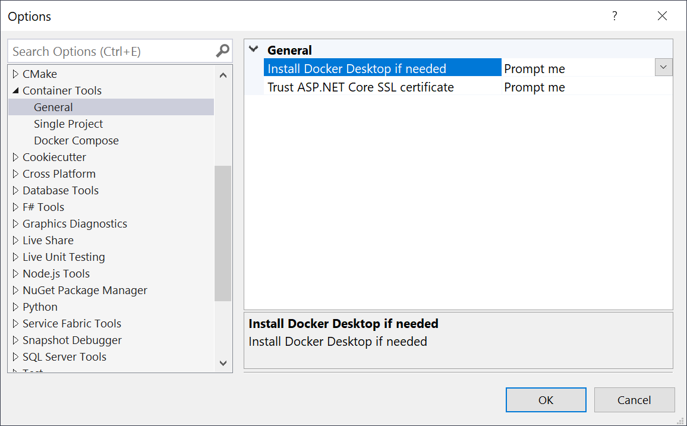
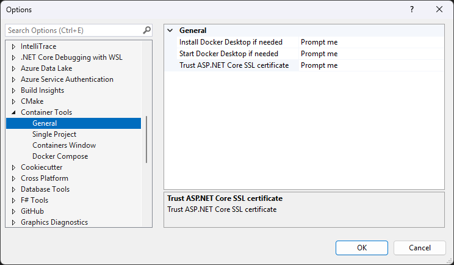
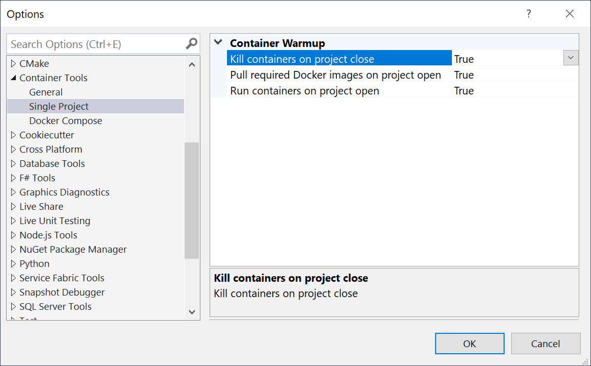
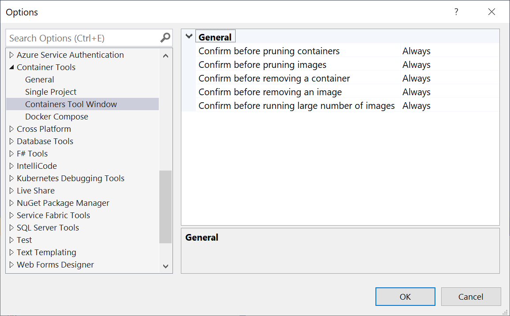
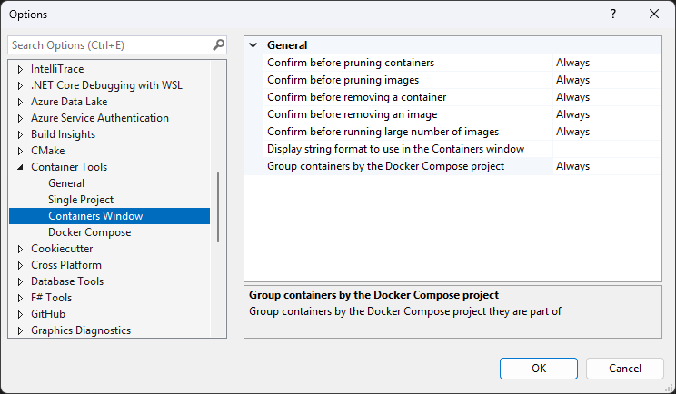

# Configure Visual Studio Container Tools

You can control some aspects of how Visual Studio works with Docker containers by using **Container Tools** settings. This article describes how to configure **Container Tools** settings that can affect Visual Studio performance and resource usage when you work with Docker containers.

## Container Tools settings

To access the settings, select **Tools > Options** from the main Visual Studio menu. In the left pane, scroll down and expand **Container Tools**.

### General settings

:::moniker range="<=vs-2019"

The following table describes the **General** settings:

|Setting|Default value|Description|
|-----|---------------|----------|-----------|
|Install Docker Desktop if needed|Prompt me|Choose whether you want to be prompted if Docker Desktop isn't installed.|
|Start Docker Desktop if needed|Always|If Docker Desktop isn't started, choose whether to start it automatically or to prompt you.|
|Trust ASP.NET Core SSL certificate|Prompt me|When set to **Prompt me**, if the `localhost` SSL certificate isn't trusted, Visual Studio prompts whenever you run an ASP.NET Core 2.x project.|

:::moniker-end
:::moniker range=">=vs-2022"

The following table describes the **General** settings:

|Setting|Default value|Description|
|-----|---------------|-----------|
|Install Docker Desktop if needed|Prompt me|Choose whether you want to be prompted if Docker Desktop isn't installed.|
|Start Docker Desktop if needed|Prompt me|If Docker Desktop isn't started, choose whether to start it automatically or to prompt you.|
|Trust ASP.NET Core SSL certificate|Prompt me|When set to **Prompt me**, if the `localhost` SSL certificate isn't trusted, Visual Studio prompts for trust whenever you run an ASP.NET Core project.|

:::moniker-end

> [!IMPORTANT]
> If the `localhost` SSL certificate isn't trusted, and you set **Trust ASP.NET Core SSL certificate** to **Never**, HTTPS web requests might fail at run time. In that case, set **Trust ASP.NET Core SSL certificate** to **Prompt me**, run your project, and indicate trust at the prompt.

### Single Project or Docker Compose settings

The Container Tools **Single Project** and **Docker Compose** settings are identical.

:::moniker range="<=vs-2019"

:::moniker-end
:::moniker range=">=vs-2022"

:::moniker-end

The following table describes **Single Project** and **Docker Compose** settings:

:::moniker range="<=vs-2019"
|Setting|Default value|Description|
|-----|---------------|-----------|
|Pull required Docker images on project open|True|Visual Studio starts a background Docker pull operation when it loads a container project, so the image is already downloaded or downloading when you're ready to run your code. If you just want to browse the code, you can set to **False** to avoid downloading container images you don't need.|
|Pull updated Docker images on project open|.NET Core projects|Whether and on which projects to check for image updates on opening and download if available.|
|Run containers on project open|True|Visual Studio creates a container when it loads a container project, so it's ready when you build and run. If you prefer to control when your container is created, set to **False**.|
|Remove containers on project close|True|Set to **False** to retain containers for your solution after closing the solution or closing Visual Studio.|
:::moniker-end
:::moniker range=">=vs-2022"
|Setting|Default value|Description|
|-----|:---------------|-----------|
|Pull required Docker images on project open|True|Visual Studio starts a background Docker pull operation when it loads a container project, so the image is already downloaded or downloading when you're ready to run your code. If you just want to browse the code, you can set to **False** to avoid downloading container images you don't need.|
|Pull updated Docker images on project open|.NET Core projects|Whether and on which projects to check for image updates on opening and download if available.|
|Run containers on project open|True|Visual Studio creates a container when it loads a container project, so it's ready when you build and run. If you prefer to control when your container is created , set to **False**.|
|Remove containers on project close|True|Set to **False** to retain containers for your solution after closing the solution or closing Visual Studio.|
|Run a service in containers to enable Azure Authentication|True|Visual Studio version 17.6 or later runs a token proxy service in the container that enables Azure Authentication, so your apps can use Azure services during development. Set to **False** if you don't want to install and run this service. For more information, see the [Configure Azure authentication](#configure-azure-authentication) section.|
|Run a service in containers to enable Hot Reload|True|The Hot Reload service is available in Visual Studio 2022 version 17.7 and later, and only supports running without debugging (**Ctrl**+**F5**). Set to **False** if you don't want to install and run this service.|
:::moniker-end

:::moniker range="<=vs-2019"
### Containers Tool Window settings

The **Containers Tool Window** settings apply to the **Containers** tool window in the Visual Studio IDE, which shows information about Docker containers and images. For more information, see [Use the Containers window](view-and-diagnose-containers.md).

The following table describes the **Containers Tool Window** settings:

|Setting|Default value|Description|
|-----|---------------|-----------|
|Confirm before pruning containers|Always|Whether to prompt you when pruning unused containers.|
|Confirm before pruning images|Always|Whether to prompt you when pruning unused images.|
|Confirm before removing a container|Always|Whether to prompt you when removing a container.|
|Confirm before removing an image|Always|Whether to prompt you when removing an image.|
|Confirm before running large number of images|Always|Whether to prompt you before starting containers from more than 10 images at a time.|

:::moniker-end
:::moniker range=">=vs-2022"
### Containers Window settings

The **Containers Window** settings apply to the **Containers** window in the Visual Studio IDE, which shows information about Docker containers and images. For more information, see [Use the Containers window](view-and-diagnose-containers.md).

The following table describes the **Containers Window** settings:

|Setting|Default value|Description|
|-----|---------------|-----------|
|Confirm before pruning containers|Always|Whether to prompt you when pruning unused containers.|
|Confirm before pruning images|Always|Whether to prompt you when pruning unused images.|
|Confirm before removing a container|Always|Whether to prompt you when removing a container.|
|Confirm before removing an image|Always|Whether to prompt you when removing an image.|
|Confirm before running large number of images|Always|Whether to prompt you before starting containers from more than 10 images at a time.|
|Display string format to use in the Containers window|Blank|Display string format to use in the Containers window, with support for the {ContainerName}, {ImageName}, {ProjectName}, and {ContainerID} tokens.|
|Group containers by the Docker Compose project|Always|Whether to group containers by the Docker Compose project they're part of.|

## Configure Azure authentication

If your app uses Azure services, it needs appropriate credentials to authenticate with Azure services when it runs in a container. During development, you can usually use your own Azure credentials, but running the containerized app in the container environment requires the credentials the app uses in production.

In Visual Studio 2022 version 17.6 and later, in both single-container and Docker Compose projects, a [token](https://www.nuget.org/packages/Azure.Identity#readme-body-tab) proxy service deploys and runs in your containers to help your apps and services authenticate in Azure. The feature requires [Azure Identity 1.9.0](https://www.nuget.org/packages/Azure.Identity/1.9.0#readme-body-tab) or later.

With this service enabled, you can automatically use most Azure services without any added configuration or setup within the container. Your code can use `DefaultAzureCredential` and `VisualStudioCredential` to authenticate with Azure services the same way as outside of a container. For more information, see the [Azure Identity 1.9.0 README](https://www.nuget.org/packages/Azure.Identity/1.9.0#readme-body-tab).

To disable this feature, set **Run a service in containers to enable Azure Authentication** to **False** in the [Single Project or Docker Compose settings](#single-project-or-docker-compose-settings) in **Container Tools**.

> [!CAUTION]
> There's a potential security concern if you use the token proxy and enable certain Container Tools diagnostic logs. When logging is enabled, authentication credentials could be logged as plain text.
> 
> Certain environment variables enable these logs. For single container projects, the environment variable is `MS_VS_CONTAINERS_TOOLS_LOGGING_ENABLED`, which logs in `%tmp%\Microsoft.VisualStudio.Containers.Tools`. For Docker Compose projects, the variable is `MS_VS_DOCKER_TOOLS_LOGGING_ENABLED`, which logs in `%tmp%\Microsoft.VisualStudio.DockerCompose.Tools`.

:::moniker-end

## Related content

- [Visual Studio Container Tools for Docker](overview.md)
- [Use the Containers window](container-tools-configure.md)

