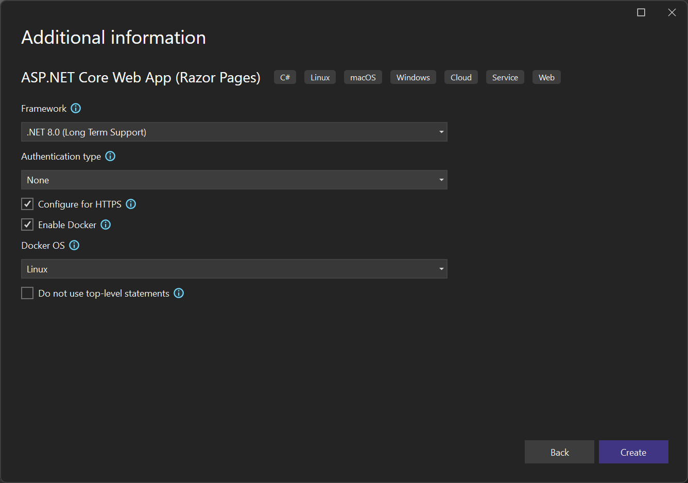
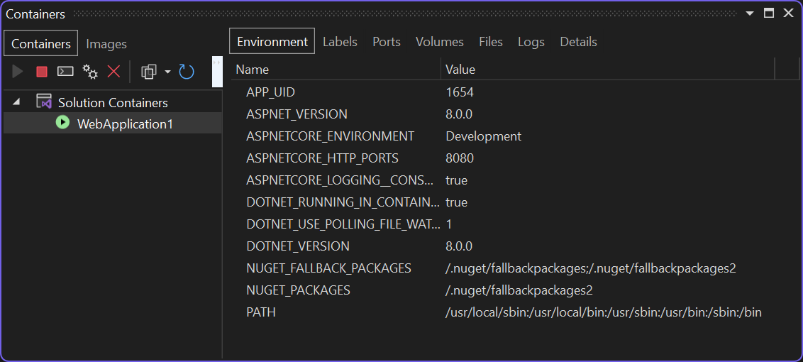
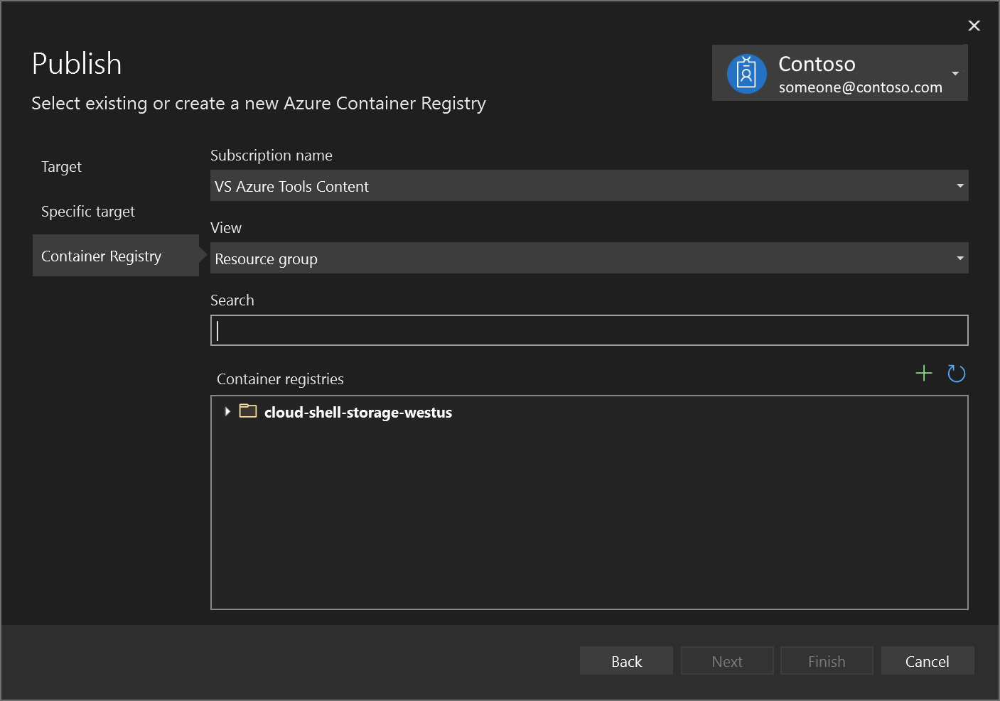
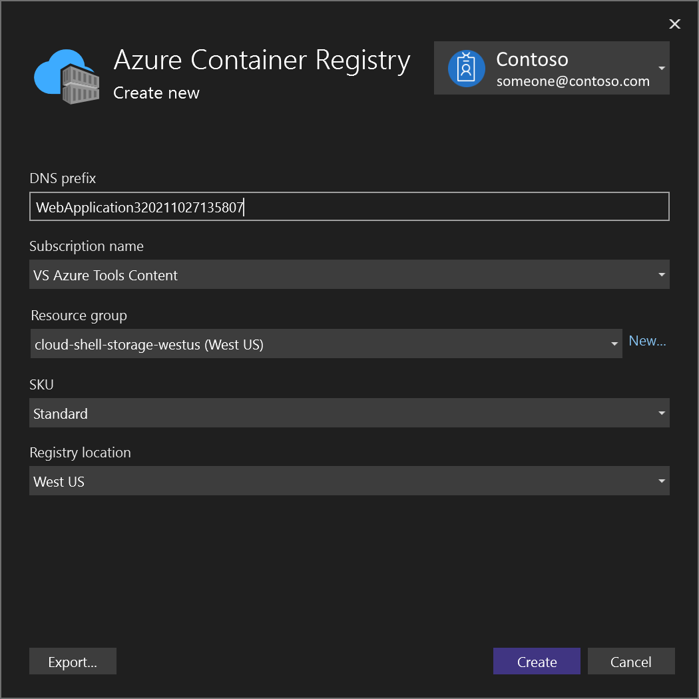
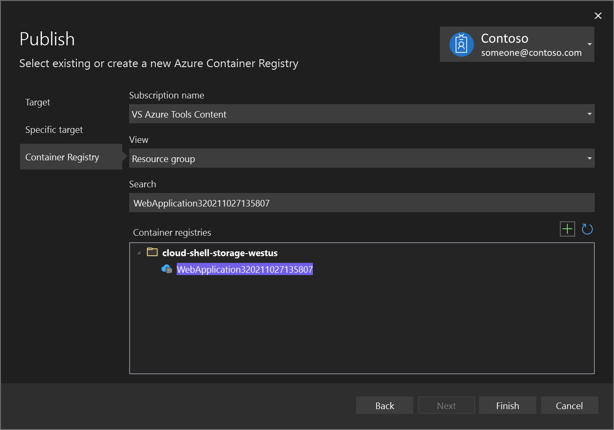

# Quickstart: Container Tools in Visual Studio

::: moniker range="vs-2019"

[!INCLUDE[Visual Studio Container Tools](includes/vs-2019/container-tools.md)]

::: moniker-end

::: moniker range=">=vs-2022"

With Visual Studio, you can easily build, debug, and run containerized .NET, ASP.NET, and ASP.NET Core apps and publish them to Azure Container Registry, Docker Hub, Azure App Service, or your own Container Registry. In this article, you publish an ASP.NET Core app to Azure Container Registry.
:::moniker-end

:::moniker range="visualstudio"

## Prerequisites

- [Docker Desktop](https://hub.docker.com/editions/community/docker-ce-desktop-windows) or [Podman Desktop](https://podman-desktop.io/downloads).
- [Visual Studio](https://visualstudio.microsoft.com/downloads/?cid=learn-onpage-download-cta), or for Podman support, [Visual Studio](https://visualstudio.microsoft.com/downloads/?cid=learn-onpage-download-cta), with the **ASP.NET and web development**, **Azure development** workload, and/or **.NET desktop development** workload installed
- To publish to Azure Container Registry, an Azure subscription. [Sign up for a free trial](https://azure.microsoft.com/free/dotnet/).

:::moniker-end
::: moniker range="vs-2022"

## Prerequisites

- [Docker Desktop](https://hub.docker.com/editions/community/docker-ce-desktop-windows).
- [Visual Studio](https://visualstudio.microsoft.com/downloads/?cid=learn-onpage-download-cta) with the **ASP.NET and web development**, **Azure development** workload, and/or **.NET desktop development** workload installed
- To publish to Azure Container Registry, an Azure subscription. [Sign up for a free trial](https://azure.microsoft.com/free/dotnet/).
:::moniker-end

::: moniker range="vs-2022"
## Installation and setup

For Docker installation, first review the information at [Docker Desktop for Windows: What to know before you install](https://docs.docker.com/docker-for-windows/install/#what-to-know-before-you-install). Next, install [Docker Desktop](https://hub.docker.com/editions/community/docker-ce-desktop-windows).

:::moniker-end

:::moniker range="visualstudio"

## Installation and setup

For Docker installation, first review the information at [Docker Desktop for Windows: What to know before you install](https://docs.docker.com/docker-for-windows/install/#what-to-know-before-you-install). Next, install [Docker Desktop](https://hub.docker.com/editions/community/docker-ce-desktop-windows).

To use Podman as the container platform, download [Podman Desktop](https://podman-desktop.io/downloads) for Windows, and then follow the tutorial at [Podman for windows](https://github.com/containers/podman/blob/main/docs/tutorials/podman-for-windows.md) to initialize and start a Podman machine.

:::moniker-end

:::moniker range="vs-2022"

## Add a project to a container

1. Before you create the Visual Studio project, make sure Docker Desktop is running the type of containers (Windows or Linux) that you intend to use in your Visual Studio project.

   To change the container type used by Docker Desktop, right-click the Docker icon (whale) in the Taskbar and choose either **Switch to Linux containers** or **Switch to Windows containers**.

   > [!WARNING]
   > If you switch the container type after you create the Visual Studio project, the Docker image files might fail to load.

1. Create a new project using the **ASP.NET Core Web App** template.

1. On the **Create new web application** screen, make sure the **Enable container support** checkbox is selected.

   

   The screenshot shows the latest release with .NET 8.0.

1. Select the type of container you want (Windows or Linux) and select **Create**.

## Dockerfile overview

Visual Studio creates a *Dockerfile* in your project, which provides the recipe for how to create a final Docker image. For more information, see the [Dockerfile reference](https://docs.docker.com/engine/reference/builder/) for details about the commands used in the Dockerfile.

```dockerfile
#See https://aka.ms/customizecontainer to learn how to customize your debug container and how Visual Studio uses this Dockerfile to build your images for faster debugging.

# This stage is used when running from VS in fast mode (Default for Debug configuration)
FROM mcr.microsoft.com/dotnet/aspnet:8.0 AS base
USER $APP_UID
WORKDIR /app
EXPOSE 8080
EXPOSE 8081

# This stage is used to build the service project
FROM mcr.microsoft.com/dotnet/sdk:8.0 AS build
ARG BUILD_CONFIGURATION=Release
WORKDIR /src
COPY ["MyWepApp/MyWebApp.csproj", "MyWebApp/"]
RUN dotnet restore "./MyWebApp/./MyWebApp.csproj"
COPY . .
WORKDIR "/src/MyWebApp"
RUN dotnet build "./MyWebApp.csproj" -c %BUILD_CONFIGURATION% -o /app/build

# This stage is used to publish the service project to be copied to the final stage
FROM build AS publish
ARG BUILD_CONFIGURATION=Release
RUN dotnet publish "./MyWebApp.csproj" -c %BUILD_CONFIGURATION% -o /app/publish /p:UseAppHost=false

# This stage is used in production or when running from VS in regular mode (Default when not using the Debug configuration)
FROM base AS final
WORKDIR /app
COPY --from=publish /app/publish .
ENTRYPOINT ["dotnet", "MyWebApp.dll"]
```

The preceding *Dockerfile* is based on the [Microsoft syndicates container catalog](https://azure.microsoft.com/blog/microsoft-syndicates-container-catalog/) .NET 8 image and includes instructions for modifying the base image by building the project named `MyWebApp` and adding it to the container. If you're using the .NET Framework, the base image is different.

When the new project dialog's **Configure for HTTPS** checkbox is checked, the *Dockerfile* exposes two ports. One port is used for HTTP traffic; the other port is used for HTTPS. If the checkbox isn't checked, a single port (80 or 8080) is exposed for HTTP traffic.

When targeting .NET 8 and later, you have the benefit of being able to run your app more securely, as a normal user, rather than with elevated permissions. The default Dockerfile generated by Visual Studio for .NET 8 projects is configured to run as a normal user. To enable this behavior on an existing project, add the line `USER app` to the Dockerfile in the base image. Also, because port 80 is restricted for normal users, expose ports 8080 and 8081 instead of 80 and 443. Port 8080 is used for HTTP traffic, and port 8081 is used for HTTPS. To run as a normal user, the container must use a .NET 8 base image, and the app must run as a .NET 8 app. When configured correctly, your Dockerfile should contain code as in the following example:

```dockerfile
FROM mcr.microsoft.com/dotnet/aspnet:8.0 AS base
USER app
WORKDIR /app
EXPOSE 8080
EXPOSE 8081
```

The default templates for .NET 8 and later use the environment variable `APP_UID` for the identity of the normal user.

## Debug

Select **Docker** from the debug dropdown list in the toolbar, and start debugging the app. You might see a message with a prompt about trusting a certificate; choose to trust the certificate to continue.

The **Container Tools** option in the **Output** window shows what actions are taking place. The first time, it might take a while to download the base image, but it's faster on subsequent runs.

After the build completes, the browser opens and displays your app's home page. In the browser address bar, you can see the `localhost` URL and port number for debugging.

> [!NOTE]
> If you need to change ports for debugging, you can do that in the `launchSettings.json` file. See [Container Launch Settings](container-launch-settings.md).

## Containers window

You can use the **Containers** window to view running containers on your machine and other images you have available.

Open the **Containers** window by using the search box in the IDE (press **Ctrl**+**Q** to use it), type in `container`, and choose the **Containers** window from the list.

You can mount the **Containers** window in a convenient place, such as below the editor, by moving it around and following the window placement guides.

In the window, find your container and step through each tab to view the environment variables, port mappings, logs, and the filesystem.



For more information, see [Use the Containers window](view-and-diagnose-containers.md).

## Publish Docker images

Once the develop and debug cycle of the app is completed, you can create a production image of the app.

1. Change the configuration dropdown list to **Release** and build the app.
1. Right-click your project in **Solution Explorer** and choose **Publish**.
1. On the **Publish** dialog, select the **Docker Container Registry** tab.

   

1. Choose **Create New Azure Container Registry**.

   

1. Fill in your desired values in the **Create a new Azure Container Registry**.

    | Setting      | Suggested value  | Description                                |
    | ------------ |  ------- | -------------------------------------------------- |
    | **DNS Prefix** | Globally unique name | Name that uniquely identifies your container registry. |
    | **Subscription** | Choose your subscription | The Azure subscription to use. |
    | **[Resource Group](/azure/azure-resource-manager/resource-group-overview)** | myResourceGroup |  Name of the resource group in which to create your container registry. Choose **New** to create a new resource group.|
    | **[SKU](/azure/container-registry/container-registry-skus)** | Standard | Service tier of the container registry  |
    | **Registry Location** | A location close to you | Choose a Location in a [region](https://azure.microsoft.com/regions/) near you or near other services that can use your container registry. |

    

1. Select **Create**. The **Publish** dialog now shows the created registry.

   

1. Choose **Finish** to complete the process of publishing your container image to the newly created registry in Azure.

   :::image type="content" source="media/container-tools/vs-2022/publish-succeeded.png" alt-text="Screenshot showing successful publish." lightbox="media/container-tools/vs-2022/publish-succeeded.png" :::

## Next steps

You can now pull the container from the registry to any host capable of running Docker images, for example [Azure Container Instances](/azure/container-instances/container-instances-tutorial-deploy-app).

::: moniker-end

:::moniker range="visualstudio"

## Add a project to a container

1. Before you create the Visual Studio project, make sure Docker Desktop is running the type of containers (Windows or Linux) that you intend to use in your Visual Studio project.

   To change the container type used by Docker Desktop, right-click the Docker icon (whale) in the Taskbar and choose either **Switch to Linux containers** or **Switch to Windows containers**.

   > [!WARNING]
   > If you switch the container type after you create the Visual Studio project, the Docker image files might fail to load.

1. Create a new project using the **ASP.NET Core Web App** template.

1. On the **Create new web application** screen, make sure the **Enable container Support** checkbox is selected.

   

   The screenshot shows the latest release with .NET 8.0.

1. Select the type of container you want (Windows or Linux) and select **Create**.

## Dockerfile overview

Visual Studio creates a *Dockerfile* in your project, which provides the recipe for how to create a final Docker image. For more information, see the [Dockerfile reference](https://docs.docker.com/engine/reference/builder/) for details about the commands used in the Dockerfile.

```dockerfile
#See https://aka.ms/customizecontainer to learn how to customize your debug container and how Visual Studio uses this Dockerfile to build your images for faster debugging.

# This stage is used when running from VS in fast mode (Default for Debug configuration)
FROM mcr.microsoft.com/dotnet/aspnet:8.0 AS base
USER $APP_UID
WORKDIR /app
EXPOSE 8080
EXPOSE 8081

# This stage is used to build the service project
FROM mcr.microsoft.com/dotnet/sdk:8.0 AS build
ARG BUILD_CONFIGURATION=Release
WORKDIR /src
COPY ["MyWepApp/MyWebApp.csproj", "MyWebApp/"]
RUN dotnet restore "./MyWebApp/./MyWebApp.csproj"
COPY . .
WORKDIR "/src/MyWebApp"
RUN dotnet build "./MyWebApp.csproj" -c %BUILD_CONFIGURATION% -o /app/build

# This stage is used to publish the service project to be copied to the final stage
FROM build AS publish
ARG BUILD_CONFIGURATION=Release
RUN dotnet publish "./MyWebApp.csproj" -c %BUILD_CONFIGURATION% -o /app/publish /p:UseAppHost=false

# This stage is used in production or when running from VS in regular mode (Default when not using the Debug configuration)
FROM base AS final
WORKDIR /app
COPY --from=publish /app/publish .
ENTRYPOINT ["dotnet", "MyWebApp.dll"]
```

The preceding *Dockerfile* is based on the [Microsoft syndicates container catalog](https://azure.microsoft.com/blog/microsoft-syndicates-container-catalog/) .NET 8 image and includes instructions for modifying the base image by building the project named `MyWebApp` and adding it to the container.

When the new project dialog's **Configure for HTTPS** checkbox is checked, the *Dockerfile* exposes two ports. One port is used for HTTP traffic; the other port is used for HTTPS. If the checkbox isn't checked, a single port (80 or 8080) is exposed for HTTP traffic.

When targeting .NET 8 and later, you have the benefit of being able to run your app more securely, as a normal user, rather than with elevated permissions. The default Dockerfile generated by Visual Studio for .NET 8 projects is configured to run as a normal user. To enable this behavior on an existing project, add the line `USER app` to the Dockerfile in the base image. Also, because port 80 is restricted for normal users, expose ports 8080 and 8081 instead of 80 and 443. Port 8080 is used for HTTP traffic, and port 8081 is used for HTTPS. To run as a normal user, the container must use a .NET 8 base image, and the app must run as a .NET 8 app. When configured correctly, your Dockerfile should contain code as in the following example:

```dockerfile
FROM mcr.microsoft.com/dotnet/aspnet:8.0 AS base
USER app
WORKDIR /app
EXPOSE 8080
EXPOSE 8081
```

The default templates use the environment variable `APP_UID` for the identity of the normal user.

## Debug

Select **Docker** from the debug dropdown list in the toolbar, and start debugging the app. You might see a message with a prompt about trusting a certificate; choose to trust the certificate to continue.

The **Container Tools** option in the **Output** window shows what actions are taking place. The first time, it might take a while to download the base image, but it's faster on subsequent runs.

After the build completes, the browser opens and displays your app's home page. In the browser address bar, you can see the `localhost` URL and port number for debugging.

> [!NOTE]
> If you need to change ports for debugging, you can do that in the `launchSettings.json` file. See [Container Launch Settings](container-launch-settings.md).

## Containers window

You can use the **Containers** window to view running containers on your machine and other images you have available.

Open the **Containers** window by using the search box in the IDE (press **Ctrl**+**Q** to use it), type in `container`, and choose the **Containers** window from the list.

You can mount the **Containers** window in a convenient place, such as below the editor, by moving it around and following the window placement guides.

In the window, find your container and step through each tab to view the environment variables, port mappings, logs, and the filesystem.


For more information, see [Use the Containers window](view-and-diagnose-containers.md).

## Publish Docker images

Once the develop and debug cycle of the app is completed, you can create a production image of the app.

1. Change the configuration dropdown list to **Release** and build the app.
1. Right-click your project in **Solution Explorer** and choose **Publish**.
1. On the **Publish** dialog, select the **Docker Container Registry** tab.

   

1. Choose **Create New Azure Container Registry**.

   

1. Fill in your desired values in the **Create a new Azure Container Registry**.

    | Setting      | Suggested value  | Description                                |
    | ------------ |  ------- | -------------------------------------------------- |
    | **DNS Prefix** | Globally unique name | Name that uniquely identifies your container registry. |
    | **Subscription** | Choose your subscription | The Azure subscription to use. |
    | **[Resource Group](/azure/azure-resource-manager/resource-group-overview)** | myResourceGroup |  Name of the resource group in which to create your container registry. Choose **New** to create a new resource group.|
    | **[SKU](/azure/container-registry/container-registry-skus)** | Standard | Service tier of the container registry  |
    | **Registry Location** | A location close to you | Choose a Location in a [region](https://azure.microsoft.com/regions/) near you or near other services that can use your container registry. |

    

1. Select **Create**. The **Publish** dialog now shows the created registry.

   

1. Choose **Finish** to complete the process of publishing your container image to the newly created registry in Azure.

   :::image type="content" source="media/container-tools/vs-2022/publish-succeeded.png" alt-text="Screenshot showing successful publish." lightbox="media/container-tools/vs-2022/publish-succeeded.png" :::

## Next steps

You can now pull the container from the registry to any host capable of running Docker images, for example [Azure Container Instances](/azure/container-instances/container-instances-tutorial-deploy-app).

::: moniker-end

## Additional resources

- [Container development with Visual Studio](./index.yml)
- [Create a multi-container app with Docker Compose](tutorial-multicontainer.md)
- [Troubleshoot Visual Studio development with Docker](/troubleshoot/developer/visualstudio/ide/troubleshooting-docker-errors)
- [Visual Studio Container Tools GitHub repository](https://github.com/Microsoft/DockerTools)
