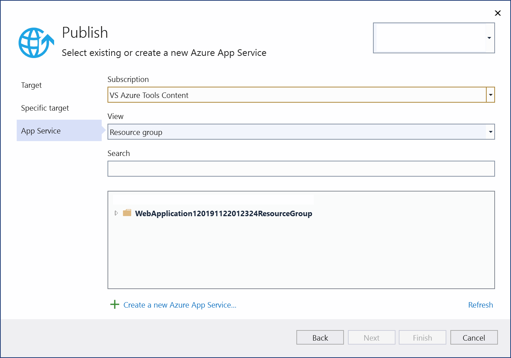

# Deploy an ASP.NET Core container to Azure App Service using Visual Studio

This tutorial walks you through using Visual Studio to publish your containerized ASP.NET Core web application to an [Azure App Service](/azure/app-service). Azure App Service is an appropriate service for a single-container web app hosted in Azure.

You can also deploy to [Azure Container Apps](/azure/container-apps/overview). For a tutorial, see [Deploy to Azure Container Apps using Visual Studio](/azure/container-apps/deploy-visual-studio).

If you don't have an Azure subscription, create a [free account](https://azure.microsoft.com/free/dotnet/?utm_source=acr-publish-doc&utm_medium=docs&utm_campaign=docs) before you begin.

## Prerequisites

To complete this tutorial:

::: moniker range="vs-2019"
- [Visual Studio 2019](https://visualstudio.microsoft.com/downloads/?cid=learn-onpage-download-cta) with the **ASP.NET and web development** workload.
::: moniker-end
::: moniker range=">=vs-2022"
- [Visual Studio](https://visualstudio.microsoft.com/downloads/?cid=learn-onpage-download-cta) with the **ASP.NET and web development** workload.
::: moniker-end

:::moniker range="visualstudio"
- Install [Docker Desktop](https://docs.docker.com/docker-for-windows/install/) or [Podman Desktop](https://podman-desktop.io/downloads).
:::moniker-end

:::moniker range="<=vs-2022"
- Install [Docker Desktop](https://docs.docker.com/docker-for-windows/install/).
:::moniker-end

## Create an ASP.NET Core web app

The following steps guide you through creating a basic ASP.NET Core app that will be used in this tutorial.

:::moniker range=">=vs-2022"

1. From the Visual Studio start window, choose **Create a new project**.
1. Choose **ASP.NET Core Web App (Razor pages)**, and choose **Next**.
1. Give your new application a name (or take the default) and choose **Next**.
1. Choose the .NET version you want to target.
1. Choose whether or not you want SSL support by using the **Configure for HTTPS** checkbox.
1. Select the **Enable container support** checkbox.
1. Select the container type, and click **Create**.

:::moniker-end
:::moniker range="vs-2019"

1. From the Visual Studio start window, choose **Create a new project**.
1. Choose **ASP.NET Core Web App**, and choose **Next**.
1. Give your new application a name (or take the default) and choose **Next**.
1. Choose the .NET version you want to target.
1. Choose whether or not you want SSL support by using the **Configure for HTTPS** checkbox.
1. Select the **Enable Docker Support** checkbox.
1. Select the container type, and click **Create**.

:::moniker-end

## Deploy the container to Azure

:::moniker range="vs-2019"

1. Right-click your project in **Solution Explorer** and choose **Publish**.
1. On the **Publish** dialog, choose the **Azure** target.

   

1. On the **Specific target** tab, choose the appropriate deployment target, such as **App Service (Windows)** or **App Service (Linux)**, depending on your container type.

   

1. If you are not signed in to the right Azure account with the subscription you want to use, sign in by using the button at the top left of the **Publish** window.

1. You can use an existing app service or create a new one by clicking on the **Create new Azure App Service** link. Find your existing app service in the treeview by expanding its resource group, or change the **View** setting to **Resource type** to sort by type.

   

1. If you create a new one, a resource group and app service will be generated in Azure. You can change the names if desired, as long as they are unique.

   

1. You can accept the default hosting plan or change the hosting plan now, or later in the Azure portal. The default is `S1` (small) in one of the supported regions. To create a hosting plan, choose **New** next to the **Hosting Plan** dropdown list. The **Hosting Plan** window appears.

   

   You can view the details about these options at [Azure App Service plan overview](/azure/app-service/overview-hosting-plans).

1. Once you're done selecting or creating these resources, choose **Finish**. Your container is deployed to Azure in the resource group and app service you selected. This process takes a bit of time. When it's completed, the **Publish** tab shows information about what was published, including the site URL.

   :::image type="content" source="media/deploy-app-service/publish-succeeded-windows.png" alt-text="Screenshot of publish tab." lightbox="media/deploy-app-service/publish-succeeded-windows.png":::

1. Click on the site link to verify your app works as expected in Azure.

   

1. The publishing profile is saved with all the details you selected, such as the resource group and app service.

1. To deploy again with the same publishing profile, use the **Publish** button, the **Publish** button on the **Web Publish Activity** window, or right-click on the project in **Solution Explorer** and choose the **Publish** item on the context-menu.

:::moniker-end

:::moniker range=">=vs-2022"

1. Right-click your project in **Solution Explorer** and choose **Publish**.
1. On the **Publish** dialog, choose the **Azure** target.

   

1. On the **Specific target** tab, choose the appropriate deployment target, such as **Azure App Service Container**. **App Service (Linux)**, or **App Service (Windows)**, depending on your container type. Choose **Azure App Service Container** if you want to deploy your image to Azure Container Registry.

   

1. If you are not signed in to the right Azure account with the subscription you want to use, sign in by using the button at the top left of the **Publish** window.

1. You can use an existing app service or create a new one by clicking on the **Create new Azure App Service** link. Find your existing app service in the treeview by expanding its resource group, or change the **View** setting to **Resource type** to sort by type.

   

   > [!NOTE]
   > In Visual Studio 2022 version 17.11 and later, the default authentication method used for publishing to Azure changed from basic authentication to using an access token for authentication. To use basic authentication with Visual Studio 17.11 or later, clear the checkbox **Enable secure publishing** (not recommended).

1. If you create a new one, a resource group and app service will be generated in Azure. You can change the names if desired, as long as they are unique.

   

1. You can accept the default hosting plan or change the hosting plan now, or later in the Azure portal. The default is `S1` (small) in one of the supported regions. To create a hosting plan, choose **New** next to the **Hosting Plan** dropdown list. The **Hosting Plan** window appears.

   

   You can view the details about these options at [Azure App Service plan overview](/azure/app-service/overview-hosting-plans).

1. If you chose the **Azure App Service Container** option, specify whether to use an existing registry or create a new one. If you create a new one, a screen appears with settings for the new registry. For the description of the options for **SKU**, see [Azure Container Registry service tiers](/azure/container-registry/container-registry-skus).

   

1. Once you're done selecting or creating these resources, choose **Finish**. Your container is deployed to Azure in the resource group and app service you selected. This process takes a bit of time. When it's completed, the **Publish** tab shows information about what was published, including the site URL.

   :::image type="content" source="media/deploy-app-service/vs-2022/publish-succeeded-app-service-container.png" alt-text="Screenshot of publish tab." lightbox="media/deploy-app-service/vs-2022/publish-succeeded-app-service-container.png":::

1. The publishing profile is saved with all the details you selected, such as the resource group and app service. If you chose **Azure App Service Container**, you might be asked to enable the Admin user on the Container Registry instance.

1. Click on the site link to verify your app works as expected in Azure.

   

1. To deploy again with the same publishing profile, use the **Publish** button, the **Publish** button on the **Web Publish Activity** window, or right-click on the project in **Solution Explorer** and choose the **Publish** item on the context-menu.

:::moniker-end

## View container settings

In the [Azure portal](https://portal.azure.com), you can open your deployed App Service.

You can view settings for your deployed App Service by opening the **Container settings** menu (when you are using Visual Studio 2019 version 16.4 or later).

From there, you can view the container information, view or download logs, or set up continuous deployment. See [Azure App Service Continuous Deployment CI/CD](/azure/app-service/containers/app-service-linux-ci-cd).

## Clean up resources

To remove all Azure resources associated with this tutorial, delete the resource group using the [Azure portal](https://portal.azure.com). To find the resource group associated with a published web application, choose **View** > **Other Windows** > **Web Publish Activity**, and then choose the gear icon. The **Publish** tab opens, which contains the resource group.

In the Azure portal, choose **Resource groups**, select the resource group to open its details page. Verify that this is the correct resource group, then choose **Remove resource group**, type the name, and choose **Delete**.

## Related content

- [Azure App Service](/azure/app-service/overview)
- [Deploy to Azure Container Registry](hosting-web-apps-in-docker.md)
