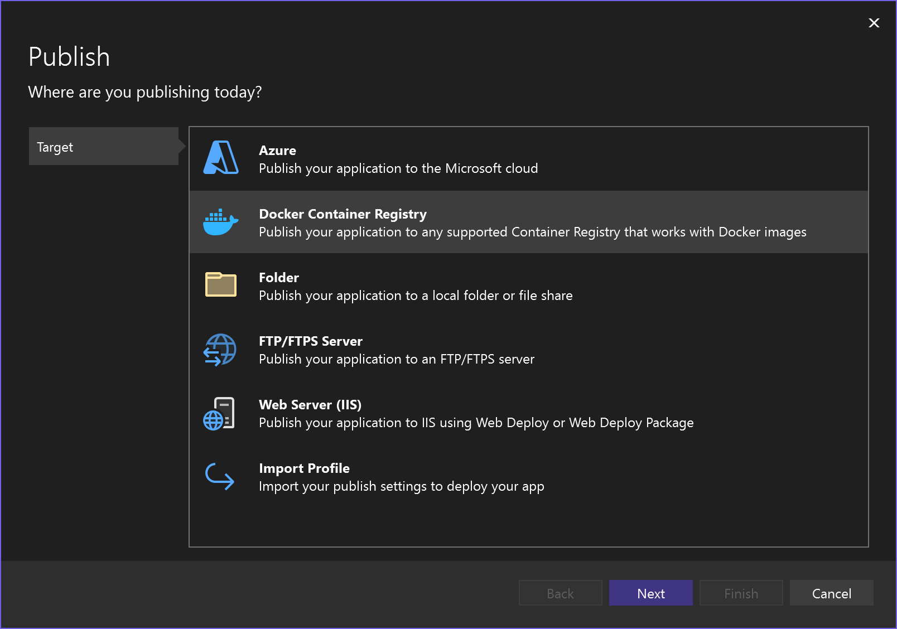
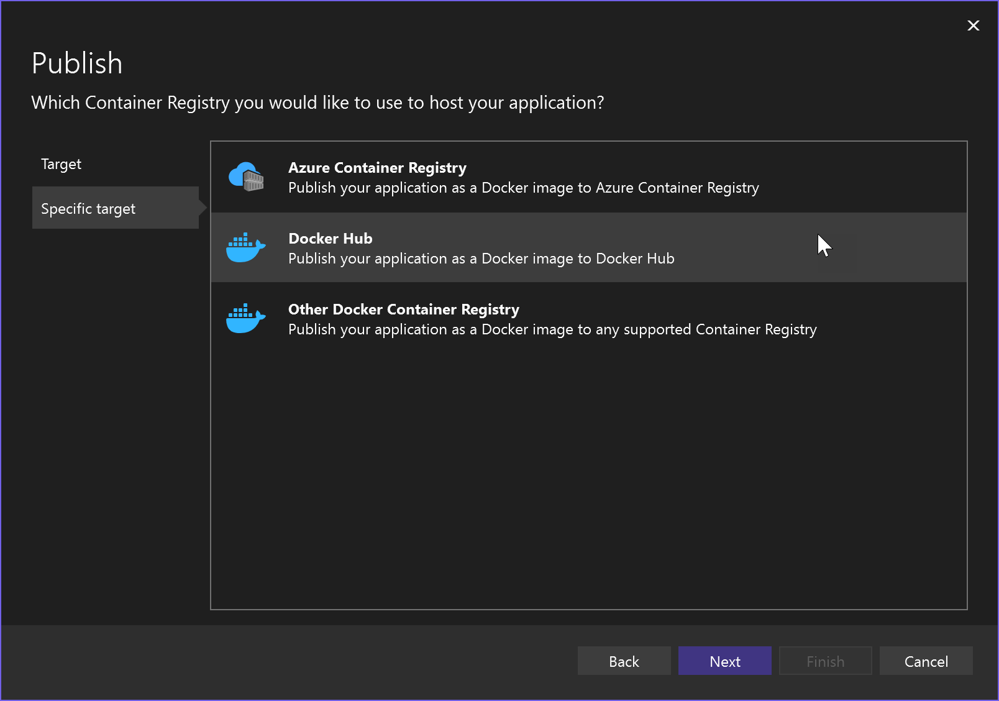
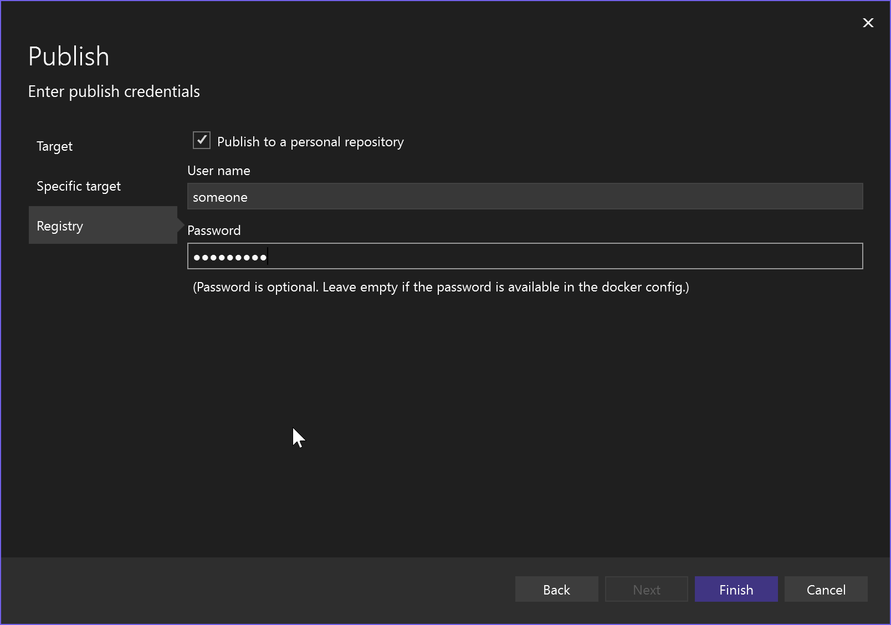
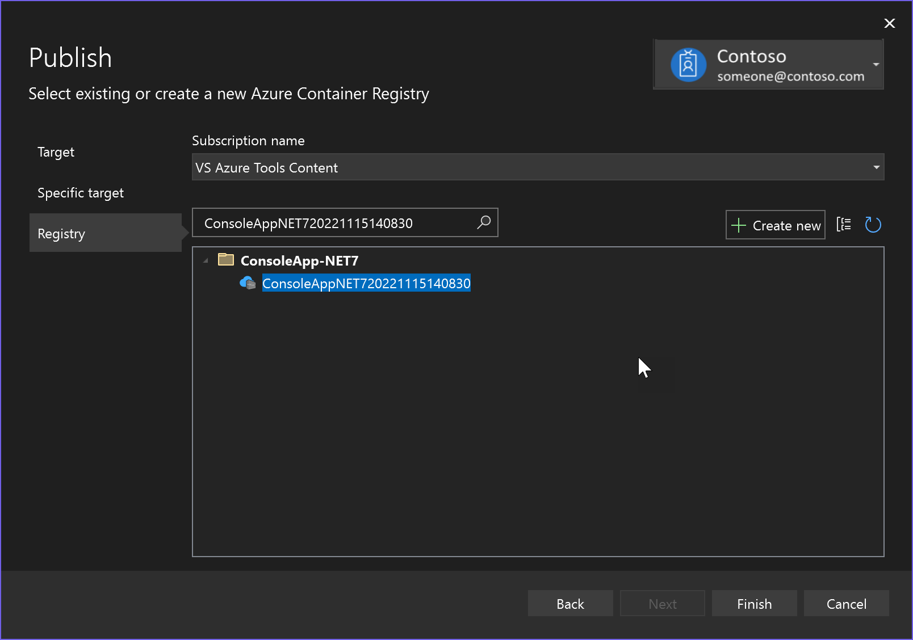
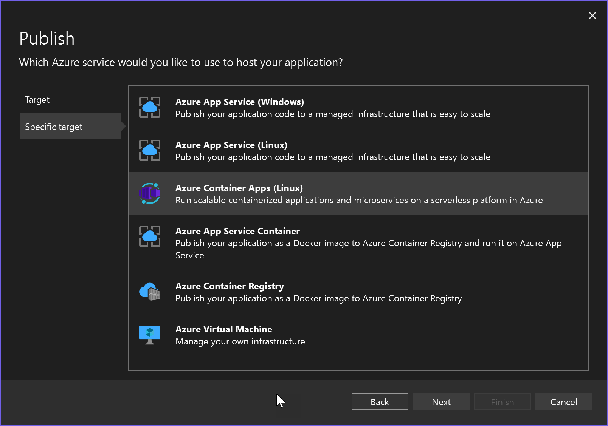
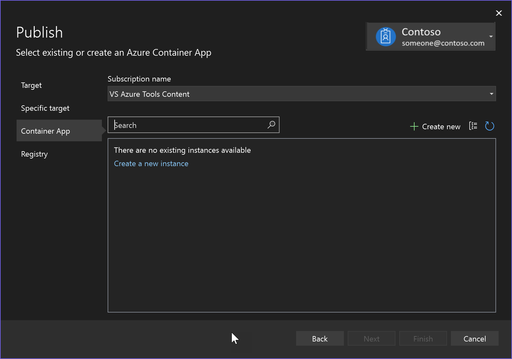
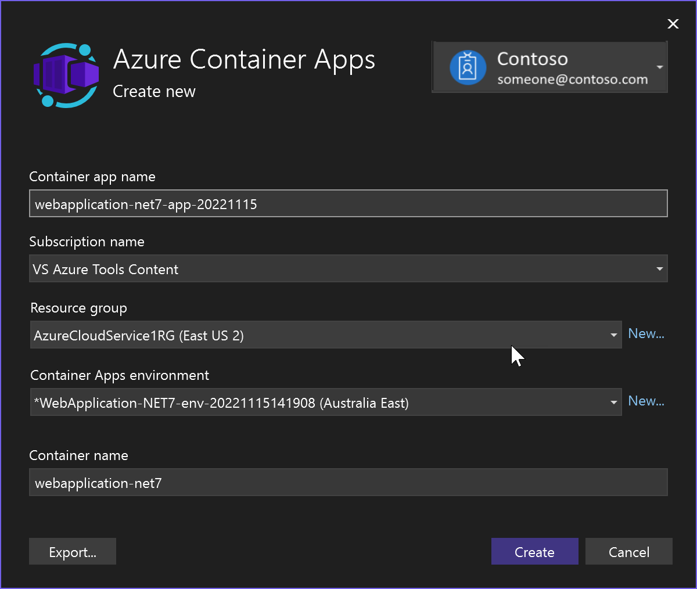
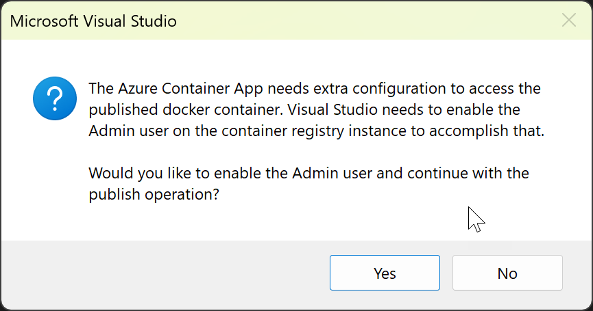
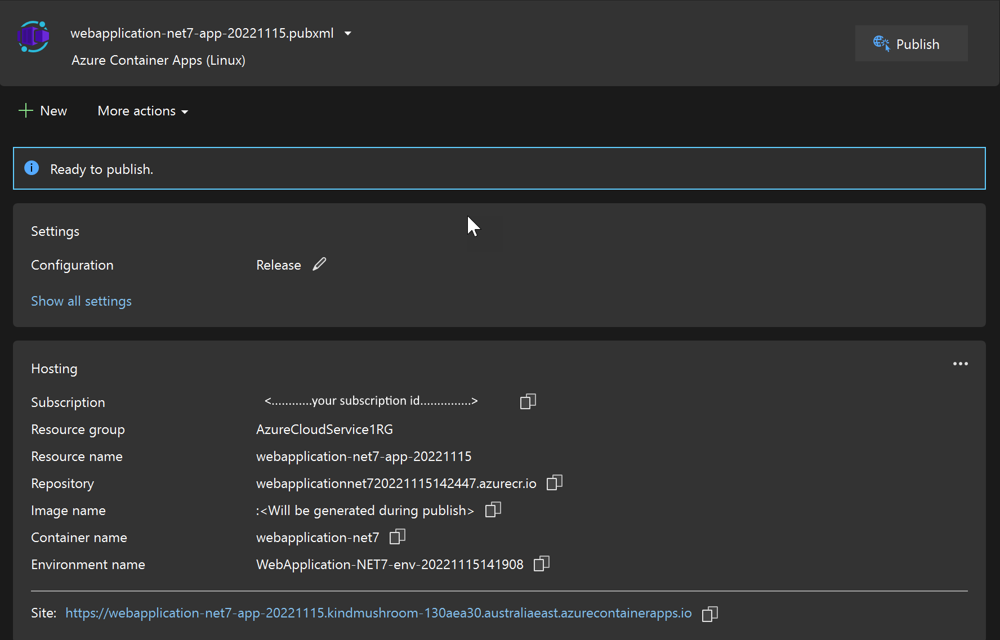

# Deploy an app into a container in Azure or Docker Hub

You can deploy a .NET 7 or later app without Docker Desktop or a Dockerfile. Visual Studio provides a deployment option that handles this conveniently for you.

:::moniker range="visualstudio"
## Prerequisites

- Install [Visual Studio](https://visualstudio.microsoft.com/vs/).
- A .NET 7 or later project
- For Azure targets, an Azure subscription. Sign up for a [free trial](https://azure.microsoft.com/pricing/purchase-options/azure-account?cid=msft_learn).
- For Docker Hub, a Docker account. If you don't have one, you can [sign up](https://hub.docker.com/signup/).

You don't need Docker Desktop or Podman Desktop.

:::moniker-end
:::moniker range="vs-2022"
## Prerequisites

- Install [Visual Studio 2022 version 17.5](https://visualstudio.microsoft.com/vs/) or later.
- A .NET 7 or later project
- For Azure targets, an Azure subscription. Sign up for a [free trial](https://azure.microsoft.com/pricing/purchase-options/azure-account?cid=msft_learn).
- For Docker Hub, a Docker account. If you don't have one, you can [sign up](https://hub.docker.com/signup/).

You don't need Docker Desktop.

:::moniker-end

## Deploy to Docker Hub

1. Right-click on the project node and choose **Publish**.

   

1. Choose **Docker Container Registry**, and then **Docker Hub**.

   

1. Provide your Docker username and password. You can skip the password, if it's in the *docker.config* file.

   

## Deploy to Azure Container Registry

1. Right-click on the project node and choose **Publish**.

   

1. Choose **Docker Container Registry**, and then **Azure Container Registry**.

   

The app is deployed to Azure Container Registry, and Visual Studio creates a publish profile for the selected deployment target.

## Deploy to Azure Container Apps

If you have an ASP.NET Core 7 or later project, you can deploy it to Azure Container Apps.

1. Right-click on the project node and choose **Publish**, then **Azure**.

1. Choose **Azure Container Apps (Linux)**.

   

1. Choose an existing container app or create a new one.

   

   If you create a new one, review and modify the default app name, resource group, location, [environment](/azure/container-apps/environment), and container name, and choose **Create**. It might take some time to create the resources in Azure.

   

1. Choose **Finish** and wait for the container app to be created. If you see a message box about enabling the Admin user on the container instance, you'll need to accept this to continue.

   

When the container app has been created, Visual Studio creates a publish profile (`.pubxml` file) and displays the settings on the **Publish** tab.

You can access the containerized web site online using the **Site** link.

Next time you want to publish using the same target and settings, you can use the **Publish** button on this screen. If you want to publish using different settings, use the **New** button. You can repeat the entire process and save the target and other settings in a separate `.pubxml` file.

## Clean up resources

To clean up resources, use the Azure portal or use the Azure CLI or Azure PowerShell to delete the resource group, if you created one, or delete the resources individually.

## Related content

Learn more about:

- [Azure Container Apps](/azure/container-apps/overview)
- [Azure Container Registry](/azure/container-registry/container-registry-intro)
- [Docker Hub](https://docs.docker.com/docker-hub/)
