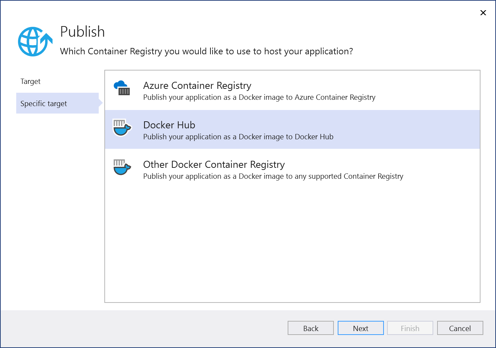
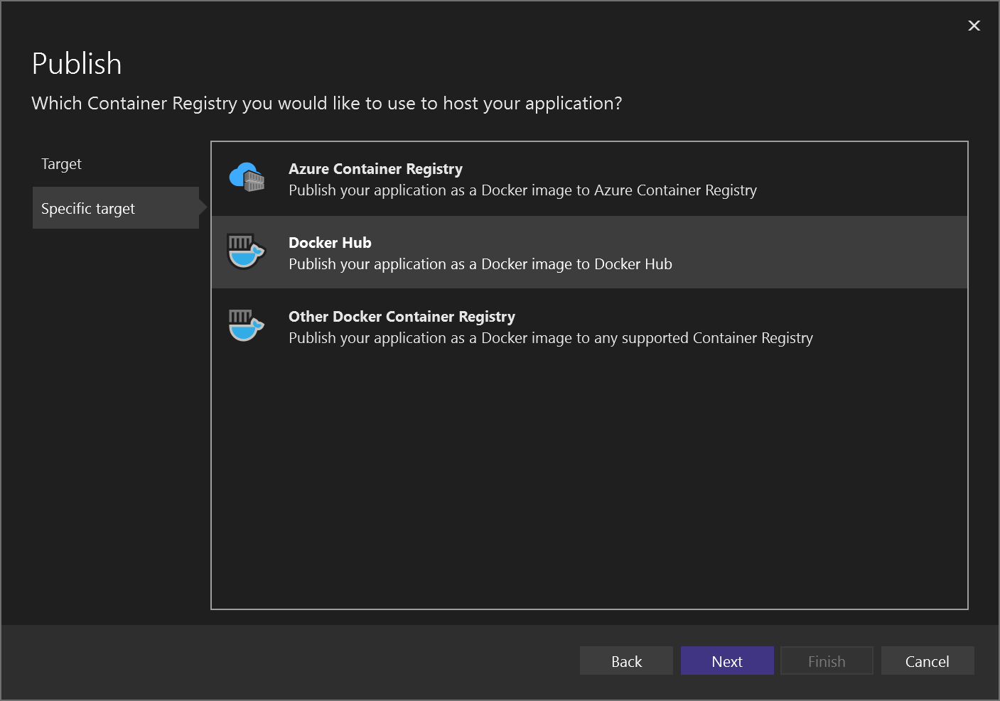
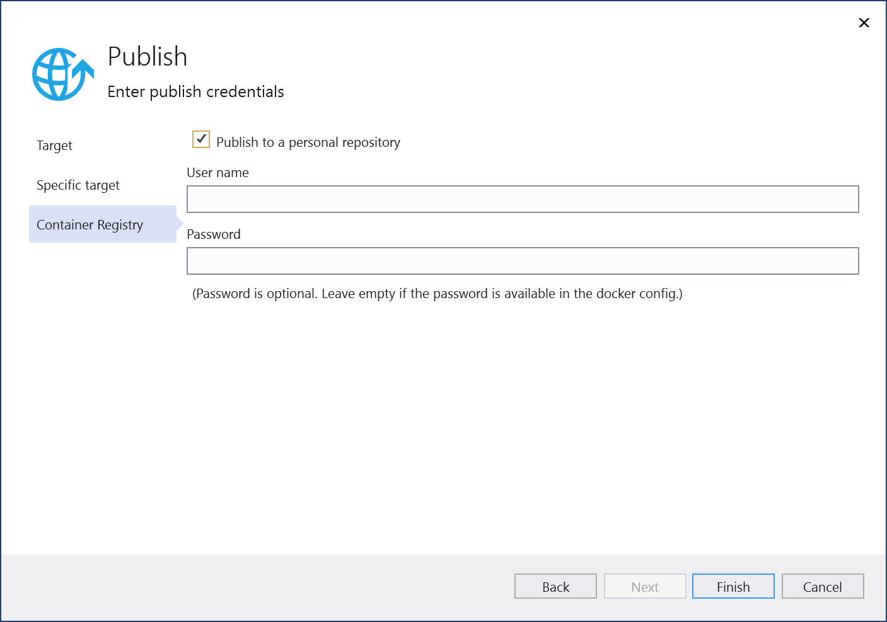
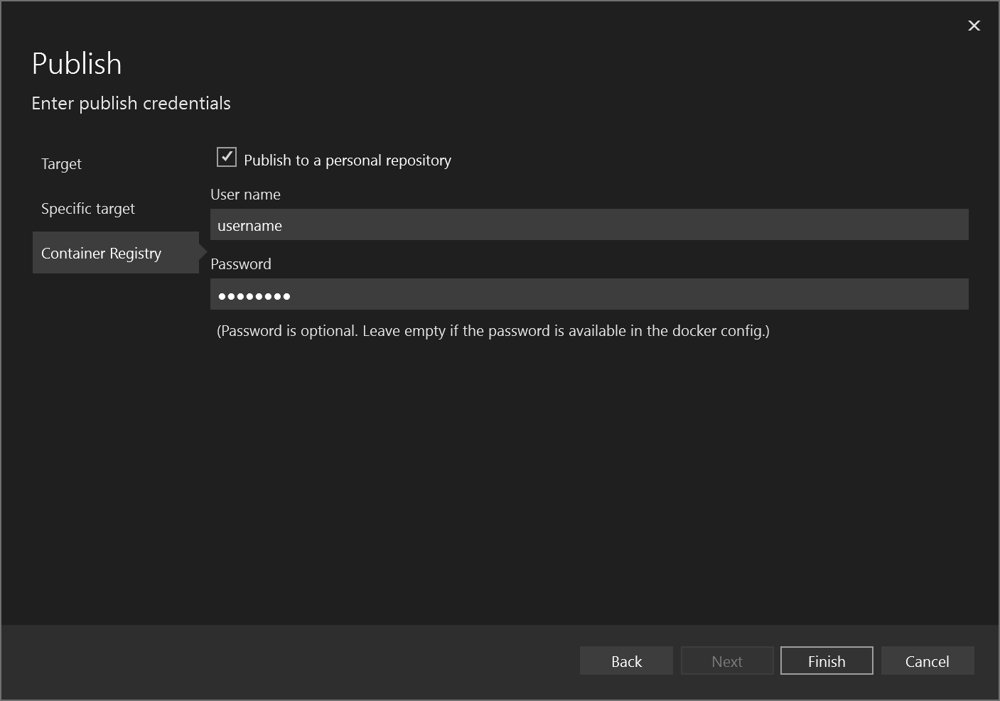
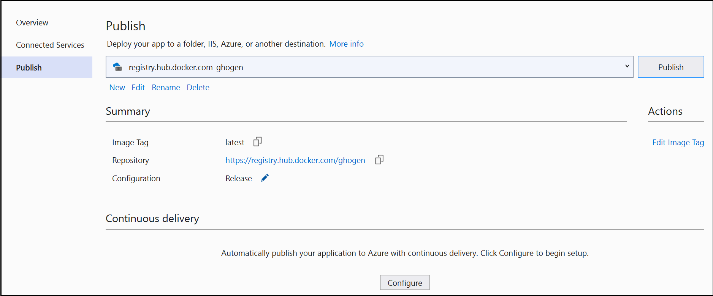

# Deploy to Docker Hub

Docker Hub provides a convenient hosting service for your image repositories. You can easily deploy to Docker Hub manually from Visual Studio.

::: moniker range=">=vs-2022"

## Prerequisites

- [Docker Desktop](https://hub.docker.com/editions/community/docker-ce-desktop-windows).
- [Visual Studio](https://visualstudio.microsoft.com/downloads/?cid=learn-onpage-download-cta) with the **ASP.NET and web development**, **Azure development** workload, and/or **.NET desktop development** workload installed.

:::moniker-end

::: moniker range="vs-2019"

## Prerequisites

- [Docker Desktop](https://hub.docker.com/editions/community/docker-ce-desktop-windows)
- [Visual Studio 2019 or later](https://visualstudio.microsoft.com/downloads/?cid=learn-onpage-download-cta) with the **ASP.NET and web development**, **Azure development** workload, **.NET desktop development**, and/or **.NET Core cross-platform development** workload installed.

:::moniker-end

## Create a Docker account and Docker Hub repository

[Sign up](https://hub.docker.com/signup) for a Docker account, if you don't already have one.

If you don't have a Docker Hub repository, create one at [Docker Hub](https://hub.docker.com/).

## Publish the image for a single project to Docker Hub

1. Right-click on the project node and choose **Publish...**. A screen showing deployment options appears.

   :::moniker range="vs-2019"
   
   :::moniker-end
   :::moniker range=">=vs-2022"
   
   :::moniker-end

1. Choose **Docker Container Registry**, and then choose **Docker Hub**.

   :::moniker range="vs-2019"
   
   :::moniker-end
   :::moniker range=">=vs-2022"
   
   :::moniker-end

1. Enter your Docker credentials.

   :::moniker range="vs-2019"
   
   :::moniker-end
   :::moniker range=">=vs-2022"
   
   :::moniker-end

1. If you are connecting to your own repository (not part of an organization), leave the checkbox for **Publish to a personal repository** checked. If the repository is owned by an organization, clear the checkbox, and enter the organization name. Enter your Docker username and password for your Docker account that has permissions to access the repository that you are connecting to, and then select **Save**.

   Visual Studio attempts to deploy your image to the Docker Hub. If successful, the **Publish** screen appears with the URL for the repository image, the image tag, repository, and the build configuration (for example, **Release**).

   :::moniker range="vs-2019"
   
   :::moniker-end
   :::moniker range=">=vs-2022"
   :::image type="content" source="media/deploy-docker-hub/vs-2022/container-tools-docker-hub-finished.png" alt-text="Screenshot of Publish screen." lightbox="media/deploy-docker-hub/vs-2022/container-tools-docker-hub-finished.png":::
   :::moniker-end

1. You can update the image at any time by clicking on the **Publish** button on this page. Or, you can modify or remove the profile, by using the links underneath the URL.

## Next steps

Publish to [Azure Container Registry](/azure/container-registry/) by following the steps at [Deploy to Azure Container Registry](hosting-web-apps-in-docker.md).

Set up continuous integration and delivery (CI/CD) with [Azure Pipelines](/azure/devops/pipelines/?view=azure-devops&preserve-view=true).

## Related content

- [Deploy to Azure App Service](deploy-app-service.md)
- [Visual Studio Container Tools](./index.yml).
