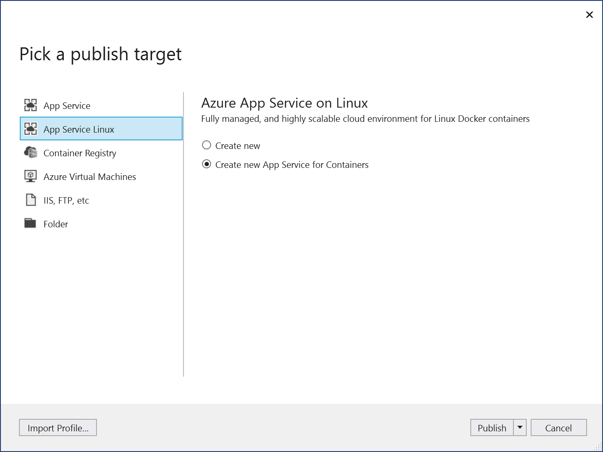
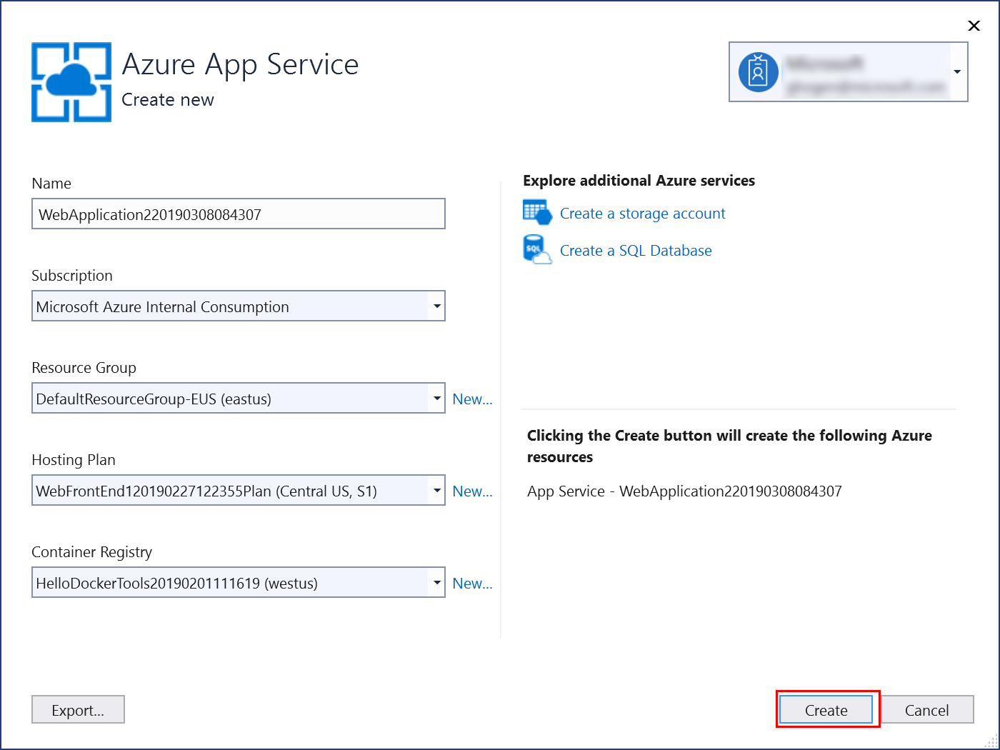
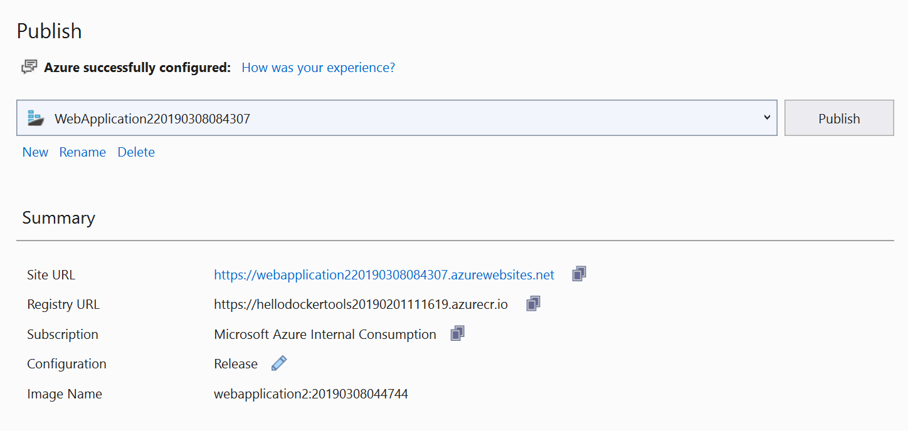
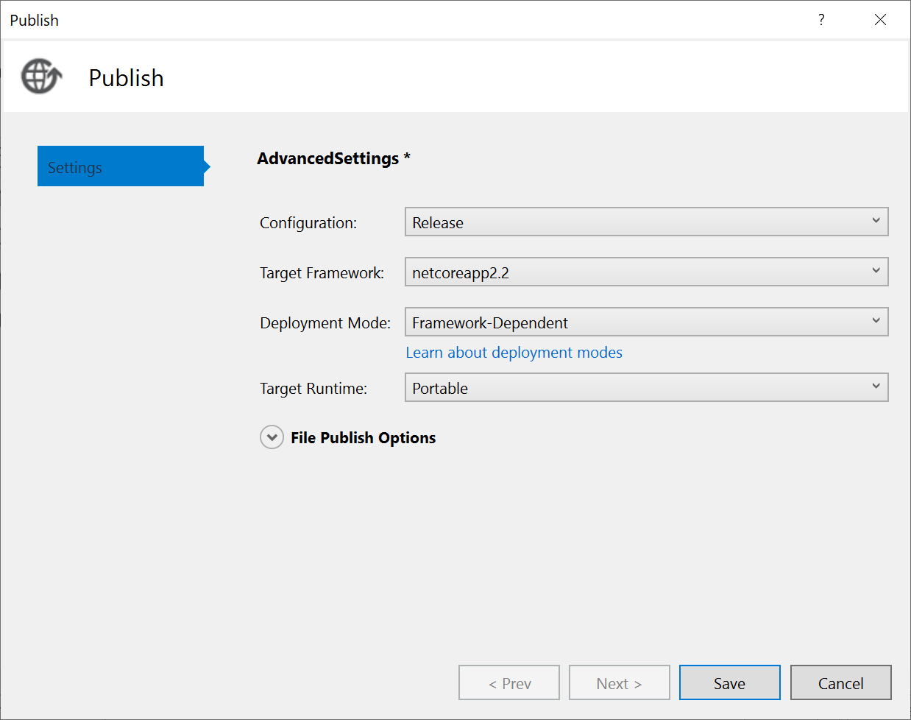
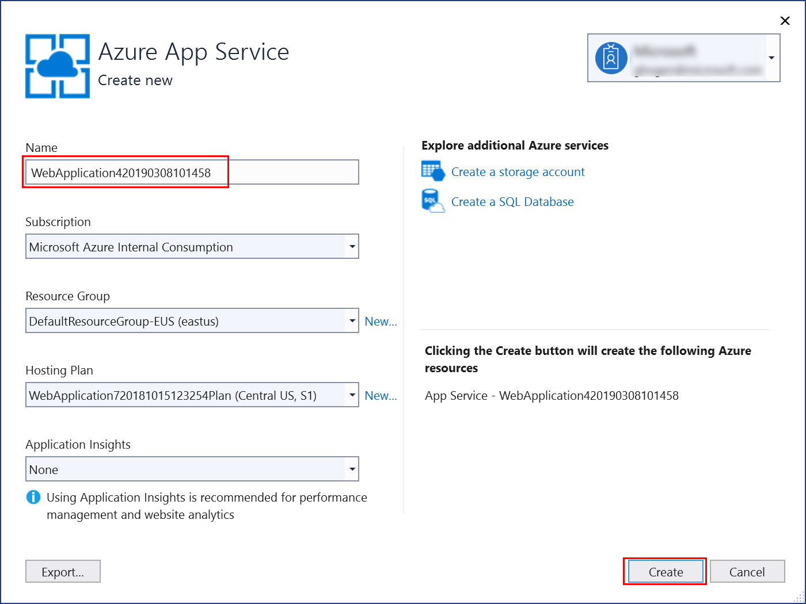

# Deploy an ASP.NET Core container to Azure App Service using Visual Studio

This tutorial walks you through using Visual Studio to publish your containerized ASP.NET Core web application to an [Azure App Service](/azure/app-service). Azure App Service is an appropriate service for a single-container web app hosted in Azure.

If you don't have an Azure subscription, create a [free account](https://azure.microsoft.com/free/dotnet/?utm_source=acr-publish-doc&utm_medium=docs&utm_campaign=docs) before you begin.

## Prerequisites

To complete this tutorial:

::: moniker range="vs-2017"
- Install the latest version of [Visual Studio 2017](https://azure.microsoft.com/downloads/) with the "ASP.NET and web development" workload
::: moniker-end
::: moniker range=">=vs-2019"
- [Visual Studio 2019](https://visualstudio.microsoft.com/downloads/?utm_medium=microsoft&utm_source=docs.microsoft.com&utm_campaign=inline+link&utm_content=download+vs2019+rc) with the *ASP.NET and web development* workload.
::: moniker-end
- Install [Docker Desktop](https://docs.docker.com/docker-for-windows/install/)

## Create an ASP.NET Core web app

The following steps guide you through creating a basic ASP.NET Core app that will be used in this tutorial.

::: moniker range="vs-2017"
[!INCLUDE [create-aspnet5-app](../azure/includes/create-aspnet5-app.md)]
::: moniker-end
::: moniker range=">= vs-2019"
[!INCLUDE [create-aspnet5-app](../azure/includes/vs-2019/create-aspnet5-app-2019.md)]
::: moniker-end

Follow the appropriate steps in the next sections, depending on whether you are using a [Linux container](#linux-container) or a [Windows container](#windows-container).

## Linux container

1. Right-click your project in **Solution Explorer** and choose **Publish**.
1. On the publish target dialog, choose **App Service Linux**.
1. You can publish only to App Service, or you can publish to both App Service and Azure Container Registry (ACR). To publish the container in an Azure Container Registry (ACR), choose **Create new App Service for containers**, and click **Publish**.

   

   To publish only to an Azure App Service without using Azure Container Registry, choose **Create new**, and click **Publish**.

1. Check that you're signed in with the account that's associated with your Azure subscription, and choose a unique name, subscription, resource group, hosting plan, and container registry (if applicable), or accept the defaults.

   

1. Choose **Create**. Your container is deployed to Azure in the resource group and container registry you selected. This process takes a bit of time. When it's completed, the **Publish** tab shows information about what was published, including the site URL.

   

1. Click on the site link to verify your app works as expected in Azure.

   

1. The publishing profile is saved with all the details you selected, such as the resource group and container registry.
1. To deploy again with the same publishing profile, use the **Publish** button, the **Publish** button on the **Web Publish Activity** window, or right-click on the project in **Solution Explorer** and choose the **Publish** item on the context-menu.

## Windows container

1. Right-click your project in **Solution Explorer** and choose **Publish**.
1. On the publish target dialog, choose **App Service**, and **Create new**.

   

1. If you want to deploy a build configuration other than **Release**, or customize your .NET Core deployment details (version, target architecture, or deployment mode), choose **Advanced**.

   

1. Choose **Publish**.
1. Check that you're signed in with the account that's associated with your Azure subscription, and choose a unique name, the subscription, resource group, hosting plan, and container registry (if applicable), or accept the defaults.

   

1. Choose **Create**. Your container is deployed to Azure in the resource group and container registry you selected. This process takes a bit of time. When it's completed, the **Publish** tab shows information about what was published, including the site URL.

   

1. Click on the site link to verify your app works as expected in Azure.

   

1. The publishing profile is saved with all the details you selected, such as the resource group and container registry.
1. To deploy again with the same publishing profile, use the **Publish** button, the **Publish** button on the **Web Publish Activity** window, or right-click on the project in **Solution Explorer** and choose the **Publish** item on the context-menu.

## Clean up resources

To remove all Azure artifacts associated with this tutorial, delete the resource group using the [Azure Portal](https://portal.azure.com). To find the resource group associated with a published web application, choose **View** > **Other Windows** > **Web Publish Activity**, and then choose the gear icon. The **Publish** tab opens, which contains the resource group.

In the Azure portal, choose **Resource groups**, select the resource group to open its details page. Verify that this is the correct resource group, and then choose **Remove resource group**, type the name, and choose **Delete**.

## Next steps

Set up continuous integration and delivery (CI/CD) with [Azure Pipelines](/azure/devops/pipelines/?view=azure-devops).

## See also

[Deploy to Azure Container Registry](vs-azure-tools-docker-hosting-web-apps-in-docker.md)