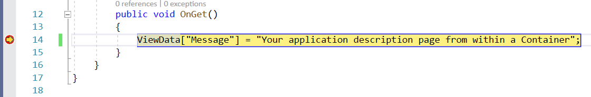
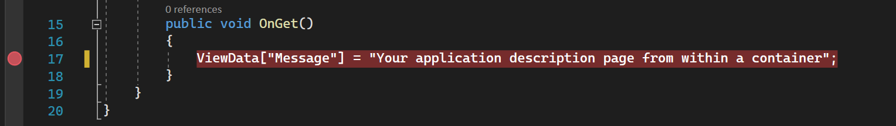
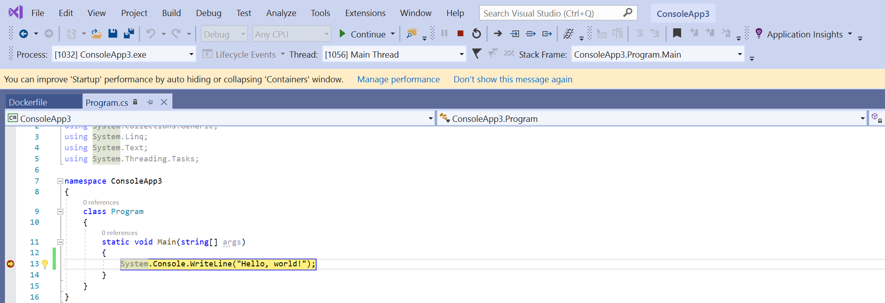

# Debug apps in a local container

Visual Studio provides a consistent way to develop containers and validate your application locally.
You can run and debug your apps in Linux or Windows containers running on your local Windows desktop with Docker installed, and you don't have to restart the container each time you make a code change.

:::moniker range="visualstudio"
This article illustrates how to use Visual Studio to start an app in a local container, make changes, and then refresh the browser to see the changes. This article also shows you how to set breakpoints for debugging for containerized apps. Supported project types include web app, console app, and Azure function targeting .NET Core or .NET 5 and higher. The examples presented in this article are a project of type ASP.NET Core Web App and Console App.
:::moniker-end

:::moniker range="<=vs-2022"
This article illustrates how to use Visual Studio to start an app in a local container, make changes, and then refresh the browser to see the changes. This article also shows you how to set breakpoints for debugging for containerized apps. Supported project types include web app, console app, and Azure function targeting .NET Framework and .NET Core. The examples presented in this article are a project of type ASP.NET Core Web App and a project of type Console App (.NET Framework).
:::moniker-end

If you already have a project of a supported type, Visual Studio can create a Dockerfile and configure your project to run in a container. See [Container Tools in Visual Studio](overview.md).

## Prerequisites

To debug apps in a local container, the following tools must be installed:

::: moniker range="vs-2019"

- [Visual Studio 2019](https://visualstudio.microsoft.com/downloads/?cid=learn-onpage-download-cta) with the Web Development workload installed

To run Docker containers locally, you must have a local Docker client. You can use [Docker Desktop](https://www.docker.com/get-docker), which requires Windows 10 or later.
::: moniker-end

::: moniker range="vs-2022"

- [Visual Studio 2022 or later](https://visualstudio.microsoft.com/downloads/?cid=learn-onpage-download-cta) with the Web Development workload installed

To run Docker containers locally, you must have a local Docker client. You can use [Docker Desktop](https://www.docker.com/get-docker), which requires Windows 10 or later.
::: moniker-end

::: moniker range="visualstudio"

- [Visual Studio](https://visualstudio.microsoft.com/downloads/?cid=learn-onpage-download-cta) with the Web Development workload installed

To run Docker containers locally, you must have a local Docker client. You can use [Docker Desktop](https://www.docker.com/get-docker), which requires Windows 10 or later.

To run containers with Podman, install [Podman Desktop](https://podman-desktop.io/downloads).

::: moniker-end

## Create a web app

If you have a project and you've added Docker support as described in the [overview](overview.md), skip this section.

::: moniker range="vs-2019"
[!INCLUDE [create-aspnet5-app-2019](../azure/includes/vs-2019/create-aspnet5-app-2019.md)]
::: moniker-end
::: moniker range=">=vs-2022"
[!INCLUDE [create-aspnet5-app-2022](../azure/includes/vs-2022/create-aspnet5-app-2022.md)]
::: moniker-end

### Edit your Razor pages and refresh

To quickly iterate changes in your Razor pages, you can start your application in a container. Then, continue to make changes, viewing them as you would with Internet Information Services (IIS) Express.

1. Make sure that Docker is set up to use the container type (Linux or Windows) that you are using. Right-click on the Docker icon on the Taskbar, and choose **Switch to Linux containers** or **Switch to Windows containers** as appropriate.

1. Editing your code and refreshing the running site as described in this section is not enabled in the default templates in .NET Core and .NET 5 and later. To enable it, add the NuGet package [Microsoft.AspNetCore.Mvc.Razor.RuntimeCompilation](https://www.nuget.org/packages/Microsoft.AspNetCore.Mvc.Razor.RuntimeCompilation/). Add a call to the extension method [AddRazorRuntimeCompilation](/dotnet/api/microsoft.extensions.dependencyinjection.razorruntimecompilationmvcbuilderextensions.addrazorruntimecompilation) to the code in the `Startup.ConfigureServices` method. You only need this enabled in DEBUG mode, so code it as follows in the `Main` method:

    ```csharp
    // Add services to the container.
    var mvcBuilder = builder.Services.AddRazorPages();
    #if DEBUG
        if (Env.IsDevelopment())
        {
            mvcBuilder.AddRazorRuntimeCompilation();
        }
    #endif
    ```

    For more information, see [Razor file compilation in ASP.NET Core](/aspnet/core/mvc/views/view-compilation). The exact code might vary, depending on the target framework and the project template you used.

1. Set **Solution Configuration** to **Debug**. Then, press **Ctrl**+**F5** to build your Docker image and run it locally.

    When the container image is built and running in a Docker container, Visual Studio launches the web app in your default browser.

1. Go to the *Index* page. We'll make changes on this page.
1. Return to Visual Studio and open *Index.cshtml*.
1. Add the following HTML content to the end of the file, and then save the changes.

    ```html
    <h1>Hello from a Docker container!</h1>
    ```

1. In the output window, when the .NET build is finished and you see the following lines, switch back to your browser and refresh the page:

   ```output
   Now listening on: http://*:80
   Application started. Press Ctrl+C to shut down.
   ```

Your changes have been applied!

### Debug with breakpoints

Often, changes require further inspection. You can use the debugging features of Visual Studio for this task.

1. In Visual Studio, open *Index.cshtml.cs*.
2. Replace the contents of the `OnGet` method with the following code:

   ```csharp
       ViewData["Message"] = "Your application description page from within a container";
   ```

3. To the left of the code line, set a breakpoint.
4. To start debugging and hit the breakpoint, press F5.
5. Switch to Visual Studio to view the breakpoint. Inspect values.

   :::moniker range="vs-2019"
   
   :::moniker-end
   :::moniker range=">=vs-2022"
   
   :::moniker-end

:::moniker range=">=vs-2022"
## Hot reload

Also, in Visual Studio 17.10 and later, [Hot Reload](../debugger/hot-reload.md) is supported in containers, although be aware that in a container, you have to refresh the page to see changes. If the change is to a CSS file, you again have to refresh the page to see those changes. Note also that updates to scoped CSS files (`.razor.css` files, see [ASP.NET Core Blazor CSS isolation](/aspnet/core/blazor/components/css-isolation)) are not supported as part of hot reload.
:::moniker-end

:::moniker range="<=vs-2022"
## Create a .NET Framework console app

This section presents how to debug a .NET Framework console app project in a local Docker container by first showing how to add Docker support to the project. It's important to recognize that different project types have different levels of Docker support. There are even different levels of Docker support for .NET Core (including .NET 5 and later) console app projects versus .NET Framework console app projects.

When a .NET Framework console app project is created, there's no option to enable Docker support. After creating such a project, there's no way to explicitly add Docker support to the project. For a .NET Framework console app project, it's possible to add support for container orchestration. A side effect of adding orchestration support to the .NET Framework console app project is that it adds Docker support to the project.

The following procedure demonstrates how to add orchestration support to a .NET Framework console app project, which subsequently adds Docker support to the project and allows the project to be debugged in a local Docker container.

1. Create a new .NET Framework Console app project.
1. In Solution Explorer, right-click the project node, and then select **Add** > **Container Orchestration Support**. In the dialog box that appears, select **Docker Compose**. A Dockerfile is added to your project and a Docker Compose project with associated support files is added.

### Debug with breakpoints

1. In Solution Explorer, open *Program.cs*.
2. Replace the contents of the `Main` method with the following code:

   ```csharp
       System.Console.WriteLine("Hello, world!");
   ```

3. Set a breakpoint to the left of the code line.
4. Press **F5** to start debugging and hit the breakpoint.
5. Switch to Visual Studio to view the breakpoint and inspect values.

   

:::moniker-end

:::moniker range="vs-2022"

## Authenticating to Azure services using the token proxy

When you're using Azure services from a container, you can use [DefaultAzureCredential](/dotnet/api/azure.identity.defaultazurecredential) (with the [VisualStudioCredential](/dotnet/api/azure.identity.visualstudiocredential) enabled) to authenticate with Azure services with your Microsoft Entra account without any additional configuration in the container. To enable this, see [How to configure Visual Studio Container Tools](container-tools-configure.md). Also, you need to set up Azure authentication in Visual Studio by following the instructions at [Authenticate Visual Studio with Azure](/dotnet/azure/configure-visual-studio#authenticate-visual-studio-with-azure). The support for VisualStudioCredential in a container is available in Visual Studio version 17.6 and later.

### Azure Functions

If you're debugging an integrated Azure Functions project and using the token proxy in the container to handle authentication to Azure services, you need to copy the .NET runtime onto the container for the token proxy to run. If you're debugging an isolated Azure Functions project, it already has the .NET runtime, so there's no need for this extra step.

To ensure the .NET runtime is available to the token proxy, add, or modify the `debug` layer in the Dockerfile that copies the .NET runtime into the container image. For Linux containers, you can add the following code to the Dockerfile:

```dockerfile
# This layer is to support debugging, VS's Token Proxy requires the runtime to be installed in the container
FROM mcr.microsoft.com/dotnet/runtime:8.0 AS runtime
FROM base as debug
COPY --from=runtime /usr/share/dotnet /usr/share/dotnet
RUN ln -s /usr/share/dotnet/dotnet /usr/bin/dotnet
```

Also, in the Visual Studio project, you need to make some changes to specify this as the layer to use when debugging in Fast Mode. For an explanation of Fast Mode, see [Customize Docker containers in Visual Studio](container-build.md). For single container scenarios (not Docker Compose), set the MSBuild property `DockerfileFastModeStage` to `debug` in order to use that layer for debugging. For Docker Compose, modify the `docker-compose.vs.debug.yml` as follows:

```yml
# Set the stage to debug to use an image with the .NET runtime in it
services:
  functionappintegrated:
    build:
      target: debug
```

For a code sample of authentication with Azure Functions, including both integrated and isolated scenarios, see [VisualStudioCredentialExample](https://github.com/NCarlsonMSFT/VisualStudioCredentialExample).
:::moniker-end

:::moniker range="visualstudio"

## Authenticating to Azure services using the token proxy

When you're using Azure services from a container, you can use [DefaultAzureCredential](/dotnet/api/azure.identity.defaultazurecredential) (with the [VisualStudioCredential](/dotnet/api/azure.identity.visualstudiocredential) enabled) to authenticate with Azure services with your Microsoft Entra account without any additional configuration in the container. To enable this, see [How to configure Visual Studio Container Tools](container-tools-configure.md). Also, you need to set up Azure authentication in Visual Studio by following the instructions at [Authenticate Visual Studio with Azure](/dotnet/azure/configure-visual-studio#authenticate-visual-studio-with-azure). The support for VisualStudioCredential in a container is available in Visual Studio version 17.6 and later.

### Azure Functions

If you're debugging an integrated Azure Functions project and using the token proxy in the container to handle authentication to Azure services, you need to copy the .NET runtime onto the container for the token proxy to run. If you're debugging an isolated Azure Functions project, it already has the .NET runtime, so there's no need for this extra step.

To ensure the .NET runtime is available to the token proxy, add, or modify the `debug` layer in the Dockerfile that copies the .NET runtime into the container image. For Linux containers, you can add the following code to the Dockerfile:

```dockerfile
# This layer is to support debugging, VS's Token Proxy requires the runtime to be installed in the container
FROM mcr.microsoft.com/dotnet/runtime:8.0 AS runtime
FROM base as debug
COPY --from=runtime /usr/share/dotnet /usr/share/dotnet
RUN ln -s /usr/share/dotnet/dotnet /usr/bin/dotnet
```

Also, in the Visual Studio project, you need to make some changes to specify this as the layer to use when debugging in Fast Mode. For an explanation of Fast Mode, see [Customize Docker containers in Visual Studio](container-build.md). For single container scenarios (not Docker Compose), set the MSBuild property `ContainerFastModeStage` (or `DockerfileFastModeStage`) to `debug` in order to use that layer for debugging. For Docker Compose, modify the `docker-compose.vs.debug.yml` as follows:

```yml
# Set the stage to debug to use an image with the .NET runtime in it
services:
  functionappintegrated:
    build:
      target: debug
```

For a code sample of authentication with Azure Functions, including both integrated and isolated scenarios, see [VisualStudioCredentialExample](https://github.com/NCarlsonMSFT/VisualStudioCredentialExample).
:::moniker-end

## Container reuse

When you use [Fast Mode](container-build.md), which Visual Studio normally uses for the Debug configuration, Visual Studio rebuilds only your container images and the container itself when you change the Dockerfile. If you don't change the Dockerfile, Visual Studio reuses the container from an earlier run.

If you manually modified your container and want to restart with a clean container image, use the **Build** > **Clean** command in Visual Studio, and then build as normal.

When you're not using Fast Mode, which is typical for the Release configuration, Visual Studio rebuilds the container each time the project is built.

You can configure when Fast Mode is used; see [How to configure Visual Studio Container Tools](container-tools-configure.md).

## Troubleshoot

Learn how to [troubleshoot Visual Studio Docker development](/troubleshoot/developer/visualstudio/ide/troubleshooting-docker-errors).

## Related content

Get more details by reading [How Visual Studio builds containerized apps](container-build.md).

## More about Docker with Visual Studio, Windows, and Azure

- Learn more about [container development with Visual Studio](./index.yml).
- To build and deploy a Docker container, see [Docker integration for Azure Pipelines](https://marketplace.visualstudio.com/items?itemName=ms-vscs-rm.docker).
- For an index of Windows Server and Nano Server articles, see [Windows container information](/virtualization/windowscontainers/).
- Learn about [Azure Kubernetes Service](https://azure.microsoft.com/services/kubernetes-service/) and review the [Azure Kubernetes Service documentation](/azure/aks).
