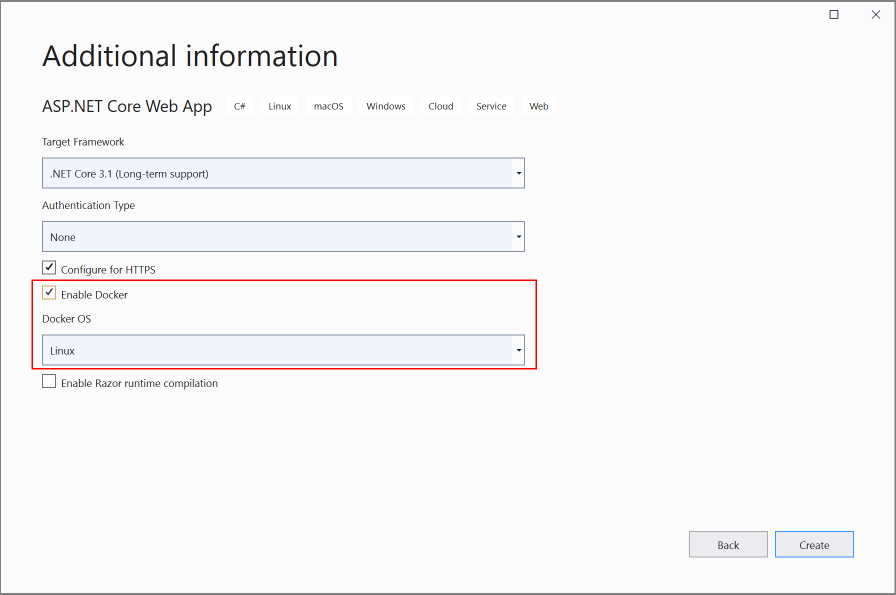
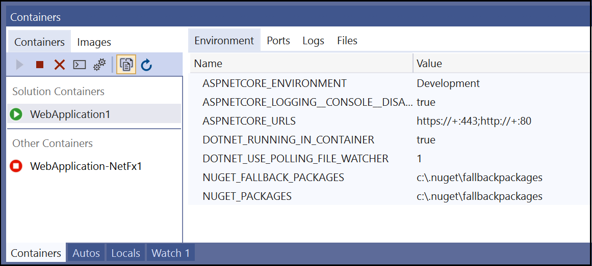
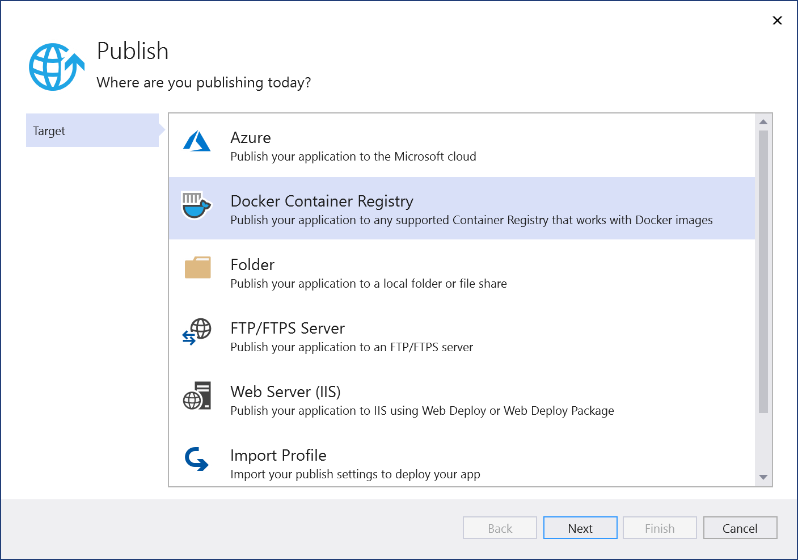
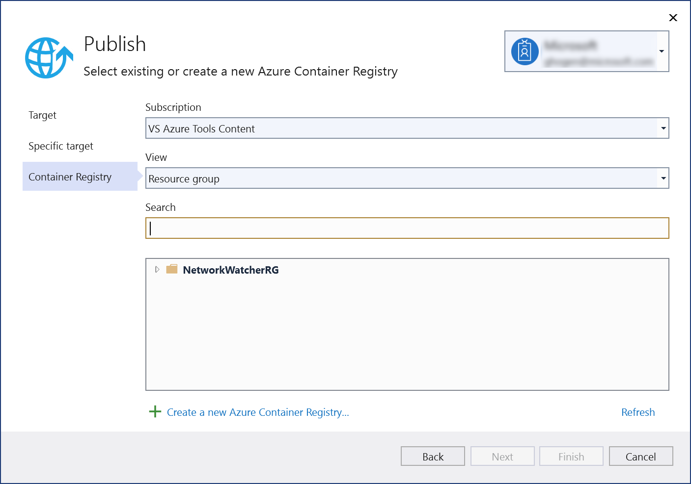
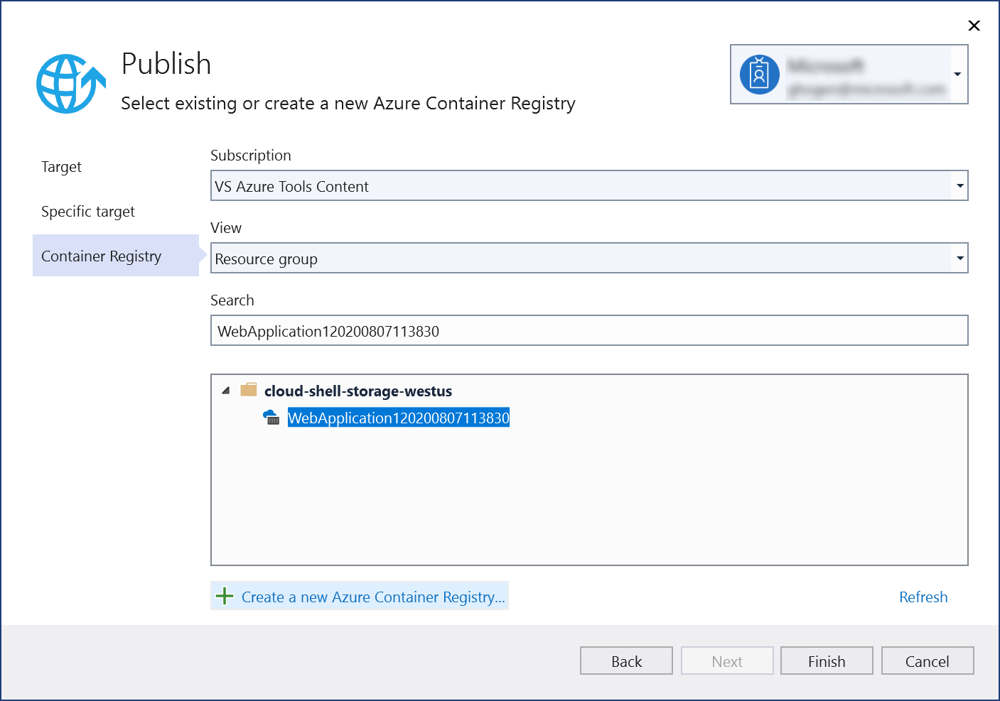
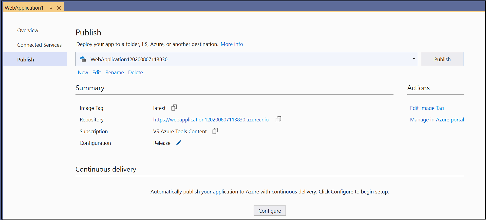

With Visual Studio, you can easily build, debug, and run containerized .NET, ASP.NET, and ASP.NET Core apps and publish them to Azure Container Registry, Docker Hub, Azure App Service, or your own Container Registry. In this article, we'll publish an ASP.NET Core app to Azure Container Registry.

## Prerequisites

- [Docker Desktop](https://hub.docker.com/editions/community/docker-ce-desktop-windows)
- [Visual Studio 2019](https://visualstudio.microsoft.com/downloads/?cid=learn-onpage-download-cta) with the **Web Development**, **Azure Tools** workload, and/or **.NET Core cross-platform development** workload installed
- [.NET Core Development Tools](https://dotnet.microsoft.com/download/dotnet-core/) for development with .NET Core
- To publish to Azure Container Registry, an Azure subscription. [Sign up for a free trial](https://azure.microsoft.com/free/dotnet/).

## Installation and setup

For Docker installation, first review the information at [Docker Desktop for Windows: What to know before you install](https://docs.docker.com/docker-for-windows/install/#what-to-know-before-you-install). Next, install [Docker Desktop](https://hub.docker.com/editions/community/docker-ce-desktop-windows).

## Add a project to a Docker container

1. Create a new project using the **ASP.NET Core Web App** template or if you want to use the .NET Framework instead of .NET Core, choose **ASP.NET Web Application (.NET Framework)**.
1. On the **Create new web application** screen, make sure the **Enable Docker Support** checkbox is selected.

   

   The screenshot shows .NET Core; if you're using .NET Framework, it looks a bit different.

1. Select the type of container you want (Windows or Linux) and click **Create**.

## Dockerfile overview

A *Dockerfile*, the recipe for creating a final Docker image, is created in the project. Refer to [Dockerfile reference](https://docs.docker.com/engine/reference/builder/) for an understanding of the commands within it.:

```dockerfile
FROM mcr.microsoft.com/dotnet/core/aspnet:3.1 AS base
WORKDIR /app
EXPOSE 80
EXPOSE 443

FROM mcr.microsoft.com/dotnet/core/sdk:3.1 AS build
WORKDIR /src
COPY ["WebApplication1/WebApplication1.csproj", "WebApplication1/"]
RUN dotnet restore "WebApplication1/WebApplication1.csproj"
COPY . .
WORKDIR "/src/WebApplication1"
RUN dotnet build "WebApplication1.csproj" -c Release -o /app/build

FROM build AS publish
RUN dotnet publish "WebApplication1.csproj" -c Release -o /app/publish

FROM base AS final
WORKDIR /app
COPY --from=publish /app/publish .
ENTRYPOINT ["dotnet", "WebApplication1.dll"]
```

The preceding *Dockerfile* is based on the dotnet/core/aspnet image, and includes instructions for modifying the base image by building your project and adding it to the container. If you're using the .NET Framework, the base image will be different.

When the new project dialog's **Configure for HTTPS** checkbox is checked, the *Dockerfile* exposes two ports. One port is used for HTTP traffic; the other port is used for HTTPS. If the checkbox isn't checked, a single port (80) is exposed for HTTP traffic.

## Debug

Select **Docker** from the debug dropdown list in the toolbar, and start debugging the app. You might see a message with a prompt about trusting a certificate; choose to trust the certificate to continue.

The **Container Tools** option in the **Output** window shows what actions are taking place. The first time, it might take a while to download the base image, but it's much faster on subsequent runs.

> [!NOTE]
> If you need to change ports for debugging, you can do that in the *launchSettings.json* file. See [Container Launch Settings](../../container-launch-settings.md).

## Containers window

If you have Visual Studio 2019 version 16.4 or later, you can use the **Containers** window to view running containers on your machine, as well as images that you have available.

Open the **Containers** window by using the search box in the IDE (press **Ctrl**+**Q** to use it), type in `container`, and choose the **Containers** window from the list.

You can mount the **Containers** window in a convenient place, such as below the editor, by moving it around and following the window placement guides.

In the window, find your container and step through each tab to view the environment variables, port mappings, logs, and the filesystem.



For more information, see [Use the Containers window](../../view-and-diagnose-containers.md).

## Publish Docker images

Once the develop and debug cycle of the app is completed, you can create a production image of the app.

1. Change the configuration dropdown list to **Release** and build the app.
1. Right-click your project in **Solution Explorer** and choose **Publish**.
1. On the **Publish** dialog, select the **Docker Container Registry** tab.

   

1. Choose **Create New Azure Container Registry**.

   

1. Fill in your desired values in the **Create a new Azure Container Registry**.

    | Setting      | Suggested value  | Description                                |
    | ------------ |  ------- | -------------------------------------------------- |
    | **DNS Prefix** | Globally unique name | Name that uniquely identifies your container registry. |
    | **Subscription** | Choose your subscription | The Azure subscription to use. |
    | **[Resource Group](/azure/azure-resource-manager/resource-group-overview)** | myResourceGroup |  Name of the resource group in which to create your container registry. Choose **New** to create a new resource group.|
    | **[SKU](/azure/container-registry/container-registry-skus)** | Standard | Service tier of the container registry  |
    | **Registry Location** | A location close to you | Choose a Location in a [region](https://azure.microsoft.com/regions/) near you or near other services that will use your container registry. |

    ![Screenshot of Visual Studio's create Azure Container Registry dialog.][0]

1. Click **Create**. The **Publish** dialog now shows the created registry.

   

1. Choose **Finish** to complete the process of publishing your container image to the newly created registry in Azure.

   

## Next Steps

You can now pull the container from the registry to any host capable of running Docker images, for example [Azure Container Instances](/azure/container-instances/container-instances-tutorial-deploy-app).

[0]: ../../media/hosting-web-apps-in-docker/vs-azure-container-registry-provisioning-dialog-2019.png
