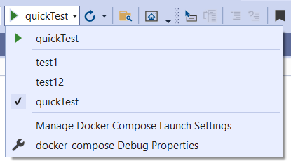
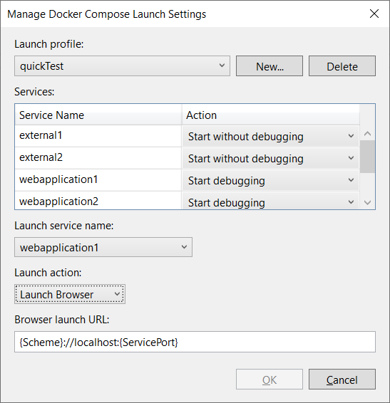

# Manage launch profiles for Docker Compose

You can control which services in a multi-service Docker Compose project using Docker Compose profiles. In Visual Studio, you can configure the debugger to use a specific Docker Compose launch profile as well as further customize what is launched. By using launch profiles and Visual Studio launch settings, you can avoid running services unnecessarily when you're only trying to debug part of a larger set of services that make up your application.

For information about Docker Compose profiles, see [Using profiles with Compose](https://docs.docker.com/compose/profiles/).

## Managing launch settings

Consider a Docker Compose project in which the *docker-compose.yml* has the following 5 services defined. It has 3 Compose profiles (web, web1 and web2).

```yml
version: '3.9'

services:
  webapplication1:
    image: ${DOCKER_REGISTRY-}webapplication1
    profiles: [web, web1]
    build:
      context: .
      dockerfile: WebApplication1/Dockerfile

  webapplication2:
    image: ${DOCKER_REGISTRY-}webapplication2
    profiles: [web, web2]
    build:
      context: .
      dockerfile: WebApplication2/Dockerfile

  webapplication3:
    image: ${DOCKER_REGISTRY-}webapplication3
    profiles: [web]
    build:
      context: .
      dockerfile: WebApplication3/Dockerfile

  external1:
    image: redis

  external2:
    image: redis

```

In Visual Studio, choose **Debug** > **Manage Docker Compose Launch Settings**, or use Quick Launch (**Ctrl**+**Q**) and search for **Docker Compose** to find that command.



It shows the three compose profiles and the five services as shown in the following screenshot:



The Docker Compose profiles section only appears if there are profiles defined in your *docker-compose.yml* files.

Now let's say you want to create a launch profile (test2) by arbitrarily (not using the compose profile) setting action for each service. Say you want to run only webapplication1 and webapplication2 and debug webapplication1.

Set the action as **Start debugging** for webapplication1 and **Start without debugging** for webapplication2 and **Do not start** for rest of them. And also user wants to launch a browser when the application starts and it should open the webapplication1’s web page. The UI will look like this


And this information will be saved in the launchSettings.json as shown below

```json
{
    "profiles": {
      "test2": {
        "commandName": "DockerCompose",
        "composeLaunchServiceName": "webapplication1",
        "serviceActions": {
        "external1": "DoNotStart",
        "external2": "DoNotStart",
        "webapplication1": "StartDebugging",
        "webapplication2": "StartWithoutDebugging",
        "webapplication3": "DoNotStart"
        },
        "composeLaunchAction": "LaunchBrowser",
        "commandVersion": "1.0",
        "composeLaunchUrl": "{Scheme}://localhost:{ServicePort}"
      }
    }
}
```

## Creating a profile that makes use of the compose profile

You can also further customize launch behaviors by creating Visual Studio launch profiles that make use of the Compose profiles.

To create another profile that makes use of the compose profile, select **Use Docker Compose profiles** and choose web1. Now the launch profile includes three services – webapplication1 (which belongs to both web and web1 compose profiles), external1 and external2 (if a service didn't specify any compose profile, it implicitly belongs to all the profiles). By default, the services without source code (external1, external2) have the default action of **Start without debugging**. Applications with source code will have **Start debugging**.


This information will be saved as shown in the following code. Note that service and its default action is not saved unless you change the default action.

```json
{
    "profiles": {
    "test1": {
        "commandName": "DockerCompose",
        "composeProfile": {
        "includes": [
            "web1"
        ]
        },
        "commandVersion": "1.0"
    }
    }
}
```

You can also change the action of webapplication1 to **Start without debugging**. The settings in *launchSettings.json* then look like the following:

```json
{
    "profiles": {
    "test1": {
        "commandName": "DockerCompose",
        "composeProfile": {
        "includes": [
            "web1"
            ],
        "serviceActions": {
            "webapplication1": "StartWithoutDebugging"
        }
    },
    "commandVersion": "1.0"
    }
    }
}
```

## Properties

Here are the description of each properties in the *launchSettings.json*:

|Property| Description|
| - | - |
|commandName| Name of the command. It is always “DockerCompose”|
|commandVersion| Version number used to manage the schema of the DockerCompose launch profile.|
|composeProfile| Parent property that holds properties when the launch profile is created based on compose profile.|
|composeProfile - includes | List of the compose profile names that makes up this launch profile.|
|composeProfile - serviceActions | List of service name and it’s action.|
|serviceActions | List of service name and it’s action.|
|composeLaunchServiceName| If DockerLaunchAction or DockerLaunchBrowser are specified, then DockerServiceName is the name of the service that should be launched. Use this property to determine which of the potentially many projects that a docker-compose file can reference will be launched.|
|composeLaunchAction| Specifies the launch action to perform on F5 or Ctrl+F5. Allowed values are None, LaunchBrowser, and LaunchWCFTestClient.|
|composeLaunchUrl| The URL to use when launching the browser. Valid replacement tokens are "{ServiceIPAddress}", "{ServicePort}", and "{Scheme}". For example: {Scheme}://{ServiceIPAddress}:{ServicePort}|

## Next steps

Learn more about how Container Tools works by reading [Visual Studio Container Tools build and debug overview](container-build.md).

## See also

- [Visual Studio Container Tools launch settings](container-launch-settings.md)

- [Docker Compose build settings](docker-compose-properties.md)