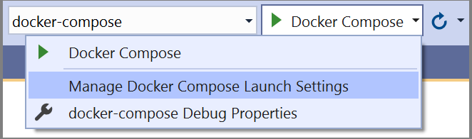

# Launch a subset of Compose services

If you have an application that consists of multiple services and uses Docker Compose, you can configure which services run and debug by creating or editing an existing launch profile in Docker Compose launch settings. Launch profiles allow you to dynamically run only the services that matter to your current scenario. You can create and select from launch profiles in order to customize your debugging experience and set specific launch actions such as `Browser Launch URL`. You also have the option of either choosing each service individually or by choosing a Docker Compose profile, which also looks at your Compose file to determine the group of services to run.

For information about Docker Compose profiles, see [Using profiles with Compose](https://docs.docker.com/compose/profiles/).

## Prerequisites

:::moniker range="vs-2019"
- [Visual Studio 2019 version 16.10](https://visualstudio.microsoft.com/vs/) or later
- A .NET solution with [Container Orchestration with Docker Compose](tutorial-multicontainer.md)
:::moniker-end
:::moniker range=">=vs-2022"
- [Visual Studio](https://visualstudio.microsoft.com/downloads/?cid=learn-onpage-download-cta)
- A .NET solution with [Container Orchestration with Docker Compose](tutorial-multicontainer.md)
:::moniker-end

## Manage launch settings

Consider the following Docker Compose project in which the *docker-compose.yml* has five services and three Compose profiles (web, web1 and web2).

```yml
version: '3.9'

services:
  webapplication1:
    image: ${DOCKER_REGISTRY-}webapplication1
    profiles: [web, web1]
    build:
      context: .
      dockerfile: WebApplication1/Dockerfile

  webapplication2:
    image: ${DOCKER_REGISTRY-}webapplication2
    profiles: [web, web2]
    build:
      context: .
      dockerfile: WebApplication2/Dockerfile

  webapplication3:
    image: ${DOCKER_REGISTRY-}webapplication3
    profiles: [web]
    build:
      context: .
      dockerfile: WebApplication3/Dockerfile

  external1:
    image: redis

  external2:
    image: redis

```

There are a few options to open the Docker Compose launch settings dialog:
- In Visual Studio, choose **Debug** > **Manage Docker Compose Launch Settings**:

    :::moniker range="<=vs-2019"
    
    :::moniker-end
    :::moniker range=">=vs-2022"
    
    :::moniker-end

- Right-click on the Visual Studio `docker-compose` project and select **Manage Docker Compose Launch Settings**

    :::moniker range="<=vs-2019"
    
    :::moniker-end
    :::moniker range=">=vs-2022"
    
    :::moniker-end

- Use the Quick Launch (**Ctrl**+**Q**) and search for **Docker Compose** to find the same command.

In the example below, the `web1` Compose profile is selected, which filters the **Services** list to only the three out of five included in that profile:


> [!NOTE]
> The Docker Compose profiles section only appears if there are profiles defined in your *docker-compose.yml* files.

The next example demonstrates selecting between individual services instead of filtering to the services in a Compose profile. Here, we show how the dialog would look if you created a new launch profile named `test2` that only starts two out of the five services, `webapplication1` with debugging and `webapplication2` without debugging. This launch profile also launches a browser when the application starts and opens it to the home page of `webapplication1`.


And this information is saved in *launchSettings.json* as shown below

```json
{
    "profiles": {
      "test2": {
        "commandName": "DockerCompose",
        "composeLaunchServiceName": "webapplication1",
        "serviceActions": {
          "external1": "DoNotStart",
          "external2": "DoNotStart",
          "webapplication1": "StartDebugging",
          "webapplication2": "StartWithoutDebugging",
          "webapplication3": "DoNotStart"
        },
        "composeLaunchAction": "LaunchBrowser",
        "commandVersion": "1.0",
        "composeLaunchUrl": "{Scheme}://localhost:{ServicePort}"
      }
   }
}
```

## Create a launch profile that uses a Docker Compose profile

You can also further customize launch behaviors by creating Visual Studio launch profiles that make use of the Compose profiles.

To create another profile that makes use of the Compose profile, select **Use Docker Compose profiles** and choose `web1`. Now the launch profile includes three services: `webapplication1` (which belongs to both `web` and `web1` Compose profiles), `external1`, and `external2`. By default, the services without source code such as `external1` and  `external2` have the default action of **Start without debugging**. .NET applications with source code defaults to **Start debugging**.

> [!IMPORTANT]
> If a service doesn't specify a Compose profile, it's included in all Compose profiles implicitly.


This information is saved as shown in the following code. The configuration for the service and its default action are not saved unless you change the default action.

```json
{
  "profiles": {
    "test1": {
      "commandName": "DockerCompose",
      "composeProfile": {
         "includes": [
            "web1"
         ]
      },
      "commandVersion": "1.0"
    }
  }
}
```

You can also change the action of webapplication1 to **Start without debugging**. The settings in *launchSettings.json* then look like the following code:

```json
{
  "profiles": {
    "test1": {
        "commandName": "DockerCompose",
        "composeProfile": {
          "includes": [
              "web1"
              ],
          "serviceActions": {
              "webapplication1": "StartWithoutDebugging"
          }
        },
    "commandVersion": "1.0"
    }
  }
}
```

## Properties

Here's a description of each property in the *launchSettings.json*:

|Property| Description|
| - | - |
|commandName| Name of the command. Defaults to "DockerCompose"|
|commandVersion| Version number used to manage the schema of the DockerCompose launch profile.|
|composeProfile| Parent property that defines the launch profile definition. Its child properties are `includes` and `serviceActions`|
|composeProfile - includes | List of the Compose profile names that make up a launch profile.|
|composeProfile - serviceActions | Lists the selected Compose profiles, services, and the launch action of each service|
|serviceActions | Lists the selected services and the launch action.|
|composeLaunchAction| Specifies the launch action to perform on **F5** or **Ctrl**+**F5**. Allowed values are None, LaunchBrowser, and LaunchWCFTestClient.|
|composeLaunchUrl| The URL to use when launching the browser. Valid replacement tokens are "{ServiceIPAddress}", "{ServicePort}", and "{Scheme}". For example: {Scheme}://{ServiceIPAddress}:{ServicePort}|
|composeLaunchServiceName| Specifies the service used for replacing the tokens in composeLaunchUrl.|

## Related content

- [Visual Studio Container Tools build and debug overview](container-build.md)
- [Visual Studio Container Tools launch settings](container-launch-settings.md)
- [Docker Compose build settings](docker-compose-properties.md)
