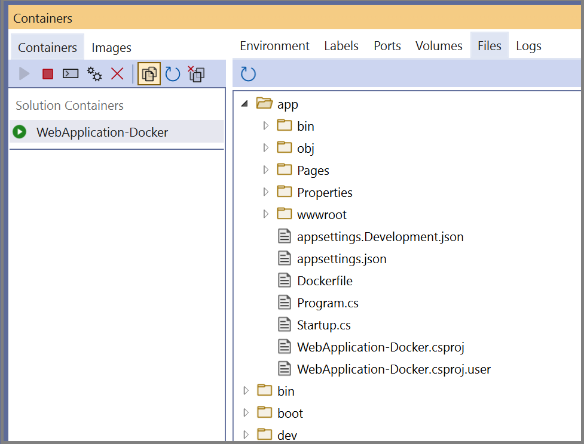
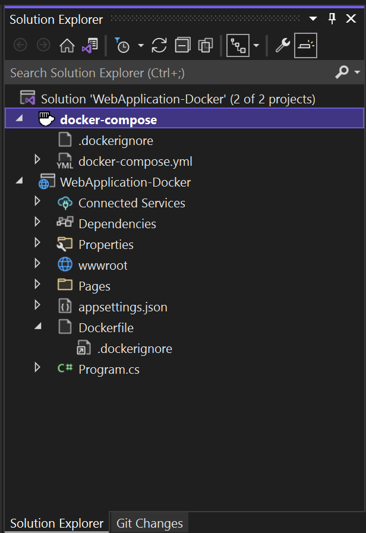

# Visual Studio Container Tools

:::moniker range="visualstudio"

The tools included in Visual Studio for developing with [Docker](https://docs.docker.com/) or [Podman](https://podman.io/) containers greatly simplify building, debugging, and deployment for containerized applications. You can work with a container for a single project, or use container orchestration with [Docker Compose](https://docs.docker.com/compose/).

:::moniker-end

:::moniker range="<=vs-2022"

The tools included in Visual Studio for developing with [Docker](https://docs.docker.com/) containers greatly simplify building, debugging, and deployment for containerized applications. You can work with a container for a single project, or use container orchestration with [Docker Compose](https://docs.docker.com/compose/) or [Service Fabric](/azure/service-fabric/) to work with multiple services in containers.

:::moniker-end

::: moniker range="vs-2019"

## Prerequisites

- [Docker Desktop](https://hub.docker.com/editions/community/docker-ce-desktop-windows)
- [Visual Studio 2019 or later](https://aka.ms/vs/download/?cid=learn-onpage-download-cta) with the **ASP.NET and web development**, **Azure development** workload, and/or **.NET Core cross-platform development** workload installed.
- [.NET Core Development Tools](https://dotnet.microsoft.com/download/dotnet-core/) for development with .NET Core.
- To publish to Azure Container Registry, an Azure subscription. [Sign up for a free trial](https://azure.microsoft.com/offers/ms-azr-0044p/).

## Docker support in Visual Studio

Docker support is available for ASP.NET projects, ASP.NET Core projects, and .NET Core and .NET Framework console projects.

The support for Docker in Visual Studio has changed over a number of releases in response to customer needs. There are two levels of Docker support you can add to a project, and the supported options vary by the type of project and the version of Visual Studio. With some supported project types, if you just want a container for a single project, without using orchestration, you can do that by adding Docker support. The next level is container orchestration support, which adds appropriate support files for the particular orchestrator you choose.

With Visual Studio 2019, you can use Docker Compose, Kubernetes, and Service Fabric as container orchestration services.

In Visual Studio 2019 version 16.4 and later, the **Containers** window is available, which lets you view running containers, browse available images, view environment variables, logs, and port mappings, inspect the filesystem, attach a debugger, or open a terminal window inside the container environment. See [Use the Containers window](view-and-diagnose-containers.md).

::: moniker-end

::: moniker range="visualstudio"

## Prerequisites

- [Docker Desktop](https://www.docker.com/get-docker) or [Podman Desktop](https://podman-desktop.io/downloads)
- [Visual Studio](https://aka.ms/vs/download/?cid=learn-onpage-download-cta), or for Podman support, [Visual Studio 2026](https://aka.ms/vs/download/?cid=learn-onpage-download-cta), with the **ASP.NET and web development**, **Azure development** workload, and/or **.NET desktop development** workload installed.
- To publish to Azure Container Registry, an Azure subscription. [Sign up for a free trial](https://azure.microsoft.com/offers/ms-azr-0044p/).

## Container support in Visual Studio

Container support is available for ASP.NET Core projects, and .NET Core (and .NET 5 and later) console projects. .NET Framework projects are not supported in the current version of Visual Studio.

If you just want a container for a single project, without using orchestration, you can do that by adding container support. You can choose Docker or Podman as a container platform, and easily switch between them without changing the project. The next level is **Container Compose support**, which adds appropriate support files for Docker Compose. (Podman Compose is not supported.)

When you add container support to a .NET 7 or later project, you have two container build types to choose from for adding container support. You can choose to add a Dockerfile to specify how to build the container images, or you can choose to use the built-in container support provided by the .NET SDK.

The **Containers** window lets you view running containers, browse available images, view environment variables, logs, and port mappings, inspect the filesystem, attach a debugger, or open a terminal window inside the container environment. See [Use the Containers window](view-and-diagnose-containers.md).

::: moniker-end

::: moniker range="vs-2022"

## Prerequisites

- [Docker Desktop](https://www.docker.com/get-docker)
- [Visual Studio](https://aka.ms/vs/download/?cid=learn-onpage-download-cta). For Podman support, [Visual Studio 2026](https://aka.ms/vs/download/?cid=learn-onpage-download-cta) with the **ASP.NET and web development**, **Azure development** workload, and/or **.NET desktop development** workload installed.
- To publish to Azure Container Registry, an Azure subscription. [Sign up for a free trial](https://azure.microsoft.com/offers/ms-azr-0044p/).

## Docker support in Visual Studio

Docker support is available for ASP.NET projects, ASP.NET Core projects, and .NET Core and .NET Framework console projects.

The support for Docker in Visual Studio has changed over a number of releases in response to customer needs. There are several options to add Docker support to a project, and the supported options vary by the type of project and the version of Visual Studio. With some supported project types, if you just want a container for a single project, without using orchestration, you can do that by adding Docker support. The next level is container orchestration support, which adds appropriate support files for the particular orchestrator you choose.

With Visual Studio 2022 version 17.9 and later, when you add Docker support to a .NET 7 or later project, you have two container build types to choose from for adding Docker support. You can choose to add a Dockerfile to specify how to build the container images, or you can choose to use the built-in container support provided by the .NET SDK.

Also, with Visual Studio 2022 and later, when you choose container orchestration, you can use Docker Compose or Service Fabric as container orchestration services.

In Visual Studio 2022, the **Containers** window is available, which lets you view running containers, browse available images, view environment variables, logs, and port mappings, inspect the filesystem, attach a debugger, or open a terminal window inside the container environment. See [Use the Containers window](view-and-diagnose-containers.md).

::: moniker-end

:::moniker range="visualstudio"
To create a project with container support, or add container support to an existing project, see [Add support for containers](add-container-support.md).
:::moniker-end

:::moniker range="<=vs-2022"
To create a project with Docker support, or add Docker support to an existing project, see [Add support for containers](add-container-support.md).
:::moniker-end

> [!NOTE]
> Docker's licensing requirements might be different for different versions of Docker Desktop. Refer to the [Docker documentation](https://docs.docker.com/subscription/) to understand the current licensing requirements for using your version of Docker Desktop for development in your situation.

:::moniker range="visualstudio"

## Podman support in Visual Studio

Visual Studio supports Podman containers, a popular container management tool that provides a daemonless container engine. You can run and manage containers using the Podman CLI directly from Visual Studio. You can use Podman to run your single-container apps in the same way as Docker.

To use Podman containers, start podman from the CLI, and open your solution in Visual Studio. By default, Container Tools automatically detects whether Podman or Docker is running, and use the currently active container runtime when you start the app. To configure the container runtime manually, go to **Tools > Options > Container Tools > Container Runtime** and select **Podman** or **Docker**. The default setting is **Auto**, which means Visual Studio tries to detect the currently active container runtime. Close the **Tools > Options** window to commit the setting change.

:::moniker-end

## Containers window

The **Containers** window lets you view containers and images on your machine and see what's going on with them. You can view the filesystem, volumes mounted, environment variables, ports used, and examine log files.

Open the **Containers** window by using the quick launch (**Ctrl**+**Q**) and typing `containers`. You can use the docking controls to put the window somewhere. Because of the width of the window, it works best when docked at the bottom of the screen.

Select a container, and use the tabs to view the information that's available. To check it out, run your Docker-enabled app, open the **Files** tab, and expand the **app** folder to see your deployed app on the container.

:::moniker range="visualstudio"

:::image type="content" source="media\overview\visualstudio\containers-files.png" alt-text="Screenshot that shows the Containers window.":::  

:::moniker-end

:::moniker range="<=vs-2019"

:::moniker-end
:::moniker range="vs-2022"

:::moniker-end

For more information, see [Use the Containers window](view-and-diagnose-containers.md).

## Docker Compose support

When you want to compose a multi-container solution using Docker Compose, add container orchestrator support to your projects. This lets you run and debug a group of containers (a whole solution or group of projects) at the same time if they're defined in the same *docker-compose.yml* file.

:::moniker range="visualstudio"

To add container orchestrator support using Docker Compose, right-click the application in **Solution Explorer**, and then select **Add** > **Container Compose Support**.
    
:::moniker-end

:::moniker range="<=vs-2022"

To add container orchestrator support using Docker Compose, right-click on the project node in **Solution Explorer**, and choose **Add > Container Orchestrator Support**. Then choose **Docker Compose** to manage the containers.

:::moniker-end

After you add container orchestrator support to your project, you see a *Dockerfile* added to the project (if there wasn't one there already) and a **docker-compose** folder added to the solution in **Solution Explorer**, as shown here:

:::moniker range="visualstudio"

:::image type="content" source="media/overview/visualstudio/docker-compose-solution-explorer.png" alt-text="Screenshot that shows Docker files in Solution Explorer.":::

:::moniker-end

:::moniker range="<=vs-2019"

:::moniker-end
:::moniker range="vs-2022"

:::moniker-end

If *docker-compose.yml* already exists, Visual Studio just adds the required lines of configuration code to it.

Repeat the process with the other projects that you want to control using Docker Compose.

If you work with a large number of services, you can save time and computing resources by selecting which subset of services you want to start in your debugging session. See [Start a subset of Compose services](launch-profiles.md).

> [!NOTE]
> Remote Docker hosts are not supported in Visual Studio tooling.

## Service Fabric support

With Service Fabric tools in Visual Studio, you can develop and debug for Azure Service Fabric, run and debug locally, and deploy to Azure.

Visual Studio 2019 and later support developing containerized microservices using Windows containers and Service Fabric orchestration.

For a detailed tutorial, see
[Tutorial: Deploy a .NET application in a Windows container to Azure Service Fabric](/azure/service-fabric/service-fabric-host-app-in-a-container).

For more information on Azure Service Fabric, see [Service Fabric](/azure/service-fabric).

## Continuous delivery and continuous integration (CI/CD)

Visual Studio integrates readily with Azure Pipelines for automated and continuous integration and delivery of changes to your service code and configuration. To get started, see [Create your first pipeline](/azure/devops/pipelines/create-first-pipeline?view=azure-devops&tabs=tfs-2018-2&preserve-view=true).

For Service Fabric, see [Tutorial: Deploy your ASP.NET Core app to Azure Service Fabric by using Azure DevOps Projects](/azure/devops-project/azure-devops-project-service-fabric).

## Next steps

For further details on the services implementation and use of Visual Studio tools for working with containers, read the following articles:

[Add support for containers](add-container-support.md)

[Container Tools in Visual Studio](container-tools.md)

[Debugging apps in a local container](edit-and-refresh.md)

[Deploy an ASP.NET container to a container registry using Visual Studio](hosting-web-apps-in-docker.md)

[Deploy to Azure App Service](deploy-app-service.md)

[Deploy to Azure Container Apps using Visual Studio](/azure/container-apps/deploy-visual-studio)
