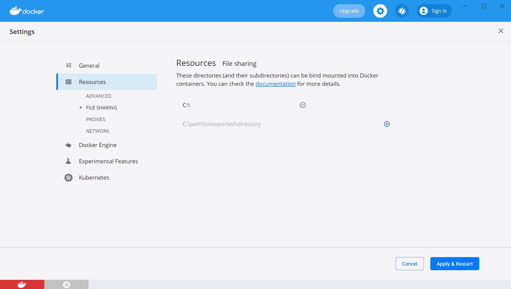
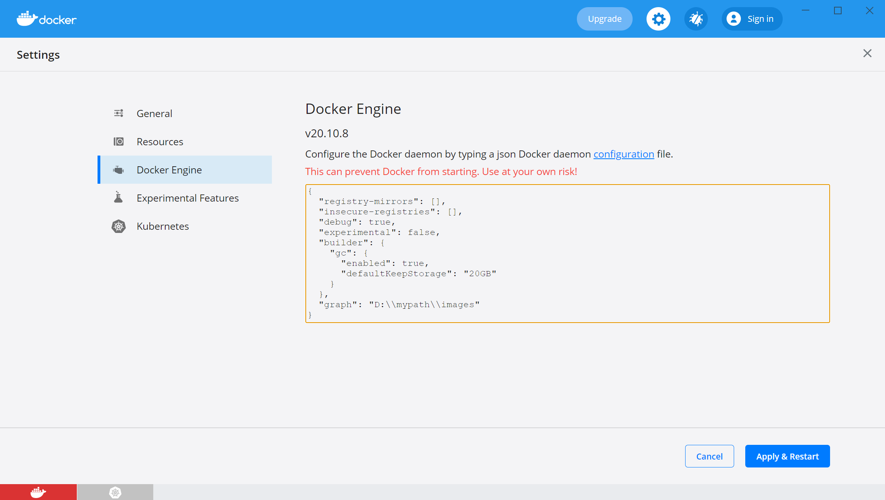
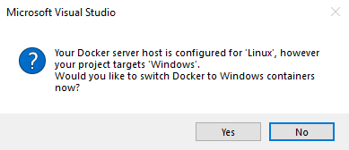

# Troubleshoot Visual Studio development with Docker

When you're working with Visual Studio Container Tools, you may encounter issues while building or debugging your application. Below are some common troubleshooting steps.

## Volume sharing is not enabled. Enable volume sharing in the Docker CE for Windows settings  (Linux containers only)

File sharing only needs to be managed if you are using Hyper-V with Docker. If you are using WSL 2, the following steps are not necessary and the file sharing option will not be visible. To resolve this issue:

1. Right-click **Docker for Windows** in the notification area, and then select **Settings**.
1. Select **Resources** > **File Sharing** and share the folder that needs to be accessed. Sharing your entire system drive is possible but not recommended.

    

> [!TIP]
> Visual Studio versions later than Visual Studio 2017 version 15.6 will prompt when **Shared Drives** aren't configured.

## Unable to start debugging

One reason could be related to having stale debugging components in your user profile folder. Execute the following commands to remove these folders so that the latest debugging components are downloaded on the next debug session.

- del %userprofile%\vsdbg
- del %userprofile%\onecoremsvsmon

## Errors specific to networking when debugging your application

Try executing the script downloadable from [Cleanup Container Host Networking](https://github.com/MicrosoftDocs/Virtualization-Documentation/tree/master/windows-server-container-tools/CleanupContainerHostNetworking),
which will refresh the network-related components on your host machine.

## Mounts denied

When using Docker for macOS, you might encounter an error referencing the folder /usr/local/share/dotnet/sdk/NuGetFallbackFolder. Add the folder to the File Sharing tab in Docker.

## Docker users group

You might encounter the following error in Visual Studio when working with containers:

```
The current user must be in the 'docker-users' group to use Docker Desktop. 
Add yourself to the 'docker-users' group and then log out of Windows.
```

You must be a member of the 'docker-users' group in order to have permissions to work with Docker containers.  To add yourself to the group in Windows 10 or later, follow these steps:

1. From the Start menu, open **Computer Management**.
1. Expand **Local Users and Groups**, and choose **Groups**.
1. Find the **docker-users** group, right-click and choose **Add to group**.
1. Add your user account or accounts.
1. Sign out and sign back in again for these changes to take effect.

You can also use the `net localgroup` command at the Administrator command prompt to add users to specific groups.

```cmd
net localgroup docker-users DOMAIN\username /add
```

In PowerShell, use the [Add-LocalGroupMember](/powershell/module/microsoft.powershell.localaccounts/add-localgroupmember) function.

## Low disk space

By default, Docker stores images in the *%ProgramData%/Docker/* folder, which is typically on the system drive, *C:\ProgramData\Docker\*. To prevent images from taking up valuable space on the system drive, you can change the image folder location. To do so:

 1. Right click on the Docker icon on the task bar and select **Settings**.
 1. Select **Docker Engine**. 
 1. In the editing pane, add the `graph` property setting with the value of your desired location for Docker images:

```json
    "graph": "D:\\mypath\\images"
```

  


Click **Apply & Restart**. These steps modify the configuration file at *%ProgramData%\docker\config\daemon.json*. Previously built images are not moved.

## Container type mismatch

When adding Docker support to a project, you choose either a Windows or a Linux container. If the Docker Server host is not configured to run the same container type as the project target, you will likely see an error similar to the one below:

  

To resolve this issue:

- Right-click the Docker for Windows icon in the System Tray and choose **Switch to Windows containers...** or **Switch to Linux containers...**.

## Microsoft/DockerTools GitHub repo

For any other issues you encounter, see  [Microsoft/DockerTools](https://github.com/microsoft/dockertools/issues) issues.

## See also

- [Visual Studio troubleshooting](/troubleshoot/visualstudio/welcome-visual-studio/)
