# Get started with Visual Studio Kubernetes Tools

The Visual Studio Kubernetes Tools help streamline the development of containerized applications targeting Kubernetes. Visual Studio can automatically create the configuration-as-code files needed to support Kubernetes deployment, such as Dockerfiles and Helm charts. You can debug your code in a live Azure Kubernetes Service (AKS) cluster using Azure Dev Spaces, or publish directly to an AKS cluster from inside Visual Studio.

This tutorial covers using Visual Studio to add Kubernetes support to an project and publish to AKS. If you are primarily interested in using [Azure Dev Spaces](https://aka.ms/get-azds) to debug and test your project running in AKS, you can jump to the [Azure Dev Spaces tutorial](/azure/dev-spaces/get-started-netcore-visualstudio) instead.

## Prerequisites

To leverage this new functionality, you'll need:

::: moniker range="vs-2017"
- The latest version of [Visual Studio 2017](https://visualstudio.microsoft.com/vs/older-downloads/?utm_medium=microsoft&utm_source=docs.microsoft.com&utm_campaign=vs+2017+download) with the *ASP.NET and web development* workload.
- The [Kubernetes tools for Visual Studio](https://marketplace.visualstudio.com/items?itemName=ms-azuretools.vs-tools-for-kubernetes), available as a separate download.
::: moniker-end
::: moniker range="vs-2019"
- [Visual Studio 2019](https://visualstudio.microsoft.com/downloads) with the *ASP.NET and web development* workload.
::: moniker-end
- [Docker Desktop](https://store.docker.com/editions/community/docker-ce-desktop-windows) installed on your development workstation (that is, where you run Visual Studio), if you wish to build Docker images, debug Docker containers running locally, or publish to AKS. (Docker is *not* required for building and debugging Docker containers in AKS using Azure Dev Spaces.)
::: moniker range="vs-2017"
- If you wish to publish to AKS from Visual Studio (*not* required for debugging in AKS using Azure Dev Spaces):

    1. The [AKS publishing tools](https://marketplace.visualstudio.com/items?itemName=ms-azuretools.vs-tools-for-kubernetes), available as a separate download.

    1. An Azure Kubernetes Service cluster. For more information, see
        [Creating an AKS cluster](/azure/aks/kubernetes-walkthrough-portal#create-an-aks-cluster). Be sure to [connect to the cluster](/azure/aks/kubernetes-walkthrough#connect-to-the-cluster) from your development workstation.

    1. Helm CLI installed on your development workstation. For more information
        see [Installing Helm](https://github.com/kubernetes/helm/blob/master/docs/install.md).

    1. Helm configured against your AKS cluster by using the `helm init` command. For more information on how to do this, see [How to configure Helm](/azure/aks/kubernetes-helm#configure-helm).
::: moniker-end

## Create a new Kubernetes project

::: moniker range="vs-2017"

Once you have the appropriate tools installed, launch Visual Studio and create a new project. Under **Cloud**, choose the **Container Application for Kubernetes** project type. Select this project type and choose **OK**.

::: moniker-end
::: moniker range=">= vs-2019"

In the Visual Studio start window, search for *Kubernetes*, and choose the **Container Application for Kubernetes**.

Provide the project name.

::: moniker-end

You can then choose which type of ASP.NET Core web application to create. Choose **Web Application**. The usual **Enable Docker Support** option does not appear on this dialog.  Docker support is enabled by default for a container application for Kubernetes.

::: moniker range="vs-2017"

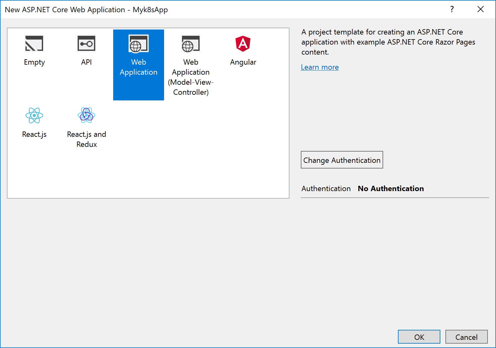

::: moniker-end
::: moniker range=">=vs-2019"

::: moniker-end

## Add Kubernetes support to an existing project

Alternatively, you can add Kubernetes support to an existing ASP.NET Core web application project. To do this, right-click on the project, and choose **Add** > **Container Orchestrator Support**.

::: moniker range="vs-2017"

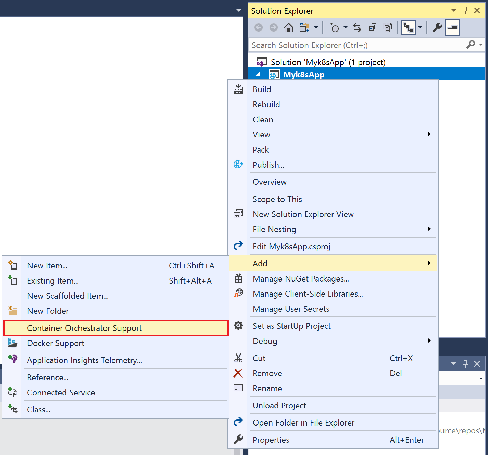

::: moniker-end
::: moniker range=">=vs-2019"

::: moniker-end

In the dialog box, select **Kubernetes/Helm** and choose **OK**.

## What Visual Studio creates for you

After creating a new **Container Application for Kubernetes** project or adding Kubernetes container orchestrator support to an existing project, you see some additional files in your project that facilitate deploying to Kubernetes.

::: moniker range="vs-2017"

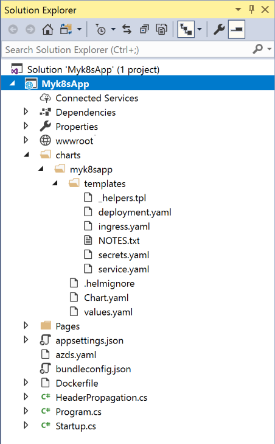

::: moniker-end
::: moniker range="vs-2019"

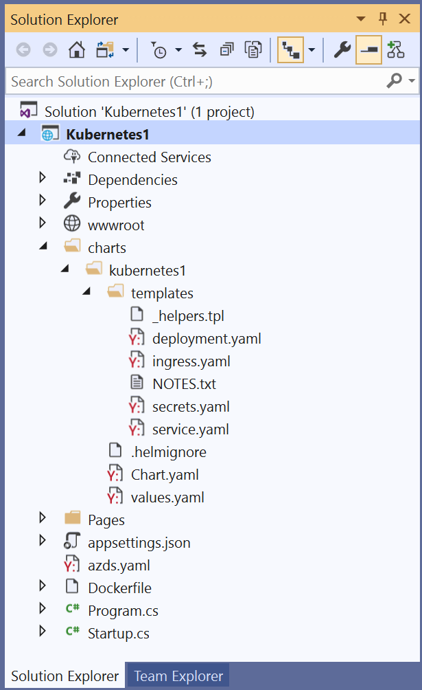

::: moniker-end

The added files are:

- a Dockerfile, which allows you to generate a Docker container image hosting this web application. As you'll see, the Visual Studio tooling leverages this Dockerfile when debugging and deploying to Kubernetes. If you prefer to work directly with the Docker image, you can right-click on the Dockerfile and choose **Build Docker Image**.

   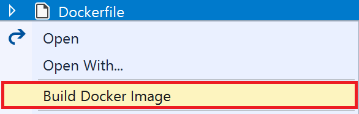

- a Helm chart, and a *charts* folder. These yaml files make up the Helm chart for the application, which you can use to deploy it to Kubernetes. For more information on Helm, see [https://www.helm.sh](https://www.helm.sh).

- *azds.yaml*. This contains settings for Azure Dev Spaces, which provides a rapid, iterative debugging experience in Azure Kubernetes Service. For more information, see [the Azure Dev Spaces documentation](https://docs.microsoft.com/azure/dev-spaces/azure-dev-spaces).

::: moniker range="vs-2017"

## Publish to Azure Kubernetes Service (AKS)

With all these files in place, you can use the Visual Studio IDE to write and debug your application code, just as you always have. You can also use [Azure Dev Spaces](https://aka.ms/get-azds) to quickly run and debug your code running live in an AKS cluster. For more information, please reference the [Azure Dev Spaces tutorial](https://docs.microsoft.com/azure/dev-spaces/get-started-netcore-visualstudio)

Once you have your code running the way you want, you can publish directly from Visual Studio to an AKS cluster.

To do this, you first need to double-check that you've installed everything as described in the [Prerequisites](#prerequisites) section under the item for publishing to AKS, and run through all the command line steps given in the links. Then, set up a publish profile that publishes your container image to Azure Container Registry (ACR). Then AKS can pull your container image from ACR and deploy it into the cluster.

1. In **Solution Explorer**, right-click on your *project* and choose **Publish**.

   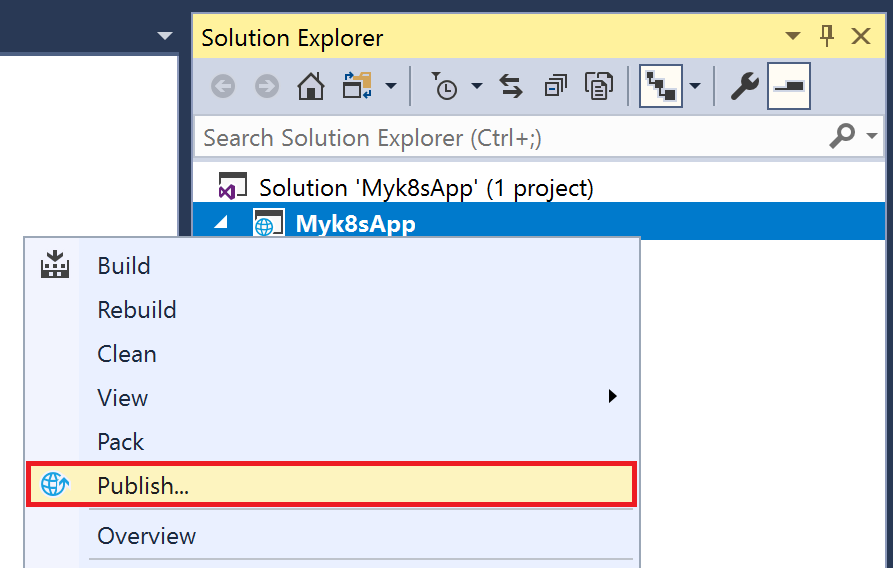

2. In the **Publish** screen, choose **Container Registry** as the publish target, and follow the prompts to select your container registry. If you don't already have a container registry, choose **Create New Azure Container Registry** to create one from Visual Studio. For more information, see [Publish your container to Azure Container Registry](hosting-web-apps-in-docker.md).

   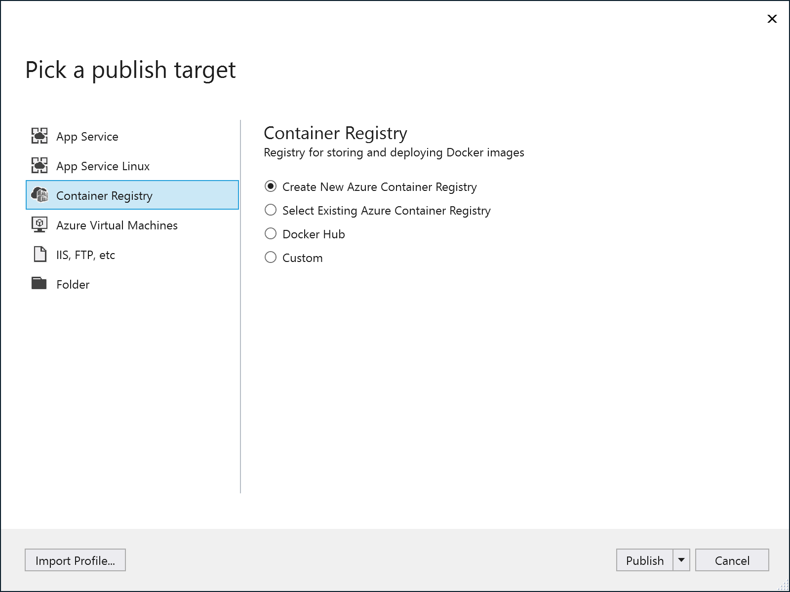

3. Back in Solution Explorer, right click on your *solution* and click **Publish to Azure AKS**.

   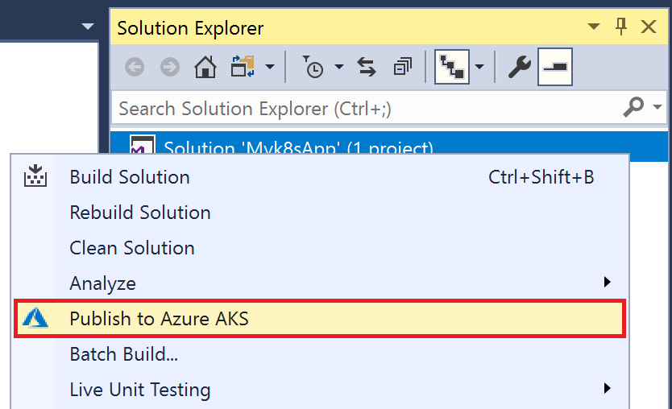

4. Choose your subscription and your AKS cluster, along with the ACR publish profile that you just created. Then click **OK**.

   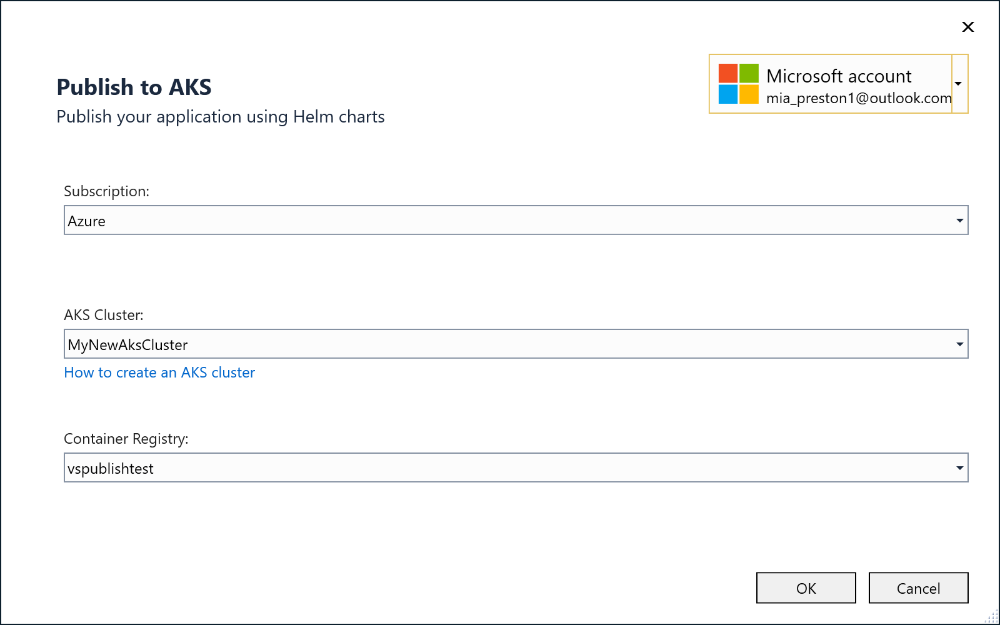

   This takes you to the **Publish to Azure AKS** screen.

5. Choose the **Configure Helm** link to update the command line used to install the Helm charts on the server.

   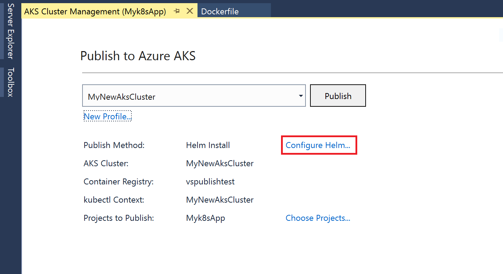

   Updating the command line is useful if there are custom command line arguments that you wish to specify, such as a different Kubernetes context or chart name.

   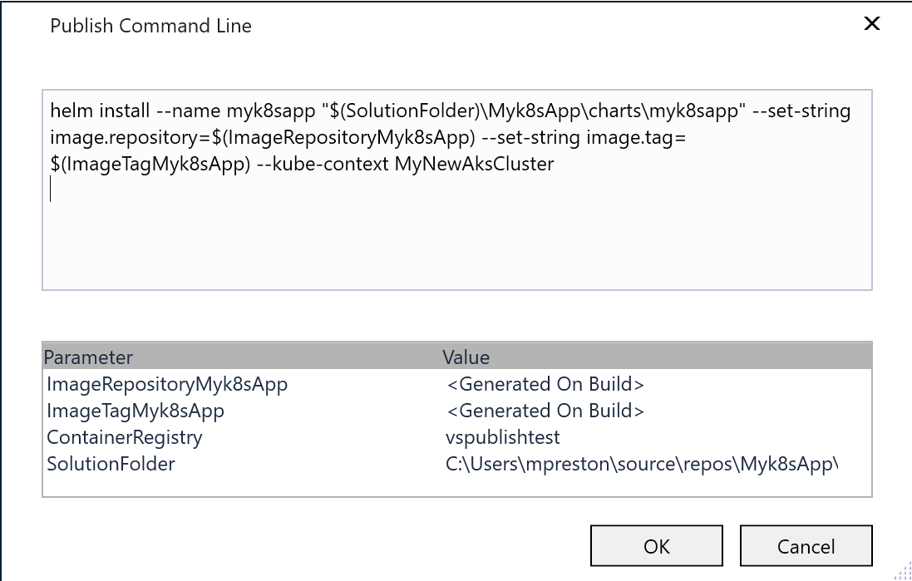

6. When you are ready to deploy, click the **Publish** button to publish your application to AKS.

   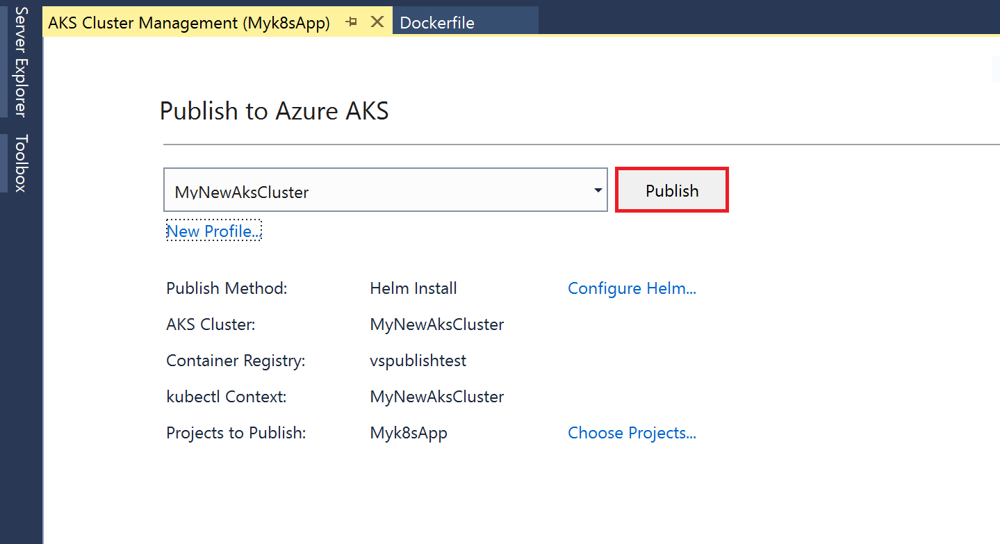

::: moniker-end

Congratulations! You can now use the full power of Visual Studio for all your Kubernetes app development.

## Next steps

Learn more about Kubernetes development on Azure by reading the [AKS documentation](/azure/aks).

Learn more about Azure Dev Spaces by reading the [Azure Dev Spaces documentation](https://aka.ms/get-azds)
