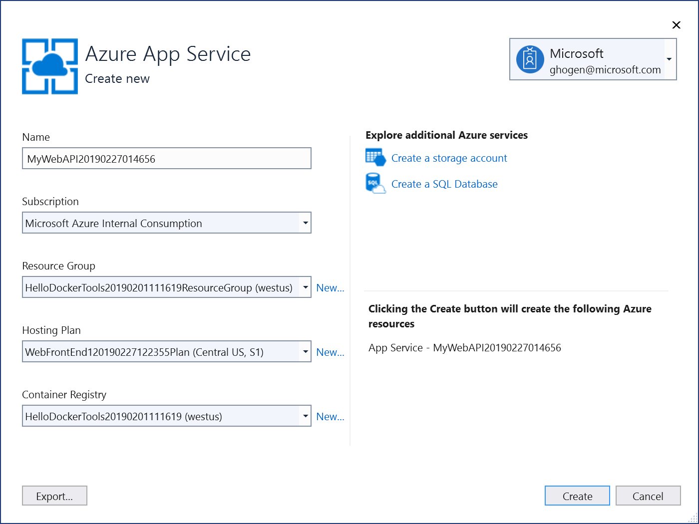

# Tutorial: Create a multi-container app with Docker Compose

In this tutorial, you'll learn how to manage more than one container and communicate between them when using Container Tools in Visual Studio.  Managing multiple containers requires *container orchestration* and requires an orchestrator such as Docker Compose, Kubernetes, or Service Fabric. Here, we'll use Docker Compose.

## Prerequisites

::: moniker range="vs-2017"
* [Docker Desktop](https://hub.docker.com/editions/community/docker-ce-desktop-windows)
* [Visual Studio 2017](https://visualstudio.microsoft.com/) with the **Web Development**, **Azure Tools** workload, or **.NET Core cross-platform development** workload installed

::: moniker-end

::: moniker range=">= vs-2019"
* [Docker Desktop](https://hub.docker.com/editions/community/docker-ce-desktop-windows)
* [Visual Studio 2019 Preview](https://visualstudio.microsoft.com/vs/preview/?utm_medium=microsoft&utm_source=docs.microsoft.com&utm_campaign=button+cta&utm_content=download+vs2019+preview) with the **Web Development**, **Azure Tools** workload, and/or **.NET Core cross-platform development** workload installed
* [.NET Core 2.2 Development Tools](https://dotnet.microsoft.com/download/dotnet-core/2.2) for development with .NET Core 2.2
::: moniker-end

## Create a Web Application project

In Visual Studio, create an **ASP.NET Core Web Application** project, named `WebFrontEnd`. Select **Web Application** to create a web application with Razor pages. 
  
::: moniker range="vs-2017"

Do not select **Enable Docker Support**. You'll add Docker support later.


::: moniker-end

::: moniker range="vs-2019"


Do not select **Enable Docker Support**. You'll add Docker support later.


::: moniker-end

## Create a Web API project

Add a project to the same solution and call it *MyWebAPI*. Select **API** as the project type, and clear the checkbox for **Configure for HTTPS**. In this design, we're only using SSL for communication with the client, not for communication from between containers in the same web application. Only `WebFrontEnd` needs HTTPS.

::: moniker range="vs-2017"
   
::: moniker-end
::: moniker range="vs-2019"
   
::: moniker-end

## Add code to call the Web API

1. In the `WebFrontEnd` project, open the *Index.cshtml.cs* file, and replace the `OnGet` method with the following code.

   ```csharp
    public async Task OnGet()
    {
       ViewData["Message"] = "Hello from webfrontend";

       using (var client = new System.Net.Http.HttpClient())
       {
          // Call *mywebapi*, and display its response in the page
          var request = new System.Net.Http.HttpRequestMessage();
          request.RequestUri = new Uri("http://mywebapi/api/values/1");
          var response = await client.SendAsync(request);
          ViewData["Message"] += " and " + await response.Content.ReadAsStringAsync();
       }
    }
   ```

1. In the *Index.cshtml* file, add a line to display `ViewData["Message"]` so that the file looks like the following code:
    
      ```cshtml
      @page
      @model IndexModel
      @{
          ViewData["Title"] = "Home page";
      }
    
      <div class="text-center">
          <h1 class="display-4">Welcome</h1>
          <p>Learn about <a href="https://docs.microsoft.com/aspnet/core">building Web apps with ASP.NET Core</a>.</p>
          <p>@ViewData["Message"]</p>
      </div>
      ```

1. Now in the Web API project, add code to the Values controller to customize the message returned by the API for the call you added from *webfrontend*.
    
      ```csharp
        // GET api/values/5
        [HttpGet("{id}")]
        public ActionResult<string> Get(int id)
        {
            return "webapi (with value " + id + ")";
        }
      ```

1. In the `WebFrontEnd` project, choose **Add > Container Orchestrator Support**. The **Docker Support Options** dialog appears.

1. Choose **Docker Compose**.

1. Choose your Target OS, for example, Linux.

   

   Visual Studio creates a *docker-compose.yml* file and a *.dockerignore* file in the **docker-compose** node in the solution, and that project shows in boldface font, which shows that it's the startup project.

   

   The *docker-compose.yml* appears as follows:

   ```yaml
   version: '3.4'

    services:
      webfrontend:
        image: ${DOCKER_REGISTRY-}webfrontend
        build:
          context: .
          dockerfile: WebFrontEnd/Dockerfile
   ```

   The *.dockerignore* file contains file types and extensions that you don't want Docker to include in the container. These files are generally associated with the development environment and source control, not part of the app or service you're developing.

   Look at the **Container Tools** section of the output pane for details of the commands being run.  You can see the command-line tool docker-compose is used to configure and create the runtime containers.

1. In the Web API project, again right-click on the project node, and choose **Add** > **Container Orchestrator Support**. Choose **Docker Compose**, and then select the same target OS.  

    > [!NOTE]
    > In this step, Visual Studio will offer to create a Dockerfile. If you do this on a project that already has Docker support, you are prompted whether you want to overwrite the existing Dockerfile. If you've made changes in your Dockerfile that you want to keep, choose no.

    Visual Studio makes some changes to your docker compose YML file. Now both services are included.

    ```yaml
    version: '3.4'
    
    services:
      webfrontend:
        image: ${DOCKER_REGISTRY-}webfrontend
        build:
          context: .
          dockerfile: WebFrontEnd/Dockerfile
    
      mywebapi:
        image: ${DOCKER_REGISTRY-}mywebapi
        build:
          context: .
          dockerfile: MyWebAPI/Dockerfile
    ```

1. Run the site locally now (F5 or Ctrl+F5) to verify that it works as expected. If everything is configured correctly, you see the message "Hello from webfrontend and webapi (with value 1)."

   The first project that you use when you add container orchestration is set up to be launched when you run or debug. You can configure the launch action in the **Project Properties** for the docker-compose project.  On the docker-compose project node, right-click to open the context menu, and then choose **Properties**, or use Alt+Enter.  The following screenshot shows the properties you would want for the solution used here.  For example, you can change the page that is loaded by customizing the **Service URL** property.

   

   Here's what you see when launched:

   

## Deploy to Azure App Service

You can now deploy to Azure.  Using App Service is the easiest way to deploy a multicontainer service. You can also use [Azure Container Registry](vs-azure-tools-docker-hosting-web-apps-in-docker.md).

If you don't have an Azure subscription, create a [free account](https://azure.microsoft.com/free/dotnet/?utm_source=acr-publish-doc&utm_medium=docs&utm_campaign=docs) before you begin.

To deploy to App Service, you'll publish each web project separately. First, publish the Web API project.  Right-click on the Web API project node and choose Publish.  On the **Publish** screen, choose **App Service Linux**, and **Create new App Service for Containers**.


On the next screen, verify or change your Azure subscription information, and choose **Create**. The project is deployed to Azure. This takes a few minutes.

::: moniker range="vs-2017"



::: moniker-end

::: moniker range=">= vs-2019"


::: moniker-end


The **Publish** screen in Visual Studio shows the URL of the published service.


Then, update the `OnGet` method in *Index.cshtml.cs* in the `WebFrontEnd` project to use the URL from the published Web API project, which you can copy from the screen shown previously.  You can use HTTP rather than HTTPS if you set the Web API project to not use HTTPS, as recommended in a previous step. The following code shows an example.

```csharp
        public async Task OnGet()
        {
            ViewData["Message"] = "Hello from webfrontend";

            using (var client = new System.Net.Http.HttpClient())
            {
                // Call *mywebapi*, and display its response in the page
                var request = new System.Net.Http.HttpRequestMessage();
                request.RequestUri = new Uri("http://mywebapi20190227122832.azurewebsites.net/api/values/1");
                var response = await client.SendAsync(request);
                ViewData["Message"] += " and " + await response.Content.ReadAsStringAsync();
            }
        }
```

Then, build and publish the `WebFrontEnd` project, using the same steps you used for the Web API project.

You can verify that the app is working by navigating to the URL shown in the **Publish** page.


## Next steps

Explore Azure App Service further by trying a tutorial in the [App Service](/azure/app-service/) documentation.

## See also
  
[Docker Compose](https://docs.docker.com/compose/)  
[Container Tools](/visualstudio/containers/)
