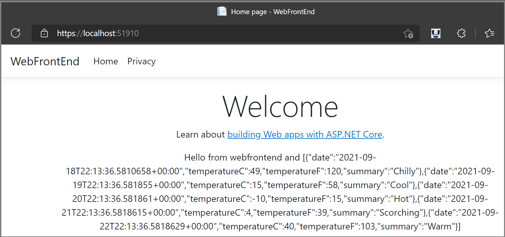

# Tutorial: Create a multi-container app with Docker Compose

In this tutorial, you'll learn how to manage more than one container and communicate between them when using Container Tools in Visual Studio.  Managing multiple containers requires *container orchestration* and requires an orchestrator such as Docker Compose, Kubernetes, or Service Fabric. Here, we'll use Docker Compose. Docker Compose is great for local debugging and testing in the course of the development cycle.

## Prerequisites

::: moniker range="vs-2017"

* [Docker Desktop](https://hub.docker.com/editions/community/docker-ce-desktop-windows)
* [Visual Studio 2017](https://visualstudio.microsoft.com/vs/older-downloads/?utm_medium=microsoft&utm_source=docs.microsoft.com&utm_campaign=vs+2017+download) with the **Web Development**, **Azure Tools** workload, or **.NET Core cross-platform development** workload installed
::: moniker-end

::: moniker range="vs-2019"

* [Docker Desktop](https://hub.docker.com/editions/community/docker-ce-desktop-windows)
* [Visual Studio 2019](https://visualstudio.microsoft.com/downloads) with the **Web Development**, **Azure Tools** workload, and/or **.NET cross-platform development** workload installed
* [.NET Core 3 Development Tools](https://dotnet.microsoft.com/download/dotnet-core/3.1) for development with .NET Core 3.1.
::: moniker-end

::: moniker range=">=vs-2022"

* [Docker Desktop](https://hub.docker.com/editions/community/docker-ce-desktop-windows)
* [Visual Studio 2022](https://visualstudio.microsoft.com/downloads/) with the **Web Development**, **Azure Tools** workload, and/or **.NET cross-platform development** workload installed. This includes .NET Core 3.1 and .NET 6 development tools.
* [.NET 5 Development Tools](https://dotnet.microsoft.com/download/dotnet-core/5.0) for development with .NET 5.
::: moniker-end

## Create a Web Application project

In Visual Studio, create an **ASP.NET Core Web App** project, named `WebFrontEnd`, to create a web application with Razor pages.
  
::: moniker range="vs-2017"

Do not select **Enable Docker Support**. You'll add Docker support later.


::: moniker-end

::: moniker range="vs-2019"


Do not select **Enable Docker Support**. You'll add Docker support later.


::: moniker-end
::: moniker range=">=vs-2022"


Do not select **Enable Docker Support**. You'll add Docker support later.


::: moniker-end

## Create a Web API project

Add a project to the same solution and call it *MyWebAPI*. Select **API** as the project type, and clear the checkbox for **Configure for HTTPS**. In this design, we're only using SSL for communication with the client, not for communication from between containers in the same web application. Only `WebFrontEnd` needs HTTPS and the code in the examples assumes that you have cleared that checkbox. In general, the .NET developer certificates used by Visual Studio are only supported for external-to-container requests, not for container-to-container requests.

::: moniker range="vs-2017"
   
::: moniker-end
::: moniker range="vs-2019"
   
::: moniker-end
::: moniker range=">=vs-2022"
   
::: moniker-end

## Add code to call the Web API

:::moniker range="vs-2017"

1. In the `WebFrontEnd` project, open the *Index.cshtml.cs* file, and replace the `OnGet` method with the following code.

   ```csharp
    public async Task OnGet()
    {
       ViewData["Message"] = "Hello from webfrontend";

       using (var client = new System.Net.Http.HttpClient())
       {
          // Call *mywebapi*, and display its response in the page
          var request = new System.Net.Http.HttpRequestMessage();
          request.RequestUri = new Uri("http://mywebapi/WeatherForecast");
          // request.RequestUri = new Uri("http://mywebapi/api/values/1"); // For ASP.NET 2.x, comment out previous line and uncomment this line.
          var response = await client.SendAsync(request);
          ViewData["Message"] += " and " + await response.Content.ReadAsStringAsync();
       }
    }
   ```
   
    > [!NOTE]
    > In real-world code, you shouldn't dispose `HttpClient` after every request. For best practices, see [Use HttpClientFactory to implement resilient HTTP requests](/dotnet/architecture/microservices/implement-resilient-applications/use-httpclientfactory-to-implement-resilient-http-requests).

1. In the *Index.cshtml* file, add a line to display `ViewData["Message"]` so that the file looks like the following code:
    
      ```cshtml
      @page
      @model IndexModel
      @{
          ViewData["Title"] = "Home page";
      }
    
      <div class="text-center">
          <h1 class="display-4">Welcome</h1>
          <p>Learn about <a href="/aspnet/core">building Web apps with ASP.NET Core</a>.</p>
          <p>@ViewData["Message"]</p>
      </div>
      ```

1. (ASP.NET 2.x only) Now in the Web API project, add code to the Values controller to customize the message returned by the API for the call you added from *webfrontend*.
    
      ```csharp
        // GET api/values/5
        [HttpGet("{id}")]
        public ActionResult<string> Get(int id)
        {
            return "webapi (with value " + id + ")";
        }
      ```

    With .NET Core 3.1 and later, you don't need this, because you can use the WeatherForecast API that is already there. However, you need to comment out the call to <xref:Microsoft.AspNetCore.Builder.HttpsPolicyBuilderExtensions.UseHttpsRedirection*>  in the Web API project, because this code uses HTTP, not HTTPS, to call the Web API.

    ```csharp
                //app.UseHttpsRedirection();
    ```

1. In the `WebFrontEnd` project, choose **Add > Container Orchestrator Support**. The **Docker Support Options** dialog appears.

1. Choose **Docker Compose**.

1. Choose your Target OS, for example, Linux.

   

   Visual Studio creates a *docker-compose.yml* file and a *.dockerignore* file in the **docker-compose** node in the solution, and that project shows in boldface font, which shows that it's the startup project.

   

   The *docker-compose.yml* appears as follows:

   ```yaml
   version: '3.4'

    services:
      webfrontend:
        image: ${DOCKER_REGISTRY-}webfrontend
        build:
          context: .
          dockerfile: WebFrontEnd/Dockerfile
   ```

   The *.dockerignore* file contains file types and extensions that you don't want Docker to include in the container. These files are generally associated with the development environment and source control, not part of the app or service you're developing.

   Look at the **Container Tools** section of the output pane for details of the commands being run.  You can see the command-line tool docker-compose is used to configure and create the runtime containers.

1. In the Web API project, again right-click on the project node, and choose **Add** > **Container Orchestrator Support**. Choose **Docker Compose**, and then select the same target OS.  

    > [!NOTE]
    > In this step, Visual Studio will offer to create a Dockerfile. If you do this on a project that already has Docker support, you are prompted whether you want to overwrite the existing Dockerfile. If you've made changes in your Dockerfile that you want to keep, choose no.

    Visual Studio makes some changes to your docker compose YML file. Now both services are included.

    ```yaml
    version: '3.4'
    
    services:
      webfrontend:
        image: ${DOCKER_REGISTRY-}webfrontend
        build:
          context: .
          dockerfile: WebFrontEnd/Dockerfile
    
      mywebapi:
        image: ${DOCKER_REGISTRY-}mywebapi
        build:
          context: .
          dockerfile: MyWebAPI/Dockerfile
    ```

1. To run the site locally, you have to use a different URL for the request to the Web API service, since docker compose sets up the host names in its own network, so that `mywebapi` is visible to other services as a hostname. To run locally, first replace `mywebapi` in the `OnGet` method in *Index.cshtml.cs* with a localhost and port syntax. You can get the port number either from launching the webapi project on its own or from the **App URL** setting in the **Debug** section of **Project Properties** (**Alt**+**Enter**).

   ```csharp
   request.RequestUri = new Uri("http://localhost:{port}/WeatherForecast");
   ```

1. Run the site locally now to verify that it works as expected. Right-click on the Web API project, and choose **Set as startup project**, and then choose **Debug** > **Start without debugging**. Then, right-click the WebFrontEnd project node and choose **Set as startup project**, and press **F5** to start debugging.

   If everything is configured correctly with the .NET Core 2.x version, you see the message "Hello from webfrontend and webapi (with value 1)."  With .NET Core 3, you see weather forecast data.

   Once you've verified it works locally, change the URL in `OnGet` in *Index.cshtml.cs* back to reference mywebapi in preparation for running in Docker Compose. You might wish to use a configuration file to obtain the URL, if you want to use the same code for both Docker and non-container run and debug configurations.

1. The first project that you use when you add container orchestration is set up to be launched when you run or debug. You can configure the launch action in the **Project Properties** for the docker-compose project.  On the docker-compose project node, right-click to open the context menu, and then choose **Properties**, or use Alt+Enter.  The following screenshot shows the properties you would want for the solution used here.  For example, you can change the page that is loaded by customizing the **Service URL** property.

   

   Here's what you see when launched (the .NET Core 2.x version):

   

   The web app for .NET 3.1 shows the weather data in JSON format.

:::moniker-end

::: moniker range="vs-2019"

1. In the `WebFrontEnd` project, open the *Index.cshtml.cs* file, and replace the `OnGet` method with the following code.

   ```csharp
    public async Task OnGet()
    {
       ViewData["Message"] = "Hello from webfrontend";

       using (var client = new System.Net.Http.HttpClient())
       {
          // Call *mywebapi*, and display its response in the page
          var request = new System.Net.Http.HttpRequestMessage();
          request.RequestUri = new Uri("http://mywebapi/WeatherForecast");
          // request.RequestUri = new Uri("http://mywebapi/api/values/1"); // For ASP.NET 2.x, comment out previous line and uncomment this line.
          var response = await client.SendAsync(request);
          ViewData["Message"] += " and " + await response.Content.ReadAsStringAsync();
       }
    }
   ```
   
    > [!NOTE]
    > In real-world code, you shouldn't dispose `HttpClient` after every request. For best practices, see [Use HttpClientFactory to implement resilient HTTP requests](/dotnet/architecture/microservices/implement-resilient-applications/use-httpclientfactory-to-implement-resilient-http-requests).

1. In the *Index.cshtml* file, add a line to display `ViewData["Message"]` so that the file looks like the following code:
    
      ```cshtml
      @page
      @model IndexModel
      @{
          ViewData["Title"] = "Home page";
      }
    
      <div class="text-center">
          <h1 class="display-4">Welcome</h1>
          <p>Learn about <a href="/aspnet/core">building Web apps with ASP.NET Core</a>.</p>
          <p>@ViewData["Message"]</p>
      </div>
      ```

1. (ASP.NET 2.x only) Now in the Web API project, add code to the Values controller to customize the message returned by the API for the call you added from *webfrontend*.
    
      ```csharp
        // GET api/values/5
        [HttpGet("{id}")]
        public ActionResult<string> Get(int id)
        {
            return "webapi (with value " + id + ")";
        }
      ```

    With .NET Core 3.1 and later, you don't need this, because you can use the WeatherForecast API that is already there. However, you need to comment out the call to <xref:Microsoft.AspNetCore.Builder.HttpsPolicyBuilderExtensions.UseHttpsRedirection*>  in the Web API project, because this code uses HTTP, not HTTPS, to call the Web API.

    ```csharp
                //app.UseHttpsRedirection();
    ```

1. In the `WebFrontEnd` project, choose **Add > Container Orchestrator Support**. The **Docker Support Options** dialog appears.

1. Choose **Docker Compose**.

1. Choose your Target OS, for example, Linux.

   

   Visual Studio creates a *docker-compose.yml* file and a *.dockerignore* file in the **docker-compose** node in the solution, and that project shows in boldface font, which shows that it's the startup project.

   

   The *docker-compose.yml* appears as follows:

   ```yaml
   version: '3.4'

    services:
      webfrontend:
        image: ${DOCKER_REGISTRY-}webfrontend
        build:
          context: .
          dockerfile: WebFrontEnd/Dockerfile
   ```

   The *.dockerignore* file contains file types and extensions that you don't want Docker to include in the container. These files are generally associated with the development environment and source control, not part of the app or service you're developing.

   Look at the **Container Tools** section of the output pane for details of the commands being run.  You can see the command-line tool docker-compose is used to configure and create the runtime containers.

1. In the Web API project, again right-click on the project node, and choose **Add** > **Container Orchestrator Support**. Choose **Docker Compose**, and then select the same target OS.  

    > [!NOTE]
    > In this step, Visual Studio will offer to create a Dockerfile. If you do this on a project that already has Docker support, you are prompted whether you want to overwrite the existing Dockerfile. If you've made changes in your Dockerfile that you want to keep, choose no.

    Visual Studio makes some changes to your docker compose YML file. Now both services are included.

    ```yaml
    version: '3.4'
    
    services:
      webfrontend:
        image: ${DOCKER_REGISTRY-}webfrontend
        build:
          context: .
          dockerfile: WebFrontEnd/Dockerfile
    
      mywebapi:
        image: ${DOCKER_REGISTRY-}mywebapi
        build:
          context: .
          dockerfile: MyWebAPI/Dockerfile
    ```

1. To run the site locally, you have to use a different URL for the request to the Web API service, since docker compose sets up the host names in its own network, so that `mywebapi` is visible to other services as a hostname. To run locally, first replace `mywebapi` in the `OnGet` method in *Index.cshtml.cs* with a localhost and port syntax. You can get the port number either from launching the webapi project on its own or from the **App URL** setting in the **Debug** section of **Project Properties** (**Alt**+**Enter**).

   ```csharp
   request.RequestUri = new Uri("http://localhost:{port}/WeatherForecast");
   ```

1. Run the site locally now to verify that it works as expected. Right-click on the Web API project, and choose **Set as startup project**, and then choose **Debug** > **Start without debugging**. Then, right-click the WebFrontEnd project node and choose **Set as startup project**, and press **F5** to start debugging.

   If everything is configured correctly with the .NET Core 2.x version, you see the message "Hello from webfrontend and webapi (with value 1)."  With .NET Core 3, you see weather forecast data.

   Once you've verified it works locally, change the URL in `OnGet` in *Index.cshtml.cs* back to reference mywebapi in preparation for running in Docker Compose. You might wish to use a configuration file to obtain the URL, if you want to use the same code for both Docker and non-container run and debug configurations.

1. The first project that you use when you add container orchestration is set up to be launched when you run or debug. You can configure the launch action in the **Project Properties** for the docker-compose project.  On the docker-compose project node, right-click to open the context menu, and then choose **Properties**, or use Alt+Enter.  The following screenshot shows the properties you would want for the solution used here.  For example, you can change the page that is loaded by customizing the **Service URL** property.

   

   Here's what you see when launched (the .NET Core 2.x version):

   

   The web app for .NET 3.1 shows the weather data in JSON format.

1. Now suppose you are only interested in having the debugger attached to WebFrontEnd, not the Web API project. From the menu bar, you can use the dropdown next to the start button to bring up a menu of debug options; choose **Manage Docker Compose Launch Settings**.

   

   The **Manage Docker Compose Launch Settings** dialog comes up. With this dialog, you can control which subset of services is launched during a debugging session, which are launched with or without the debugger attached, as well as the launch service and URL. See [Start a subset of Compose services](launch-profiles.md).

   

   Choose **New** to create a new profile, and name it `Debug WebFrontEnd only`. Then, set the Web API project to **Start without debugging**, leave the WebFrontEnd project set to start with debugging, and choose **Save**.

   The new configuration is chosen as the default for the next **F5**.

1. Press **F5** to confirm it works as you expect.

Congratulations, you're running a Docker Compose application with a custom Docker Compose profile.


::: moniker-end
::: moniker range=">=vs-2022"

1. In the `WebFrontEnd` project, open the *Index.cshtml.cs* file, and replace the `OnGet` method with the following code.

   ```csharp
    public async Task OnGet()
    {
       ViewData["Message"] = "Hello from webfrontend";

       using (var client = new System.Net.Http.HttpClient())
       {
          // Call *mywebapi*, and display its response in the page
          var request = new System.Net.Http.HttpRequestMessage();
          request.RequestUri = new Uri("http://mywebapi/WeatherForecast");
          ViewData["Message"] += " and " + await response.Content.ReadAsStringAsync();
       }
    }
   ```

    > [!NOTE]
    > In real-world code, you shouldn't dispose `HttpClient` after every request. For best practices, see [Use HttpClientFactory to implement resilient HTTP requests](/dotnet/architecture/microservices/implement-resilient-applications/use-httpclientfactory-to-implement-resilient-http-requests).

1. In the *Index.cshtml* file, add a line to display `ViewData["Message"]` so that the file looks like the following code:

      ```cshtml
      @page
      @model IndexModel
      @{
          ViewData["Title"] = "Home page";
      }
    
      <div class="text-center">
          <h1 class="display-4">Welcome</h1>
          <p>Learn about <a href="/aspnet/core">building Web apps with ASP.NET Core</a>.</p>
          <p>@ViewData["Message"]</p>
      </div>
      ```

1. In the Web API project, comment out the call to <xref:Microsoft.AspNetCore.Builder.HttpsPolicyBuilderExtensions.UseHttpsRedirection*>, because this code uses HTTP, not HTTPS, to call the Web API.

    ```csharp
                //app.UseHttpsRedirection();
    ```

1. In the `WebFrontEnd` project, choose **Add > Container Orchestrator Support**. The **Docker Support Options** dialog appears.

1. Choose **Docker Compose**.

1. Choose your Target OS, for example, Linux.

   

   Visual Studio creates a *docker-compose.yml* file and a *.dockerignore* file in the **docker-compose** node in the solution, and that project shows in boldface font, which shows that it's the startup project.

   

   The *docker-compose.yml* appears as follows:

   ```yaml
   version: '3.4'

    services:
      webfrontend:
        image: ${DOCKER_REGISTRY-}webfrontend
        build:
          context: .
          dockerfile: WebFrontEnd/Dockerfile
   ```

   The *.dockerignore* file contains file types and extensions that you don't want Docker to include in the container. These files are generally associated with the development environment and source control, not part of the app or service you're developing.

   Look at the **Container Tools** section of the output pane for details of the commands being run.  You can see the command-line tool docker-compose is used to configure and create the runtime containers.

1. In the Web API project, again right-click on the project node, and choose **Add** > **Container Orchestrator Support**. Choose **Docker Compose**, and then select the same target OS.  

    > [!NOTE]
    > In this step, Visual Studio will offer to create a Dockerfile. If you do this on a project that already has Docker support, you are prompted whether you want to overwrite the existing Dockerfile. If you've made changes in your Dockerfile that you want to keep, choose no.

    Visual Studio makes some changes to your docker compose YML file. Now both services are included.

    ```yaml
    version: '3.4'
    
    services:
      webfrontend:
        image: ${DOCKER_REGISTRY-}webfrontend
        build:
          context: .
          dockerfile: WebFrontEnd/Dockerfile
    
      mywebapi:
        image: ${DOCKER_REGISTRY-}mywebapi
        build:
          context: .
          dockerfile: MyWebAPI/Dockerfile
    ```

1. To run the site locally, you have to use a different URL for the request to the Web API service, since docker compose sets up the host names in its own network, so that `mywebapi` is visible to other services as a hostname. To run locally, first replace `mywebapi` in the `OnGet` method in *Index.cshtml.cs* with a localhost and port syntax. You can get the port number either from launching the webapi project on its own or find it in **Project Properties** in the **Debug** section, choose **Open debug launch profiles UI**, then choose **IIS Express**, and look for the **App URL** setting.

   ```csharp
   request.RequestUri = new Uri("http://localhost:{port}/WeatherForecast");
   ```

   Run the site locally in IIS Express now to verify that it works as expected: Right-click on the Web API project and choose **Debug** > **Start without debugging**. Then, right-click the WebFrontEnd project node and choose **Set as startup project**, and press **F5** to start debugging. If everything is configured correctly, you see weather forecast data.

   Once you've verified it works locally, change the URL in `OnGet` in *Index.cshtml.cs* back to reference mywebapi in preparation for running in Docker Compose. You might wish to use a configuration file to obtain the URL, if you want to use the same code for both Docker and non-container run and debug configurations.

1. The first project that you use when you add container orchestration is set up to be launched when you run or debug. You can configure the launch action in the **Project Properties** for the docker-compose project.  On the docker-compose project node, right-click to open the context menu, and then choose **Properties**, or use **Alt**+**Enter**.  The following screenshot shows the properties you would want for the solution used here.  For example, you can change the page that is loaded by customizing the **Service URL** property.

   

   Here's what you see when launched:

   

   The web app shows the weather data in JSON format.

1. Now suppose you are only interested in having the debugger attached to WebFrontEnd, not the Web API project. From the menu bar, you can use the dropdown next to the start button to bring up a menu of debug options; choose **Manage Docker Compose Launch Settings**.

   

   The **Manage Docker Compose Launch Settings** dialog comes up. With this dialog, you can control which subset of services is launched during a debugging session, which are launched with or without the debugger attached, as well as the launch service and URL. See [Start a subset of Compose services](launch-profiles.md).

   

   Choose **New** to create a new profile, and name it `Debug WebFrontEnd only`. Then, set the Web API project to **Start without debugging**, leave the WebFrontEnd project set to start with debugging, and choose **Save**.

   The new configuration is chosen as the default for the next **F5**.

1. Press **F5** to confirm it works as you expect.

Congratulations, you're running a Docker Compose application with a custom Docker Compose profile.

::: moniker-end

## Next steps

Look at the options for deploying your [containers to Azure](/azure/containers).

## See also
  
[Docker Compose](https://docs.docker.com/compose/)  
[Container Tools](./index.yml)