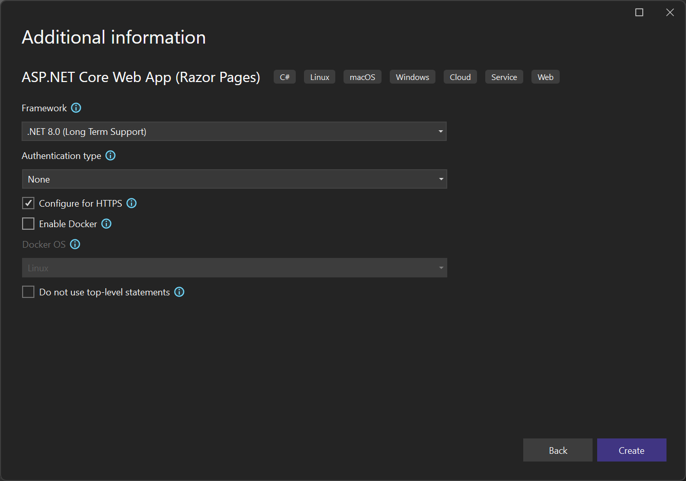

# Tutorial: Create a multi-container app with Docker Compose

 [!INCLUDE [Visual Studio](~/includes/applies-to-version/vs-windows-only.md)]

In this tutorial, you'll learn how to manage more than one container and communicate between them when using Container Tools in Visual Studio.  Managing multiple containers requires *container orchestration* and requires an orchestrator such as Docker Compose or Service Fabric. Here, we'll use Docker Compose. Docker Compose is great for local debugging and testing in the course of the development cycle.

:::moniker range=">=vs-2022"
The completed sample that you'll create in this tutorial may be found on GitHub at [https://github.com/MicrosoftDocs/vs-tutorial-samples](https://github.com/MicrosoftDocs/vs-tutorial-samples) in the folder *docker/ComposeSample*.
:::moniker-end

## Prerequisites

::: moniker range="vs-2019"

* [Docker Desktop](https://hub.docker.com/editions/community/docker-ce-desktop-windows)
* [Visual Studio 2019](https://visualstudio.microsoft.com/downloads) with the **Web Development**, **Azure Tools** workload, and/or **.NET cross-platform development** workload installed
* [.NET Core 3 Development Tools](https://dotnet.microsoft.com/download/dotnet-core/3.1) for development with .NET Core 3.1.
::: moniker-end

::: moniker range=">=vs-2022"

* [Docker Desktop](https://hub.docker.com/editions/community/docker-ce-desktop-windows)
* [Visual Studio 2022](https://visualstudio.microsoft.com/downloads/) with the **Web Development**, **Azure Tools** workload, and/or **.NET cross-platform development** workload installed. This includes .NET Core 3.1 and .NET 6 development tools.
::: moniker-end

## Create a Web Application project

In Visual Studio, create an **ASP.NET Core Web App** project, named `WebFrontEnd`, to create a web application with Razor pages.

::: moniker range="vs-2019"


Do not select **Enable Docker Support**. You'll add Docker support later.


::: moniker-end
::: moniker range=">=vs-2022"

> [!NOTE]
> In Visual Studio 2022 17.2 and later, you can use Azure Functions for this project instead.


Do not select **Enable Docker Support**. You'll add Docker support later.



::: moniker-end

## Create a Web API project

::: moniker range="vs-2019"

Add a project to the same solution and call it *MyWebAPI*. Select **API** as the project type, and clear the checkbox for **Configure for HTTPS**. In this design, we're only using SSL for communication with the client, not for communication from between containers in the same web application. Only `WebFrontEnd` needs HTTPS and the code in the examples assumes that you have cleared that checkbox. In general, the .NET developer certificates used by Visual Studio are only supported for external-to-container requests, not for container-to-container requests.

   
::: moniker-end

:::moniker range=">=vs-2022"
1. Add a project to the same solution and call it *WebAPI*. Select **API** as the project type, and clear the checkbox for **Configure for HTTPS**. In this design, we're only using SSL for communication with the client, not for communication from between containers in the same web application. Only `WebFrontEnd` needs HTTPS and the code in the examples assumes that you have cleared that checkbox. In general, the .NET developer certificates used by Visual Studio are only supported for external-to-container requests, not for container-to-container requests.

   

1. Add support for Redis Cache. Add the NuGet package `Microsoft.Extensions.Caching.StackExchangeRedis` (not `StackExchange.Redis`). In *Program.cs*, add the following lines, just before `var app = builder.Build()`:

   ```csharp
   builder.Services.AddStackExchangeRedisCache(options =>
      {
         options.Configuration = "redis:6379"; // redis is the container name of the redis service. 6379 is the default port
         options.InstanceName = "SampleInstance";
      });
   ```

1. Add using directives in *Program.cs* for `Microsoft.Extensions.Caching.Distributed` and `Microsoft.Extensions.Caching.StackExchangeRedis`.

   ```csharp
   using Microsoft.Extensions.Caching.Distributed;
   using Microsoft.Extensions.Caching.StackExchangeRedis;
   ```

1. In the Web API project, delete the existing *WeatherForecast.cs* and *Controllers/WeatherForecastController.cs*, and add a file under Controllers, *CounterController.cs*, with the following contents:

   ```csharp
   using Microsoft.AspNetCore.Mvc;
   using Microsoft.Extensions.Caching.Distributed;
   using StackExchange.Redis;

   namespace WebApi.Controllers
   {
       [ApiController]
       [Route("[controller]")]
       public class CounterController : ControllerBase
       {
           private readonly ILogger<CounterController> _logger;
           private readonly IDistributedCache _cache;

           public CounterController(ILogger<CounterController> logger, IDistributedCache cache)
           {
               _logger = logger;
               _cache = cache;
           }

           [HttpGet(Name = "GetCounter")]
           public string Get()
           {
               string key = "Counter";
               string? result = null;
               try
               {
                   var counterStr = _cache.GetString(key);
                   if (int.TryParse(counterStr, out int counter))
                   {
                       counter++;
                   }
                   else
                   {
                       counter = 0;
                   }
                   result = counter.ToString();
                   _cache.SetString(key, result);
               }
               catch(RedisConnectionException)
               {
                   result = "Redis cache is not found.";
               }
               return result;
           }
       }
   }
   ```

   The service increments a counter every time the page is accessed and stores the counter in the Redis cache.
:::moniker-end

## Add code to call the Web API

::: moniker range="vs-2019"

1. In the `WebFrontEnd` project, open the *Index.cshtml.cs* file, and replace the `OnGet` method with the following code.

   ```csharp
    public async Task OnGet()
    {
       ViewData["Message"] = "Hello from webfrontend";

       using (var client = new System.Net.Http.HttpClient())
       {
          // Call *mywebapi*, and display its response in the page
          var request = new System.Net.Http.HttpRequestMessage();
          request.RequestUri = new Uri("http://mywebapi/WeatherForecast");
          // request.RequestUri = new Uri("http://mywebapi/api/values/1"); // For ASP.NET 2.x, comment out previous line and uncomment this line.
          var response = await client.SendAsync(request);
          ViewData["Message"] += " and " + await response.Content.ReadAsStringAsync();
       }
    }
   ```

    > [!NOTE]
    > In real-world code, you shouldn't dispose `HttpClient` after every request. For best practices, see [Use HttpClientFactory to implement resilient HTTP requests](/dotnet/architecture/microservices/implement-resilient-applications/use-httpclientfactory-to-implement-resilient-http-requests).

1. In the *Index.cshtml* file, add a line to display `ViewData["Message"]` so that the file looks like the following code:

      ```cshtml
      @page
      @model IndexModel
      @{
          ViewData["Title"] = "Home page";
      }
    
      <div class="text-center">
          <h1 class="display-4">Welcome</h1>
          <p>Learn about <a href="/aspnet/core">building Web apps with ASP.NET Core</a>.</p>
          <p>@ViewData["Message"]</p>
      </div>
      ```

1. (ASP.NET 2.x only) Now in the Web API project, add code to the Values controller to customize the message returned by the API for the call you added from *webfrontend*.

      ```csharp
        // GET api/values/5
        [HttpGet("{id}")]
        public ActionResult<string> Get(int id)
        {
            return "webapi (with value " + id + ")";
        }
      ```

   With .NET Core 3.1 and later, you don't need this, because you can use the WeatherForecast API that is already there. However, you need to comment out the call to <xref:Microsoft.AspNetCore.Builder.HttpsPolicyBuilderExtensions.UseHttpsRedirection*>  in the Web API project, because this code uses HTTP, not HTTPS, to call the Web API.

    ```csharp
                //app.UseHttpsRedirection();
    ```

## Add Docker Compose support

1. In the `WebFrontEnd` project, choose **Add > Container Orchestrator Support**. The **Docker Support Options** dialog appears.

1. Choose **Docker Compose**.

1. Choose your Target OS, for example, Linux.

   

   Visual Studio creates a *docker-compose.yml* file and a *.dockerignore* file in the **docker-compose** node in the solution, and that project shows in boldface font, which shows that it's the startup project.

   

   The *docker-compose.yml* appears as follows:

   ```yaml
   version: '3.4'

    services:
      webfrontend:
        image: ${DOCKER_REGISTRY-}webfrontend
        build:
          context: .
          dockerfile: WebFrontEnd/Dockerfile
   ```

   The `version` specified in the first line is the [Docker Compose file version](https://docs.docker.com/compose/compose-file/#version-top-level-element). You normally shouldn't change it, since it's used by the tools to understand how to interpret the file.

   The *.dockerignore* file contains file types and extensions that you don't want Docker to include in the container. These files are generally associated with the development environment and source control, not part of the app or service you're developing.

   Look at the **Container Tools** section of the output pane for details of the commands being run.  You can see the command-line tool docker-compose is used to configure and create the runtime containers.

1. In the Web API project, again right-click on the project node, and choose **Add** > **Container Orchestrator Support**. Choose **Docker Compose**, and then select the same target OS.  

    > [!NOTE]
    > In this step, Visual Studio will offer to create a Dockerfile. If you do this on a project that already has Docker support, you are prompted whether you want to overwrite the existing Dockerfile. If you've made changes in your Dockerfile that you want to keep, choose no.

    Visual Studio makes some changes to your docker compose YML file. Now both services are included.

    ```yaml
    version: '3.4'
    
    services:
      webfrontend:
        image: ${DOCKER_REGISTRY-}webfrontend
        build:
          context: .
          dockerfile: WebFrontEnd/Dockerfile
    
      mywebapi:
        image: ${DOCKER_REGISTRY-}mywebapi
        build:
          context: .
          dockerfile: MyWebAPI/Dockerfile
    ```

1. The first project that you add container orchestration to is set up to be launched when you run or debug. You can configure the launch action in the **Project Properties** for the docker-compose project.  On the docker-compose project node, right-click to open the context menu, and then choose **Properties**, or use Alt+Enter.  The following screenshot shows the properties you would want for the solution used here.  For example, you can change the page that is loaded by customizing the **Service URL** property.

   

   Here's what you see when launched (the .NET Core 2.x version):

   

   The web app for .NET 3.1 shows the weather data in JSON format.

1. Now suppose you are only interested in having the debugger attached to WebFrontEnd, not the Web API project. From the menu bar, you can use the dropdown next to the start button to bring up a menu of debug options; choose **Manage Docker Compose Launch Settings**.

   

   The **Manage Docker Compose Launch Settings** dialog comes up. With this dialog, you can control which subset of services is launched during a debugging session, which are launched with or without the debugger attached, as well as the launch service and URL. See [Start a subset of Compose services](launch-profiles.md).

   

   Choose **New** to create a new profile, and name it `Debug WebFrontEnd only`. Then, set the Web API project to **Start without debugging**, leave the WebFrontEnd project set to start with debugging, and choose **Save**.

   The new configuration is chosen as the default for the next **F5**.

1. Press **F5** to confirm it works as you expect.

Congratulations, you're running a Docker Compose application with a custom Docker Compose profile.

::: moniker-end

:::moniker range=">=vs-2022"

1. In the `WebFrontEnd` project, open the *Index.cshtml.cs* file, and replace the `OnGet` method with the following code.

   ```csharp
   public async Task OnGet()
   {
      using (var client = new System.Net.Http.HttpClient())
      {
         // Call *mywebapi*, and display its response in the page
         var request = new System.Net.Http.HttpRequestMessage();
         // webapi is the container name
         request.RequestUri = new Uri("http://webapi/Counter");
         var response = await client.SendAsync(request);
         string counter = await response.Content.ReadAsStringAsync();
         ViewData["Message"] = $"Counter value from cache :{counter}";
      }
   }
   ```

    > [!NOTE]
    > In real-world code, you shouldn't dispose `HttpClient` after every request. For best practices, see [Use HttpClientFactory to implement resilient HTTP requests](/dotnet/architecture/microservices/implement-resilient-applications/use-httpclientfactory-to-implement-resilient-http-requests).

1. In the *Index.cshtml* file, add a line to display `ViewData["Message"]` so that the file looks like the following code:

      ```cshtml
      @page
      @model IndexModel
      @{
          ViewData["Title"] = "Home page";
      }
    
      <div class="text-center">
          <h1 class="display-4">Welcome</h1>
          <p>Learn about <a href="/aspnet/core">building Web apps with ASP.NET Core</a>.</p>
          <p>@ViewData["Message"]</p>
      </div>
      ```

      This code will display the value of the counter returned from the Web API project.

## Add Docker Compose support

1. In the `WebFrontEnd` project, choose **Add > Container Orchestrator Support**. The **Docker Support Options** dialog appears.

1. Choose **Docker Compose**.

1. Choose your Target OS, for example, Linux.

   

   Visual Studio creates a *docker-compose.yml* file and a *.dockerignore* file in the **docker-compose** node in the solution, and that project shows in boldface font, which shows that it's the startup project.

   

   The *docker-compose.yml* appears as follows:

   ```yaml
   version: '3.4'

    services:
      webfrontend:
        image: ${DOCKER_REGISTRY-}webfrontend
        build:
          context: .
          dockerfile: WebFrontEnd/Dockerfile
   ```

   The `version` specified in the first line is the [Docker Compose file version](https://docs.docker.com/compose/compose-file/#version-top-level-element). You normally shouldn't change it, since it's used by the tools to understand how to interpret the file.

   The *.dockerignore* file contains file types and extensions that you don't want Docker to include in the container. These files are generally associated with the development environment and source control, not part of the app or service you're developing.

   Look at the **Container Tools** section of the output pane for details of the commands being run.  You can see the command-line tool docker-compose is used to configure and create the runtime containers.

1. In the Web API project, again right-click on the project node, and choose **Add** > **Container Orchestrator Support**. Choose **Docker Compose**, and then select the same target OS.  

    > [!NOTE]
    > In this step, Visual Studio will offer to create a Dockerfile. If you do this on a project that already has Docker support, you are prompted whether you want to overwrite the existing Dockerfile. If you've made changes in your Dockerfile that you want to keep, choose no.

    Visual Studio makes some changes to your docker compose YML file. Now both services are included.

    ```yaml
    version: '3.4'
    
    services:
      webfrontend:
        image: ${DOCKER_REGISTRY-}webfrontend
        build:
          context: .
          dockerfile: WebFrontEnd/Dockerfile
    
      mywebapi:
        image: ${DOCKER_REGISTRY-}mywebapi
        build:
          context: .
          dockerfile: MyWebAPI/Dockerfile
    ```

1. Add the Redis cache to the `docker.compose.yml` file:

   ```yml
   redis:
      image: redis
   ```

   Make sure the indentation is at the same level as the other two services.

1. The first project that you add container orchestration to is set up to be launched when you run or debug. You can configure the launch action in the **Project Properties** for the docker-compose project.  On the docker-compose project node, right-click to open the context menu, and then choose **Properties**, or use **Alt**+**Enter**. For example, you can change the page that is loaded by customizing the **Service URL** property.

   

1. Press **F5**. Here's what you see when launched:

   

## Set up launch profiles

1. This solution has a Redis Cache, but it's not efficient to rebuild the Redis cache container every time you start a debugging session. To avoid that, you can set up a couple of launch profiles, one profile that just starts the Redis cache, and another to start the other services, which will use the Redis cache container that's already running. From the menu bar, you can use the dropdown next to the start button to bring up a menu of debug options; choose **Manage Docker Compose Launch Settings**.

   

   The **Manage Docker Compose Launch Settings** dialog comes up. With this dialog, you can control which subset of services is launched during a debugging session, which are launched with or without the debugger attached, as well as the launch service and URL. See [Start a subset of Compose services](launch-profiles.md).

   

   Choose **New** to create a new profile, and name it `Start Redis`. Then, set the Redis container to **Start without debugging**, leave the other set to **Do not start**, and choose **Save**.

   

   Then create another profile `Start My Services` that doesn't start Redis, but starts the other two services.

   

   (Optional) Create a third profile `Start All` to start everything. You can choose **Start without debugging** for Redis.

1. Choose **Start Redis** from the dropdown list on the main Visual Studio toolbar, press **F5**. The Redis container builds and starts. You can use the **Containers** window to see that it's running. Next, choose **Start My Services** from the dropdown list and press **F5** to launch them. Now you can keep the Redis cache container running throughout many subsequent debug sessions. Every time you use **Start My Services**, those services will use the same Redis cache container.

Congratulations, you're running a Docker Compose application with a custom Docker Compose profile.

::: moniker-end

## Next steps

Look at the options for deploying your [containers to Azure](/azure/containers).

## See also
  
[Docker Compose](https://docs.docker.com/compose/)  
[Container Tools](./index.yml)
