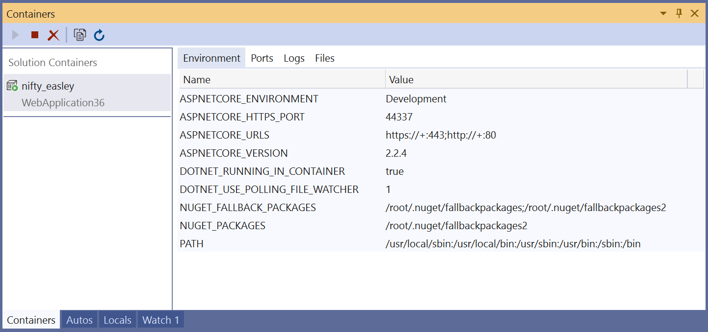
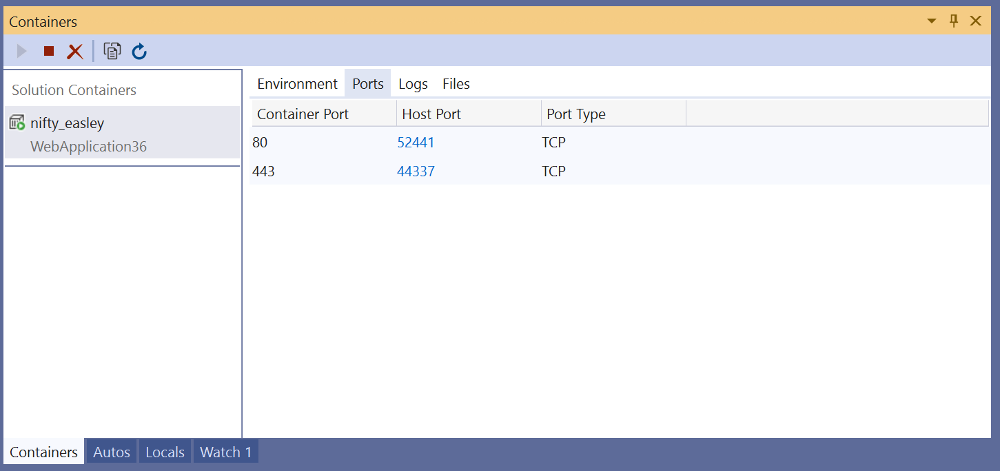
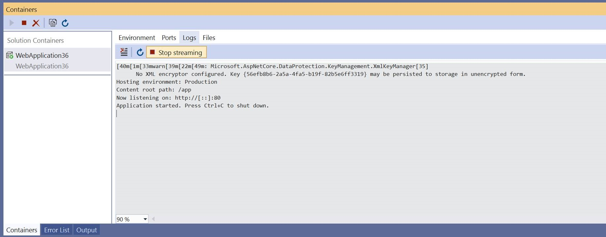

# How to: View and diagnose containers in Visual Studio

You can view what's going on inside the containers that host your app by using the **Containers** window. If you're used to using the command prompt to run Docker commands to view and diagnose what's going on with your containers, this window provides a more convenient way to monitor your containers without leaving the Visual Studio IDE.

> [!NOTE]
> The Containers window is currently available as a Preview extension that you can [download](https://aka.ms/vscontainerspreview) for Visual Studio 2019.

## Prerequisities

- [Docker Desktop](https://hub.docker.com/editions/community/docker-ce-desktop-windows)
- Install [Visual Studio 2019](https://visualstudio.microsoft.com/downloads/?utm_medium=microsoft&utm_source=docs.microsoft.com&utm_campaign=inline+link&utm_content=download+vs2019) with the **Web Development**, **Azure Tools** workload, and/or **.NET Core cross-platform development** workload
- Install the [Containers window extension](https://aka.ms/vscontainerspreview)

## View information about your containers

The **Containers** window opens automatically when you start a containerized .NET project. To view your containers in Visual Studio at any time, use **Ctrl**+**Q** to activate the Visual Studio Search box, and type `Containers` and choose **View > Other Windows > Containers**. You can also open the **Containers** window from the main menu. Use the menu path  **View** > **Other Windows** > **Containers**.  

On the left side, you see the list of containers, where you can see the friendly name that Docker chose for your container. To the right, you see a pane with tabs for **Environment**, **Ports**, **Logs**, and **Files**.

> [!TIP]
> You can easily customize where the **Containers** tool window is docked in Visual Studio. See [Customizing window layouts in Visual Studio](/visualstudio/ide/customizing-window-layouts-in-visual-studio). By default, the **Containers** window is docked with the **Watch** window when the debugger is running.

## View environment variables

The **Environment** tab shows the environment variables in the container. For your app's container, you can set these variables in the Dockerfile, in a .env file, or by using the -e option when you start a container using a Docker command.

> [!NOTE]
> Any changes to the environment variables aren't reflected in real time. To refresh the environment variable pane, use the **Refresh** button on the **Containers** window.

## View port mappings

On the **Ports** tab, you can check the port mappings that are in effect for your container.

Well-known ports are linked, so if there's content available on a port, you can click on them to open the browser.

## View logs

The **Logs** tab shows the stdout and stderr streams on a container.  By default, it streams the logs, but you can disable that by choosing the **Stop** button on the tab.

To clear the logs, use the **Clear** button on the **Logs** tab.  To get all the logs, use the **Refresh** button.

## View the filesystem

On the **Files** tab, you can view the container's filesystem, including the app folder that contains your project.

To open files in Visual Studio, browse to the file and double-click it, or right-click and choose **Open**. Visual Studio opens files in read-only mode.

Using the Files tab, you can view application logs such as IIS logs, configuration files, and other content files in your container's filesystem.

## Start, stop, and remove containers

By default, the **Containers** window shows all containers on the machine that Docker manages. You can use the toolbar buttons to start, stop, or remove (delete) a container you no longer want.  This list is dynamically updated as containers are created or removed.

## Next steps

Learn more about the Container Tools available in Visual Studio by reading the [Container Tools Overview](overview.md).

## See also

[Container Development in Visual Studio](/visualstudio/containers)

[Extensions Marketplace for Visual Studio](https://marketplace.visualstudio.com/)
