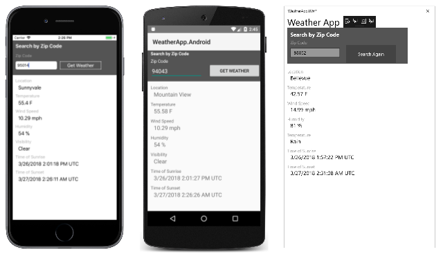
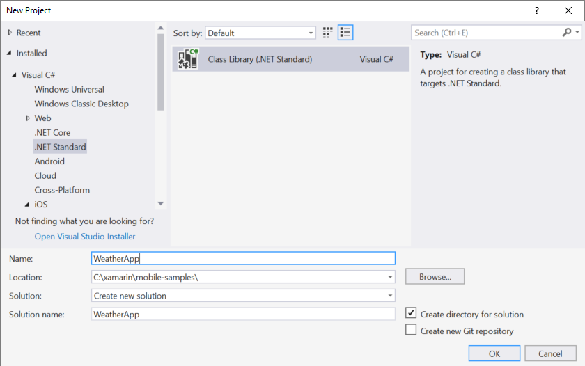
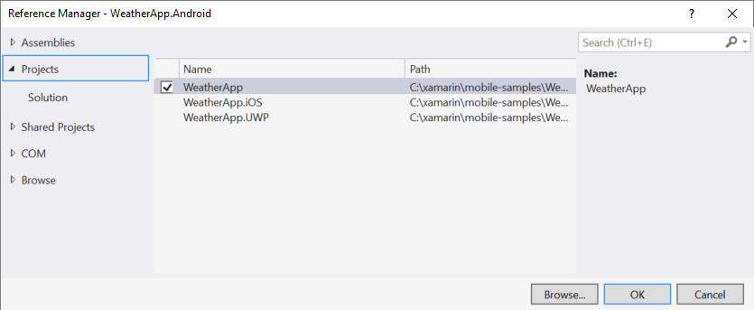
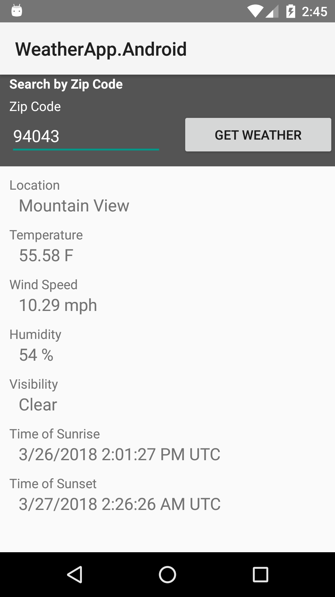
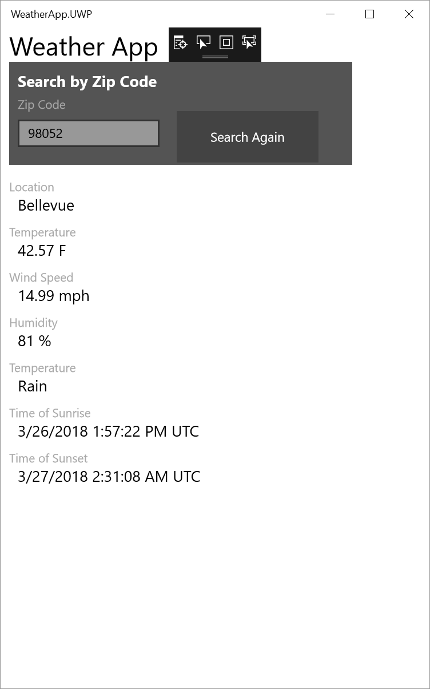

# Build apps with native UI using Xamarin in Visual Studio

Most developers who choose Xamarin for writing cross-platform mobile applications in C# use Xamarin.Forms, which defines a user interface that maps to native controls in iOS, Android, and the Universal Windows Platform (UWP). Xamarin.Forms is described in the article [Learn app-building basics with Xamarin.Forms in Visual Studio](learn-app-building-basics-with-xamarin-forms-in-visual-studio.md).

This article describes a different approach that involves accessing the native user-interface APIs of each platform. This is a much harder approach because it requires extensive knowledge of each platform your application support. The advantage is that you can tailor the user interface to the strengths and capabilities of each platform, while still sharing underlying business logic.

Once you've done the steps in [Setup and install](../cross-platform/setup-and-install.md) and [Verify your Xamarin environment](../cross-platform/verify-your-xamarin-environment.md), this walkthrough shows you how to build a basic Xamarin app with native UI layers. With native UI, shared code resides in a .NET Standard library (PCL) and the individual platform projects contain the UI definitions. Here is the application that you'll build running on (from left to right) iOS and Android phones, and the Windows 10 desktop.
  
[](../cross-platform/media/cross-plat-xamarin-build-1-Large.png#lightbox)
  
You'll do these things to build it:  
  
- [Set up your solution](#solution)  
  
- [Write shared data service code](#dataservice)  
  
- [Design UI for Android](#Android)  

- [Design UI for Windows](#Windows)  
  
- [Next steps](#next), which include designing an iOS user interface
  
> [!TIP]
> You can find the complete source code for this project in the [mobile-samples repository on GitHub](https://github.com/xamarin/mobile-samples/tree/master/Weather).
>
> If you have difficulties or run into errors, please post questions on [forums.xamarin.com](http://forums.xamarin.com). Many errors can be resolved by updating to the latest SDKs required by Xamarin, which are described in the [Xamarin Release Notes](https://developer.xamarin.com/releases/) for each platform.    
  
> [!NOTE]
> Xamarin's developer documentation also offers several walkthroughs with both Quickstart and Deep Dive sections as listed below. On all these pages, be sure that "Visual Studio" is selected in the upper right of the page to see Visual Studio-specific walkthroughs.  
>   
>  -   Xamarin apps with native UI:  
>   
>     -   [Hello, Android](/xamarin/android/get-started/hello-android/) (simple app with one screen)  
>     -   [Hello, Android multiscreen](/xamarin/android/get-started/hello-android-multiscreen/) (app with navigation between screens)  
>     -   [Android Fragments Walkthrough](/xamarin/android/platform/fragments/fragments/implementing-with-fragments/walkthrough/) (used for master/detail screens, among other things)  
>     -   [Hello, iOS](/xamarin/ios/get-started/hello-iOS/)  
>     -   [Hello, iOS Multiscreen](/xamarin/ios/get-started/hello-iOS-multiscreen/)  
> -   Xamarin apps with Xamarin.Forms (shared UI)  
>   
>     -   [Hello, Xamarin.Forms](/xamarin/cross-platform/xamarin-forms/get-started/hello-xamarin-forms/quickstart/)  
>     -   [Hello, Xamarin.Forms Multiscreen](/xamarin/cross-platform/xamarin-forms/get-started/hello-xamarin-forms-multiscreen/)  
  
<a name="solution"></a>

##  Set up your solution  

There is no Visual Studio solution template for creating native UI applications sharing a .NET Standard library, but it's not hard to build such a project from the individual components. These steps create a Xamarin solution with native UI that contains a .NET Standard library for shared code and two added NuGet packages.  
  
1.  In Visual Studio, create a new **Class Library (.NET Standard)** solution and name it **WeatherApp**. You can find this template most easily by selecting **Visual C#** at the left and then **.NET Standard**: 

    

    After clicking OK to create the solution, the **WeatherApp** solution contains a single project named **WeatherApp**. 

2.  If you want to target iOS, add an iOS project to the solution. Right-click the solution name in the **Solution Explorer** and select **Add** and **New Project**.  In the **New Project** dialog, at the left select **Visual C#**, and then **iOS** and **Universal**. (If it's not there, you might have to install Xamarin or enable the Visual Studio 2017 feature, see [Setup and install](../cross-platform/setup-and-install.md).) In the list of templates, select **Single View App (iOS)**. Name it **WeatherApp.iOS**.

3.  If you want to target Android, add an Android project to the solution. In the **New Project** dialog, at the left select **Visual C#** and **Android**. In the template list, select **Blank App (Android)**. Name it **WeatherApp.Android**. 

4. If you want to target the Universal Windows Platform, in the **New Project** dialog, at the left select **Visual C#** and **Windows Universal**. In the template list, select **Blank App (Universal Windows)** and name it **WeatherApp.UWP**.
  
5. For each of the application projects (iOS, Android, and UWP), right click the **References** section in the **Solution Explorer** and select **Add Reference**. In the **Reference Manager** dialog, at the left select **Project** and **Solution**. You'll see a list of all the projects in the solution expect the project whose references you're managing:

   

   Check the checkbox next to **WeatherApp**. 

   After you do this for each of the application projects, they will all contain references to the .NET Standard library and can share the code in that library.
  
6. Add the **Newtonsoft.Json** NuGet package to the .NET Standard project, which you'll use to process information retrieved from a weather data service:  
  
    -   Right-click the **WeatherApp** project in the **Solution Explorer** and select **Manage NuGet Packages...**.  
  
         In the NuGet window, select the **Browse** tab and search for **Newtonsoft**.  
  
    -   Select **Newtonsoft.Json**.  
  
    -   Ensure the **Version** field is set to the **Latest stable** version.  
  
    -   Click **Install**.  
  
7.  Repeat step 7 to find and install the **Microsoft.CSharp** package in the .NET Standard project. This is necessary to use the C# `dynamic` data type in a .NET Standard library.
  
8.  Build your solution and verify that there are no build errors.  
  
<a name="dataservice"></a>

## Write shared data service code  

 The **WeatherApp** project is where you'll write code for the .NET Standard library that is shared across all platforms. Because each application project has a reference to the .NET Standard library, it is included in the iOS, Android, and UWP app packages.  
  
 The following steps then add code to the PCL to access and store data from that weather service:  
  
1.  To run this sample you must first sign up for a free API key at [http://openweathermap.org/appid](http://openweathermap.org/appid).  
  
2.  Right-click the **WeatherApp** project and select **Add > Class...**. In the **Add New Item** dialog, name the file **Weather.cs**. You'll use this class to store data from the weather data service.  
  
3.  Replace the entire contents of **Weather.cs** with the following:  
  
    ```csharp  
    namespace WeatherApp
    {
        public class Weather
        {
            // Because labels bind to these values, set them to an empty string to
            // ensure that the label appears on all platforms by default.
            public string Title { get; set; } = " ";
            public string Temperature { get; set; } = " ";
            public string Wind { get; set; } = " ";
            public string Humidity { get; set; } = " ";
            public string Visibility { get; set; } = " ";
            public string Sunrise { get; set; } = " ";
            public string Sunset { get; set; } = " ";
        }
    }
    ```  
  
4.  Add another class to the PCL project named **DataService.cs** in which you'll use to process JSON data from the weather data service.  
  
5.  Replace the entire contents of **DataService.cs** with the following code:  
  
    ```csharp  
    using System.Net.Http;  
    using System.Threading.Tasks;  
    using Newtonsoft.Json;  
  
    namespace WeatherApp  
    {  
        public class DataService  
        {  
            public static async Task<dynamic> getDataFromService(string queryString)  
            {  
                HttpClient client = new HttpClient();  
                var response = await client.GetAsync(queryString);  
  
                dynamic data = null;  
                if (response != null)  
                {  
                    string json = response.Content.ReadAsStringAsync().Result;  
                    data = JsonConvert.DeserializeObject(json);  
                }  
  
                return data;  
            }  
        }  
    }  
    ```  
  
6.  Add a third class to the PCL named **Core** where you'll put shared business logic, such as logic that forms a query string with a zip code, calls the weather data service, and populates an instance of the **Weather** class.  
  
7.  Replace the contents of **Core.cs** with the following:  
  
    ```csharp  
    using System;  
    using System.Threading.Tasks;  
  
    namespace WeatherApp  
    {  
        public class Core  
        {  
            public static async Task<Weather> GetWeather(string zipCode)  
            {  
                //Sign up for a free API key at http://openweathermap.org/appid  
                string key = "YOUR API KEY HERE";  
                string queryString = "http://api.openweathermap.org/data/2.5/weather?zip="  
                    + zipCode + ",us&appid=" + key + "&units=imperial";  

                //Make sure developers running this sample replaced the API key
                if (key == "YOUR API KEY HERE")
                {
                    throw new ArgumentException("You must obtain an API key from openweathermap.org/appid and save it in the 'key' variable.");
                }
  
                dynamic results = await DataService.GetDataFromService(queryString).ConfigureAwait(false);  
  
                if (results["weather"] != null)  
                {  
                    Weather weather = new Weather();  
                    weather.Title = (string)results["name"];                  
                    weather.Temperature = (string)results["main"]["temp"] + " F";  
                    weather.Wind = (string)results["wind"]["speed"] + " mph";                  
                    weather.Humidity = (string)results["main"]["humidity"] + " %";  
                    weather.Visibility = (string)results["weather"][0]["main"];  
  
                    DateTime time = new System.DateTime(1970, 1, 1, 0, 0, 0, 0);  
                    DateTime sunrise = time.AddSeconds((double)results["sys"]["sunrise"]);  
                    DateTime sunset = time.AddSeconds((double)results["sys"]["sunset"]);  
                    weather.Sunrise = sunrise.ToString() + " UTC";  
                    weather.Sunset = sunset.ToString() + " UTC";  
                    return weather;  
                }  
                else  
                {  
                    return null;  
                }  
            }  
        }  
    }  
    ```  
  
8. Replace the first occurrence of *YOUR API KEY HERE* in the code with the API key you obtained in step 1 (it still needs quotes around it).  
  
9. Delete **MyClass.cs** in the PCL because we won't be using it.  
  
10. Build the **WeatherApp** PCL project to make sure the code is correct.  
  
<a name="Android"></a>

## Design UI for Android  

 Now, we'll design the user interface, connect it to your shared code, and then run the app.  
  
### Design the look and feel of your app  
  
1.  In **Solution Explorer**, expand the **WeatherApp.Droid**>**Resources**>**layout** folder and open **Main.axml**. This opens the file in the visual designer. (If a Java-related error appears, see this [blog post](http://forums.xamarin.com/discussion/32365/connection-to-the-layout-renderer-failed-in-xs-5-7-and-xamarinvs-3-9).)  
  
    > [!TIP]
    >  There are many other files in the project. Exploring them is beyond the scope of this topic, but if you want to dive into the structure of an Android project a bit more, see [Part 2 Deep Dive](/xamarin/guides/android/getting_started/hello,android/hello,android_deepdive/) of the Hello Android topic on xamarin.com.  
  
2.  Select and delete the default button that appears in the designer.  
  
3.  Open the Toolbox with **View > Other Windows > Toolbox**.  
  
4.  From the **Toolbox**, drag a **RelativeLayout** control onto the designer. You'll use this control as a parent container for other controls.  
  
    > [!TIP]
    >  If at any time the layout doesn't seem to display correctly, save the file and switching between the **Design** and **Source** tabs to refresh.  
  
5.  In the **Properties** window, set the **background** property (in the Style group) to `#545454`.  
  
6.  From the **Toolbox**, drag a **TextView** control onto the **RelativeLayout** control.  
  
7.  In the **Properties** window, set these properties (note: it can help to sort the list alphabetically using the sort button in the Properties window toolbar):  
  
    |Property|Value|  
    |--------------|-----------|  
    |**text**|**Search by Zip Code**|  
    |**id**|`@+id/ZipCodeSearchLabel`|  
    |**layout_marginLeft**|`10dp`|  
    |**textColor**|`@android:color/white`|  
    |**textStyle**|`bold`|  
  
    > [!TIP]
    >  Notice that many properties don't contain a drop-down list of values that you can select.  It can be difficult to guess what string value to use for any given property. For suggestions, try searching for the name of a property in the [R.attr](http://developer.android.com/reference/android/R.attr.html) class page.  
    >   
    >  Also, a quick web search often leads to a page on [http://stackoverflow.com/](http://stackoverflow.com/) where others have used the same property.  
  
     For reference, if you switch to **Source** view, you should see the following code for this element:  
  
    ```xml  
    <TextView  
        android:text="Search by Zip Code"  
        android:layout_width="wrap_content"  
        android:layout_height="wrap_content"  
        android:id="@+id/ZipCodeSearchLabel"  
        android:layout_centerVertical="true"  
        android:layout_marginLeft="10dp"  
        android:textColor="@android:color/white"  
        android:textStyle="bold" />  
  
    ```  
  
8.  From the **Toolbox**, drag a **TextView** control onto the **RelativeLayout** control and position it below the ZipCodeSearchLabel control. You do this by dropping the new control on the appropriate edge of the existing control; it helps to zoom the designer in somewhat for this.  
  
9. In the **Properties** window, set these properties:  
  
    |Property|Value|  
    |--------------|-----------|  
    |**text**|**Zip Code**|  
    |**id**|`@+id/ZipCodeLabel`|  
    |**layout_marginLeft**|`10dp`|  
    |**layout_marginTop**|`5dp`|  
    |**textColor**|`@android:color/white`|  
  
     The code in **Source** view should look like this:  
  
    ```xml  
    <TextView  
        android:text="Zip Code"  
        android:layout_width="wrap_content"  
        android:layout_height="wrap_content"  
        android:layout_below="@id/ZipCodeSearchLabel"  
        android:id="@+id/ZipCodeLabel"  
        android:layout_marginLeft="10dp"
        android:layout_marginTop="5dp"  
        android:textColor="@android:color/white" />  
    ```  
  
10. From the **Toolbox**, drag a **Number** control onto the **RelativeLayout**, position it below the **Zip Code** label. Then set the following properties:  
  
    |Property|Value|  
    |--------------|-----------|  
    |**id**|`@+id/zipCodeEntry`|  
    |**layout_marginLeft**|`10dp`|  
    |**layout_marginBottom**|`10dp`|  
    |**width**|`165dp`|  
    |**textColor**|`@android:color/white`|  
  
     Again, the code:  
  
    ```xml  
    <EditText  
        android:inputType="number"  
        android:layout_width="wrap_content"  
        android:layout_height="wrap_content"  
        android:layout_below="@id/ZipCodeLabel"  
        android:id="@+id/zipCodeEntry"  
        android:layout_marginLeft="10dp"  
        android:layout_marginBottom="10dp"  
        android:width="165dp"  
        android:textColor="@android:color/white" />  
    ```  
  
11. From the **Toolbox**, drag a **Button** onto the **RelativeLayout** control and position it to the right of the zipCodeEntry control. Then set these properties:  
  
    |Property|Value|  
    |--------------|-----------|  
    |**id**|`@+id/weatherBtn`|  
    |**text**|**Get Weather**|  
    |**layout_marginLeft**|`20dp`|  
    |**layout_alignBottom**|`@id/zipCodeEntry`|  
    |**width**|`165dp`|  
  
    ```xml  
    <Button
        android:text="Get Weather"  
        android:layout_width="wrap_content"  
        android:layout_height="wrap_content"  
        android:layout_toRightOf="@id/zipCodeEntry"  
        android:id="@+id/weatherBtn"  
        android:layout_marginLeft="20dp"  
        android:layout_alignBottom="@id/zipCodeEntry"  
        android:width="165dp" />  
    ```  
  
12. You now have enough experience to build a basic UI by using the Android designer. You can also build a UI by adding markup directly to the .axml file of the page. To build the rest of the UI that way, switch to Source view in the designer, then past the following markup *beneath* the `</RelativeLayout>` tag. (They must be beneath the tag because these elements are not contained in the `RelativeLayout)`.  
  
    ```xml  
    <TextView  
            android:text="Location"  
            android:textAppearance="?android:attr/textAppearanceSmall"  
            android:layout_width="match_parent"  
            android:layout_height="wrap_content"  
            android:id="@+id/locationLabel"  
            android:layout_marginLeft="10dp"  
            android:layout_marginTop="10dp" />  
        <TextView  
            android:textAppearance="?android:attr/textAppearanceMedium"  
            android:layout_width="match_parent"  
            android:layout_height="wrap_content"  
            android:id="@+id/locationText"  
            android:layout_marginLeft="20dp"  
            android:layout_marginBottom="10dp" />  
        <TextView  
            android:text="Temperature"  
            android:textAppearance="?android:attr/textAppearanceSmall"  
            android:layout_width="match_parent"  
            android:layout_height="wrap_content"  
            android:id="@+id/tempLabel"  
            android:layout_marginLeft="10dp" />  
        <TextView  
            android:textAppearance="?android:attr/textAppearanceMedium"  
            android:layout_width="match_parent"  
            android:layout_height="wrap_content"  
            android:id="@+id/tempText"  
            android:layout_marginBottom="10dp"  
            android:layout_marginLeft="20dp" />  
        <TextView  
            android:text="Wind Speed"  
            android:textAppearance="?android:attr/textAppearanceSmall"  
            android:layout_width="match_parent"  
            android:layout_height="wrap_content"  
            android:id="@+id/windLabel"  
            android:layout_marginLeft="10dp" />  
        <TextView  
            android:textAppearance="?android:attr/textAppearanceMedium"  
            android:layout_width="match_parent"  
            android:layout_height="wrap_content"  
            android:id="@+id/windText"  
            android:layout_marginBottom="10dp"  
            android:layout_marginLeft="20dp" />  
        <TextView  
            android:text="Humidity"  
            android:textAppearance="?android:attr/textAppearanceSmall"  
            android:layout_width="match_parent"  
            android:layout_height="wrap_content"  
            android:id="@+id/humidtyLabel"  
            android:layout_marginLeft="10dp" />  
        <TextView  
            android:textAppearance="?android:attr/textAppearanceMedium"  
            android:layout_width="match_parent"  
            android:layout_height="wrap_content"  
            android:id="@+id/humidityText"  
            android:layout_marginBottom="10dp"  
            android:layout_marginLeft="20dp" />  
        <TextView  
            android:text="Visibility"  
            android:textAppearance="?android:attr/textAppearanceSmall"  
            android:layout_width="match_parent"  
            android:layout_height="wrap_content"  
            android:id="@+id/visibilityLabel"  
            android:layout_marginLeft="10dp" />  
        <TextView  
            android:textAppearance="?android:attr/textAppearanceMedium"  
            android:layout_width="match_parent"  
            android:layout_height="wrap_content"  
            android:id="@+id/visibilityText"  
            android:layout_marginBottom="10dp"  
            android:layout_marginLeft="20dp" />  
        <TextView  
            android:text="Time of Sunrise"  
            android:textAppearance="?android:attr/textAppearanceSmall"  
            android:layout_width="match_parent"  
            android:layout_height="wrap_content"  
            android:id="@+id/sunriseLabel"  
            android:layout_marginLeft="10dp" />  
        <TextView  
            android:textAppearance="?android:attr/textAppearanceMedium"  
            android:layout_width="match_parent"  
            android:layout_height="wrap_content"  
            android:id="@+id/sunriseText"  
            android:layout_marginBottom="10dp"  
            android:layout_marginLeft="20dp" />  
        <TextView  
            android:text="Time of Sunset"  
            android:textAppearance="?android:attr/textAppearanceSmall"  
            android:layout_width="match_parent"  
            android:layout_height="wrap_content"  
            android:id="@+id/sunsetLabel"  
            android:layout_marginLeft="10dp" />  
        <TextView  
            android:textAppearance="?android:attr/textAppearanceMedium"  
            android:layout_width="match_parent"  
            android:layout_height="wrap_content"  
            android:id="@+id/sunsetText"  
            android:layout_marginBottom="10dp"  
            android:layout_marginLeft="20dp" />  
    ```  
  
13. Save the file and switch to **Design** view. Your UI should appear as follows:  
  
       
  
14. Open **MainActivity.cs** and delete the lines in the *OnCreate* method that refer to the default button that was removed earlier. The code should look like this when you're done:  
  
    ```  
    protected override void OnCreate (Bundle bundle)  
    {  
    	base.OnCreate (bundle);  
  
    	// Set our view from the "main" layout resource  
    	SetContentView (Resource.Layout.Main);  
    }  
    ```  
  
15. Build the Android project to check your work. Note that building adds control IDs to the **Resource.Designer.cs** file so that you can refer to controls by name in code.  
  
### Consume your shared code  
  
1.  Open the **MainActivity.cs** file of the **WeatherApp** project in the code editor and replace its contents with the code below. This code calls the `GetWeather` method that you defined in your shared code. Then, in the UI of the app, it shows the data that is retrieved from that method.  
  
    ```csharp  
    using System;  
    using Android.App;  
    using Android.Widget;  
    using Android.OS;  
  
    namespace WeatherApp.Droid  
    {  
        [Activity(Label = "Sample Weather App", 
                  Theme = "@android:style/Theme.Material.Light", 
                  MainLauncher = true)]  
        public class MainActivity : Activity  
        {  
            protected override void OnCreate(Bundle bundle)  
            {  
                base.OnCreate(bundle);  
  
                SetContentView(Resource.Layout.Main);  
  
                Button button = FindViewById<Button>(Resource.Id.weatherBtn);  
  
                button.Click += Button_Click;  
            }  
  
            private async void Button_Click(object sender, EventArgs e)  
            {  
                EditText zipCodeEntry = FindViewById<EditText>(Resource.Id.zipCodeEntry);  
  
                if (!String.IsNullOrEmpty(zipCodeEntry.Text))  
                {  
                    Weather weather = await Core.GetWeather(zipCodeEntry.Text);  
                    FindViewById<TextView>(Resource.Id.locationText).Text = weather.Title;  
                    FindViewById<TextView>(Resource.Id.tempText).Text = weather.Temperature;  
                    FindViewById<TextView>(Resource.Id.windText).Text = weather.Wind;  
                    FindViewById<TextView>(Resource.Id.visibilityText).Text = weather.Visibility;  
                    FindViewById<TextView>(Resource.Id.humidityText).Text = weather.Humidity;  
                    FindViewById<TextView>(Resource.Id.sunriseText).Text = weather.Sunrise;  
                    FindViewById<TextView>(Resource.Id.sunsetText).Text = weather.Sunset;  
                }  
            }  
        }  
    }  
    ```  

    Notice that the activity has been given a theme for a light background.
  
### Run the app and see how it looks  
  
1.  In **Solution Explorer**, make sure the **WeatherApp.Droid** project is set as the startup project.  
  
2.  Select an appropriate device or emulator target, then start the app by pressing the F5 key.  
  
3.  On the device or in the emulator, type a valid United States five-digit zip code into the edit box, and press **Get Weather**. Weather data for that region then appears in the controls.  
  
       
  
> [!TIP]
>  The complete source code for this project is in the [mobile-samples repository on GitHub](https://github.com/xamarin/mobile-samples/tree/master/Weather).  
  
<a name="Windows"></a> 

## Design UI for Windows

 Now we'll design the user interface for Windows, connect it to your shared code, and then run the app.  
  
### Design the look and feel of your app  

 The process of designing a native UWP user interface in a Xamarin app is no different from any other native UWP app. For this reason, we won't go into the details here of how to use the designer. For that, refer to [Creating a UI by using XAML Designer](../designers/creating-a-ui-by-using-xaml-designer-in-visual-studio.md).  
  
 Instead, simply open MainPage.xaml and replace the entire XAML contents with the following:  
  
```xaml  
<Page
    x:Class="WeatherApp.UWP.MainPage"
    xmlns="http://schemas.microsoft.com/winfx/2006/xaml/presentation"
    xmlns:x="http://schemas.microsoft.com/winfx/2006/xaml"
    xmlns:local="using:WeatherApp.UWP"
    xmlns:d="http://schemas.microsoft.com/expression/blend/2008"
    xmlns:mc="http://schemas.openxmlformats.org/markup-compatibility/2006"
    mc:Ignorable="d">

    <Grid Background="{ThemeResource ApplicationPageBackgroundThemeBrush}">

        <StackPanel HorizontalAlignment="Left" 
                    VerticalAlignment="Top" 
                    Height="40" Margin="10,0,0,0" Width="400">
            <TextBlock Text="Weather App" FontSize="30" />
        </StackPanel>
        <StackPanel HorizontalAlignment="Left" 
                    VerticalAlignment="Top" 
                    Height="120" Margin="10,40,0,0" Width="400" 
                    Background="#FF545454">

            <TextBlock Text="Search by Zip Code" TextWrapping="Wrap" 
                       HorizontalAlignment="Left" Margin="10,10,0,0"
                       Foreground="White" FontSize="18" FontWeight="Bold" />
            
            <TextBlock Text="Zip Code" TextWrapping="Wrap" 
                       Margin="10,5,0,0" FontSize="14" Foreground="#FFA8A8A8"/>
            
            <StackPanel Orientation="Horizontal">

                <TextBox x:Name="zipCodeEntry" Text="" 
                         Margin="10,10,0,0" VerticalAlignment="Top" 
                         InputScope="Number" Width="165" />
                
                <Button x:Name="weatherBtn" Content="Get Weather" 
                        Foreground="White" Width="165" Margin="20,0,0,0" Height="60" 
                        Click="GetWeatherButton_Click"/>
            </StackPanel>
        </StackPanel>
        
        <StackPanel Margin="10,175,0,0">
            <StackPanel.Resources>
                <Style x:Key="commonText" TargetType="TextBlock">
                    <Setter Property="HorizontalAlignment" Value="Left" />
                    <Setter Property="VerticalAlignment" Value="Top" />
                    <Setter Property="TextWrapping" Value="Wrap" />
                </Style>
                
                <Style x:Key="labelText" TargetType="TextBlock" BasedOn="{StaticResource commonText}">
                    <Setter Property="FontSize" Value="14" />
                    <Setter Property="Foreground" Value="#FFA8A8A8" />
                </Style>

                <Style x:Key="valueText" TargetType="TextBlock" BasedOn="{StaticResource commonText}">
                    <Setter Property="FontSize" Value="18" />
                    <Setter Property="Margin" Value="10, 0, 0, 10" />
                </Style>
            </StackPanel.Resources>
            
            <TextBlock Text="Location" Style="{StaticResource labelText}" />
            <TextBlock x:Name="locationText" Style="{StaticResource valueText}" />

            <TextBlock Text="Temperature" Style="{StaticResource labelText}" />
            <TextBlock x:Name="tempText" Style="{StaticResource valueText}" />
            
            <TextBlock Text="Wind Speed" Style="{StaticResource labelText}" />
            <TextBlock x:Name="windText" Style="{StaticResource valueText}" />
            
            <TextBlock Text="Humidity" Style="{StaticResource labelText}" />
            <TextBlock x:Name="humidityText" Style="{StaticResource valueText}" />
            
            <TextBlock Text="Temperature" Style="{StaticResource labelText}" />
            <TextBlock x:Name="visibilityText" Style="{StaticResource valueText}" />
            
            <TextBlock Text="Time of Sunrise" Style="{StaticResource labelText}" />
            <TextBlock x:Name="sunriseText" Style="{StaticResource valueText}" />
            
            <TextBlock Text="Time of Sunset" Style="{StaticResource labelText}" />
            <TextBlock x:Name="sunsetText" Style="{StaticResource valueText}" />
        </StackPanel>
    </Grid>
</Page>
```  
  
### Consume your shared code  
  
In the **MainPage.xaml.cs** code-behind file, add the following event handler for the button: 
  
```csharp  
private async void GetWeatherButton_Click(object sender, RoutedEventArgs e)  
{  
    if (!String.IsNullOrEmpty(zipCodeEntry.Text))  
    {  
        Weather weather = await Core.GetWeather(zipCodeEntry.Text);  
        locationText.Text = weather.Title;  
        tempText.Text = weather.Temperature;  
        windText.Text = weather.Wind;  
        visibilityText.Text = weather.Visibility;  
        humidityText.Text = weather.Humidity;  
        sunriseText.Text = weather.Sunrise;  
        sunsetText.Text = weather.Sunset;  

        weatherBtn.Content = "Search Again";  
    }  
}  
```  
  
This code calls the `GetWeather` method that you defined in your shared code. This is the same method that you called in your Android app. This code also shows data retrieved from that method in the UI controls of your app.  
  
### Run the app and see how it looks  
  
1.  In **Solution Explorer**, set the **WeatherApp.UWP** project as the startup project.  

2.  In the **Solution Platforms** dropdown box, select **x86** and select **Local Machine** to deploy the application to the Windows 10 desktop.
  
3.  Start the app by pressing the F5 key.  
  
4.  In the window, type a valid five-digit United States zip code into the edit box, and press **Get Weather**. Weather data for that region then appears in the controls.  
  
       
  
> [!TIP]
>  The complete source code for this project is in the [mobile-samples repository on GitHub](https://github.com/xamarin/mobile-samples/tree/master/Weather).  

<a name="next"></a> 

## Next steps  

 **Add UI for iOS to the solution**  
  
 Extend this sample by adding native UI for iOS. For this you'll need to connect to a Mac on your local network that has Xcode and Xamarin installed. Once you do, you can use the iOS designer directly in Visual Studio. See the [mobile-samples repository on GitHub](https://github.com/xamarin/mobile-samples/tree/master/Weather) for a completed app.  
  
 Also refer to the [Hello, iOS](http://developer.xamarin.com/guides/ios/getting_started/hello,_iOS/hello,iOS_quickstart/) (xamarin.com) walkthrough. Note that on this page, be sure that "Visual Studio" is selected in the upper right corner of pages on xamarin.com so that the correct set of instructions appear.  
  
 **Add platform-specific code in a shared project**  
  
 Shared code in a .NET Standard library is platform-neutral, because the library is compiled once and included in each platform-specific app package. If you want to write shared code that uses conditional compilation to isolate platform-specific code, you can use a *shared* project. For more details, see [Code Sharing Options](/xamarin/cross-platform/application_fundamentals/building_cross_platform_applications/sharing_code_options/) (xamarin.com).  
  
## See Also  
 [Xamarin Documentation](http://docs.microsoft.com/xamarin)   
 [Windows Dev Center](https://dev.windows.com/en-us)   
 [Swift and C# Quick Reference Poster](http://aka.ms/scposter)