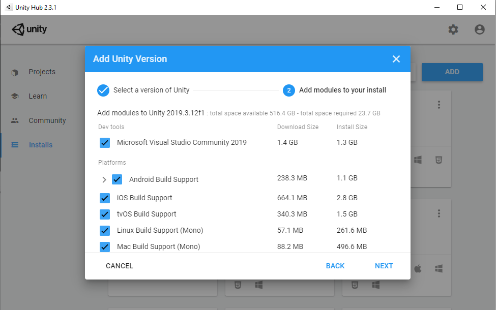
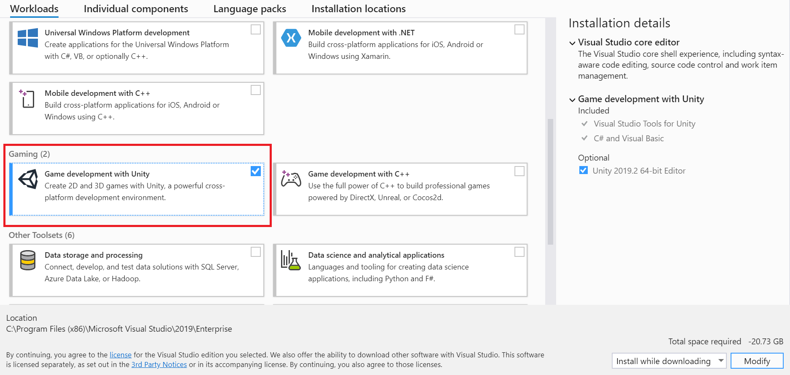
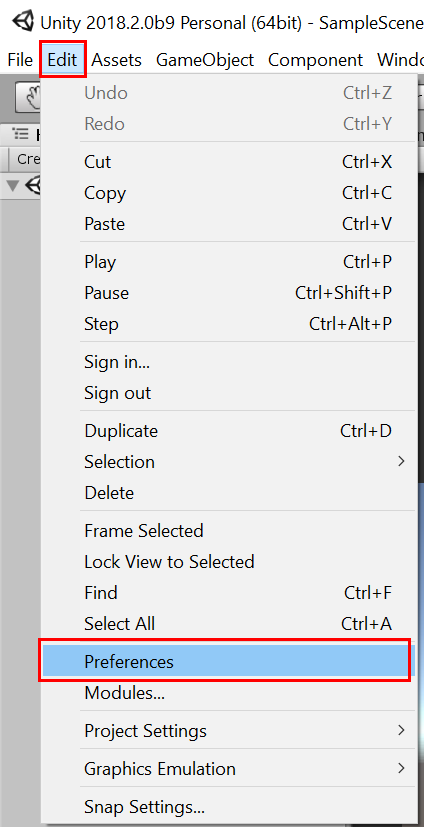
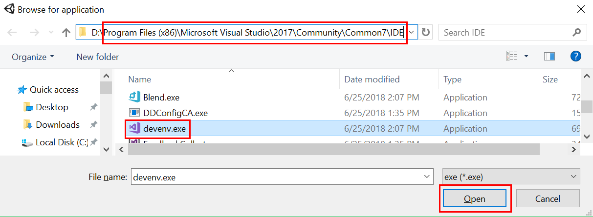
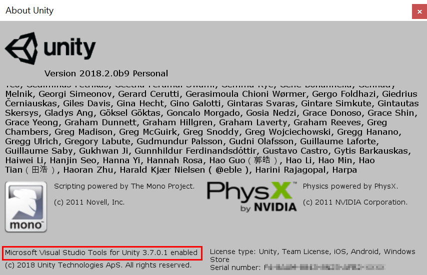

# Get started with Visual Studio Tools for Unity

## Install Visual Studio

### Unity bundled installation

Starting with Unity 2018.1, Visual Studio is the default C# script editor for Unity, and is included in the Unity Download Assistant, as well as the Unity Hub installation tool.

- Download Unity from [store.unity.com](https://store.unity.com/).

During installation, ensure that Visual Studio is checked in the list of components to install with Unity:

#### Unity Hub

#### Unity Download Assistant

#### Check for updates to Visual Studio

The version of Visual Studio included with your Unity installation may not be the latest. It is recommended to check for updates to ensure you have access to the latest tools and features.

- [Update Visual Studio](../install/update-visual-studio.md)

### Manual installation

If you already have Visual Studio 2017 installed, or prefer to manually install, run the Visual Studio installer.

1. [Download the Visual Studio installer](../install/install-visual-studio.md), or open it if already installed.

1. Click **Modify** (if already installed) or **Install** (for new installations) for your desired version of Visual Studio.

1. On the **Workloads** tab, scroll to the **Mobile & Gaming** section and select the **Game development with Unity** workload.

    

1. Click **Modify** (if already installed) or **Install** (for new installations) in the bottom-right corner of the installer window.

## Configure Unity for use with Visual Studio

Starting with Unity 2018.1, Visual Studio should be the default external script editor in Unity. You can confirm this or change the external script editor to a specific version of Visual Studio:

1. Select **Preferences** from the **Edit** menu.

   

2. In the Preferences dialog, select the **External Tools** tab.

3. From the **External Script Editor** dropdown list, choose your desired version of Visual Studio if it is listed, otherwise select **Browse...**.

   

4. If **Browse...** was selected, navigate to the **Common7/IDE** directory inside your Visual Studio installation directory and select **devenv.exe**. Then click **Open**.

   

5. Once Visual Studio is selected in the **External Script Editor** list, confirm that the **Editor Attaching** checkbox is selected.

6. Close the **Preferences** dialog to complete the configuration process.

## Support for older versions

 Download and install Visual Studio Tools for Unity from the Visual Studio Marketplace. You'll need to install the right package for your version of Visual Studio.

- For Visual Studio 2015 Community, Visual Studio 2015 Professional, or Visual Studio 2015 Enterprise:

   [Download Visual Studio 2015 Tools for Unity](https://marketplace.visualstudio.com/items?itemName=SebastienLebreton.VisualStudio2015ToolsforUnity)

> [!NOTE]
> Visual Studio Tools for Unity requires Unity 5.2 and above, as well as a version of Visual Studio that supports extensions, such as Visual Studio Community, Professional, Premium, or Enterprise. To verify that Visual Studio Tools for Unity are enabled in your installation of Unity, select **About Unity** from the **Help** menu and look for the text "Microsoft Visual Studio Tools for Unity enabled" in the bottom-left of the dialog.
> 

## Next steps

 To learn how to work with and debug your Unity project in Visual Studio, see [Visual Studio Tools for Unity](../cross-platform/using-visual-studio-tools-for-unity.md).
