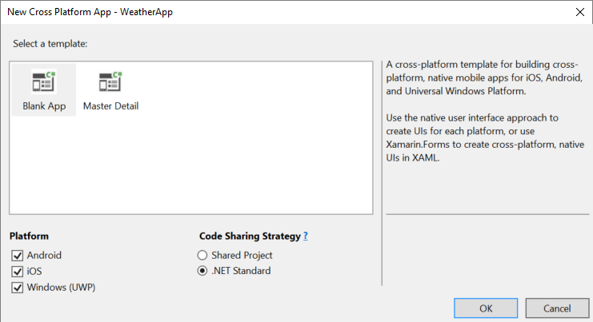

# Learn app-building basics with Xamarin.Forms in Visual Studio
Once you've done the steps in [Setup and install](../cross-platform/setup-and-install.md) and [Verify your Xamarin environment](../cross-platform/verify-your-xamarin-environment.md), this walkthrough shows you how to build a basic app (shown below) with Xamarin.Forms. With Xamarin.Forms you'll write all of your UI code once in a .NET Standard class library. Xamarin will then automatically render the native UI controls for the iOS, Android, and Universal Windows platforms. We recommend this approach (rather than a Shared project) because the .NET Standard library includes only those .NET APIs that are supported across all target platforms, and because Xamarin.Forms lets you share UI code across platforms.  
  
   
  
 You'll do these things to build it:  
  
-   [Set up your solution](#solution)  
  
-   [Write shared data service code](#dataservice)  
  
-   [Begin writing shared UI code](#uicode)  
  
-   [Test your app using the Visual Studio Emulator for Android](#test)  
  
-   [Finish the UI with a native look and feel across platforms](#finish)  
  
> [!TIP]
>  You can find the complete source code for this project in the [xamarin-forms-samples repository on GitHub](https://github.com/xamarin/xamarin-forms-samples/tree/master/Weather).  
  
##  <a name="solution"></a> Set up your solution  
 These steps create a Xamarin.Forms solution that contains a .NET Standard class library for shared code and two added NuGet packages.  
  
1.  In Visual Studio, create a new **Cross-Platform App (Xamarin.Forms)** solution and name it **WeatherApp**. Look for the template by selecting **Visual C#** and **Cross-Platform** from the list at the left.  
  
     If it's not there, you might have to install Xamarin or enable the Visual Studio 2017 feature, see [Setup and install](../cross-platform/setup-and-install.md).  
  
     

2.  After clicking OK, you'll have the opportunity to select some options. Pick **Blank App**, **Xamarin.Forms** and **.NET Standard**:

     
  
3.  After clicking OK to create the solution, you'll have a number of individual projects:  
  
    -   **WeatherApp**: the .NET Standard library where you'll write code that is shared across platforms, including common business logic and UI code using Xamarin.Forms.  
  
    -   **WeatherApp.Android**: the project that contains the native Android code. This is set as the default startup project.  
  
    -   **WeatherApp.iOS**: the project that contains the native iOS code.  
  
    -   **WeatherApp.UWP**: the project that contains Windows 10 UWP code.  
  
    > [!NOTE]
    >  You're free to delete any of the projects for a platform that you're not targeting.   
  
     Within each native project you have access to the native designer for the corresponding platform and can implement platform specific screens and functionality as needed.  
  
4.  Upgrade the Xamarin.Forms NuGet package in your solution to the latest stable version as follows. We recommend doing this whenever you create a new Xamarin solution:  
  
    -   Select **Tools > NuGet Package Manager > Manage NuGet Packages for Solution**.  
  
    -   Under the **Updates** tab, check the **Xamarin.Forms** package and check to update all the projects in your solution. (Note: leave any updates for Xamarin.Android.Support unchecked.)  
  
    -   Update the **Version** field to the **Latest stable** version that is available.  
  
    -   Click **Install**.  
  
           
  
5.  Add the **Newtonsoft.Json** NuGet package to the **WeatherApp** project, which you'll use to process information retrieved from a weather data service:  
  
    -   In the NuGet Package Manager (still open from step 4), select the **Browse** tab and search for **Newtonsoft**.  
  
    -   Select **Newtonsoft.Json**.  
  
    -   Check the **WeatherApp** project (this is the only project in which you need to install the package).  
  
    -   Ensure the **Version** field is set to the **Latest stable** version.  
  
    -   Click **Install**.  
  
      
  
6.  Repeat step 5 to find and install the **Microsoft.Net.Http** package.  
  
7.  Build your solution and verify that there are no build errors.  
  
##  <a name="dataservice"></a> Write shared data service code  
 The **WeatherApp** project is where you'll write code for the .NET Standard library that's shared across all platforms. This library is automatically included in the app packages build by the iOS, Android, and Windows projects.  
  
 To run this sample, you must first sign up for a free API key at [http://openweathermap.org/appid](http://openweathermap.org/appid).  
  
 The following steps then add code to the .NET Standard library to access and store data from that weather service:  
  
1.  Right-click the **WeatherApp** project and select **Add > Class...**. In the **Add New Item** dialog, name the file **Weather.cs**. You'll use this class to store data from the weather data service.  
  
2.  Replace the entire contents of **Weather.cs** with the following:  
  
    ```csharp  
    namespace WeatherApp
    {
        public class Weather
        {
            // Because labels bind to these values, set them to an empty string to
            // ensure that the label appears on all platforms by default.
            public string Title { get; set; } = " ";
            public string Temperature { get; set; } = " ";
            public string Wind { get; set; } = " ";
            public string Humidity { get; set; } = " ";
            public string Visibility { get; set; } = " ";
            public string Sunrise { get; set; } = " ";
            public string Sunset { get; set; } = " ";
        }
    }
    ```  
  
3.  Add another class to the **WeatherApp** project named **DataService.cs** that you'll use to process JSON data from the weather data service.  
  
4.  Replace the entire contents of **DataService.cs** with the following code:  
  
    ```csharp  
    using System.Net.Http;  
    using System.Threading.Tasks;  
    using Newtonsoft.Json;  
    
    namespace WeatherApp  
    {  
        public class DataService  
        {  
            public static async Task<dynamic> getDataFromService(string queryString)  
            {  
                HttpClient client = new HttpClient();  
                var response = await client.GetAsync(queryString);  
  
                dynamic data = null;  
                if (response != null)  
                {  
                    string json = response.Content.ReadAsStringAsync().Result;  
                    data = JsonConvert.DeserializeObject(json);  
                }  
  
                return data;  
            }  
        }  
    }  
    ```  
  
5.  Add a third class to the **WeatherApp** project named **Core** where you'll put shared business logic. This code forms a query string with a zip code, calls the weather data service, and populates an instance of the **Weather** class.  
  
6.  Replace the contents of **Core.cs** with the following:  
  
    ```csharp  
    using System;  
    using System.Threading.Tasks;  
  
    namespace WeatherApp  
    {  
        public class Core  
        {  
            public static async Task<Weather> GetWeather(string zipCode)  
            {  
                //Sign up for a free API key at http://openweathermap.org/appid  
                string key = "YOUR KEY HERE";  
                string queryString = "http://api.openweathermap.org/data/2.5/weather?zip="  
                    + zipCode + ",us&appid=" + key + "&units=imperial";  
  
                dynamic results = await DataService.getDataFromService(queryString).ConfigureAwait(false);  
  
                if (results["weather"] != null)  
                {  
                    Weather weather = new Weather();  
                    weather.Title = (string)results["name"];                  
                    weather.Temperature = (string)results["main"]["temp"] + " F";  
                    weather.Wind = (string)results["wind"]["speed"] + " mph";                  
                    weather.Humidity = (string)results["main"]["humidity"] + " %";  
                    weather.Visibility = (string)results["weather"][0]["main"];  
  
                    DateTime time = new System.DateTime(1970, 1, 1, 0, 0, 0, 0);  
                    DateTime sunrise = time.AddSeconds((double)results["sys"]["sunrise"]);  
                    DateTime sunset = time.AddSeconds((double)results["sys"]["sunset"]);  
                    weather.Sunrise = sunrise.ToString() + " UTC";  
                    weather.Sunset = sunset.ToString() + " UTC";  
                    return weather;  
                }  
                else  
                {  
                    return null;  
                }  
            }  
        }  
    }  
    ```  
  
7.  Build the **WeatherApp** library project to make sure the code is correct.  
  
##  <a name="uicode"></a> Begin writing shared UI code  
 Xamarin.Forms let you implement shared UI code in the .NET Standard library. In these steps you'll add a page to the project with a button that updates its text with data returned by the weather data service code added in the previous section:  
  
1.  Add a **Content Page** named **WeatherPage.cs** by right-clicking the **WeatherApp** project and selecting **Add > New Item...**. In the **Add New Item** dialog, select **Content Page**. Be careful not to select **Content Page (C#)** or **Content View**. Name it **WeatherPage.cs**.  
  
       
  
     Xamarin.Forms is XAML-based, so this step creates a **WeatherPage.xaml** file along with the nested code-behind file **WeatherPage.xaml.cs**. This allows you to generate UI through either XAML or code. You'll do some of both in this walkthrough.  
  
2.  To add a button to the WeatherPage screen, replace the contents of **WeatherPage.xaml** with the following:  
  
    ```xaml  
    <?xml version="1.0" encoding="utf-8" ?>  
    <ContentPage xmlns="http://xamarin.com/schemas/2014/forms"  
           xmlns:x="http://schemas.microsoft.com/winfx/2009/xaml"  
           x:Class="WeatherApp.WeatherPage"
           Title="Sample Weather App">  
      <Button x:Name="getWeatherBtn" 
              Text="Get Weather"
              Clicked="GetWeatherBtn_Clicked" />  
    </ContentPage>  
    ```  
  
     Notice that the name of the button must be defined using the **x:Name** attribute so that you can reference this button by name from within the code-behind file.  
  
3.  To add an event handler for the button's **Clicked** event to update the button text, replace the contents of **WeatherPage.xaml.cs** with the code below. (Feel free to change "60601" to another zip code.)  
  
    ```csharp  
    using System;  
    using Xamarin.Forms;  
  
    namespace WeatherApp  
    {  
        public partial class WeatherPage: ContentPage  
        {  
            public WeatherPage()  
            {  
                InitializeComponent();  
  
                //Set the default binding to a default object for now  
                BindingContext = new Weather();  
            }  
  
            private async void GetWeatherBtn_Clicked(object sender, EventArgs e)  
            {  
                Weather weather = await Core.GetWeather("60601");  
                getWeatherBtn.Text = weather.Title;  
            }  
        }  
    }  
    ```  
  
4.  To open **WeatherPage** as the first screen when the app launches, replace the default constructor in **App.cs** with the following code:  
  
    ```csharp  
    public App()  
    {
        InitializeComponent();

        MainPage = new NavigationPage(new WeatherPage());  
    }  
    ```  
  
5.  Build the **WeatherApp** project to make sure the code is correct.  
  
##  <a name="test"></a> Test your app using the Visual Studio Emulator for Android  
 Now you're ready to run the app! Let's run just the Android version for now to verify that the app is getting data from the weather service. Later you'll also run the iOS and UWP versions after you've added more UI elements.   
  
1.  Set the **WeatherApp.Android** project as the startup project by right-clicking it and selecting **Set as Startup Project**.  
  
2.  In the Visual Studio toolbar, you'll see **WeatherApp.Android** listed as the target project. Select one of the Android emulators for debugging and hit **F5**. We recommend using one of the **VisualStudio** emulator options that will run the app in the Visual Studio Emulator for Android.  
  
       
  
3.  When the app launches in the emulator, click the **Get Weather** button. You should see the button's text updated to **Chicago**, which is the *Title* property of the data retrieved from the weather service.  
  
       
  
##  <a name="finish"></a> Finish the UI with a native look and feel across platforms  
 Xamarin.Forms renders native UI controls for each platform so that your app automatically has a native look and feel. To see this more clearly, let's finish the UI with an input field for a zip code and then display the weather data that's returned from the service.  
  
1.  Replace the contents of **WeatherPage.xaml** with the code below. Elements that are named using the **x:Name** attribute as described earlier can be referenced from code. Xamarin.Forms also provides a number of [layout options](http://developer.xamarin.com/guides/xamarin-forms/controls/layouts/) (xamarin.com). Here, WeatherPage is using [Grid](http://developer.xamarin.com/api/type/Xamarin.Forms.Grid/) (xamarin.com) and [StackLayout](http://developer.xamarin.com/api/type/Xamarin.Forms.StackLayout/) (xamarin.com).  
  
    ```xaml  
    <?xml version="1.0" encoding="utf-8" ?>
    <ContentPage xmlns="http://xamarin.com/schemas/2014/forms"  
                 xmlns:x="http://schemas.microsoft.com/winfx/2009/xaml"  
                 x:Class="WeatherApp.WeatherPage"
                 Title="Sample Weather App">

        <ContentPage.Resources>
            <ResourceDictionary>
                <Style x:Key="labelStyle" TargetType="Label">
                    <Setter Property="FontSize" Value="Small" />
                    <Setter Property="TextColor" Value="#404040" />
                </Style>
                <Style x:Key="fieldStyle" TargetType="Label">
                    <Setter Property="FontSize" Value="Medium" />
                    <Setter Property="Margin" Value="10,0,0,0" />
                </Style>
            </ResourceDictionary>
        </ContentPage.Resources>

        <StackLayout>
            <Grid BackgroundColor="#545454" Padding="10, 10, 10, 10">
                <Grid.RowDefinitions>
                    <RowDefinition Height="Auto" />
                    <RowDefinition Height="Auto" />
                </Grid.RowDefinitions>

                <Grid.ColumnDefinitions>
                    <ColumnDefinition Width="Auto" />
                    <ColumnDefinition Width="*" />
                    <ColumnDefinition Width="Auto" />
                </Grid.ColumnDefinitions>
            
                <Label Text="Search by Zip Code" 
                       Grid.Row="0" Grid.Column="0" Grid.ColumnSpan="3"
                       HorizontalOptions="Center"
                       TextColor="White" FontAttributes="Bold" FontSize="Medium" />
            
                <Label x:Name="zipCodeLabel" Text="Zip Code:" 
                       Grid.Row="1" Grid.Column="0"
                       VerticalOptions="Center"
                       Style="{StaticResource labelStyle}"
                       TextColor="#C0C0C0" />
            
                <Entry x:Name="zipCodeEntry"
                       Grid.Row="1" Grid.Column="1"
                       VerticalOptions="Center"
                       Margin="5,0"
                       BackgroundColor="DarkGray"
                       TextColor="White" />
            
                <Button x:Name="getWeatherBtn" Text="Get Weather" 
                        Grid.Row="1" Grid.Column="2"
                        HorizontalOptions="Center"
                        VerticalOptions="Center"
                        BorderWidth="1"
                        BorderColor="White"
                        BackgroundColor="DarkGray"
                        TextColor="White"
                        Clicked="GetWeatherBtn_Clicked" />
            </Grid>

            <ScrollView VerticalOptions="FillAndExpand">
                <StackLayout Padding="10,10,10,10" HorizontalOptions="Start">
                    <Label Text="Location" Style="{StaticResource labelStyle}" />
                    <Label Text="{Binding Title}" Style="{StaticResource fieldStyle}" />
                
                    <Label Text="Temperature" Style="{StaticResource labelStyle}" />
                    <Label Text="{Binding Temperature}" Style="{StaticResource fieldStyle}" />
                
                    <Label Text="Wind Speed" Style="{StaticResource labelStyle}" />
                    <Label Text="{Binding Wind}" Style="{StaticResource fieldStyle}" />
                
                    <Label Text="Humidity" Style="{StaticResource labelStyle}" />
                    <Label Text="{Binding Humidity}" Style="{StaticResource fieldStyle}" />
                
                    <Label Text="Visibility" Style="{StaticResource labelStyle}" />
                    <Label Text="{Binding Visibility}" Style="{StaticResource fieldStyle}" />
                
                    <Label Text="Time of Sunrise" Style="{StaticResource labelStyle}" />
                    <Label Text="{Binding Sunrise}" Style="{StaticResource fieldStyle}" />
                
                    <Label Text="Time of Sunset" Style="{StaticResource labelStyle}" />
                    <Label Text="{Binding Sunset}" Style="{StaticResource fieldStyle}" />
                </StackLayout>
            </ScrollView>
        </StackLayout>
    </ContentPage>  
     ```  
  
     Although not shown here, you can use the **OnPlatform** tag to select a property value that's specific to the current platform on which the app is running (see [Essential XAML Syntax](http://developer.xamarin.com/guides/xamarin-forms/user-interface/xaml-basics/essential_xaml_syntax/) (xamarin.com). In the code-behind file, you can use the [Device.OnPlatform API](http://developer.xamarin.com/guides/xamarin-forms/platform-features/device/) for the same purpose.  
  
2.  In **WeatherPage.xaml.cs**, replace the **GetWeatherBtn_Clicked** event handler with the code below. This code verifies that there's a zip code in the entry field, retrieves data for that zip code, sets the whole page's binding context to the resulting **Weather** instance, then sets the button text to "Search Again." Note that each label in the UI binds to a property of the **Weather** class, so when you set the screen's binding context to a **Weather** instance, those labels update automatically.  
  
    ```csharp  
    private async void GetWeatherBtn_Clicked(object sender, EventArgs e)  
    {  
        if (!String.IsNullOrEmpty(zipCodeEntry.Text))  
        {  
            Weather weather = await Core.GetWeather(zipCodeEntry.Text);  
            BindingContext = weather;  
            getWeatherBtn.Text = "Search Again";  
        }  
    }  
    ```  
  
3.  Run the app on all three platforms—Android, iOS, and Windows—by right-clicking the appropriate project, selecting **Set as startup project**, and starting the app either on a device or in the emulator or simulator. Enter a valid United States five-digit zip code and press the **Get Weather** button to display weather data for that region as shown below. You'll need to have Visual Studio connected to a Mac OS X computer on your network for the iOS project.  
  
       
  
 The complete source code for this project is in the [xamarin-forms-samples repository on GitHub](https://github.com/xamarin/xamarin-forms-samples/tree/master/Weather).