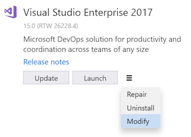
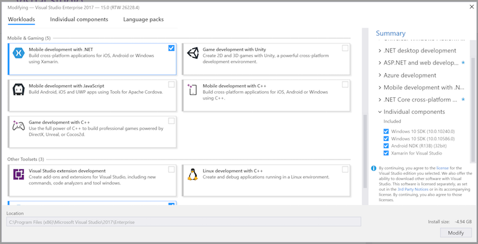

# Setup and install
To build native iOS, Android, and Windows apps from a common C#/.NET code base using Xamarin, you need the following:  
  
-   For working with Windows and Android apps: a Windows development computer with Visual Studio 2017 or 2015 with Xamarin installed. You can also use Visual Studio 2013 by following the instructions for [direct Xamarin install](https://developer.xamarin.com/guides/cross-platform/getting_started/requirements/#install) (xamarin.com). 
  
-   For working with iOS apps: a Mac with macOS Sierra 10.12 or above, with Xcode and Xamarin installed.  
  
 You can set up the Windows and Mac computers at the same time, and while those installers are running you can go through [Learn about mobile development with Xamarin](../cross-platform/learn-about-mobile-development-with-xamarin.md) to read and watch the necessary background material.  
 
If you have issues using Xamarin after doing this setup and install, post your question on [forums.xamarin.com](http://forums.xamarin.com/).
  
> [!NOTE]
>  As of March 31, 2016, all of Xamarin is included with all editions of Visual Studio at no extra cost and does not need a separate license. Xamarin Studio Community for Mac is also free for students, OSS developers, and small teams. Note that for existing installations of Visual Studio that are configured with earlier Xamarin licenses, you must update Xamarin to version 4.0.3.214 or higher. To do this, go to **Tools > Options > Xamarin > Other**, click the **Check Now** link, and download the 4.0.3.214 update. When you restart Visual Studio, go to **Tools > Xamarin Account...** and you should see updated status.  
  
##   Pre-requisites  
  
###  For targeting Windows and Android 
  
1.  Recommended: a physical Windows computer (not a VM) running Windows 8 or later, for best Android emulator performance. (Did we mention that you need a physical computer and not a VM?)  
  
2.  You can use a computer with Windows 7 or earlier, in which case you'll use the Xamarin Player for Android as the emulator. 
    
3. For either configuration, you can always run apps directly on connected physical devices.  
  
### For targeting iOS  
  
1.  A networked Mac or Mac mini with macOS Sierra running macOS 10.12 or later (required for Xcode 8.3).  
  
2.  When using Visual Studio on a Windows (7+) computer as your primary development environment, a networked Mac is necessary only to compile and debug iOS apps, attach to the iOS simulator or tethered devices, and to use the storyboard designer in Visual Studio for designing the user interface. Older Mac models are entirely sufficient for this secondary role.  
  
##   Windows setup (Visual Studio and Xamarin)  
  
> [!TIP]
>  These instructions apply to Visual Studio 2017. For Visual Studio 2015 see [MSDN](setup-and-install.md). To use Xamarin with Visual Studio 2013 (Update 2 is required),  follow the instructions for [direct Xamarin install](https://developer.xamarin.com/guides/cross-platform/getting_started/requirements/#install) (xamarin.com).  
  
1.  [Download and launch the installer for any edition of Visual Studio 2017](https://www.visualstudio.com/downloads/) (Community, Professional, or Enterprise). Visual Studio 2017 Community is the free edition; the Professional and Enterprise editions can be used on a trial basis for 30 days after which you'll need to purchase a license.  
  
    1.  If you already have Visual Studio 2017 installed, run the **Visual Studio Installer** from the **Start** menu.
  
2.  Within the installer, click the **Additional Choices** (three-bars icon) button _next to_ **Launch** then choose **Modify**.:  
  
       
  
3.  Check the following boxes:  
  
    1.  **Mobile & Gaming > Mobile Development with .NET**. This will also automatically select various Android tools under Common Tools and Software Development Kits. This option should also update any existing Xamarin installation.  
  
           
  
    2. (Optional) **Windows > Universal Windows Platform development**. This include options for installing emulators images that will take longer to download; you can always return to the Visual Studio installer to add them later. 
  
4.  Click the **Modify** button and let the process run. Again, this will take some time to complete, during which time you can continue with the Mac setup instructions and go through [Learn about mobile development with Xamarin](../cross-platform/learn-about-mobile-development-with-xamarin.md).  
  
5.  Once installation is complete, launch Visual Studio and sign in with your Microsoft account if prompted (this is the same account you use with Windows).  
      
6.  For testing Android apps, use the [Android SDK Emulator](https://developer.xamarin.com/guides/android/deployment,_testing,_and_metrics/debug-on-emulator/android-sdk-emulator/) if you don't have physical devices. See note below.  
  
 **Note about emulators on Windows computers:** Because CPUs support only one virtualization technology at a time, it's best to have only one in use on a development computer. There are three main virtualizations technologies are Hyper-V (used by the Visual Studio Emulator for Android and the Windows Phone emulator), Virtual Box (used by Genymotion), and Intel HAXM (used by the Android SDK emulator). Because of various issues between Hyper-V and Virtual Box, it's best to use emulators of only one type on any given computer, hence the recommendations above to use Hyper-V on Windows 8 and above computers, and Intel HAXM emulators on Windows 7 and earlier as well as when running Windows on a Mac.  
  
##   Mac setup (Apple ID, Xcode, and Xamarin)  
  
1.  Create a free Apple ID at [https://appleid.apple.com](https://appleid.apple.com/) if you don't have one already. This is necessary for installing and signing into Xcode.  
  
2.  Download and install Xcode from  [https://developer.apple.com/xcode/](https://developer.apple.com/xcode/), and add your Apple ID as described on [Adding Your Account to XCode](https://developer.apple.com/library/content/documentation/IDEs/Conceptual/AppStoreDistributionTutorial/AddingYourAccounttoXcode/AddingYourAccounttoXcode.html#//apple_ref/doc/uid/TP40013839-CH40-SW1) (apple.com).  
  
3.  Download and install Xamarin by following the instructions on [Installing and Configuring Xamarin.iOS](http://developer.xamarin.com/guides/ios/getting_started/installation/mac/) (xamarin.com).  
  
4.  Once you've completed installing Xamarin on both the Windows and Mac computers, follow the instructions on [Connecting to the Mac](http://developer.xamarin.com/guides/ios/getting_started/installation/windows/xamarin-mac-agent/) (xamarin.com) so that you can work with iOS and the Mac from Visual Studio on the Windows computer.  
  
     Note that both computers must be on the same local network.