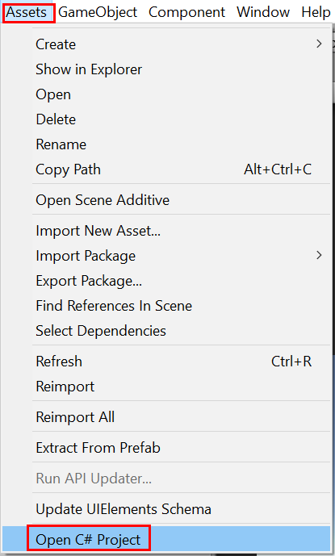
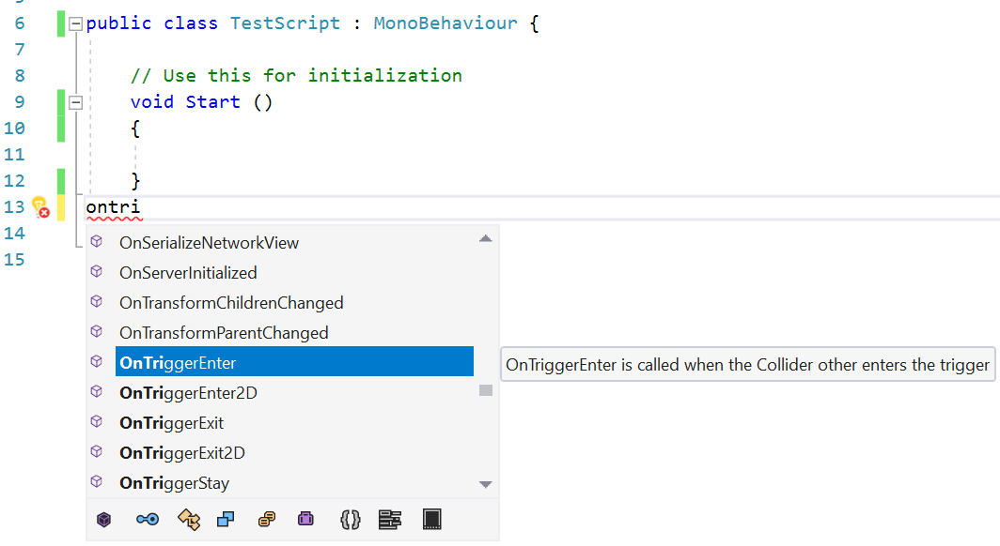

# Use Visual Studio Tools for Unity

In this section, you'll learn how to use Visual Studio Tools for Unity's integration and productivity features, and how to use the Visual Studio debugger for Unity development.

## Open Unity scripts in Visual Studio

Once Visual Studio is [set as the external script editor for Unity](getting-started-with-visual-studio-tools-for-unity.md#configure-unity-for-use-with-visual-studio), opening any script from the Unity editor will automatically launch or switch to Visual Studio with the chosen script open. Just double click a script in your Unity project.

Alternatively, you can open Visual Studio with no script open in the source editor by selecting **Open C# Project** from the **Assets** menu in Unity.

## Unity documentation access

You can access the Unity scripting documentation quickly from Visual Studio. If Visual Studio Tools for Unity doesn't find the API documentation locally, it will try to find it online.

- In Visual Studio, highlight or place the cursor over the Unity API you want to learn about, then press **Ctrl**+**Alt**+**M**, **Ctrl**+**H**

## Intellisense for Unity API Messages

Intellisense code-completion makes it easy to implement Unity API messages in MonoBehaviour scripts, and assists with learning the Unity API. To use IntelliSense for Unity messages:

1. Place the cursor on a new line inside the body of a class that derives from `MonoBehaviour`.

2. Begin typing the name of a Unity message, such as `OnTriggerEnter`.

3. Once the letters "**ontri**" have been typed, a list of IntelliSense suggestions appears.

   

4. The selection on the list can be changed in three ways:

    - With the **Up** and **Down** arrow keys.

    - By clicking with the mouse on the desired item.

    - By continuing to type the name of the desired item.

5. IntelliSense can insert the selected Unity message, including any necessary parameters:

    - By pressing **Tab**.

    - By pressing **Enter**.

    - By double-clicking the selected item.

   

## Unity MonoBehavior scripting wizard

You can use the MonoBehavior wizard to view a list of all the Unity API methods and quickly implement an empty definition. This feature, particularly with the **Generate method comments** option enabled, is helpful if you are still learning what's available in the Unity API.

To create empty MonoBehavior method definitions with the MonoBehavior wizard:

1. In Visual Studio, position the cursor where you want the methods to be inserted, then press **Ctrl**+**Shift**+**M** to launch the MonoBehavior wizard.

2. In the **Create script methods** window, mark the checkbox next to the name of each method you want to add.

3. Use the **Framework version** dropdown to select your desired version.

4. By default, the methods are inserted at the position of the cursor. Alternatively, you can choose to insert them after any method that's already implemented in your class by changing the value of the **Insertion point** dropdown to the location you want.

5. If you want the wizard to generate comments for the methods you selected, mark the **Generate method comments** checkbox. These comments are meant to help you understand when the method is called and what its general responsibilities are.

6. Choose the **OK** button to exit the wizard and insert the methods into your code.

   

## Unity Project Explorer

The Unity Project Explorer shows all of your Unity project files and directories in the same way that the Unity Editor does. This is different than navigating your Unity scripts with the normal Visual Studio Solution Explorer, which organizes them into projects and a solution generated by Visual Studio.

- On the main Visual Studio menu, choose **View > Unity Project Explorer**. Keyboard shortcut: **Alt**+**Shift**+**E**

   

## Unity debugging

Visual Studio Tools for Unity lets you debug both editor and game scripts for your Unity project using Visual Studio's powerful debugger.

### Debug in the Unity editor

#### Start debugging

1. Connect Visual Studio to Unity by clicking the **Play** button labeled **Attach to Unity**, or use the keyboard shortcut **F5**.

   

2. Switch to Unity and click the **Play** button to run the game in the editor.

   

3. When the game is running in the Unity editor while connected to Visual Studio, any breakpoints encountered will pause execution of the game and bring up the line of code where the game hit the breakpoint in Visual Studio.

#### Stop debugging

- Click the **Stop** button in Visual Studio, or use the keyboard shortcut **Shift + F5**.

  

To learn more about debugging in Visual Studio, see [First look at the Visual Studio Debugger](../debugger/debugger-feature-tour.md).

#### Attach to Unity and Play

For added convenience, you can change the **Attach to Unity** button to **Attach to Unity and Play** mode.

1. Click the small **down arrow** next to the **Attach to Unity** button.

1. Select **Attach to Unity and Play** from the dropdown menu.

    

The play button becomes labeled **Attach to Unity and Play**. Clicking this button or using the keyboard shortcut **F5** now automatically switches to the Unity editor and runs the game in the editor, in addition to attaching the Visual Studio debugger.

Clicking the **Stop** button in Visual Studio or using the keyboard shortcut **Shift**+**F5** will automatically stop the game in the Unity editor.

### Debug Unity player builds

You can debug development builds of various Unity players with Visual Studio.

#### Enable script debugging in a Unity player

1. In Unity, open the Build Settings by selecting **File > Build Settings**.

2. In the Build Settings window, mark the **Development Build** and **Script Debugging** checkboxes.

   

#### Select a Unity instance to attach the debugger to

- In Visual Studio, on the main menu, choose **Debug > Attach Unity Debugger**.

   

   The **Select Unity Instance** dialog displays some information about each Unity instance that you can connect to.

   

   **Project**

   The name of the Unity project that's running in this instance of Unity.

   **Machine**
   The name of the computer or device that this instance of Unity is running on.

   **Type**
   **Editor** if this instance of Unity is running as part of the Unity Editor; **Player** if this instance of Unity is a stand-alone player.

   **Port**
   The port number of the UDP socket that this instance of Unity is communicating over.

> [!IMPORTANT]
> Because Visual Studio Tools for Unity and the Unity instance are communicating over a UDP network socket, your firewall might ask about it. If this happens, you'll have to authorize the connection so that VSTU and Unity can communicate.

### Debug a DLL in your Unity project

Many Unity developers are writing code components as external DLLs so that the functionality they develop can be easily shared with other projects. Visual Studio Tools for Unity makes it easy to debug code in these DLLs seamlessly with other code in your Unity project.

> [!NOTE]
> At this time, Visual Studio Tools for Unity only supports managed DLLs. It does not support debugging of native code DLLs, such as those written in C++.

Note that the scenario described here assumes that you have the source code—that is, you are developing or re-using your own first-party code, or you have the source code to a third-party library, and plan to deploy it in your Unity project as a DLL. This scenario does not describe debugging a DLL for which you do not have the source code.

#### To debug a managed DLL project used in your Unity project

1. Add your existing DLL project to the Visual Studio solution generated by Visual Studio Tools for Unity. Less commonly, you might be starting a new managed DLL project to contain code components in your Unity project; if that's the case, you can add a new managed DLL project to the Visual Studio solution instead. For more information on adding a new or existing project to a solution, see [How to: Add Projects to a Solution](https://msdn.microsoft.com/library/ff460187.aspx).

   

   In either case, Visual Studio Tools for Unity maintains the project reference, even if it has to regenerate the project and solution files again, so you only need to perform these steps once.

2. Reference the correct Unity framework profile in the DLL project. In Visual Studio, in the DLL project's properties, set the **Target framework** property to the Unity framework version you're using. This is the Unity Base Class Library that matches the API compatibility that your project targets, such as the Unity full, micro, or web base class libraries. This prevents your DLL from calling framework methods that exist in other frameworks or compatibility levels, but which might not exist in the Unity framework version you're using.

> [!NOTE]
> The following is only required if you are using Unity's legacy runtime. If you are using the new Unity runtime, you don't need to use those dedicated 3.5 profiles anymore. Use a .NET 4.x profile compatible with your Unity version.

   

3. Copy the DLL to your Unity project's Asset folder. In Unity, assets are files that are packaged and deployed together with your Unity app so that they can be loaded at run-time. Since DLLs are linked at run time, DLLs must be deployed as assets. To be deployed as an asset, the Unity Editor requires the DLLs to be put inside the Assets folder in your Unity project. There are two ways you can do this:

   - Modify the build settings of your DLL project to include a post-built task that copies the output DLL and PDB files from its output folder to the **Assets** folder of your Unity project.

   - Modify the build settings of your DLL project to set its output folder to be the **Assets** folder of your Unity project. Both DLL and PDB files will be placed in the **Assets** folder.

   The PDB files are needed for debugging because they contain the DLL's debugging symbols, and map the DLL code to its source code form. If you are targeting the legacy runtime, Visual Studio Tools for Unity will use information from the DLL and PDB to create a DLL.MDB file, which is the debug symbol format used by the legacy Unity scripting engine. If you are targeting the new runtime, and using Portable-PDB, Visual Studio Tools for Unity will not try to do any symbol conversion as the new Unity runtime is able to natively consume Portable-PDBs.

   More information about PDB generation can be found [here](https://docs.microsoft.com/visualstudio/debugger/how-to-set-debug-and-release-configurations). If you are targeting the new runtime, please make sure that "Debugging Information" is set to "Portable", in order to properly generate Portable-PDB. If you are targeting the legacy runtime, you need to use "Full".

4. Debug your code. You can now debug your DLL source code together with your Unity project's source code, and use all the debugging features you are used to, such as breakpoints and stepping through code.

## Keyboard shortcuts

You can quickly access the Unity Tools for Visual Studio functionality by using their keyboard shortcuts. Here's a summary of the shortcuts that are available.

|Command|Shortcut|Shortcut command name|
|-------------|--------------|---------------------------|
|Open the MonoBehavior Wizard|**Ctrl**+**Shift**+**M**|**EditorContextMenus.CodeWindow.ImplementMonoBehaviours**|
|Open the Unity Project Explorer|**Alt**+**Shift**+**E**|**View.UnityProjectExplorer**|
|Access Unity documentation|**Ctrl**+**Alt**+**M, Ctrl**+**H**|**Help.UnityAPIReference**|
|Attach to Unity debugger (player or editor)|**_no default_**|**Debug.AttachUnityDebugger**|

You can change the shortcut key combinations if you don't like the default. For information on how to change it, see [Identify and customize keyboard shortcuts in Visual Studio](../ide/identifying-and-customizing-keyboard-shortcuts-in-visual-studio.md).
