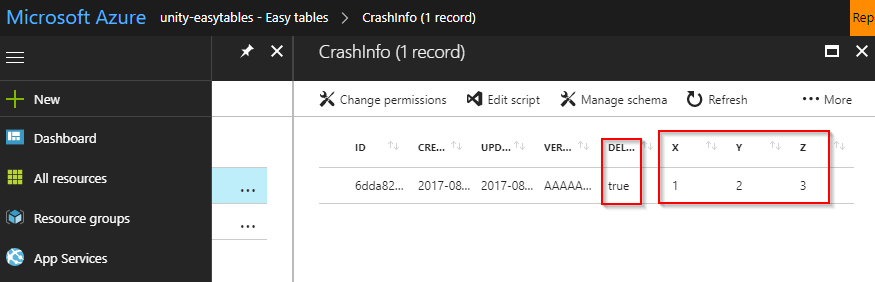

# Test the client connection

Now that the AzureMobileServiceClient singleton is created, it's time to test the client connection.

## Create the TestClientConnection script

1. Inside the **Scripts** folder in Unity, create a new C# script called **TestClientConnection**.

2. Open the script in Visual Studio, delete any template code, and add the following:

  ```csharp
  using System.Collections.Generic;
  using UnityEngine;
  using System.Threading.Tasks;
  using System;
  using System.Linq;
  using Microsoft.WindowsAzure.MobileServices;

  public class TestClientConnection : MonoBehaviour
  {
      void Start()
      {
          Task.Run(TestTableConnection);
      }

      private async Task TestTableConnection()
      {
          var table = AzureMobileServiceClient.Client.GetTable<CrashInfo>();

          Debug.Log("Testing ToListAsync...");
          await TestToListAsync(table);

          Debug.Log("Testing InsertAsync...");
          await TestInsertAsync(table);

          Debug.Log("Testing DeleteAsync...");
          await TestDeleteAsync(table);

          Debug.Log("All testing complete.");
      }

      private async Task TestInsertAsync(IMobileServiceTable<CrashInfo> table)
      {
          try
          {
              var allEntries = await TestToListAsync(table);
              var initialCount = allEntries.Count();

              await table.InsertAsync(new CrashInfo { X = 1, Y = 2, Z = 3 });

              allEntries = await TestToListAsync(table);
              var newCount = allEntries.Count();

              Debug.Assert(newCount == initialCount + 1, "InsertAsync failed!");
          }
          catch (Exception)
          {
              throw;
          }
      }

      private async Task<List<CrashInfo>> TestToListAsync(IMobileServiceTable<CrashInfo> table)
      {
          try
          {
              var allEntries = await table.ToListAsync();
              Debug.Assert(allEntries != null, "ToListAsync failed!");
              return allEntries;
          }
          catch (Exception)
          {

              throw;
          }
      }

      private async Task TestDeleteAsync(IMobileServiceTable<CrashInfo> table)
      {
          var allEntries = await TestToListAsync(table);

          foreach (var item in allEntries)
          {
              try
              {
                  await table.DeleteAsync(item);
              }
              catch (Exception)
              {
                  throw;
              }
          }

          allEntries = await TestToListAsync(table);

          Debug.Assert(allEntries.Count() == 0, "DeleteAsync failed!");
      }
  }
  ```

3. In the Unity **GameObject** menu, select **GameObject > Create Empty** to create an empty GameObject in the Unity scene. Rename it **TestClientConnection**.

4. **Drag** the TestClientConnection script from the Unity **Project** window onto the TestClientConnection GameObject in the **Hierarchy** window.

5. In the Unity menu, select **File > Save Scene as...**. Name the scene **Client Connection Test** and click **Save**.

5. Click the **Play** button in Unity and observe the Console window. Confirm that none of the assertions have failed.

6. Open the CrashInfo Easy Table on the Azure portal. It should now have an entry with **X,Y,Z** coordinates of **(1, 2, 3)** and a value of **true** for in the **deleted** column. Each time you run the test, a new entry with the same values but a unique ID should be added to the table.

  

## Next step
* [Import the sample game assets](visual-studio-tools-for-unity-azure-game-assets.md).
