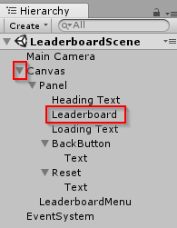

# LeaderboardScene explanation

The LeaderboardScene is composed of only UI. In the scene Hierarchy, **Alt + click** the **expand arrow** next to the Canvas GameObject to expand it and its child GameObjects. Nested below Canvas and Panel is the Leaderboard GameObject with the Leaderboard script attached.



## Leaderboard script

The `Leaderboard` class uses an `async Start` function, which is still called when the script is enabled, just like a typical Unity `Start` function.

`DownloadHighScoresAsync` uses the `OrderBy` and `Take` functions of <a href="https://msdn.microsoft.com/en-us/library/azure/jj554257(v=azure.10).aspx">`IMobileServiceTable`</a> to sort the high scores in the Azure Easy Table and only take the top entries based on the `SizeOfHighScoreList` constant, which are stored in the `highScores` list.

Then an instance of the high score row UI prefab is instantiated for each entry in the list.

``` csharp
using Microsoft.WindowsAzure.MobileServices;
using System.Collections.Generic;
using System.Threading.Tasks;
using UnityEngine;
using System;
using UnityEngine.UI;

public class Leaderboard : MonoBehaviour
{
    [SerializeField]
    private GameObject rowPrefab;

    [SerializeField]
    private Text loadingText;

    public const int SizeOfHighScoreList = 10;
    private static int numberOfAttemptsToLoadData = 3;
    private static IMobileServiceTable<HighScoreInfo> highScoreTable_UseProperty;

    public static IMobileServiceTable<HighScoreInfo> HighScoreTable
    {
        get
        {
            if (highScoreTable_UseProperty == null)
            {
                highScoreTable_UseProperty = AzureMobileServiceClient.Client.GetTable<HighScoreInfo>();
            }

            return highScoreTable_UseProperty;
        }
    }

    public static async Task<List<HighScoreInfo>> GetTopHighScoresAsync()
    {
            return await DownloadHighScoresAsync(true);
    }

    private static async Task<List<HighScoreInfo>> DownloadHighScoresAsync(bool onlyTopEntries)
    {
        List<HighScoreInfo> highScoreList;

        Debug.Log("Downloading high score data from Azure...");

        for (int i = 0; i < numberOfAttemptsToLoadData; i++)
        {
            try
            {
                Debug.Log("Connecting... attempt " + (i + 1));

                if (onlyTopEntries)
                {
                    highScoreList = await HighScoreTable
                        .OrderBy(item => item.Time)
                        .Take(SizeOfHighScoreList)
                        .ToListAsync();
                }
                else
                {
                    highScoreList = await HighScoreTable.ToListAsync();
                }

                Debug.Log("Done downloading high score data.");
                return highScoreList;
            }
            catch (Exception e)
            {
                Debug.Log("Error connecting: " + e.Message);
            }

            if (i == numberOfAttemptsToLoadData - 1)
                Debug.Log("Connection failed. Check logs, try again later.");
            else
                await Task.Delay(500);
        }

        // If we can't successfully download a list from the server,
        // just make a new one to fail more gracefully.
        return highScoreList = new List<HighScoreInfo>();
    }

    private async void Start()
    {
        var highScores = await GetTopHighScoresAsync();

        if (highScores.Count == 0)
        {
            ShowEmptyLeaderboardMessage();
        }
        else
        {
            loadingText.gameObject.SetActive(false);

            foreach (var item in highScores)
            {
                var row = Instantiate(rowPrefab, this.transform).GetComponent<LeaderboardRow>();
                row.HighScoreInfo = item;
            }
        }
    }

    private void ShowEmptyLeaderboardMessage()
    {
        loadingText.text = "The leaderboard is empty!";
    }

    public static async Task DeleteAllEntriesAsync()
    {
       Debug.Log("Deleting leaderboard data...");

        var fullHighScoreList = await DownloadHighScoresAsync(false);

        foreach (var item in fullHighScoreList)
        {
            try
            {
                await HighScoreTable.DeleteAsync(item);
            }
            catch (Exception e)
            {
                Debug.Log("Error deleting leaderboard data: " + e.Message);
            }
        }
    }
}
```