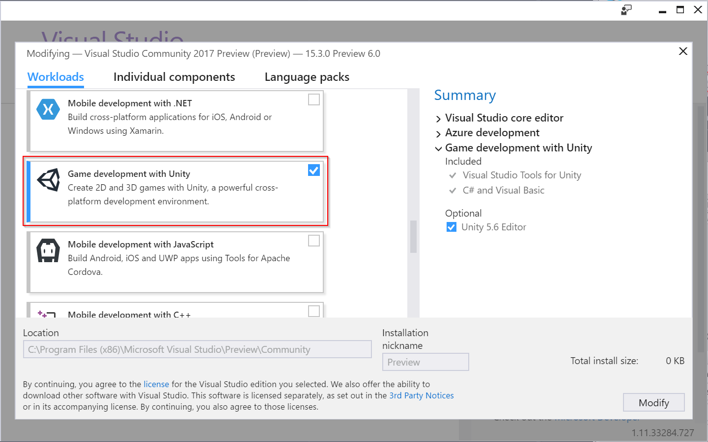
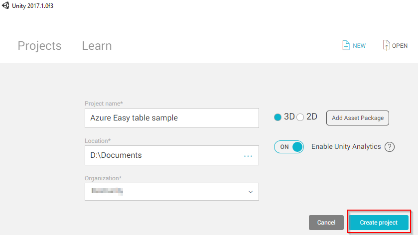
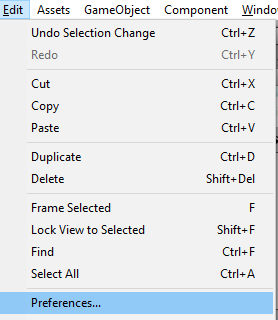
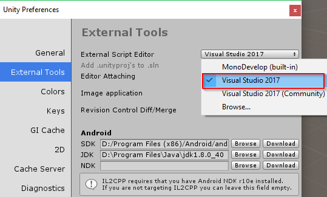
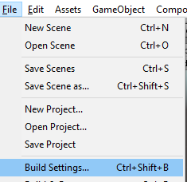
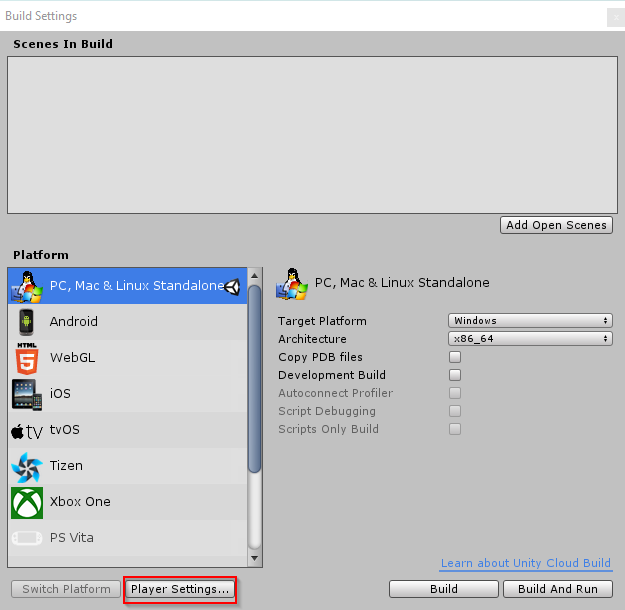
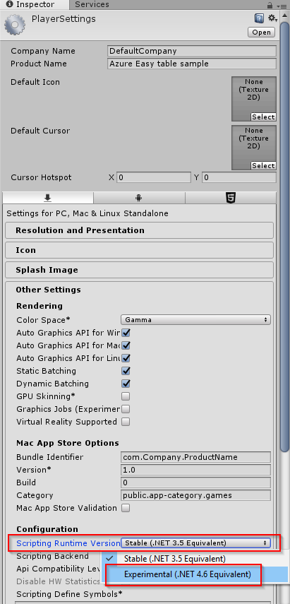
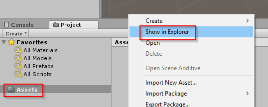
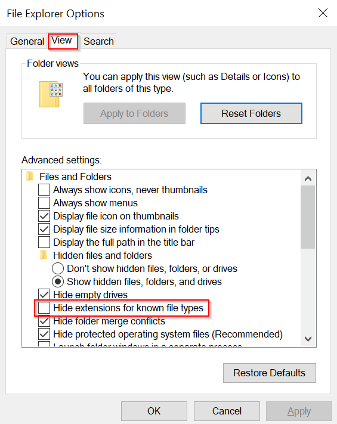
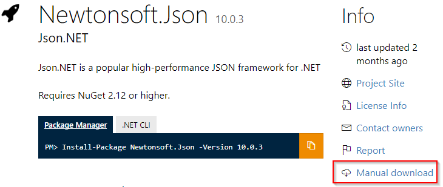

# Prepare the development environment

There are some prerequisites to using the Azure Mobile Client SDK in Unity.

## Download and install Unity 2017

Unity 2017.1 or above is required. All Unity plans work with the walkthrough, including the free Personal plan. Download Unity from https://store.unity.com/.

## Download and install Visual Studio 2017

The walkthrough requires Visual Studio 2017 15.3 and above, with the game development with Unity workload. All editions of Visual Studio 2017 work with the walkthrough, including the free Community edition.

1. Download Visual Studio 2017 at https://www.visualstudio.com/.

2. Install Visual Studio 2017 and ensure that the **Game development with Unity** workload is enabled.

 

 > [!NOTE]
 > If Visual Studio 2017 is already installed, you can view and modify workloads by running the Visual Studio Installer.

## Create a new 3D Unity project

Launch Unity and create a new 3D project.



## Set the script editor to Visual Studio Preview 2017

It's possible that you already have Visual Studio 2017 set as Unity's external script editor, but it's important to ensure the 15.3 Preview version is selected.

1. From the Unity **Edit** menu, choose **Edit > Preferences...**.

  

2. When the Unity Preferences window pops up, select the **External Tools** tab on the left side.

3. In the **External Script Editor** dropdown menu, select **Visual Studio 2017**.

  

## Change the Unity scripting runtime to .NET 4.6
The walkthrough requires .NET 4.6 in order to use the Azure Mobile Client SDK and its dependencies.

1. From the Unity **File** menu, choose **File > Build Settings...**.

  

2. Click the **Player Settings...** button.

  

3. The Player Settings opens in the Unity Inspector window. Under the **Configuration** heading, click the **Scripting Runtime Version** dropdown and select **Experimental (.NET 4.6 Equivalent)**. This will prompt a dialog asking to restart Unity. Select **Restart**.

  

## Add a reference to System.Net.Http.dll

The Unity .NET 4.6 equivalent scripting runtime allows use of the System.Net.Http package, which is required by the Azure Mobile Client SDK. The DLL file is included in Unity, however a reference must be added to use it.

1. In the Unity editor Project window, **right click** the **Assets** folder and select **Show in Explorer**.

  

2. In the Explorer window that pops up, double click the **Assets** directory to open it.

3. Inside the Assets directory, **right click** and select **New > Text Document**.

4. Open the new text document in a text editor and add the line: `-r:System.Net.Http.dll`

5. Save the document and close it.

4. Rename the new text document to "**mcs.rsp**" and be sure to delete the .txt file extension.

  * If you have file extensions hidden, you will need to change your folder view options to show them.
  * Open the Start menu and type "folder options" to search. Select "**File Explorer Options**".
  * Select the **View** tab and in the advanced settings ensure "**Hide extensions for known file types**" is unchecked.

    

Upon completing these steps you should have a file named **mcs.rsp** with the line `r:System.Net.Http.dll` in your Unity project's root **Assets** directory.

>[!NOTE]
> The reference functionality requires Visual Studio Tools for Unity 3.3 and above, which is included in the Visual Studio 15.3+ Unity workload. If this step does not work for you, ensure that you have the correct version of VSTU installed.

## Add the Newtonsoft.Json NuGet package to your project

The Azure Mobile Client SDK requires the Newtonsoft.Json package. Unfortunately, Unity does not support NuGet. If you open a Unity project in Visual Studio and add a package with NuGet, Unity will erase it the next time you open the project in the Unity editor. However, packages from NuGet can be manually added to a Unity project.

1. Create a new folder in your Unity project's Assets directory called "**NuGet Packages**". This is for organization only.

2. Go to https://www.nuget.org/packages/Newtonsoft.Json/ and click the **Manual Download** button. Download the .nupkg file.

  

3. Locate the newly downloaded file and change the file extension from .nupkg to **.zip**. This should allow you to view and extract the included files like any other zip file.

4. Open or extract the zip directory and browse to **\lib\net45**.

5. Copy the **Newtonsoft.Json.dll** file to your Unity project's **Assets\NuGet Packages** directory.

## Add the Azure Mobile Client SDK NuGet package to your project

The Azure Mobile Client SDK contains functions for easily reading and writing to Azure Easy Tables.

1. Go to https://www.nuget.org/packages/Microsoft.Azure.Mobile.Client/ and click the **Manual Download** button. Download the .nupkg file.

2. Locate the newly downloaded file and change the file extension from .nupkg to **.zip**. This should allow you to view and extract the included files like any other zip file.

3. Open or extract the zip directory and browse to **\lib\net45**.

4. Copy the **Microsoft.Azure.Mobile.Client.dll** file to your Unity project's **Assets\NuGet Packages** directory.

>[!WARNING]
> After completing these steps, be sure to restart Unity and Visual Studio or InteliSense may not recognize the newly added packages.

## Conclusion

After completing these steps, your Unity project should be setup to use the Azure Mobile Client SDK. You can test your development environment by creating a new C# script in your Unity project, opening it in Visual Studio, and typing the following using statements at the top:
```
using System.Net.Http;
using Newtonsoft.Json;
using Microsoft.WindowsAzure.MobileServices;
```

If InteliSense detects these using statements, the setup was completed properly. If there are any errors or InteliSense does not recognize these packages, try restarting Unity and Visual Studio. If it still doesn't work, revisit the steps above.

## Next step

* [Create data model classes](visual-studio-tools-for-unity-azure-data.md)
