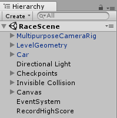
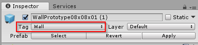

# RaceScene explanation

The RaceScene uses Unity [Standard Assets](https://www.assetstore.unity3d.com/en/#!/content/32351) to compose the basic racing gameplay and level. In this section, relevant GameObjects and their scripts will be explained in the order they are listed in the RaceScene Hierarcy, as displayed in the screenshot below.



## MultipurposeCameraRig

**MultipurposeCameraRig** is from the **Cameras** Standard Assets package. Its Inspector properties have been tuned to follow the Car at an appropriate speed.

## LevelGeometry

The LevelGeometry prefab is an empty GameObject used for organization. Its child GameObjects compose the playable space. The floors, walls, ramps, and obstacles are all built from prefabs in the **Prototyping** Standard Assets package.

**One important note** is that in order for an object to be tested for crashes that are recorded in Azure, it must have the **Wall** tag applied.



## Car

The **Car** prefab is from the **Vehicles** Standard Assets package. The only modification is that the **RecordCrashInfo** script component is added.

### RecordCrashInfo

This script checks for crashes in `OnCollisionEnter` and records them to a list. `crashRecordingCooldown` and `crashRecordingMinVelocity` limit what the game considers a crash in order to keep a relevant data set.

When the `RaceFinished` event is raised, `UploadNewCrashDataAsync` sends each crash in the list to the CrashInfo Easy Table on Azure.

```Csharp
using System.Collections;
using System.Collections.Generic;
using System.Threading.Tasks;
using UnityEngine;

public class RecordCrashInfo : MonoBehaviour
{
    [Tooltip("Time in seconds after a crash before a new crash can be recorded.")]
    [SerializeField]
    private float crashRecordingCooldown = 1;

    [Tooltip("How fast car must be traveling before crash can be recorded.")]
    [SerializeField]
    private float crashRecordingMinVelocity = 8;

    [SerializeField]
    private Rigidbody carRigidbody;

    [SerializeField]
    private GameObject crashMarkerPrefab;

    [Tooltip("If turned on, crash markers spawn when the player crashes.")]
    [SerializeField]
    private bool spawnDebugMarkers = false;

    private bool isOnCooldown = false;
    private bool meetsMinVelocity = false;
    private bool isRaceFinished = false;

    private List<CrashInfo> newCrashes = new List<CrashInfo>();

    private void LateUpdate()
    {
        // We have to update this in LateUpdate as opposed to checking in OnCollisionEnter.
        // The car's velocity has already decreased from crashing by the time
        // OnCollisionEnter gets called.

        meetsMinVelocity = carRigidbody.velocity.magnitude >= crashRecordingMinVelocity;
    }

    private void OnCollisionEnter(Collision collision)
    {
        if (!isRaceFinished && collision.gameObject.tag == "Wall" && !isOnCooldown && meetsMinVelocity)
        {
            Debug.Log("Collided with wall!");

            newCrashes.Add(new CrashInfo
            {
                X = collision.transform.position.x,
                Y = collision.transform.position.y,
                Z = collision.transform.position.z
            });

            if (spawnDebugMarkers && Debug.isDebugBuild)
                Instantiate(crashMarkerPrefab, collision.transform.position, Quaternion.identity);

            isOnCooldown = true;
            StartCoroutine(Cooldown());
        }  
    }

    private IEnumerator Cooldown()
    {
        yield return new WaitForSeconds(crashRecordingCooldown);

        isOnCooldown = false;
    }

    private void OnRaceFinished()
    {
        Task.Run(UploadNewCrashDataAsync);
    }

    private async Task UploadNewCrashDataAsync()
    {
        var crashTable = AzureMobileServiceClient.Client.GetTable<CrashInfo>();

        try
        {
            Debug.Log("Uploading crash data to Azure...");

            foreach (var item in newCrashes)
            {
                await crashTable.InsertAsync(item);
            }
            Debug.Log("Finished uploading crash data.");
        }
        catch (System.Exception e)
        {
            Debug.Log("Error uploading crash data: " + e.Message);
        }

    }

    private void OnEnable()
    {
        Checkpoint.RaceFinished += OnRaceFinished;
    }

    private void OnDisable()
    {
        Checkpoint.RaceFinished -= OnRaceFinished;
    }

}
```

## Checkpoints

The level has four GameObjects with the **Checkpoint** script component. The checkpoints ensure the player cannot finish the race by traveling the wrong way down the track. They also detect when the player finishes the race. This is where the `RaceFinished` event is invoked.

## Invisible Collision

Standard primitive cubes with their MeshRenderer components disabled are used as invisible collision to keep the player inbounds. Additionally, the **Bouncy** physics material is applied to ensure flying cars bounce off the invisible walls in a satisfying way, and to prevent the player from hitting an invisible wall, sliding down it, and landing on top of a visible wall.

## RecordHighScore

This script checks to see if the player has earned a new high score. If they have, it displays the `enterNamePopup`, which allows the player to enter their name and click **Submit**.

Once a player name is submitted, `UploadNewHighScoreAsync` is called and the new high score is sent to the HighScoreInfo Easy Table on Azure.

```csharp
using System.Collections;
using System.Collections.Generic;
using Microsoft.WindowsAzure.MobileServices;
using UnityEngine;
using System.Threading.Tasks;
using System;
using System.Linq;
using UnityEngine.UI;

public class RecordHighScore : MonoBehaviour
{
    [SerializeField]
    private InputField nameInputField;

    [SerializeField]
    private CanvasGroup enterNamePopup;

    private List<HighScoreInfo> highScores;
    private string playerName = string.Empty;

    private async void Start()
    {
        ShowEnterNamePopup(false);
        highScores = await Leaderboard.GetTopHighScoresAsync();
    }

    private void ShowEnterNamePopup(bool shouldShow)
    {
        enterNamePopup.alpha = shouldShow ? 1 : 0;
        enterNamePopup.interactable = shouldShow;
    }

    public void SubmitButtonClicked()
    {
        playerName = nameInputField.text;
    }

    private async void OnAfterMostRecentScoreSet(float newScore)
    {
        bool isNewHighScore = CheckForNewHighScore(newScore);

        if (isNewHighScore)
        {
            Debug.Log("New High Score!");
            await GetPlayerNameAsync();
            await UploadNewHighScoreAsync(newScore);
        }
        else
        {
            Debug.Log("No new high score.");
        }
    }

    private async Task GetPlayerNameAsync()
    {
        // Wait a bit before showing the popup.
        // This just helps the player experience feel
        // less jarring.
        await Task.Delay(2000);
        ShowEnterNamePopup(true);

        // Wait until the player enters a name and clicks submit.
        // OnSubmitButtonClicked will set the playerName.
        while (playerName == string.Empty)
        {
            await Task.Delay(100);
        }

        ShowEnterNamePopup(false);
    }

    private bool CheckForNewHighScore(float newScore)
    {
        Debug.Log("Checking for a new high score...");

        bool isHighScoreListFull = highScores.Count >= Leaderboard.SizeOfHighScoreList;
        var lowerScores = highScores.Where(x => x.Time > newScore);

        return lowerScores.Count() > 0 || !isHighScoreListFull;
    }

    private async Task UploadNewHighScoreAsync(float newScore)
    {
        var newHighScoreInfo = new HighScoreInfo { Name = playerName, Time = newScore };

        try
        {
            Debug.Log("Uploading high score data to Azure...");

            await Leaderboard.HighScoreTable.InsertAsync(newHighScoreInfo);

            Debug.Log("Finished uploading high score data.");
        }
        catch (System.Exception e)
        {
            Debug.Log("Error uploading high score data: " + e.Message);
        }
    }

    private void OnEnable()
    {
        LapTimer.AfterMostRecentScoreSet += OnAfterMostRecentScoreSet;
    }

    private void OnDisable()
    {
        LapTimer.AfterMostRecentScoreSet -= OnAfterMostRecentScoreSet;
    }

}
```

## Next step

* [HeatmapScene explanation](visual-studio-tools-for-unity-azure-heatmapscene.md).
