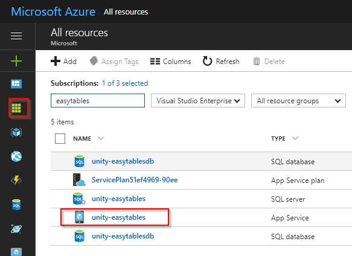
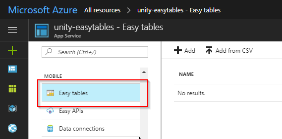
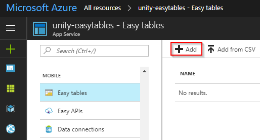
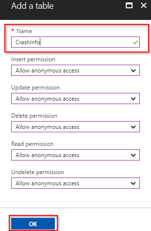
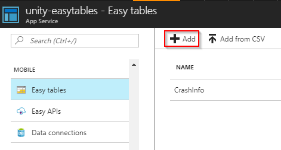
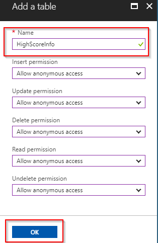

# Create Easy Tables

Now that you have a Mobile App on Azure with Easy Tables initialized, it's time to build the tables that will keep track of data sent from a Unity game.

## Setup the crash heatmap table

1. In the Azure portal, click All resources and then select the Mobile App that you configured for Easy Tables in the previous steps.

  

2. Scroll down to the **MOBILE** heading and select **Easy Tables**. There should no longer be any notice about initializing your app for Easy Tables.  

  

3. Click the **Add** button.

  

4. Name the table "**CrashInfo**" and click **OK**. Leave the rest of the options with their default settings.

  > [!WARNING]
  > This name must match the name of the data model class created later in the walkthrough.

  

5. A notification will announce when the new table has been created.

> [!NOTE]
> With Easy Tables, the table schema is actually dynamically created as data is added. This means appropriate data columns do not have to be manually set up during this step.

## Setup the leaderboard table

1. Go back to the Easy Tables blade and click **Add** to add a second table.

  

2. Name the new table "**HighScoreInfo**" and click **OK**. Leave the rest of the options at their default settings.

  > [!WARNING]
  > This name must match the name of the data model class created later in the walkthrough.

  

3. A notification will announce when the new table has been created.

## Next step

* [Prepare the development environment](visual-studio-tools-for-unity-azure-prepare.md)
