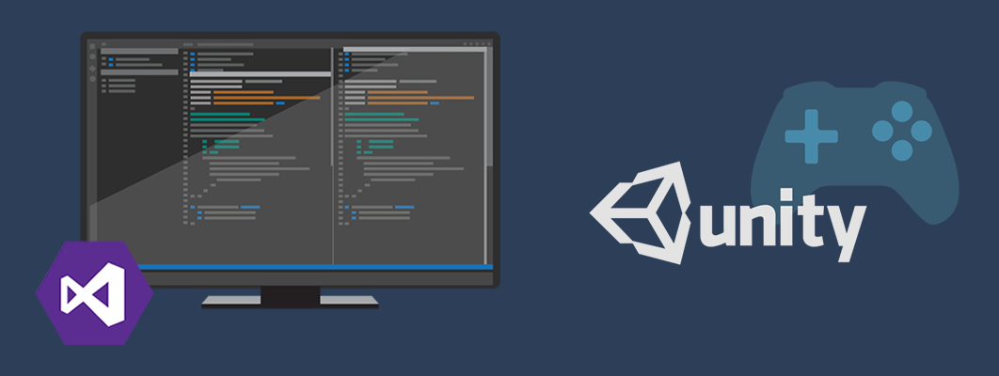
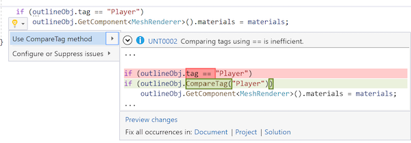

# Visual Studio Tools for Unity

Visual Studio Tools for Unity is a free Visual Studio extension that turns Visual Studio into a powerful tool for developing cross-platform games and apps with Unity.

While the Unity editor is great for putting your game world together, you can't write your code in it. With Visual Studio Tools for Unity, you can use the familiar code editing, debugging and productivity features of Visual Studio to create editor and game scripts for your Unity project using C#, and you can debug them using Visual Studio's powerful debugging capabilities.

But Visual Studio Tools for Unity is more than that; it also has deep integration with Unity editor so that you'll spend less time switching back and forth to do simple tasks, provides Unity-specific productivity enhancements, and puts the Unity documentation at your fingertips.

## Overview

Visit the [Build Unity Games with Visual Studio](https://visualstudio.microsoft.com/vs/unity-tools/) page for an overview of the advantages of using Visual Studio for Unity development, or continue below to dig deeper into the key features of Visual Studio Tools for Unity:

### Compatible with Visual Studio Community and bundled with Unity

[Visual Studio Community](https://visualstudio.microsoft.com/) is available for free, and is bundled with Unity installs starting with Unity 2018.1. See the Visual Studio Tools for Unity [getting started documentation](getting-started-with-visual-studio-tools-for-unity.md) for more information.

### IntelliSense for Unity messages

IntelliSense code-completion makes it fast and easy to [implement Unity API messages](using-visual-studio-tools-for-unity.md#intellisense-for-unity-api-messages) like `OnCollisionEnter`, including their parameters.

### Superior debugging

Visual Studio Tools for Unity supports the robust [debugging](using-visual-studio-tools-for-unity.md#unity-debugging) features that you expect from Visual Studio:

* Set breakpoints, including conditional breakpoints.
* Evaluate complex expressions in the Watch window.
* Inspect and modify the value of variables and arguments.
* Drill down into complex objects and data structures.

### Roslyn diagnostics and quick-fixes for Unity

Write better code that captures the best practices with Visual Studio's deep understanding of Unity projects.

### Visual Studio for Mac Tools for Unity

Visual Studio for Mac also supports Unity projects. For more information, see the [Visual Studio for Mac Tools for Unity documentation](/visualstudio/mac/unity-tools).

## Next steps

* [Get started with Visual Studio Tools for Unity](getting-started-with-visual-studio-tools-for-unity.md)
