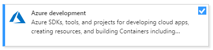

# Work with data in Visual Studio

In Visual Studio, you can create applications that connect to data in virtually any database product or service, in any format, anywhere—on a local machine, on a local area network, or in a public, private, or hybrid cloud.

For applications in JavaScript, Python, PHP, Ruby, or C++, you connect to data like you do anything else, by obtaining libraries and writing code. For .NET applications, Visual Studio provides tools that you can use to explore data sources, create object models to store and manipulate data in memory, and bind data to the user interface. Microsoft Azure provides SDKs for .NET, Java, Node.js, PHP, Python, Ruby, and mobile apps, and tools in Visual Studio for connecting to Azure Storage.

::: moniker range="vs-2019"
The following lists show just a few of the many database and storage systems that can be used from Visual Studio. The [Microsoft Azure](https://azure.microsoft.com/) offerings are data services that include all provisioning and administration of the underlying data store. The **Azure development** workload in [Visual Studio](https://visualstudio.microsoft.com/downloads/?cid=learn-onpage-download-cta) enables you to work with Azure data stores directly from Visual Studio.

Most of the other SQL and NoSQL database products that are listed here can be hosted on a local machine, on a local network, or in Microsoft Azure on a virtual machine. If you host the database in a Microsoft Azure virtual machine, you're responsible for managing the database itself.

**Microsoft Azure**

- SQL Database
- Azure Cosmos DB
- Storage (blobs, tables, queues, files)
- SQL Data Warehouse
- SQL Server Stretch Database
- StorSimple
- And more...

**SQL**

- SQL Server 2005-2016 (includes Express and LocalDB)
- Firebird
- MariaDB
- MySQL
- Oracle
- PostgreSQL
- SQLite
- And more...

**NoSQL**

- Apache Cassandra
- CouchDB
- MongoDB
- NDatabase
- OrientDB|
- RavenDB
- VelocityDB
- And more...

Many database vendors and third parties support Visual Studio integration by NuGet packages. You can explore the offerings on nuget.org or through the NuGet Package Manager in Visual Studio (**Tools** > **NuGet Package Manager** > **Manage NuGet Packages for Solution**). Other database products integrate with Visual Studio as an extension. You can browse these offerings in the [Visual Studio Marketplace](https://marketplace.visualstudio.com/) or by navigating to **Extensions** > **Manage Extensions** and then selecting **Online** in the left pane of the dialog box. For more information, see [Compatible database systems for Visual Studio](../data-tools/installing-database-systems-tools-and-samples.md).

::: moniker-end

:::moniker range=">=vs-2022"

By using [Visual Studio Connected Services](../azure/overview-connected-services.md), you can simplify the process of adding database support to your projects.

For SQL Server scenarios we support through Connected Services:

- SQL Server on-premises. In this scenario, you install SQL Server somewhere on your local network and connect to it.
- SQL Server on your local machine. In this scenario, you install SQL Server on your local machine and connect to it.
- SQL Server Express LocalDB. You don't install anything other than Visual Studio; you just connect to it.
- SQL Server Express LocalDB on Container. LocalDB as in the previous option, but inside a local container.
- Azure SQL Server DB. Connect to the service running live in Azure.

For other data-related technologies, Visual Studio 2022 supports the following:

- Azure Storage (both local and remote)
- Azure Cosmos DB (both local and remote)
- SQLite (local-only option)
- PostgreSQL on container (local-only option)
- MongoDB on container (local-only option)

Apart from Connected Services, the following lists show just a few of the many database and storage systems that can be used from Visual Studio. The [Microsoft Azure](https://azure.microsoft.com/) offerings are data services that include all provisioning and administration of the underlying data store. The **Azure development** workload in [Visual Studio](https://visualstudio.microsoft.com/downloads/?cid=learn-onpage-download-cta) enables you to work with Azure data stores directly from Visual Studio.

Most of the other SQL and NoSQL database products that are listed here can be hosted on a local machine, on a local network, or in Microsoft Azure on a virtual machine. If you host the database in a Microsoft Azure virtual machine, you're responsible for managing the database itself.

**Microsoft Azure**

- SQL Data Warehouse
- SQL Server Stretch Database
- StorSimple
- And more...

**SQL**

- Firebird
- MariaDB
- MySQL
- Oracle
- And more...

**NoSQL**

- Apache Cassandra
- CouchDB
- MongoDB
- NDatabase
- OrientDB|
- RavenDB
- VelocityDB
- And more...

:::moniker-end

> [!NOTE]
> Extended support for SQL Server 2005 ended on April 12, 2016. There is no guarantee that data tools in Visual Studio 2015 and later will continue to work with SQL Server 2005.

## .NET languages

The data access technology described in the Visual Studio documentation uses ADO.NET. ADO.NET is a legacy data access framework and is not recommended for modern data applications. We recommend targeting .NET Core or .NET 5 and later and using [Entity Framework Core](/ef/) for data access development.

ADO.NET is a set of classes that defines an interface for accessing any kind of data source, both relational and non-relational. Visual Studio has several tools and designers that work with ADO.NET to help you connect to databases, manipulate the data, and present the data to the user. The documentation in this section describes how to use those tools. You can also program directly against the ADO.NET command objects. For more information about calling the ADO.NET APIs directly, see [ADO.NET](/dotnet/framework/data/adonet/index).

For data-access documentation related to ASP.NET, see [Working with Data](https://www.asp.net/web-forms/overview/presenting-and-managing-data) on the ASP.NET site. For a tutorial on using Entity Framework with ASP.NET Model-View-Controller (MVC), see [Getting Started with Entity Framework 6 Code First using MVC 5](/aspnet/mvc/overview/getting-started/getting-started-with-ef-using-mvc/creating-an-entity-framework-data-model-for-an-asp-net-mvc-application).

Universal Windows Platform (UWP) apps in C# or Visual Basic can use the Microsoft Azure SDK for .NET to access Azure Storage and other Azure services. The Windows.Web.HttpClient class enables communication with any RESTful service. For more information, see [How to connect to an HTTP server using Windows.Web.Http](/previous-versions/windows/apps/dn469430(v=win.10)).

For data storage on the local machine, the recommended approach is to use SQLite, which runs in the same process as the app. If an object-relational mapping (ORM) layer is required, you can use Entity Framework. For more information, see [Data access](/windows/uwp/data-access/index).

If you are connecting to Azure services, be sure to download the latest [Azure SDK tools](https://azure.microsoft.com/downloads/).

### Data providers

For a database to be consumable in ADO.NET, it must have a custom *ADO.NET data provider* or else must expose an ODBC or OLE DB interface. Microsoft provides a [list of ADO.NET data providers](/dotnet/framework/data/adonet/data-providers) for SQL Server products, as well as ODBC and OLE DB providers.

> [!NOTE]
> If you're using Visual Studio to connect to databases using OLEDB or ODBC data providers, you will need to be aware that versions of Visual Studio prior to Visual Studio 2022 are all 32-bit processes. This means some of the data tools in Visual Studio will only be able to connect to OLEDB or ODBC databases using 32-bit data providers. This includes the Microsoft Access 32-bit OLEDB data provider as well as other third-party 32-bit providers.
>
> If you're using Visual Studio 2022 to connect to databases, you will need to be aware that Visual Studio 2022 is a 64-bit process. This means some of the data tools in Visual Studio will not be able to connect to OLEDB or ODBC databases using 32-bit data providers.
>
> If you need to maintain 32-bit applications that connect to OLEDB or ODBC databases, you will still be able to build and run the application with Visual Studio 2022. However, if you need to use any of the Visual Studio Data Tools such as Server Explorer, Data Source Wizard, or the DataSet Designer, you will need to use an earlier version of Visual Studio that is still a 32-bit process. The last version of Visual Studio that was a 32-bit process was Visual Studio 2019.
>
> If you plan on converting the project to be a 64-bit process, it's recommended that you use the 64-bit Microsoft Access database Engine, also called Access Connectivity Engine (ACE). Please see [OLE DB Provider for Jet and ODBC driver are 32-bit versions only](/office/troubleshoot/access/jet-odbc-driver-available-32-bit-version) for more information.

### Data modeling

In .NET, you have three choices for modeling and manipulating data in memory after you have retrieved it from a data source:

- [Entity Framework](../data-tools/entity-data-model-tools-in-visual-studio.md): The preferred Microsoft ORM technology. You can use it to program against relational data as first-class .NET objects. For new applications, it should be the default first choice when a model is required. It requires custom support from the underlying ADO.NET provider.

- [LINQ to SQL](../data-tools/linq-to-sql-tools-in-visual-studio2.md): An earlier-generation object-relational mapper. It works well for less complex scenarios but is no longer in active development.

- [Datasets](../data-tools/dataset-tools-in-visual-studio.md): The oldest of the three modeling technologies. It is designed primarily for rapid development of "forms over data" applications in which you are not processing huge amounts of data or performing complex queries or transformations. A DataSet object consists of DataTable and DataRow objects that logically resemble SQL Database objects much more than .NET objects. For relatively simple applications based on SQL data sources, datasets might still be a good choice.

There is no requirement to use any of these technologies. In some scenarios, especially where performance is critical, you can simply use a DataReader object to read from the database and copy the values that you need into a collection object such as List\<T>.

## Native C++

C++ applications that connect to SQL Server should use the [Microsoft® ODBC Driver 13.1 for SQL Server](/sql/connect/odbc/download-odbc-driver-for-sql-server) in most cases. If the servers are linked, then OLE DB is necessary and for that you use the [SQL Server Native Client](/sql/relational-databases/native-client/sql-server-native-client). You can access other databases by using [ODBC](/sql/odbc/microsoft-open-database-connectivity-odbc?view=sql-server-2017&preserve-view=true) or OLE DB drivers directly. ODBC is the current standard database interface, but most database systems provide custom functionality that can't be accessed through the ODBC interface. OLE DB is a legacy COM data-access technology that is still supported but not recommended for new applications. For more information, see [Data Access in Visual C++](/cpp/data/data-access-in-cpp).

C++ programs that consume REST services can use the [C++ REST SDK](https://github.com/Microsoft/cpprestsdk).

Data modeling&mdash;Visual Studio does not provide an ORM layer for C++. [ODB](https://www.codesynthesis.com/products/odb/) is a popular open-source ORM for C++.

To learn more about connecting to databases from C++ apps, see [Visual Studio data tools for C++](../data-tools/visual-studio-data-tools-for-cpp.md).

## JavaScript

[JavaScript in Visual Studio](../javascript/index.yml) is a first-class language for building cross-platform apps, UWP apps, cloud services, websites, and web apps. You can use Bower, Grunt, Gulp, npm, and NuGet from within Visual Studio to install your favorite JavaScript libraries and database products. Connect to Azure Storage and services by downloading SDKs from the [Azure website](https://azure.microsoft.com/). Edge.js is a library that connects server-side JavaScript (Node.js) to ADO.NET data sources.

## Python

Install [Python support in Visual Studio](../python/overview-of-python-tools-for-visual-studio.md) to create Python applications. The Azure documentation has several tutorials on connecting to data, including the following:

- [Django and SQL Database on Azure](/azure/app-service/app-service-web-get-started-python)
- [Django and MySQL on Azure](/azure/app-service-web/web-sites-python-ptvs-django-mysql)
- Work with [blobs](/azure/storage/blobs/storage-quickstart-blobs-python), [files](/azure/storage/files/storage-python-how-to-use-file-storage), [queues](/azure/storage/queues/storage-quickstart-queues-python), and [tables (Cosmo DB)](/azure/cosmos-db/table-storage-how-to-use-python).

## Related content

[Microsoft Azure Storage](/azure/storage/)&mdash;Describes Azure Storage, and how to create applications by using Azure blobs, tables, queues, and files.

[Azure SQL Database](/azure/sql-database/)&mdash;Describes how to connect to Azure SQL Database, a relational database as a service.

[SQL Server Data Tools](/sql/ssdt/download-sql-server-data-tools-ssdt)&mdash;Describes the tools that simplify design, exploration, testing, and deploying of data-connected applications and databases.

[ADO.NET](/dotnet/framework/data/adonet/index)&mdash;Describes the ADO.NET architecture and how to use the ADO.NET classes to manage application data and interact with data sources and XML.

[ADO.NET Entity Framework](/ef/ef6/)&mdash;Describes how to create data applications that allow developers to program against a conceptual model instead of directly against a relational database.

[WCF Data Services 4.5](/dotnet/framework/data/wcf/index)&mdash;Describes how to use WCF Data Services to deploy data services on the web or an intranet that implement the [Open Data Protocol (OData)](https://www.odata.org/).

[Data in Office Solutions](../vsto/data-in-office-solutions.md)&mdash;Contains links to topics that explain how data works in Office solutions. This includes information about schema-oriented programming, data caching, and server-side data access.

[LINQ (Language Integrated Query)](/dotnet/csharp/linq/)&mdash;Describes the query capabilities built into C# and Visual Basic, and the common model for querying relational databases, XML documents, datasets, and in-memory collections.

[XML Tools in Visual Studio](../xml-tools/xml-tools-in-visual-studio.md)&mdash;Discusses working with XML data, debugging XSLT, .NET XML features, and the architecture of XML Query.

[XML Documents and Data](/dotnet/standard/data/xml/index)&mdash;Provides an overview to a comprehensive and integrated set of classes that work with XML documents and data in .NET.
