# Connect to a database in Visual Studio

The steps in this article show how to connect to a data source in the Visual Studio IDE. The data source can be a local database, online data service, or a database opened from an [`.mdf` file](#open-an-mdf-database-file). You can work directly with your data in Visual Studio. You can execute queries, edit data, create and edit tables and other schema properties, edit stored procedures and functions, triggers, and so on. These functions are independent of the programming language or .NET version you are using.

If you're working with an Access database (`.accdb` file), see [Connect to an Access database in .NET Framework applications](./connect-to-data-in-an-access-database-windows-forms.md).

## Server Explorer and SQL Server Object Explorer

:::moniker range="<=vs-2019"
You can open a connection to a database or service, a LocalDB database opened from an `.mdf` file, and view and edit tables and data rows, by using **Server Explorer** or **SQL Server Object Explorer**. The functionality of these windows overlaps to some extent. The basic differences are:

- Server Explorer

   Installed by default in Visual Studio. Can be used to test connections and view SQL Server databases, any other databases that have an ADO.NET provider installed, and some Azure services. Also shows low-level objects such as system performance counters, event logs, and message queues. If a data source has no ADO.NET provider, it won't show up here, but you can still use it from Visual Studio by connecting programmatically.

- Cloud Explorer

   Install this window manually as a Visual Studio extension from [Visual Studio Marketplace](https://marketplace.visualstudio.com/items?itemName=ms-azuretools.CloudExplorerForVS). Provides specialized functionality for exploring and connecting to Azure services.

- SQL Server Object Explorer

   Installed with SQL Server Data Tools and visible under the **View** menu. If you don't see it there, go to **Programs and Features** in Control Panel, find Visual Studio, and then select **Change** to rerun the installer after selecting the checkbox for SQL Server Data Tools. Use **SQL Server Object Explorer** to view SQL databases (if they have an ADO.NET provider), create new databases, modify schemas, create stored procedures, retrieve connection strings, view the data, and more. SQL databases that have no ADO.NET provider installed won't show up here, but you can still connect to them programmatically.
::: moniker-end
:::moniker range=">=vs-2022"
You can open a connection to a database or service, or a LocalDB database opened from an `.mdf` file, and view and edit tables and data rows, by using **Server Explorer** or **SQL Server Object Explorer**. The functionality of these windows overlaps to some extent. The basic differences are:

- Server Explorer

   Installed by default in Visual Studio. Can be used to test connections and view SQL Server databases, any other databases that have an ADO.NET provider installed, and some Azure services. Also shows low-level objects such as system performance counters, event logs, and message queues. If a data source has no ADO.NET provider, it won't show up here, but you can still use it from Visual Studio by connecting programmatically.

- SQL Server Object Explorer

   Installed with SQL Server Data Tools and visible under the **View** menu. If you don't see it there, go to **Programs and Features** in Control Panel, find Visual Studio, and then select **Change** to rerun the installer after selecting the checkbox for SQL Server Data Tools. Use **SQL Server Object Explorer** to view SQL databases (if they have an ADO.NET provider), create new databases, modify schemas, create stored procedures, retrieve connection strings, view the data, and more. SQL databases that have no ADO.NET provider installed won't show up here, but you can still connect to them programmatically.
::: moniker-end

## Add a connection in Server Explorer

To create a connection to the database, click the **Connect to database** icon in **Server Explorer**, or right-click in **Server Explorer** on the **Data Connections** node and select **Add Connection**. From here, you can open a connection to a LocalDB database opened from an `.mdf` file, connect to a database on another server, a SharePoint service, or an Azure service.

:::moniker range="<=vs-2019"

:::moniker-end
:::moniker range=">=vs-2022"
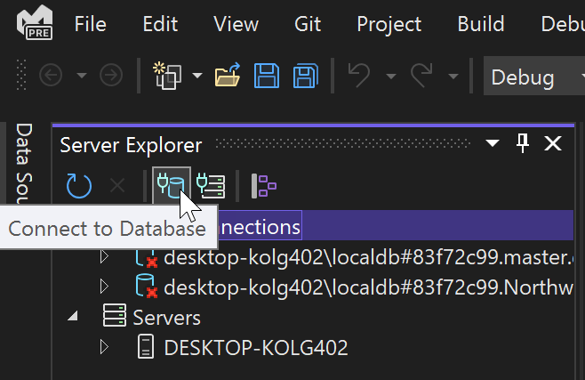
:::moniker-end

This brings up the **Add Connection** dialog box. Here, we have entered the name of the SQL Server LocalDB instance, `(localdb)\MSSqlLocalDB`, which is usually installed with Visual Studio.

If you don't have access to another database, and you don't see LocalDB installed, you can install LocalDB through the Visual Studio Installer, as part of the **Data storage and processing** workload, the **ASP.NET and web development** workload, or as an individual component. See [Modify Visual Studio](../install/modify-visual-studio.md).

:::moniker range="<=vs-2019"

:::moniker-end
:::moniker range=">=vs-2022"
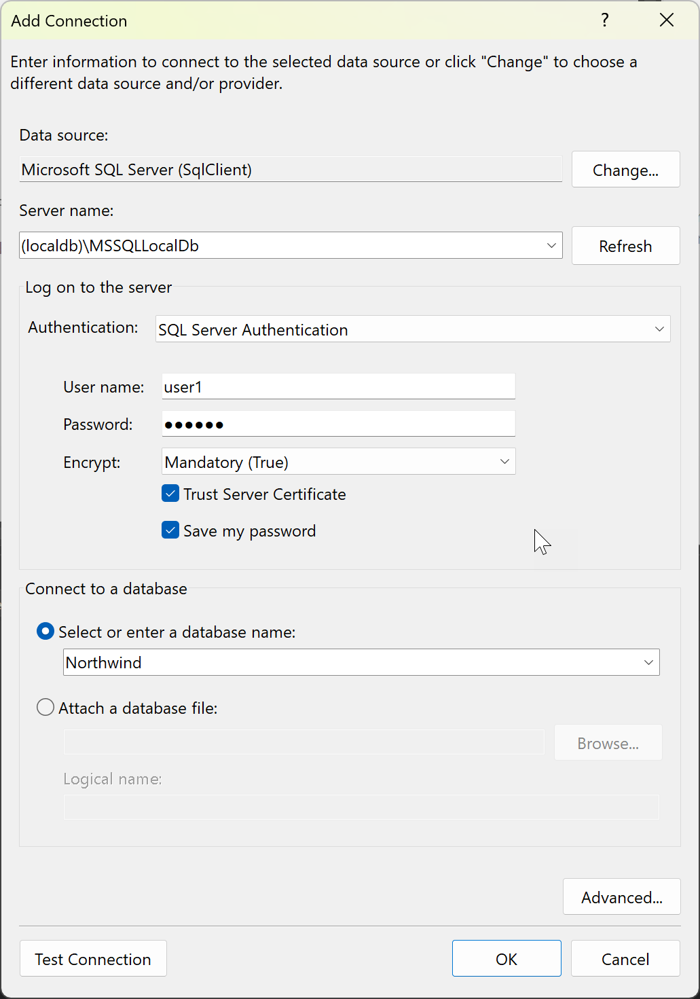

In Visual Studio 2022 version 17.8 and later, the dialog includes two new options (**Encrypt** and **Trust Server Certificate**) that go into the connection string and affect the security settings used for your connection. These options support the stricter security features of the Microsoft.Data.SqlClient 4.0 database driver. See [Changes in encryption and certificate validation behavior](/sql/connect/ado-net/encryption-and-certificate-validation#changes-in-encryption-and-certificate-validation-behavior).

The recommended security practice is to use encryption and install a certificate on the server for it. See [Encryption and certificate validation](/sql/connect/ado-net/encryption-and-certificate-validation). To opt out of this enhanced security, set **Encrypt** to **Optional (False)**.

If you don't set **Encrypt** to optional with Visual Studio 17.8 or later, which use version 4.0 of the Microsoft.Data.SqlClient, then encryption defaults to mandatory. This is a breaking change from the behavior in earlier versions. If you don't have a valid certificate or don't choose **Trust Server Certificate**, you get the following error message:

> Encryption was enabled on this connection, review your SSL and certificate configuration for the target SQL Server, or enable 'Trust server certificate' in the connection dialog.
>
> **Additional information**
>
> A connection was successfully established with the server, but then an error occurred during the login process. (provider: SSL Provider, error: 0 - The certificate chain was issued by an authority that is not trusted.) (Microsoft SQL Server)

:::moniker-end

### Authentication types

You can choose from a variety of authentication types that cover a wide range of scenarios. For details, see [Authentication types](/sql/ssdt/connect-to-an-existing-database-in-sql-server-data-tools#AuthTypes).

:::moniker range=">=vs-2022"

In Visual Studio 17.8 and later, the names of the authentication options for SQL connections have been updated to reflect the name change from Active Directory to Microsoft Entra.

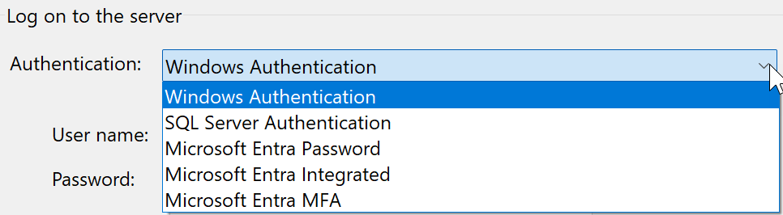

:::moniker-end

## Open an MDF database file

The `.mdf` file stands for Master Database File and is a SQL database packaged into a file. These files have an associated `.ldf` (Log Database File) that contains the logs for that database. You can create new databases that are stored in `.mdf` files by adding a **Service-based Database** item to your project. See [Create a database and add tables](create-a-sql-database-by-using-a-designer.md).

If you already have `.mdf` file in your project, you can double-click or right-click and choose **Open** to open it in Server Explorer.

To open an `.mdf` file that's not in your project in Visual Studio's Server Explorer, follow these steps:

1. In the **Add connection** dialog box, under **Data Source**, choose **Microsoft SQL Server Database File (SqlClient)**.

1. Use the **Browse** button to find and select your master database file (`.mdf` file), or enter the path in the **Database filename** box.

   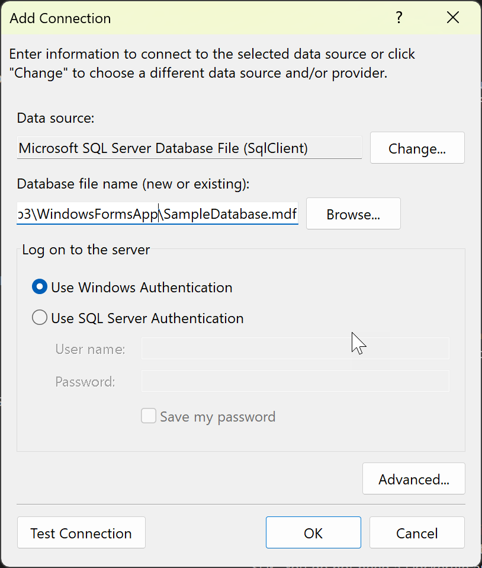

1. Choose the authentication method.

1. Test the connection, and if it is successful, choose **OK**. A node for the database opens in Server Explorer.

## Change the provider

If the data source is not what you want, click the **Change** button to choose a new data source or a new ADO.NET data provider. The new provider might ask for your credentials, depending on how you configured it.

::: moniker range=">=vs-2022"
> [!NOTE]
> If you're using Visual Studio 2022 to connect to OLEDB or ODBC data providers, you will need to be aware that Visual Studio 2022 is now a 64-bit process.
>
> This means some of the data tools in Visual Studio will not be able to connect to OLEDB or ODBC databases using 32-bit data providers. This includes the Microsoft Access 32-bit OLEDB data provider as well as other third-party 32-bit providers.
>
> If you need to maintain 32-bit applications that connect to OLEDB or ODBC, you will still be able to build and run the application with Visual Studio 2022. However, if you need to use any of the Visual Studio Data Tools such as Server Explorer, Data Source Wizard, or the DataSet Designer, you will need to use an earlier version of Visual Studio that is still a 32-bit process. The last version of Visual Studio that was a 32-bit process was Visual Studio 2019.
>
> If you plan on converting the project to be a 64-bit process you will need to update the OLEDB and ODBC data connections to use 64-bit data providers.
>
> If your application uses Microsoft Access databases, and can convert the project to 64-bit, it's recommended that you use the 64-bit Microsoft Access database Engine, also called Access Connectivity Engine (ACE). Please see [OLE DB Provider for Jet and ODBC driver are 32-bit versions only](/office/troubleshoot/access/jet-odbc-driver-available-32-bit-version) for more information.
>
> If you're using a third-party data provider, we recommend connecting with your vendor to see whether they offer a 64-bit provider before converting the project to 64-bit.

::: moniker-end

:::moniker range="<=vs-2019"
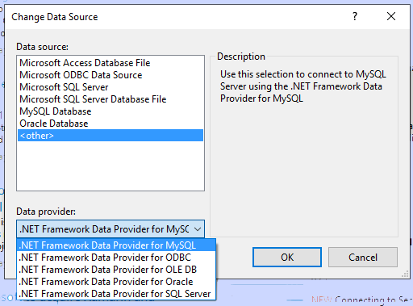
:::moniker-end
:::moniker range=">=vs-2022"
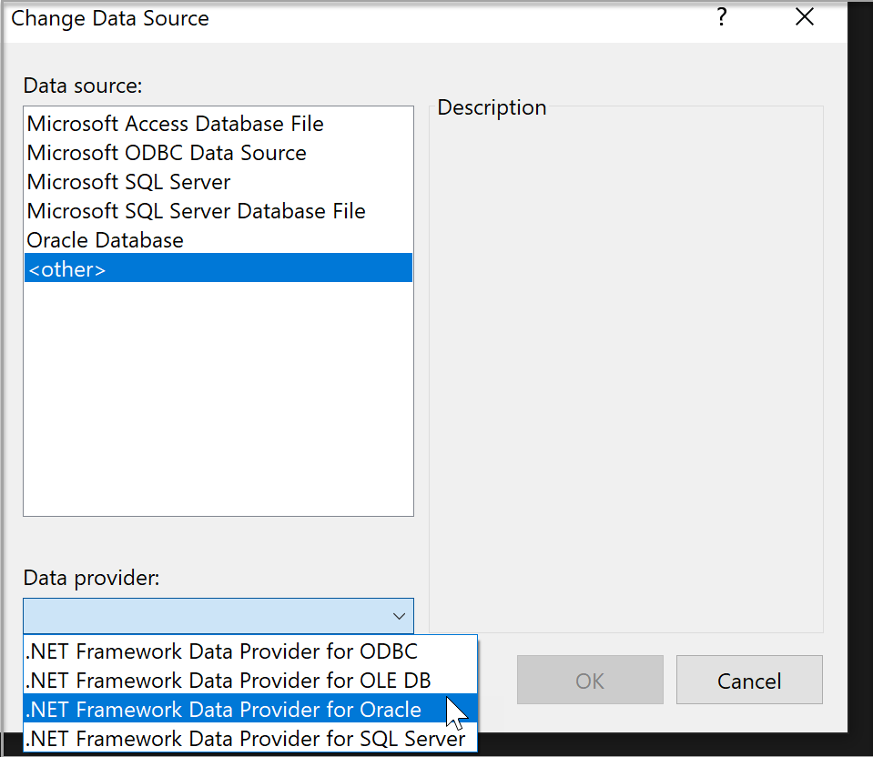
:::moniker-end

## Test the connection

After you have chosen the data source, click **Test Connection**. If it doesn't succeed, you will need to troubleshoot based on the vendor's documentation.

:::moniker range="<=vs-2019"

:::moniker-end
:::moniker range=">=vs-2022"
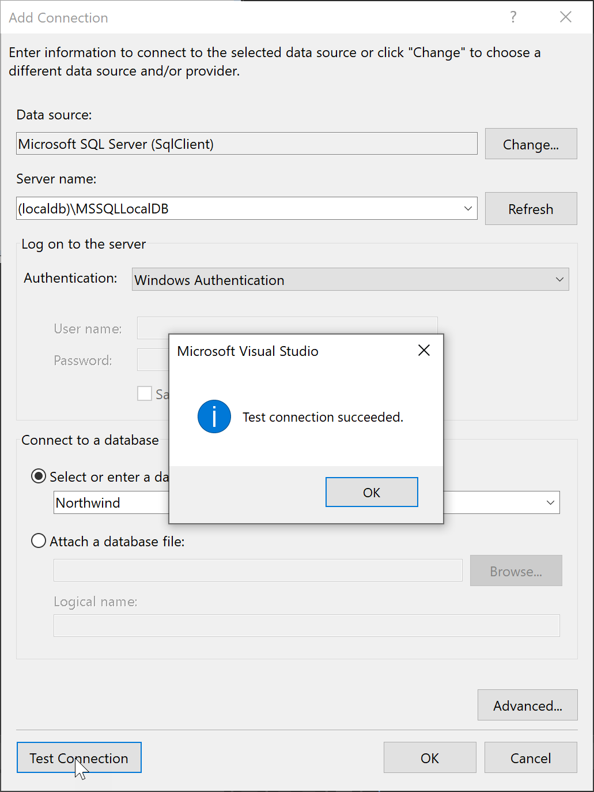
:::moniker-end

If the test succeeds, you are ready to create a *data source*, which is a Visual Studio term that really means a *data model* that is based on the underlying database or service.

:::moniker range=">=vs-2022"

## Connect using SQL Server Object Explorer

The experience might be easier if you use **SQL Server Object Explorer**, which gives you a dialog that provides more help in finding available databases locally, on the local network, and in your Azure subscriptions, and provides a history of recently used choices.

To access the connect dialog from **SQL Server Object Explorer**, click the toolbar button **Add SQL Server**.

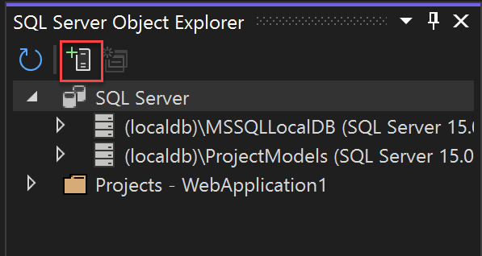

The connect dialog comes up. Choose your local, network, or Azure SQL Server, select a database, provide credentials, and choose **Connect**.

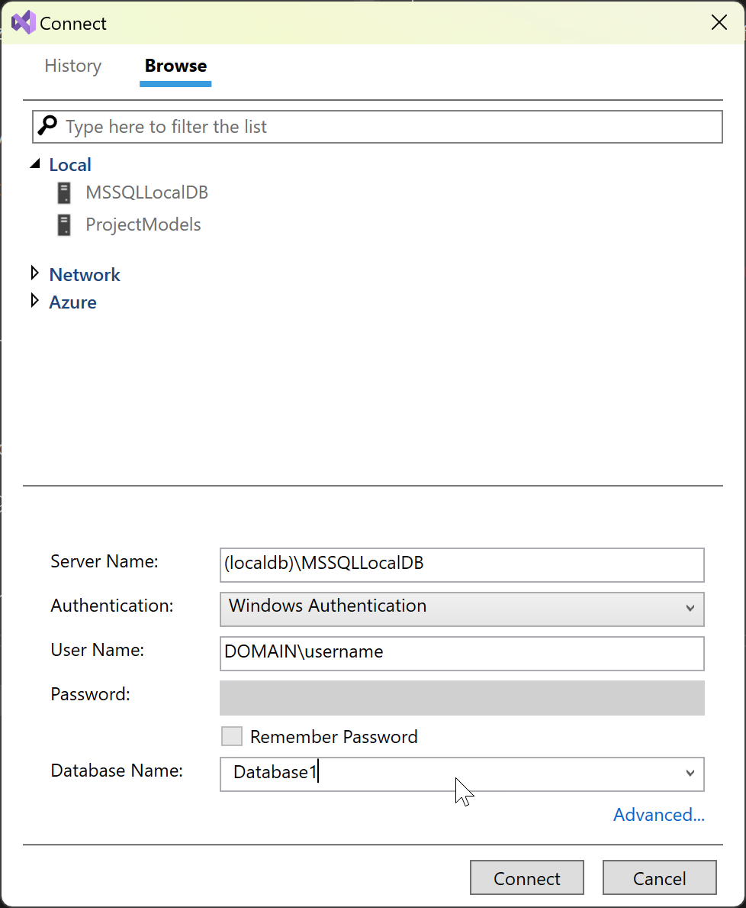

If you need to set other settings in your connection string, you can use the **Advanced** link, which brings up all the settings. For example, to connect to a LocalDB database that's based on an MDF file, choose **Advanced** and then set the property **AttachDbFilename**.

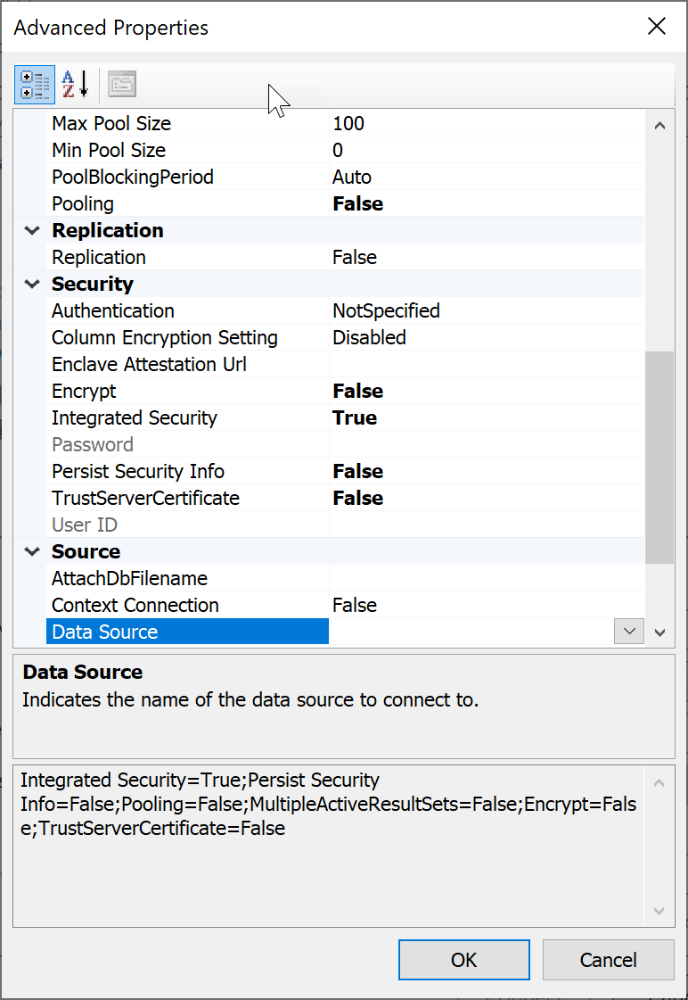

After you are done setting up the connection, the server and database are shown in the SQL Server Object Explorer window.

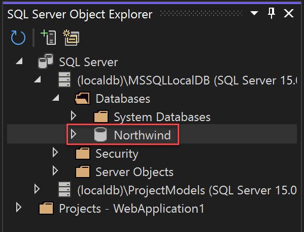

From there, you can browse the database, write and execute queries, edit data, stored procedures and functions, and perform other actions directly in Visual Studio.

:::moniker-end

## Next steps

If you're using the .NET Framework (not .NET Core or .NET 5 or later), and Windows Forms or WPF, you can use the **Data Sources** window, for example, to set up data binding for controls in Windows Forms and WPF Applications, see [Add new data sources](add-new-data-sources.md). These tools are designed to enable you to rapidly create Windows applications that need to allow users to enter, display, and manipulate data.

If you're using .NET 5 or later, .NET Core or ASP.NET Core, you can connect your app to the database using [Connected Services](../azure/overview-connected-services.md). Using Connected Services, you can easily use a local development database, hosted by SQL LocalDB, SQL Server running in a container, or an on-premises instance of SQL Server, and then transition to Azure SQL Database when you're ready to deploy to the cloud. For .NET 5 or later, .NET Core and ASP.NET Core, you should consider using [Entity Framework Core](/ef/core) as your database framework.

## Related content

- [Visual Studio data tools for .NET](../data-tools/visual-studio-data-tools-for-dotnet.md)
