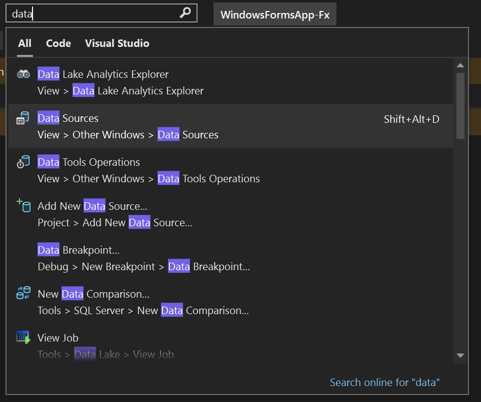
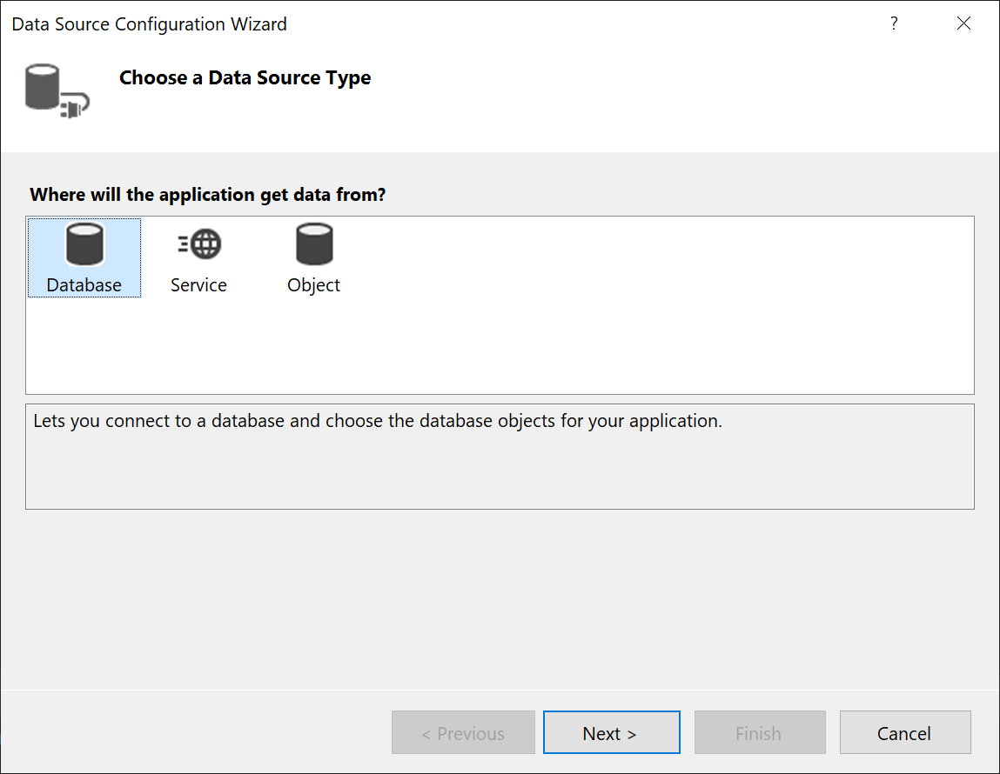
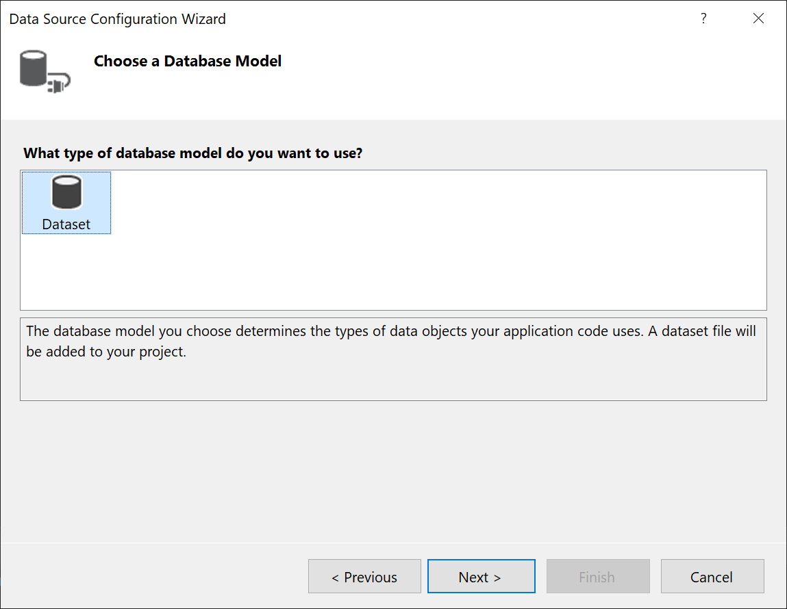
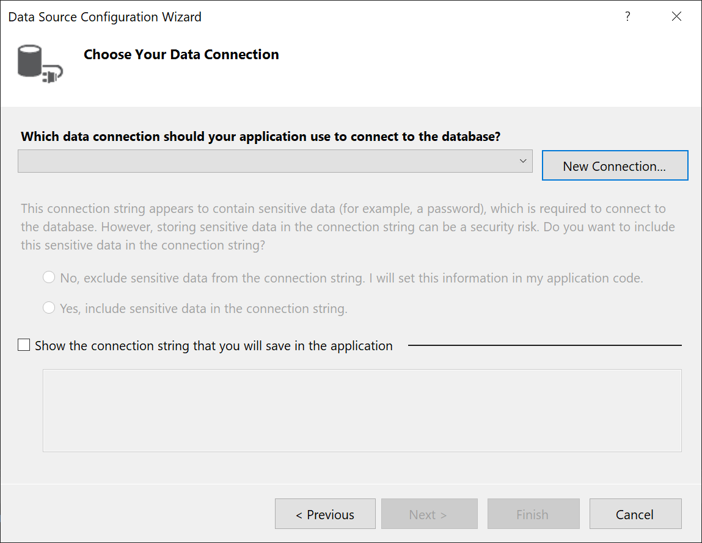
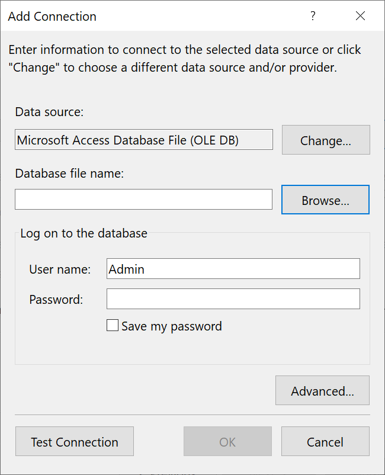
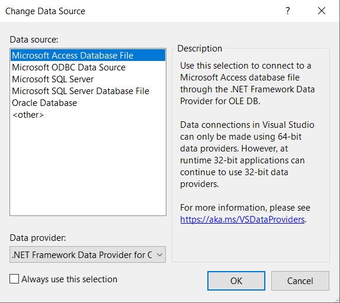
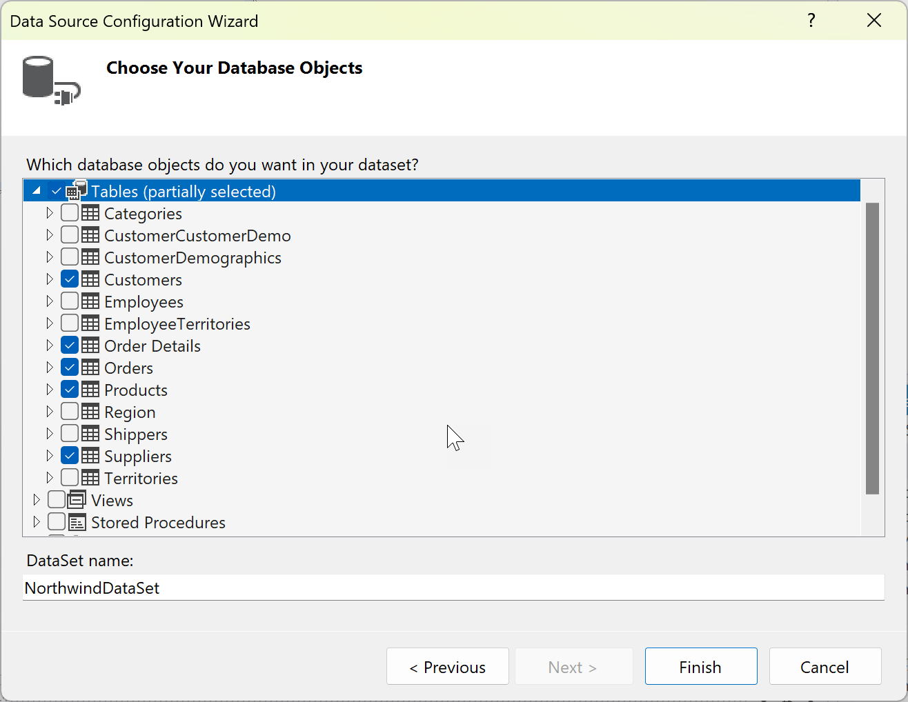
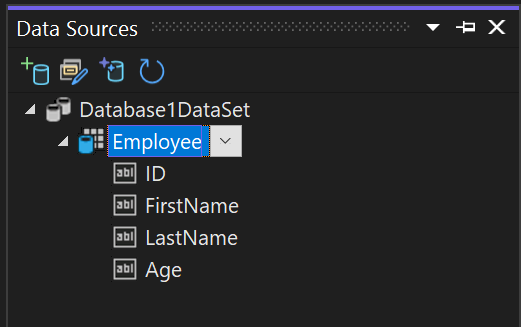
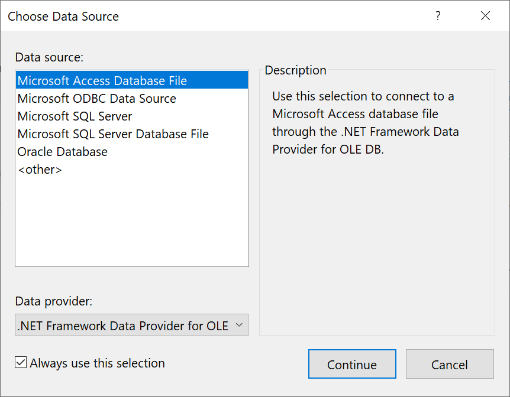
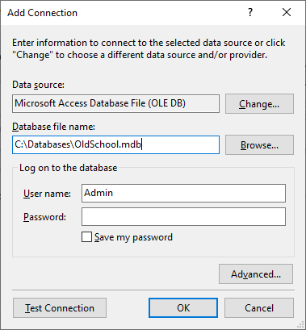

# Connect to an Access database in .NET Framework applications

[!INCLUDE [Data access tech note](./includes/data-technology-note.md)]

You can connect to an Access database (either an `.mdb` file or an `.accdb` file) by using Visual Studio. After you define the connection, the data appears in the **Data Sources** window. From there, you can drag tables or views onto your design surface.

> [!NOTE]
> If you're using Visual Studio to connect to Access databases, you will need to be aware that versions of Visual Studio prior to Visual Studio 2022 are all 32-bit processes. This means some of the data tools in Visual Studio 2019 and earlier will only be able to connect to Access databases using 32-bit data providers.
>
> If you're using Visual Studio 2022 to connect to Access databases, you will need to be aware that Visual Studio 2022 is now a 64-bit process. This means some of the data tools in Visual Studio will not be able to connect to Access databases using 32-bit data providers.
>
> If you need to maintain 32-bit applications that connect to Access databases, you will still be able to build and run the application with Visual Studio 2022. However, if you need to use any of the Visual Studio Data Tools such as Server Explorer, Data Source Wizard, or the DataSet Designer, you will need to use an earlier version of Visual Studio that is still a 32-bit process. The last version of Visual Studio that was a 32-bit process was Visual Studio 2019.
>
> If you plan on converting the project to be a 64-bit process, it's recommended that you use the 64-bit Microsoft Access database Engine, also called Access Connectivity Engine (ACE). Please see [OLE DB Provider for Jet and ODBC driver are 32-bit versions only](/office/troubleshoot/access/jet-odbc-driver-available-32-bit-version) for more information.

## Prerequisites

To use these procedures, you need:

- [Visual Studio](../install/install-visual-studio.md)
- A Windows Forms or WPF project
- Either an Access database (`.accdb` file), or an Access 2000-2003 database (`.mdb` file). Follow the procedure that corresponds to your file type.

:::moniker range=">=vs-2022"

## Create a dataset for an .accdb file

Connect to databases created with Microsoft 365, Access 2016, Access 2013, Access 2010, or Access 2007 by using the following procedure.

1. Open a Windows Forms or WPF application project in Visual Studio.

2. To open the **Data Sources** window, press **Ctrl**+**Q**, enter "data" in the search box, and choose **Data Sources** window. Or on the **View** menu, select **Other Windows** > **Data Sources**. Or on the keyboard, press **Shift**+**Alt**+**D**.

   

3. In the **Data Sources** window, click **Add New Data Source**.

   The **Data Source Configuration Wizard** opens.

   

4. Select **Database** on the **Choose a Data Source Type** page, and then select **Next**.

5. Select **Dataset** on the **Choose a Database Model** page, and then select **Next**.

   

6. On the **Choose your Data Connection** page, select **New Connection** to configure a new data connection.

   

   The **Add Connection** dialog box opens.

   

7. If **Data source** is not set to **Microsoft Access Database File**, select the **Change** button.

   The **Change Data Source** dialog box opens. In the list of data sources, choose **Microsoft Access Database File**. The option **.NET Framework Data Provider for OLE DB** is already preselected. Choose **OK**.

   

8. Choose **Browse** next to **Database file name**, and then navigate to your `.accdb` file and choose **Open**.

   > [!NOTE]
   > If the bitness (32-bit or 64-bit) of Microsoft Office and Visual Studio do not match, you will see an error while connecting to an Access database. In Visual Studio 2019, you will get an error that the database provider is not registered. In Visual Studio 2022, you will see an error that you can't connect to a 32-bit data provider. To resolve this error, make sure that if you are using a 32-bit version of Office, you are using Visual Studio 2019 or earlier; for a 64-bit version of Office, you need Visual Studio 2022 or later.

9. Enter a user name and password (if necessary), and then choose **OK**.

10. Select **Next** on the **Choose your Data Connection** page.

    You might get a dialog box telling you the data file is not in your current project. Select **Yes** or **No**.

11. Select **Next** on the **Save connection string to the Application Configuration file** page.

    

12. Expand the **Tables** node on the **Choose your Database Objects** page.

    

13. Select the tables or views you want to include in your dataset, and then select **Finish**.

    The dataset is added to your project, and the tables and views appear in the **Data Sources** window.

    

14. On 64-bit machines with the 64-bit Access database engine, you need to ensure that the application runs as a 64-bit application. Open the project properties (press **Alt**+**Enter** or right-click on the project node, and select **Properties**). In the **Build** tab for C#, or the **Compile** tab for Visual Basic, clear the **Prefer 32-bit** checkbox.

The connection string is stored in *app.config*, and in the *Settings.settings* file under **Properties** in Solution Explorer.

:::moniker-end

:::moniker range="vs-2019"

## Create a dataset for an .accdb file

Connect to databases created with Microsoft 365, Access 2016, Access 2013, Access 2010, or Access 2007 by using the following procedure.

1. Open a Windows Forms or WPF application project in Visual Studio.

2. To open the **Data Sources** window, press **Ctrl**+**Q**, enter "data" in the search box, and choose **Data Sources** window. Or on the **View** menu, select **Other Windows** > **Data Sources**. Or on the keyboard, press **Shift**+**Alt**+**D**.

   

3. In the **Data Sources** window, click **Add New Data Source**.

   The **Data Source Configuration Wizard** opens.

4. Select **Database** on the **Choose a Data Source Type** page, and then select **Next**.

5. Select **Dataset** on the **Choose a Database Model** page, and then select **Next**.

   

6. On the **Choose your Data Connection** page, select **New Connection** to configure a new data connection.

   

   The **Add Connection** dialog box opens.

   

7. If **Data source** is not set to **Microsoft Access Database File**, select the **Change** button.

   The **Change Data Source** dialog box opens. In the list of data sources, choose **Microsoft Access Database File**. The option **.NET Framework Data Provider for OLE DB** is already preselected. Choose **OK**.

   

8. Choose **Browse** next to **Database file name**, and then navigate to your `.accdb` file and choose **Open**.

   > [!NOTE]
   > If the bitness (32-bit or 64-bit) of Microsoft Office and Visual Studio do not match, you will see an error while connecting to an Access database. In Visual Studio 2019, you will get an error that the database provider is not registered. In Visual Studio 2022, you will see an error that you can't connect to a 32-bit data provider. To resolve this error, make sure that if you are using a 32-bit version of Office, you are using Visual Studio 2019 or earlier; for a 64-bit version of Office, you need Visual Studio 2022 or later.

9. Enter a user name and password (if necessary), and then choose **OK**.

10. Select **Next** on the **Choose your Data Connection** page.

    You might get a dialog box telling you the data file is not in your current project. Select **Yes** or **No**.

11. Select **Next** on the **Save connection string to the Application Configuration file** page.

    

12. Expand the **Tables** node on the **Choose your Database Objects** page.

13. Select the tables or views you want to include in your dataset, and then select **Finish**.

    The dataset is added to your project, and the tables and views appear in the **Data Sources** window.

:::moniker-end

## Create a dataset for an .mdb file

Connect to databases created with Access 2000-2003 by using the following procedure.

1. Open a Windows Forms or WPF application project in Visual Studio.

2. On the **View** menu, select **Other Windows** > **Data Sources**.

3. In the **Data Sources** window, click **Add New Data Source**.

    The **Data Source Configuration Wizard** opens.

4. Select **Database** on the **Choose a Data Source Type** page, and then select **Next**.

5. Select **Dataset** on the **Choose a Database Model** page, and then select **Next**.

6. On the **Choose your Data Connection** page, select **New Connection** to configure a new data connection.

7. If the data source is not **Microsoft Access Database File (OLE DB)**, select **Change** to open the **Change Data Source** dialog box and select **Microsoft Access Database File**, and then select **OK**.

8. In the **Database file name**, specify the path and name of the `.mdb` file you want to connect to, and then select **OK**.

   

9. Select **Next** on the **Choose your Data Connection** page.

10. Select **Next** on the **Save connection string to the Application Configuration file** page.

11. Expand the **Tables** node on the **Choose your Database Objects** page.

12. Select whatever tables or views you want in your dataset, and then select **Finish**.

    The dataset is added to your project, and the tables and views appear in the **Data Sources** window.

## View the generated code

The data tools are configured to generate a lot of code automatically when you perform certain operations in the Form Designer. For example, when you drag and drop a table onto the form, a `DataGridView` is added and code is created to hook up the data with the control. You can view this code in the `*.Designer.cs` file. The generated code may differ depending on your version of Visual Studio.

Congratulations! With a little help from Visual Studio, you've created a form-based editing experience for an Access data table.

## Next steps

The dataset that you just created is available in the **Data Sources** window. You can now perform any of the following tasks:

- Select items in the **Data Sources** window and drag them onto your form or design surface (see [Bind Windows Forms controls to data in Visual Studio](../data-tools/bind-windows-forms-controls-to-data-in-visual-studio.md) or [WPF data binding overview](/dotnet/desktop-wpf/data/data-binding-overview)).

- Open the data source in the **Dataset Designer** to add or edit the objects that make up the dataset.

- Add validation logic to the <xref:System.Data.DataTable.ColumnChanging> or <xref:System.Data.DataTable.RowChanging> event of the data tables in the dataset (see [Validate data in datasets](../data-tools/validate-data-in-datasets.md)).

## Related content

- [Add connections](../data-tools/add-new-connections.md)
- [WPF data binding overview](/dotnet/framework/wpf/data/data-binding-overview)
- [Windows Forms data binding](/dotnet/framework/winforms/data-binding-and-windows-forms)
