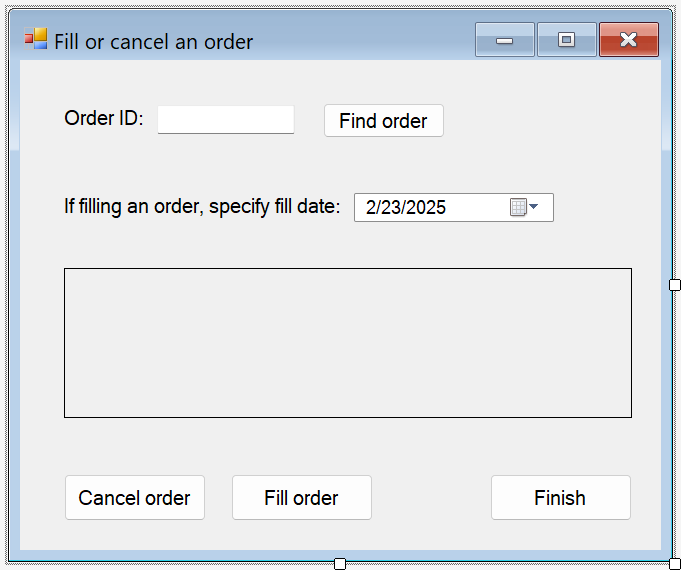

# Create a simple data application by using ADO.NET

[!INCLUDE [Data access tech note](./includes/data-technology-note.md)]

When you create an application that manipulates data in a database, you perform basic tasks such as defining connection strings, inserting data, and running stored procedures. By following this topic, you can discover how to interact with a database from within a simple Windows Forms "forms over data" application by using Visual C# or Visual Basic and ADO.NET. All .NET data technologies—including datasets, LINQ to SQL, and Entity Framework—ultimately perform steps that are very similar to those shown in this article.

This article demonstrates a simple way to quickly get data out of a database. If your application needs to modify data in nontrivial ways and update the database, you should consider using Entity Framework and using data binding to automatically sync user interface controls to changes in the underlying data.

> [!IMPORTANT]
> To keep the code simple, it doesn't include production-ready exception handling.

> [!NOTE]
> The complete code for this tutorial can be accessed in the Visual Studio docs GitHub repo in [C#](https://github.com/MicrosoftDocs/visualstudio-docs/tree/main/docs/data-tools/codesnippet/CSharp/SimpleDataApp) and [Visual Basic](https://github.com/MicrosoftDocs/visualstudio-docs/tree/main/docs/data-tools/codesnippet/VisualBasic/SimpleDataApp).

## Prerequisites

To create the application, you need:

- Visual Studio with the **.NET desktop development** and **Data storage and processing** workloads installed. To install them, open **Visual Studio Installer** and choose **Modify** (or **More** > **Modify**) next to the version of Visual Studio you want to modify.

- SQL Server Express LocalDB. If you don't have SQL Server Express LocalDB, you can install it from the [SQL Server download page](https://www.microsoft.com/sql-server/sql-server-downloads).

This topic assumes that you're familiar with the basic functionality of the Visual Studio IDE and can create a Windows Forms application, add forms to the project, put buttons and other controls on the forms, set properties of the controls, and code simple events. If you aren't comfortable with these tasks, we suggest that you complete the [Create a Windows Forms app in Visual Studio with Visual Basic](../ide/create-a-visual-basic-winform-in-visual-studio.md) tutorial or the [Create a Windows Forms app in Visual Studio with C#](../ide/create-csharp-winform-visual-studio.md) tutorial before you start this walkthrough.

## Set up the sample database

Create the sample database by following these steps:

1. In Visual Studio, open the **Server Explorer** window.

2. Right-click on **Data Connections** and choose **Create New SQL Server Database**.

3. In the **Server name** text box, enter **(localdb)\mssqllocaldb**.

4. In the **New database name** text box, enter **Sales**, then choose **OK**.

     The empty **Sales** database is created and added to the Data Connections node in Server Explorer.

5. Right-click on the **Sales** data connection and select **New Query**.

     A query editor window opens.

6. Copy the [Sales Transact-SQL script](https://github.com/MicrosoftDocs/visualstudio-docs/raw/main/docs/data-tools/samples/sales.sql) to your clipboard.

7. Paste the T-SQL script into the query editor, and then choose the **Execute** button.

     After a short time, the query finishes running and the database objects are created. The database contains two tables: Customer and Orders. These tables contain no data initially, but you can add data when you run the application that you create. The database also contains four simple stored procedures.

## Create the forms and add controls

1. Create a C# or Visual Basic project using the **Windows Forms App (.NET Framework)** template, and then name it **SimpleDataApp**.

    Visual Studio creates the project and several files, including an empty Windows form that's named **Form1**.

2. Add two Windows forms to your project so that it has three forms, and then give them the following names:

   - **Navigation**

   - **NewCustomer**

   - **FillOrCancel**

3. For each form, add the text boxes, buttons, and other controls that appear in the following illustrations. For each control, set the properties that the tables describe.

   > [!NOTE]
   > The group box and the label controls add clarity but aren't used in the code.

   **Navigation form**

   

|Controls for the Navigation form|Properties|
| - |----------------|
|Button|Name = btnGoToAdd|
|Button|Name = btnGoToFillOrCancel|
|Button|Name = btnExit|

**NewCustomer form**


|Controls for the NewCustomer form|Properties|
| - |----------------|
|TextBox|Name = txtCustomerName|
|TextBox|Name = txtCustomerID<br /><br /> Readonly = True|
|Button|Name = btnCreateAccount|
|NumericUpdown|DecimalPlaces = 0<br /><br /> Maximum = 5000<br /><br /> Name = numOrderAmount|
|DateTimePicker|Format = Short<br /><br /> Name = dtpOrderDate|
|Button|Name = btnPlaceOrder|
|Button|Name = btnAddAnotherAccount|
|Button|Name = btnAddFinish|

**FillOrCancel form**



|Controls for the FillOrCancel form|Properties|
| - |----------------|
|TextBox|Name = txtOrderID|
|Button|Name = btnFindByOrderID|
|DateTimePicker|Format = Short<br /><br /> Name = dtpFillDate|
|DataGridView|Name = dgvCustomerOrders<br /><br /> Readonly = True<br /><br /> RowHeadersVisible = False|
|Button|Name = btnCancelOrder|
|Button|Name = btnFillOrder|
|Button|Name = btnFinishUpdates|

## Store the connection string

When your application tries to open a connection to the database, your application must have access to the connection string. To avoid entering the string manually on each form, store the string in the *App.config* file in your project, and create a method that returns the string when the method is called from any form in your application.

You can find the connection string by right-clicking on the **Sales** data connection in **Server Explorer** and choosing **Properties**. Locate the **ConnectionString** property, then use **Ctrl**+**A**, **Ctrl**+**C** to select and copy the string to the clipboard.

1. If you're using C#, in **Solution Explorer**, expand the **Properties** node under the project, and then open the **Settings.settings** file.
    If you're using Visual Basic, in **Solution Explorer**, click **Show All Files**, expand the **My Project** node, and then open the **Settings.settings** file.

2. In the **Name** column, enter `connString`.

3. In the **Type** list, select **(Connection String)**.

4. In the **Scope** list, select **Application**.

5. In the **Value** column, enter your connection string (without any outside quotes), and then save your changes.

   :::image type="content" source="media/vs-2022/simple-data-app-settings.png" alt-text="Screenshot of Connection String in Settings.settings" lightbox="media/vs-2022/simple-data-app-settings.png":::

> [!CAUTION]
> In a real application, you should store the connection string securely, as described in [Connection strings and configuration files](/dotnet/framework/data/adonet/connection-strings-and-configuration-files). For best security, use an authentication method that doesn't rely on storing a password in the connection string, such as Windows Authentication for an on-premises SQL Server database. See [Save and edit connection strings](how-to-save-and-edit-connection-strings.md).

## Write the code for the forms

This section contains brief overviews of what each form does. It also provides the code that defines the underlying logic when a button on the form is clicked.

### Navigation form

The Navigation form opens when you run the application. The **Add an account** button opens the NewCustomer form. The **Fill or cancel orders** button opens the FillOrCancel form. The **Exit** button closes the application.

#### Make the Navigation form the startup form

If you're using C#, in **Solution Explorer**, open **Program.cs**, and then change the `Application.Run` line to this: `Application.Run(new Navigation());`

If you're using Visual Basic, in **Solution Explorer**, open the **Properties** window, select the **Application** tab, and then select **SimpleDataApp.Navigation** in the **Startup form** list.

#### Create autogenerated event handlers

Double-click the three buttons on the Navigation form to create empty event handler methods. Double-clicking the buttons also adds autogenerated code in the Designer code file that enables a button click to raise an event.

> [!NOTE]
> If you skip the double-click action in the designer and just copy the code and paste it into your code files, don't forget to set the event handler to the right method. You can do this in the **Properties** window. Switch to the **Events** tab (use the lightning bolt toolbar button) and look for the **Click** handler.

#### Add code for the Navigation form logic

In the code page for the Navigation form, complete the method bodies for the three button-click event handlers as shown in the following code.

### [C#](#tab/csharp)

:::code language="csharp" source="../data-tools/codesnippet/CSharp/SimpleDataApp/Navigation.cs" id="Snippet1":::

### [VB](#tab/vb)

:::code language="vb" source="../data-tools/codesnippet/VisualBasic/SimpleDataApp/Navigation.vb" id="Snippet1":::
---

> [!NOTE]
> The code for this tutorial is available in C# and Visual Basic. To switch the code language on this page between C# and Visual Basic, use the code language switcher at the top of each code example.

### NewCustomer form

When you enter a customer name and then select the **Create Account** button, the NewCustomer form creates a customer account, and SQL Server returns an IDENTITY value as the new customer ID. You can then place an order for the new account by specifying an amount and an order date and selecting the **Place Order** button.

#### Create autogenerated event handlers

Create an empty Click event handler for each button on the NewCustomer form by double-clicking on each of the four buttons. Double-clicking the buttons also adds autogenerated code in the Designer code file that enables a button click to raise an event.

#### Add code for the NewCustomer form logic

To complete the NewCustomer form logic, follow these steps.

1. Bring the `System.Data.SqlClient` namespace into scope so that you don't have to fully qualify the names of its members.

     ### [C#](#tab/csharp)

     ```csharp
     using System.Data.SqlClient;
     ```

     ### [VB](#tab/vb)

     ```vb
     Imports System.Data.SqlClient
     ```

     ---

2. Add some variables and helper methods to the class as shown in the following code.

     ### [C#](#tab/csharp)
     :::code language="csharp" source="../data-tools/codesnippet/CSharp/SimpleDataApp/NewCustomer.cs" id="Snippet1":::

     ### [VB](#tab/vb)
     :::code language="vb" source="../data-tools/codesnippet/VisualBasic/SimpleDataApp/NewCustomer.vb" id="Snippet1":::
     ---

3. Complete the method bodies for the four button-click event handlers as shown in the following code.

     ### [C#](#tab/csharp)
     :::code language="csharp" source="../data-tools/codesnippet/CSharp/SimpleDataApp/NewCustomer.cs" id="Snippet2":::

     ### [VB](#tab/vb)
     :::code language="vb" source="../data-tools/codesnippet/VisualBasic/SimpleDataApp/NewCustomer.vb" id="Snippet2":::
     ---

### FillOrCancel form

The FillOrCancel form runs a query to return an order when you enter an order ID, and then select the **Find Order** button. The returned row appears in a read-only data grid. You can mark the order as canceled (X) if you select the **Cancel Order** button, or you can mark the order as filled (F) if you select the **Fill Order** button. If you select the **Find Order** button again, the updated row appears.

#### Create autogenerated event handlers

Create empty Click event handlers for the four buttons on the FillOrCancel form by double-clicking the buttons. Double-clicking the buttons also adds autogenerated code in the Designer code file that enables a button click to raise an event.

#### Add code for the FillOrCancel form logic

To complete the FillOrCancel form logic, follow these steps.

1. Bring the following two namespaces into scope so that you don't have to fully qualify the names of their members.

     ### [C#](#tab/csharp)

     ```csharp
     using System.Data.SqlClient;
     using System.Text.RegularExpressions;
     ```

     ### [VB](#tab/vb)

     ```vb
     Imports System.Data.SqlClient
     Imports System.Text.RegularExpressions
     ```

     ---

2. Add a variable and helper method to the class as shown in the following code.

     ### [C#](#tab/csharp)
     :::code language="csharp" source="../data-tools/codesnippet/CSharp/SimpleDataApp/FillOrCancel.cs" id="Snippet1":::

     ### [VB](#tab/vb)
     :::code language="vb" source="../data-tools/codesnippet/VisualBasic/SimpleDataApp/FillOrCancel.vb" id="Snippet1":::
     ---

3. Complete the method bodies for the four button-click event handlers as shown in the following code.

     ### [C#](#tab/csharp)
     :::code language="csharp" source="../data-tools/codesnippet/CSharp/SimpleDataApp/FillOrCancel.cs" id="Snippet2":::

     ### [VB](#tab/vb)
     :::code language="vb" source="../data-tools/codesnippet/VisualBasic/SimpleDataApp/FillOrCancel.vb" id="Snippet2":::
     ---

## Test your application

Run the application and try creating a few customers and orders to verify that everything is working as expected. To verify that the database is updated with your changes, open the **Tables** node in **Server Explorer**, right-click on the **Customers** and **Orders** nodes, and choose **Show Table Data**.

## Related content

- [Visual Studio data tools for .NET](../data-tools/visual-studio-data-tools-for-dotnet.md)
