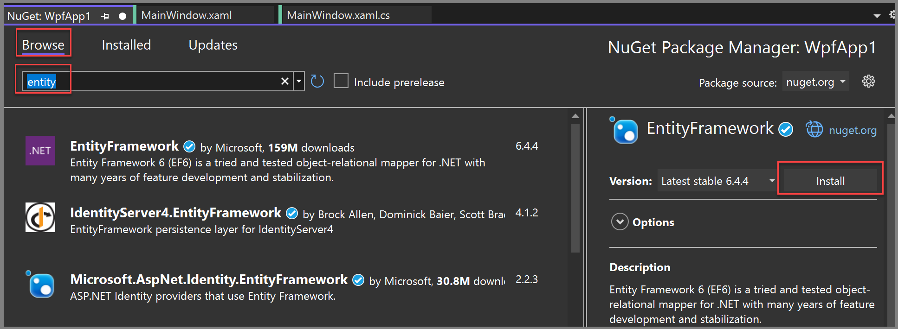
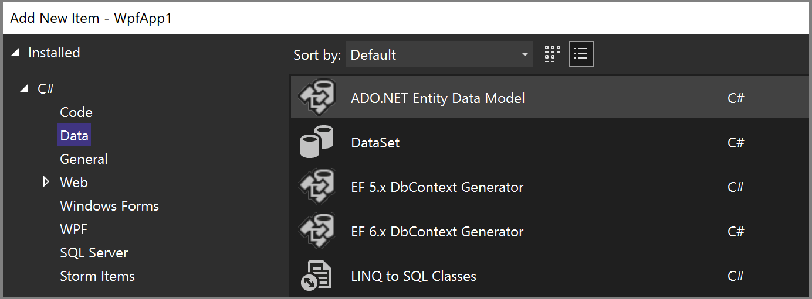
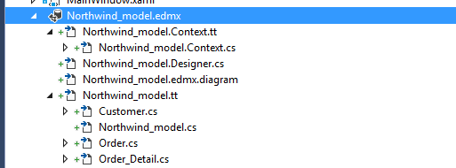
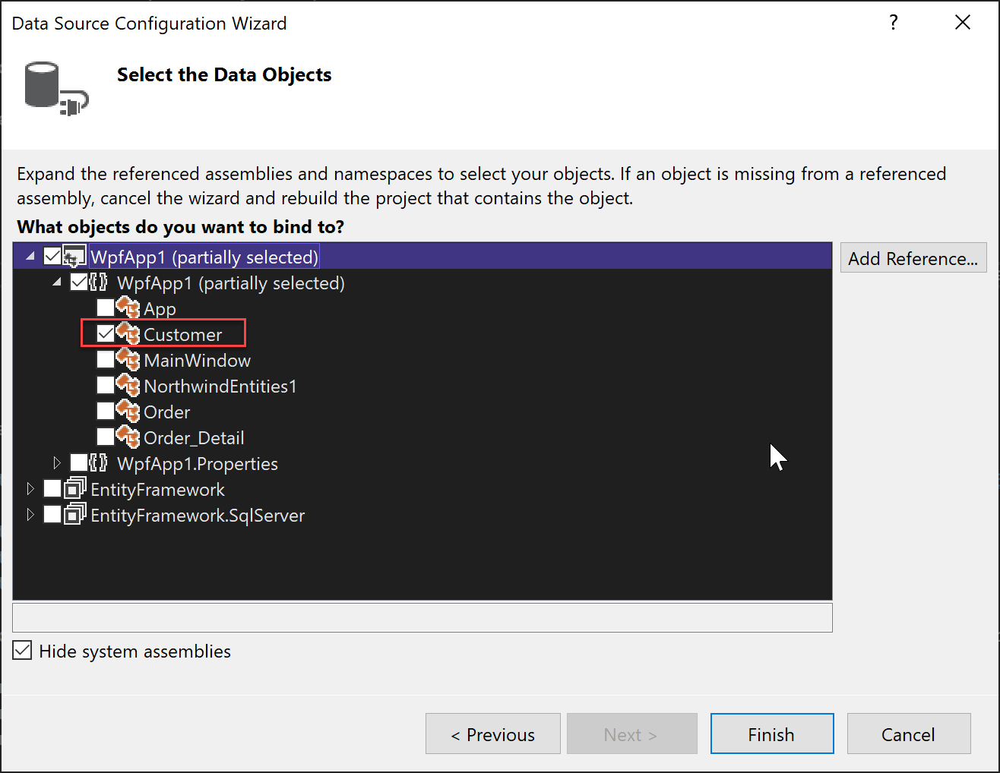
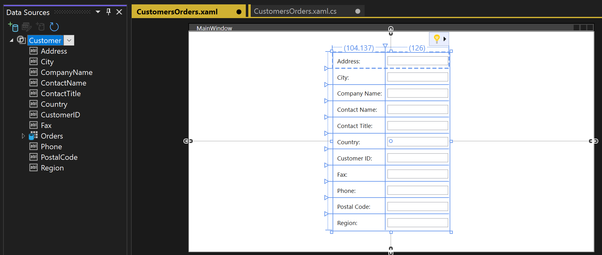
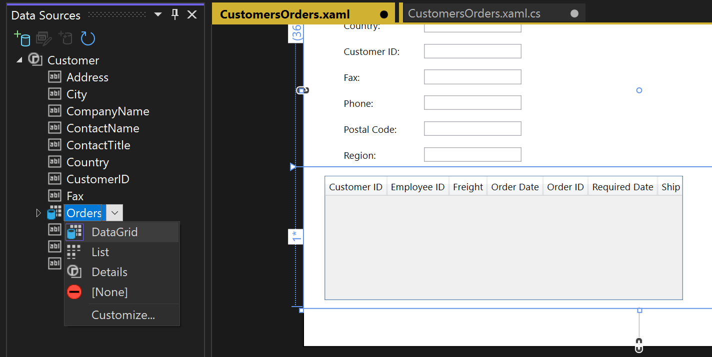

# Create a basic data application with WPF and Entity Framework 6

::: moniker range="vs-2022"
> [!NOTE]
> If you're running Visual Studio 2022, ensure you use version 17.3 or later for this tutorial.
::: moniker-end

This tutorial shows how to create a basic *forms over data* application in Visual Studio. The app uses SQL Server LocalDB, the Northwind database, Entity Framework 6 (not Entity Framework Core), and Windows Presentation Foundation (WPF) for .NET Framework (not .NET Core or .NET 5 or later). It shows how to do basic data binding with a master-detail view, and includes a custom **BindingNavigator** control with buttons that do the following: move to first, move previous, move next, move to last, delete, add, set new order, update, and cancel.

This tutorial focuses on using data tools in Visual Studio, and doesn't attempt to explain the underlying technologies in any depth. It assumes that you have a basic familiarity with Extensible Application Markup Language (XAML), Entity Framework, and SQL. Although the code in this tutorial doesn't demonstrate Model-View-ViewModel (MVVM) architecture, which is standard for WPF applications, you can copy the code with a few modifications into your own MVVM application.

To view the final code for this tutorial, see [Visual Studio tutorial samples - EF6](https://github.com/MicrosoftDocs/vs-tutorial-samples/tree/main/ef6).

In this tutorial, you:

> [!div class="checklist"]
>
> * Install and connect to Northwind
> * Configure the WPF app project
> * Create the ADO.NET entity data model
> * Data bind the model to the XAML page
> * Adjust the page design and add grids
> * Add buttons to navigate, add, update, and delete
> * Run the WPF application

## Prerequisites

* [Visual Studio](https://aka.ms/vs/download/?cid=learn-onpage-download-cta) with **.NET Desktop Development** workload installed, and the **Windows Communication Foundation** component installed. To install it:

   1. Open the **Visual Studio Installer** app, or select **Tools** > **Get Tools and Features** from the Visual Studio menu.
   1. In **Visual Studio Installer**, choose **Modify** next to the version of Visual Studio you want to modify.
   1. Select the **Individual components** tab, and then choose **Windows Communication Foundation** under **Development activities**.
   1. Select **Modify**.

* SQL Server Express LocalDB. If you don't have SQL Server Express LocalDB, you can install it from the [SQL Server download page](https://www.microsoft.com/sql-server/sql-server-downloads). Or, you can install it with the **Visual Studio Installer** app as an individual component.

* SQL Server Object Explorer. To install it, install the **Data storage and processing** workload in the **Visual Studio Installer** app.

* Entity Framework 6 tools. This is usually installed when you install the **.NET Dektop Development** workload.

## Install and connect to Northwind

The following example uses SQL Server Express LocalDB and the Northwind sample database. If the ADO.NET data provider for that product supports Entity Framework, it should work with other SQL database products as well.

Install the Northwind sample database by following these steps:

1. In Visual Studio, open the **SQL Server Object Explorer** window from the **View** menu. Expand the **SQL Server** node. Right-click your LocalDB instance and select **New Query**.

   A query editor window opens.

1. Copy the [Northwind Transact-SQL (T-SQL) script](https://github.com/MicrosoftDocs/visualstudio-docs/blob/main/docs/data-tools/samples/northwind.sql?raw=true) to your clipboard.

1. Paste the T-SQL script into the query editor, and then choose **Execute**.

   The T-SQL script query creates the Northwind database and populates it with data.

1. [Add new connections](../data-tools/add-new-connections.md) for the Northwind database.

## Configure the WPF app project

To configure the WPF app project, follow these steps:

1. In Visual Studio, create a new C# **WPF App (.NET Framework)** project.

1. Add the NuGet package for Entity Framework 6. In **Solution Explorer**, select the project node. In the main menu, choose **Project** > **Manage NuGet Packages**.

1. In the **NuGet Package Manager**, select the **Browse** link. Search for and select the **EntityFramework** package. Select **Install** in the right pane and follow the prompts.

   The **Output** window displays the progress and notifies you when the install is complete.

    :::moniker range="<=vs-2019"
     
    :::moniker-end
    :::moniker range=">=vs-2022"
     
    :::moniker-end

You can now use Visual Studio to create a model based on the Northwind database.

## Create the ADO.NET entity data model

To create the ADO.NET entity data model, follow these steps:

1. Right-click the WPF App project node in **Solution Explorer** and choose **Add** > **New Item**. In the left pane, under the C# node, choose **Data** and in the middle pane, choose **ADO.NET Entity Data Model**.

   :::moniker range="<=vs-2019"
   
   :::moniker-end
   :::moniker range=">=vs-2022"
   
   :::moniker-end

1. Enter **Northwind_model** for the **Name**, and then choose **Add**.

1. In the **Entity Data Model Wizard**, choose **EF Designer from database**, and then select **Next**.

   :::image type="content" source="../data-tools/media/entity-framework-model-from-database.png" alt-text="Screenshot that shows the EF Designer from database selected in the Entity Data Model Wizard.":::

1. In **Choose Your Data Connection**, select your LocalDB Northwind connection (for example, **(localdb)\MSSQLLocalDB**), and then select **Next**.

1. If you don't see a connection:

   1. Choose **New Connection**. If **Microsoft SQL Server** isn't selected as the **Data source** in the **Connection Properties** dialog, select **Change**. In the **Choose Data Source** dialog, choose **Microsoft SQL Server**, and then select **OK**.

   1. In the **Connection Properties** dialog, enter **(localdb)\MSSQLLocalDB** as the **Server name**.

   1. For **Select or enter a database name**, select **Northwind**, and then select **OK**.

   1. In **Choose Your Data Connection**, select your LocalDB Northwind connection, and select **Next**.

1. If prompted, choose the version of Entity Framework you're using, and then select **Next**.

   :::image type="content" source="media/vs-2022/entity-framework-choose-version.png" alt-text="Screenshot that shows the version choices for Entity Framework.":::

1. In the next page of the wizard, choose which tables, stored procedures, and other database objects to include in the Entity Framework model. Expand the **dbo** node under the **Tables** node in the tree view. Select **Customers**, **Order Details**, and **Orders**. Leave the defaults checked and select **Finish**.

    :::image type="content" source="../data-tools/media/vs-2022/choose-entity-framework-objects.png" alt-text="Screenshot that shows the selected database objects of the data model.":::

   The wizard generates the C# classes that represent the Entity Framework model, and are what Visual Studio data binds to the WPF user interface. It creates the following files in your project:

   * The `.edmx` file describes the relationships and other metadata that associates the classes with objects in the database.

   * The `.tt` files are T4 templates that generate the code that operates on the model and saves changes to the database.

   These files are visible in **Solution Explorer** under the **Northwind_model** node:

      :::moniker range="<=vs-2019"
      
      :::moniker-end
      :::moniker range=">=vs-2022"
      
      :::moniker-end

    The Forms Designer for the `.edmx` file isn't used in this tutorial, but you can use it to modify certain properties and relationships in the model.

The `.tt` files are general purpose and you must edit one of them to work with WPF data binding, which requires `ObservableCollection` objects. Follow these steps:

1. In **Solution Explorer**, expand the **Northwind_model** node until you find **Northwind_model.tt**. Double-click this file and make the following edits:

   * Replace the two occurrences of <xref:System.Collections.ICollection> with <xref:System.Collections.ObjectModel.ObservableCollection%601>.

   * Replace the first occurrence of <xref:System.Collections.Generic.HashSet%601> with <xref:System.Collections.ObjectModel.ObservableCollection%601> near line 51. Don't replace the second occurrence of HashSet.

   * Replace the only occurrence of <xref:System.Collections.Generic> (near line 431) with <xref:System.Collections.ObjectModel>.

1. Press **F5** to build and run the project. When the application first runs, the model classes are visible to the data sources wizard.

Now you're ready to hook up this model to the XAML page so that you can view, navigate, and modify the data.

## Data bind the model to the XAML page

Although it's possible to write your own data-binding code, it's easier to let Visual Studio do it for you. To do so, follow these steps:

1. From the main menu, choose **Project** > **Add new data source** to display the **Data Source Configuration Wizard**. Because you're binding to the model classes, not to the database, choose **Object**. Select **Next**.

     :::image type="content" source="../data-tools/media/data-source-configuration-wizard-with-object-source.png" alt-text="Screenshot that shows the Data Source Configuration Wizard with Object selected as the data source.":::

1. Expand the node for your project, select the **Customer** object, and then select **Finish**. The sources for **Order** objects are automatically generated from the **Orders** navigation property in **Customer**.

    :::moniker range="<=vs-2019"
     
     :::moniker-end
     :::moniker range=">=vs-2022"
     
     :::moniker-end

1. In **Solution Explorer**, double-click **MainWindow.xaml** in your project to edit the XAML. Change the `Title` from MainWindow to something more descriptive, and increase its `Height` and `Width` to 600 and 800 (you can change these values later, if necessary).

1. Add these three row definitions to the main grid, one row for the navigation buttons, one for the customer's details, and one for the grid that shows their orders:

    ```xaml
        <Grid.RowDefinitions>
            <RowDefinition Height="auto"/>
            <RowDefinition Height="auto"/>
            <RowDefinition Height="*"/>
        </Grid.RowDefinitions>
    ```

Next, you display each property in the `Customers` class in its own individual text box. Follow these steps:

1. In **Solution Explorer**, double-click **MainWindow.xaml** to open it in the designer.

   The **Data Sources** tab appears in the left pane of Visual Studio near the **Toolbox**.

1. To open the **Data Sources** window, select the **Data Sources** tab or choose **View** > **Other Windows** > **Data Sources** from the menu.

1. In **Data Sources**, select **Customers**, and then select **Details** from the drop-down list.

1. Drag the node to the middle row of the design area. If you misplace it, you can later specify the row manually in the XAML by selecting `Grid.Row="1"`.

   By default, the controls are placed vertically in a grid element, but you can arrange them however you like on the form. For example, you could place the **Name** text box above the address. The sample application for this tutorial reorders the fields and rearranges them into two columns.

     :::moniker range="<=vs-2019"
     
     ::: moniker-end
     :::moniker range=">=vs-2022"
     
     :::moniker-end

     In the XAML view, you can now see a new `Grid` element in row 1 (the middle row) of the parent grid. The parent grid has a `DataContext` attribute that refers to a <xref:System.Windows.Data.CollectionViewSource> that belongs to the `Windows.Resources` element. Given that data context, when the first text box binds to **Address**, that name is mapped to the `Address` property in the current `Customer` object in `CollectionViewSource`.

    ```xaml
    <Grid DataContext="{StaticResource customerViewSource}">
    ```

1. Drag the `Order`object's property of the `Customers` class to the lower half of the form, so that the designer puts it in row 2.

   When a customer is visible in the top half of the form, you want to see their orders in the bottom half. You show the orders in a single grid view control. For master-detail data binding to work as expected, it's important that you bind to the `Orders` property in the `Customers` class, not to the separate `Orders` node.

     :::moniker range="vs-2019"
     
     :::moniker-end
     :::moniker range=">=vs-2022"
     
     :::moniker-end

   Visual Studio now generates all the binding code that connects the UI controls to events in the model.

1. To see some data, write code to populate the model. Navigate to `MainWindow.xaml.cs` and add a data member to the `MainWindow` class for the data context.

   This object, which was generated for you, acts  like a control that tracks changes and events in the model.

1. Add `CollectionViewSource` data members for customers and orders, and the associated constructor initialization logic to the existing constructor `MainWindow()`. The first part of the class should look like this:

     :::code language="csharp" source="../data-tools/codesnippet/CSharp/CreateWPFDataApp/MainWindow.xaml.cs" id="Snippet1":::

1. If it doesn't exist, add a `using` directive for `System.Data.Entity` to bring the `Load` extension method into scope:

     ```csharp
     using System.Data.Entity;
     ```

1. Scroll down and find the `Window_Loaded` event handler. Notice that Visual Studio added a `CollectionViewSource` object. This object represents the `NorthwindEntities` object that you selected when you created the model. Because you already added it, you don't need it here. Replace the code in `Window_Loaded` so that the method looks like this:

     :::code language="csharp" source="../data-tools/codesnippet/CSharp/CreateWPFDataApp/MainWindow.xaml.cs" id="Snippet2":::

1. Press **F5**.

   You should see the details for the first customer that was retrieved into the `CollectionViewSource` and their orders in the data grid. You'll fix the formatting in the next section. You can also create a way to view the other records and do basic create, read, update, and delete (CRUD) operations.

## Adjust the page design and add grids for new customers and orders

The default arrangement produced by Visual Studio isn't ideal for your application, so we provide the final XAML here to copy into your code. You also need some grids to enable the user to add a new customer or order.

To add a new customer and order, create a separate set of text boxes that aren't data-bound to the `CollectionViewSource`. You control which grid the user sees at any given time by setting the Visible property in the handler methods. Finally, you add a Delete button to each row in the Orders grid to enable the user to delete an individual order.

1. Open `MainWindow.xaml` and add the following styles to the `Windows.Resources` element:

   ```xaml
   <Style x:Key="Label" TargetType="{x:Type Label}" BasedOn="{x:Null}">
      <Setter Property="HorizontalAlignment" Value="Left"/>
      <Setter Property="VerticalAlignment" Value="Center"/>
      <Setter Property="Margin" Value="3"/>
      <Setter Property="Height" Value="23"/>
   </Style>
   <Style x:Key="CustTextBox" TargetType="{x:Type TextBox}" BasedOn="{x:Null}">
      <Setter Property="HorizontalAlignment" Value="Right"/>
      <Setter Property="VerticalAlignment" Value="Center"/>
      <Setter Property="Margin" Value="3"/>
      <Setter Property="Height" Value="26"/>
      <Setter Property="Width" Value="120"/>
   </Style>
   ```

1. Replace the entire outer grid with this markup:

   ```xaml
   <Grid>
     <Grid.RowDefinitions>
         <RowDefinition Height="auto"/>
         <RowDefinition Height="auto"/>
         <RowDefinition Height="*"/>
     </Grid.RowDefinitions>
     <Grid x:Name="existingCustomerGrid" Grid.Row="1" HorizontalAlignment="Left" Margin="5" Visibility="Visible" VerticalAlignment="Top" Background="AntiqueWhite" DataContext="{StaticResource customerViewSource}">
         <Grid.ColumnDefinitions>
             <ColumnDefinition Width="Auto" MinWidth="233"/>
             <ColumnDefinition Width="Auto" MinWidth="397"/>
         </Grid.ColumnDefinitions>
         <Grid.RowDefinitions>
             <RowDefinition Height="Auto"/>
             <RowDefinition Height="Auto"/>
             <RowDefinition Height="Auto"/>
             <RowDefinition Height="Auto"/>
             <RowDefinition Height="Auto"/>
             <RowDefinition Height="Auto"/>
         </Grid.RowDefinitions>
         <Label Content="Customer ID:" Grid.Row="0" Style="{StaticResource Label}"/>
         <TextBox x:Name="customerIDTextBox" Grid.Row="0" Style="{StaticResource CustTextBox}"
                  Text="{Binding CustomerID, Mode=TwoWay, NotifyOnValidationError=true, ValidatesOnExceptions=true}"/>
         <Label Content="Company Name:" Grid.Row="1" Style="{StaticResource Label}"/>
         <TextBox x:Name="companyNameTextBox" Grid.Row="1" Style="{StaticResource CustTextBox}"
                  Text="{Binding CompanyName, Mode=TwoWay, NotifyOnValidationError=true, ValidatesOnExceptions=true}"/>
         <Label Content="Contact Name:" Grid.Row="2" Style="{StaticResource Label}"/>
         <TextBox x:Name="contactNameTextBox" Grid.Row="2" Style="{StaticResource CustTextBox}"
                  Text="{Binding ContactName, Mode=TwoWay, NotifyOnValidationError=true, ValidatesOnExceptions=true}"/>
         <Label Content="Contact title:" Grid.Row="3" Style="{StaticResource Label}"/>
         <TextBox x:Name="contactTitleTextBox" Grid.Row="3" Style="{StaticResource CustTextBox}"
                  Text="{Binding ContactTitle, Mode=TwoWay, NotifyOnValidationError=true, ValidatesOnExceptions=true}"/>
         <Label Content="Address:" Grid.Row="4" Style="{StaticResource Label}"/>
         <TextBox x:Name="addressTextBox" Grid.Row="4" Style="{StaticResource CustTextBox}"
                  Text="{Binding Address, Mode=TwoWay, NotifyOnValidationError=true, ValidatesOnExceptions=true}"/>
         <Label Content="City:" Grid.Column="1" Grid.Row="0" Style="{StaticResource Label}"/>
         <TextBox x:Name="cityTextBox" Grid.Column="1" Grid.Row="0" Style="{StaticResource CustTextBox}"
                  Text="{Binding City, Mode=TwoWay, NotifyOnValidationError=true, ValidatesOnExceptions=true}"/>
         <Label Content="Country:" Grid.Column="1" Grid.Row="1" Style="{StaticResource Label}"/>
         <TextBox x:Name="countryTextBox" Grid.Column="1" Grid.Row="1" Style="{StaticResource CustTextBox}"
                  Text="{Binding Country, Mode=TwoWay, NotifyOnValidationError=true, ValidatesOnExceptions=true}"/>
         <Label Content="Fax:" Grid.Column="1" Grid.Row="2" Style="{StaticResource Label}"/>
         <TextBox x:Name="faxTextBox" Grid.Column="1" Grid.Row="2" Style="{StaticResource CustTextBox}"
                  Text="{Binding Fax, Mode=TwoWay, NotifyOnValidationError=true, ValidatesOnExceptions=true}"/>
         <Label Content="Phone:" Grid.Column="1" Grid.Row="3" Style="{StaticResource Label}"/>
         <TextBox x:Name="phoneTextBox" Grid.Column="1" Grid.Row="3" Style="{StaticResource CustTextBox}"
                  Text="{Binding Phone, Mode=TwoWay, NotifyOnValidationError=true, ValidatesOnExceptions=true}"/>
         <Label Content="Postal Code:" Grid.Column="1" Grid.Row="4" VerticalAlignment="Center" Style="{StaticResource Label}"/>
         <TextBox x:Name="postalCodeTextBox" Grid.Column="1" Grid.Row="4" Style="{StaticResource CustTextBox}"
                  Text="{Binding PostalCode, Mode=TwoWay, NotifyOnValidationError=true, ValidatesOnExceptions=true}"/>
         <Label Content="Region:" Grid.Column="1" Grid.Row="5" Style="{StaticResource Label}"/>
         <TextBox x:Name="regionTextBox" Grid.Column="1" Grid.Row="5" Style="{StaticResource CustTextBox}"
                  Text="{Binding Region, Mode=TwoWay, NotifyOnValidationError=true, ValidatesOnExceptions=true}"/>
     </Grid>
     <Grid x:Name="newCustomerGrid" Grid.Row="1" HorizontalAlignment="Left" VerticalAlignment="Top" Margin="5" DataContext="{Binding RelativeSource={RelativeSource FindAncestor, AncestorType={x:Type Window}}, Path=newCustomer, UpdateSourceTrigger=Explicit}" Visibility="Collapsed" Background="CornflowerBlue">
         <Grid.ColumnDefinitions>
             <ColumnDefinition Width="Auto" MinWidth="233"/>
             <ColumnDefinition Width="Auto" MinWidth="397"/>
         </Grid.ColumnDefinitions>
         <Grid.RowDefinitions>
             <RowDefinition Height="Auto"/>
             <RowDefinition Height="Auto"/>
             <RowDefinition Height="Auto"/>
             <RowDefinition Height="Auto"/>
             <RowDefinition Height="Auto"/>
             <RowDefinition Height="Auto"/>
         </Grid.RowDefinitions>
         <Label Content="Customer ID:" Grid.Row="0" Style="{StaticResource Label}"/>
         <TextBox x:Name="add_customerIDTextBox" Grid.Row="0" Style="{StaticResource CustTextBox}"
                  Text="{Binding CustomerID, Mode=TwoWay, NotifyOnValidationError=true, ValidatesOnExceptions=true}"/>
         <Label Content="Company Name:" Grid.Row="1" Style="{StaticResource Label}"/>
         <TextBox x:Name="add_companyNameTextBox" Grid.Row="1" Style="{StaticResource CustTextBox}"
                  Text="{Binding CompanyName, Mode=TwoWay, NotifyOnValidationError=true, ValidatesOnExceptions=true }"/>
         <Label Content="Contact Name:" Grid.Row="2" Style="{StaticResource Label}"/>
         <TextBox x:Name="add_contactNameTextBox" Grid.Row="2" Style="{StaticResource CustTextBox}"
                  Text="{Binding ContactName, Mode=TwoWay, NotifyOnValidationError=true, ValidatesOnExceptions=true}"/>
         <Label Content="Contact title:" Grid.Row="3" Style="{StaticResource Label}"/>
         <TextBox x:Name="add_contactTitleTextBox" Grid.Row="3" Style="{StaticResource CustTextBox}"
                  Text="{Binding ContactTitle, Mode=TwoWay, NotifyOnValidationError=true, ValidatesOnExceptions=true}"/>
         <Label Content="Address:" Grid.Row="4" Style="{StaticResource Label}"/>
         <TextBox x:Name="add_addressTextBox" Grid.Row="4" Style="{StaticResource CustTextBox}"
                  Text="{Binding Address, Mode=TwoWay, NotifyOnValidationError=true, ValidatesOnExceptions=true}"/>
         <Label Content="City:" Grid.Column="1" Grid.Row="0" Style="{StaticResource Label}"/>
         <TextBox x:Name="add_cityTextBox" Grid.Column="1" Grid.Row="0" Style="{StaticResource CustTextBox}"
                  Text="{Binding City, Mode=TwoWay, NotifyOnValidationError=true, ValidatesOnExceptions=true}"/>
         <Label Content="Country:" Grid.Column="1" Grid.Row="1" Style="{StaticResource Label}"/>
         <TextBox x:Name="add_countryTextBox" Grid.Column="1" Grid.Row="1" Style="{StaticResource CustTextBox}"
                  Text="{Binding Country, Mode=TwoWay, NotifyOnValidationError=true, ValidatesOnExceptions=true}"/>
         <Label Content="Fax:" Grid.Column="1" Grid.Row="2" Style="{StaticResource Label}"/>
         <TextBox x:Name="add_faxTextBox" Grid.Column="1" Grid.Row="2" Style="{StaticResource CustTextBox}"
                  Text="{Binding Fax, Mode=TwoWay, NotifyOnValidationError=true, ValidatesOnExceptions=true}"/>
         <Label Content="Phone:" Grid.Column="1" Grid.Row="3" Style="{StaticResource Label}"/>
         <TextBox x:Name="add_phoneTextBox" Grid.Column="1" Grid.Row="3" Style="{StaticResource CustTextBox}"
                  Text="{Binding Phone, Mode=TwoWay, NotifyOnValidationError=true, ValidatesOnExceptions=true}"/>
         <Label Content="Postal Code:" Grid.Column="1" Grid.Row="4" VerticalAlignment="Center" Style="{StaticResource Label}"/>
         <TextBox x:Name="add_postalCodeTextBox" Grid.Column="1" Grid.Row="4" Style="{StaticResource CustTextBox}"
                  Text="{Binding PostalCode, Mode=TwoWay, NotifyOnValidationError=true, ValidatesOnExceptions=true}"/>
         <Label Content="Region:" Grid.Column="1" Grid.Row="5" Style="{StaticResource Label}"/>
         <TextBox x:Name="add_regionTextBox" Grid.Column="1" Grid.Row="5" Style="{StaticResource CustTextBox}"
                  Text="{Binding Region, Mode=TwoWay, NotifyOnValidationError=true, ValidatesOnExceptions=true}"/>
     </Grid>
     <Grid x:Name="newOrderGrid" Grid.Row="1" HorizontalAlignment="Left" VerticalAlignment="Top" Margin="5" DataContext="{Binding Path=newOrder, Mode=TwoWay}" Visibility="Collapsed" Background="LightGreen">
         <Grid.ColumnDefinitions>
             <ColumnDefinition Width="Auto" MinWidth="233"/>
             <ColumnDefinition Width="Auto" MinWidth="397"/>
         </Grid.ColumnDefinitions>
         <Grid.RowDefinitions>
             <RowDefinition Height="Auto"/>
             <RowDefinition Height="Auto"/>
             <RowDefinition Height="Auto"/>
             <RowDefinition Height="Auto"/>
             <RowDefinition Height="Auto"/>
             <RowDefinition Height="Auto"/>
             <RowDefinition Height="Auto"/>
         </Grid.RowDefinitions>
         <Label Content="New Order Form" FontWeight="Bold"/>
         <Label Content="Employee ID:"  Grid.Row="1" Style="{StaticResource Label}"/>
         <TextBox x:Name="add_employeeIDTextBox" Grid.Row="1" Style="{StaticResource CustTextBox}"
                  Text="{Binding EmployeeID, Mode=TwoWay, NotifyOnValidationError=true, ValidatesOnExceptions=true}"/>
         <Label Content="Order Date:"  Grid.Row="2" Style="{StaticResource Label}"/>
         <DatePicker x:Name="add_orderDatePicker" Grid.Row="2"  HorizontalAlignment="Right" Width="120"
                 SelectedDate="{Binding OrderDate, Mode=TwoWay, NotifyOnValidationError=true, ValidatesOnExceptions=true, UpdateSourceTrigger=PropertyChanged}"/>
         <Label Content="Required Date:" Grid.Row="3" Style="{StaticResource Label}"/>
         <DatePicker x:Name="add_requiredDatePicker" Grid.Row="3" HorizontalAlignment="Right" Width="120"
                  SelectedDate="{Binding RequiredDate, Mode=TwoWay, NotifyOnValidationError=true, ValidatesOnExceptions=true, UpdateSourceTrigger=PropertyChanged}"/>
         <Label Content="Shipped Date:"  Grid.Row="4"  Style="{StaticResource Label}"/>
         <DatePicker x:Name="add_shippedDatePicker"  Grid.Row="4"  HorizontalAlignment="Right" Width="120"
                 SelectedDate="{Binding ShippedDate, Mode=TwoWay, NotifyOnValidationError=true, ValidatesOnExceptions=true, UpdateSourceTrigger=PropertyChanged}"/>
         <Label Content="Ship Via:"  Grid.Row="5" Style="{StaticResource Label}"/>
         <TextBox x:Name="add_ShipViaTextBox"  Grid.Row="5" Style="{StaticResource CustTextBox}"
                  Text="{Binding ShipVia, Mode=TwoWay, NotifyOnValidationError=true, ValidatesOnExceptions=true}"/>
         <Label Content="Freight"  Grid.Row="6" Style="{StaticResource Label}"/>
         <TextBox x:Name="add_freightTextBox" Grid.Row="6" Style="{StaticResource CustTextBox}"
                  Text="{Binding Freight, Mode=TwoWay, NotifyOnValidationError=true, ValidatesOnExceptions=true}"/>
     </Grid>
     <DataGrid x:Name="ordersDataGrid" SelectionUnit="Cell" SelectionMode="Single" AutoGenerateColumns="False" CanUserAddRows="false" IsEnabled="True" EnableRowVirtualization="True" Width="auto" ItemsSource="{Binding Source={StaticResource customerOrdersViewSource}}" Margin="10,10,10,10" Grid.Row="2" RowDetailsVisibilityMode="VisibleWhenSelected">
         <DataGrid.Columns>
             <DataGridTemplateColumn>
                 <DataGridTemplateColumn.CellTemplate>
                     <DataTemplate>
                         <Button Content="Delete" Command="{StaticResource DeleteOrderCommand}" CommandParameter="{Binding}"/>
                     </DataTemplate>
                 </DataGridTemplateColumn.CellTemplate>
             </DataGridTemplateColumn>
             <DataGridTextColumn x:Name="customerIDColumn" Binding="{Binding CustomerID}" Header="Customer ID" Width="SizeToHeader"/>
             <DataGridTextColumn x:Name="employeeIDColumn" Binding="{Binding EmployeeID}" Header="Employee ID" Width="SizeToHeader"/>
             <DataGridTextColumn x:Name="freightColumn" Binding="{Binding Freight}" Header="Freight" Width="SizeToHeader"/>
             <DataGridTemplateColumn x:Name="orderDateColumn" Header="Order Date" Width="SizeToHeader">
                 <DataGridTemplateColumn.CellTemplate>
                     <DataTemplate>
                         <DatePicker SelectedDate="{Binding OrderDate, Mode=TwoWay, NotifyOnValidationError=true, ValidatesOnExceptions=true, UpdateSourceTrigger=PropertyChanged}"/>
                     </DataTemplate>
                 </DataGridTemplateColumn.CellTemplate>
             </DataGridTemplateColumn>
             <DataGridTextColumn x:Name="orderIDColumn" Binding="{Binding OrderID}" Header="Order ID" Width="SizeToHeader"/>
             <DataGridTemplateColumn x:Name="requiredDateColumn" Header="Required Date" Width="SizeToHeader">
                 <DataGridTemplateColumn.CellTemplate>
                     <DataTemplate>
                         <DatePicker SelectedDate="{Binding RequiredDate, Mode=TwoWay, NotifyOnValidationError=true, ValidatesOnExceptions=true, UpdateSourceTrigger=PropertyChanged}"/>
                     </DataTemplate>
                 </DataGridTemplateColumn.CellTemplate>
             </DataGridTemplateColumn>
             <DataGridTextColumn x:Name="shipAddressColumn" Binding="{Binding ShipAddress}" Header="Ship Address" Width="SizeToHeader"/>
             <DataGridTextColumn x:Name="shipCityColumn" Binding="{Binding ShipCity}" Header="Ship City" Width="SizeToHeader"/>
             <DataGridTextColumn x:Name="shipCountryColumn" Binding="{Binding ShipCountry}" Header="Ship Country" Width="SizeToHeader"/>
             <DataGridTextColumn x:Name="shipNameColumn" Binding="{Binding ShipName}" Header="Ship Name" Width="SizeToHeader"/>
             <DataGridTemplateColumn x:Name="shippedDateColumn" Header="Shipped Date" Width="SizeToHeader">
                 <DataGridTemplateColumn.CellTemplate>
                     <DataTemplate>
                         <DatePicker SelectedDate="{Binding ShippedDate, Mode=TwoWay, NotifyOnValidationError=true, ValidatesOnExceptions=true, UpdateSourceTrigger=PropertyChanged}"/>
                     </DataTemplate>
                 </DataGridTemplateColumn.CellTemplate>
             </DataGridTemplateColumn>
             <DataGridTextColumn x:Name="shipPostalCodeColumn" Binding="{Binding ShipPostalCode}" Header="Ship Postal Code" Width="SizeToHeader"/>
             <DataGridTextColumn x:Name="shipRegionColumn" Binding="{Binding ShipRegion}" Header="Ship Region" Width="SizeToHeader"/>
             <DataGridTextColumn x:Name="shipViaColumn" Binding="{Binding ShipVia}" Header="Ship Via" Width="SizeToHeader"/>
         </DataGrid.Columns>
      </DataGrid>
   </Grid>
   ```

## Add buttons to navigate, add, update, and delete

In a Windows Forms application, you're provided with a `BindingNavigator` object with buttons for navigating through rows in a database and doing basic CRUD operations. Although WPF doesn't provide a `BindingNavigator`, it's easy to create one by creating buttons inside a horizontal `StackPanel`, and associating the buttons with commands that are bound to methods in the code-behind file.

There are four parts to the command logic:

* Commands
* Bindings
* Buttons
* Command handlers in the code-behind

### Add commands, bindings, and buttons in XAML

1. In the `MainWindow.xaml` file, add the commands inside the `Windows.Resources` element as follows:

    ```xaml
    <RoutedUICommand x:Key="FirstCommand" Text="First"/>
    <RoutedUICommand x:Key="LastCommand" Text="Last"/>
    <RoutedUICommand x:Key="NextCommand" Text="Next"/>
    <RoutedUICommand x:Key="PreviousCommand" Text="Previous"/>
    <RoutedUICommand x:Key="DeleteCustomerCommand" Text="Delete Customer"/>
    <RoutedUICommand x:Key="DeleteOrderCommand" Text="Delete Order"/>
    <RoutedUICommand x:Key="UpdateCommand" Text="Update"/>
    <RoutedUICommand x:Key="AddCommand" Text="Add"/>
    <RoutedUICommand x:Key="CancelCommand" Text="Cancel"/>
    ```

1. A `CommandBinding` maps a `RoutedUICommand` event to a method in the code behind. Add this `CommandBindings` element after the `Windows.Resources` closing tag as follows:

    ```xaml
    <Window.CommandBindings>
        <CommandBinding Command="{StaticResource FirstCommand}" Executed="FirstCommandHandler"/>
        <CommandBinding Command="{StaticResource LastCommand}" Executed="LastCommandHandler"/>
        <CommandBinding Command="{StaticResource NextCommand}" Executed="NextCommandHandler"/>
        <CommandBinding Command="{StaticResource PreviousCommand}" Executed="PreviousCommandHandler"/>
        <CommandBinding Command="{StaticResource DeleteCustomerCommand}" Executed="DeleteCustomerCommandHandler"/>
        <CommandBinding Command="{StaticResource DeleteOrderCommand}" Executed="DeleteOrderCommandHandler"/>
        <CommandBinding Command="{StaticResource UpdateCommand}" Executed="UpdateCommandHandler"/>
        <CommandBinding Command="{StaticResource AddCommand}" Executed="AddCommandHandler"/>
        <CommandBinding Command="{StaticResource CancelCommand}" Executed="CancelCommandHandler"/>
    </Window.CommandBindings>
    ```

1. Add the `StackPanel` with the navigation, add, delete, and update buttons. Add this style to `Windows.Resources`:

    ```xaml
    <Style x:Key="NavButton" TargetType="{x:Type Button}" BasedOn="{x:Null}">
        <Setter Property="FontSize" Value="24"/>
        <Setter Property="FontFamily" Value="Segoe UI Symbol"/>
        <Setter Property="Margin" Value="2,2,2,0"/>
        <Setter Property="Width" Value="40"/>
        <Setter Property="Height" Value="auto"/>
    </Style>
    ```

1. Paste this code just after the `RowDefinitions` for the outer `Grid` element, toward the top of the XAML page:

   ```xaml
    <StackPanel Orientation="Horizontal" Margin="2,2,2,0" Height="36" VerticalAlignment="Top" Background="Gainsboro" DataContext="{StaticResource customerViewSource}" d:LayoutOverrides="LeftMargin, RightMargin, TopMargin, BottomMargin">
        <Button Name="btnFirst" Content="|◄" Command="{StaticResource FirstCommand}" Style="{StaticResource NavButton}"/>
        <Button Name="btnPrev" Content="◄" Command="{StaticResource PreviousCommand}" Style="{StaticResource NavButton}"/>
        <Button Name="btnNext" Content="►" Command="{StaticResource NextCommand}" Style="{StaticResource NavButton}"/>
        <Button Name="btnLast" Content="►|" Command="{StaticResource LastCommand}" Style="{StaticResource NavButton}"/>
        <Button Name="btnDelete" Content="Delete Customer" Command="{StaticResource DeleteCustomerCommand}" FontSize="11" Width="120" Style="{StaticResource NavButton}"/>
        <Button Name="btnAdd" Content="New Customer" Command="{StaticResource AddCommand}" FontSize="11" Width="80" Style="{StaticResource NavButton}"/>
        <Button Content="New Order" Name="btnNewOrder" FontSize="11" Width="80" Style="{StaticResource NavButton}" Click="NewOrder_click"/>
        <Button Name="btnUpdate" Content="Commit" Command="{StaticResource UpdateCommand}" FontSize="11" Width="80" Style="{StaticResource NavButton}"/>
        <Button Content="Cancel" Name="btnCancel" Command="{StaticResource CancelCommand}" FontSize="11" Width="80" Style="{StaticResource NavButton}"/>
    </StackPanel>
   ```

### Add command handlers to the MainWindow class

The code-behind in `MainWindow.xaml.cs` is minimal except for the add and delete methods:

1. To navigate, call methods on the `View` property of the `CollectionViewSource`.

1. To perform a cascade delete on an order, use the `DeleteOrderCommandHandler` as shown in the code sample. However, you must first delete the order's associated `Order_Details`.

1. Use the `UpdateCommandHandler` to add a customer or order to the collection, or update an existing customer or order with the changes that the user makes in the text boxes.

1. Add these handler methods to the `MainWindow` class in `MainWindow.xaml.cs`. If your `CollectionViewSource` for the Customers table has a different name, you must adjust the name in each of the methods:

   :::code language="csharp" source="../data-tools/codesnippet/CSharp/CreateWPFDataApp/MainWindow.xaml.cs" id="Snippet3":::

## Run the WPF application

1. To start debugging, press **F5**. Verify that customer and order data are populated in the grid, and the navigation buttons work as expected.

1. Select **Commit** to add a new customer or order to the model after you enter the data.

1. Select **Cancel** to back out of a new customer or new order form without saving the data.

1. To make edits to existing customers and orders directly, use the text boxes, which write those changes to the model automatically.

## Related content

* [Visual Studio data tools for .NET](../data-tools/visual-studio-data-tools-for-dotnet.md)
* [Entity Framework documentation](/ef/)
