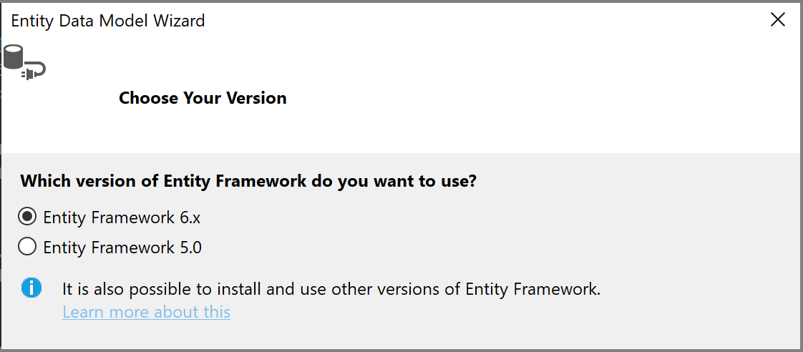
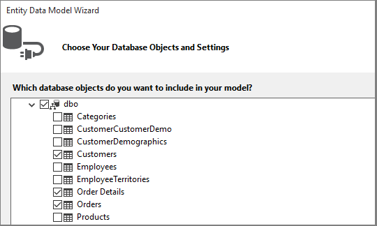
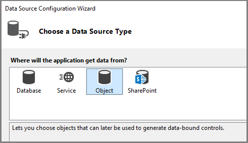

# Create a simple data application with WPF and Entity Framework 6

::: moniker range="vs-2022"
> [!WARNING]
> If you're using Visual Studio 2022, you should use Visual Studio 2022 version 17.3 Preview 3 or later for this tutorial.
::: moniker-end

This walkthrough shows how to create a basic "forms over data" application in Visual Studio. The app uses SQL Server LocalDB, the Northwind database, Entity Framework 6 (not Entity Framework Core), and Windows Presentation Foundation for .NET Framework (not .NET Core or .NET 5 or later). It shows how to do basic databinding with a master-detail view, and it also has a custom Binding Navigator with buttons for **Move Next**, **Move Previous**, **Move to beginning**, **Move to end**, **Update** and **Delete**.

This article focuses on using data tools in Visual Studio, and does not attempt to explain the underlying technologies in any depth. It assumes that you have a basic familiarity with XAML, Entity Framework, and SQL. This example also does not demonstrate Model-View-ViewModel (MVVM) architecture, which is standard for WPF applications. However, you can copy this code into your own MVVM application with few modifications.

The final code for this tutorial can be found in GitHub at [Visual Studio Tutorial Samples - EF6](https://github.com/MicrosoftDocs/vs-tutorial-samples/tree/main/ef6).

## Install and connect to Northwind

This example uses SQL Server Express LocalDB and the Northwind sample database. If the ADO.NET data provider for that product supports Entity Framework, it should work with other SQL database products just as well.

1. If you don't have SQL Server Express LocalDB, install it through the **Visual Studio Installer**. In the **Visual Studio Installer**, you can install SQL Server Express LocalDB as part of the **Data storage and processing** workload, or as an individual component.

2. Install the Northwind sample database by following these steps:

    1. In Visual Studio, open the **SQL Server Object Explorer** window. (**SQL Server Object Explorer** is installed as part of the **Data storage and processing** workload in the **Visual Studio Installer**.) Expand the **SQL Server** node. Right-click on your LocalDB instance and select **New Query**.

       A query editor window opens.

    2. Copy the [Northwind Transact-SQL script](https://github.com/MicrosoftDocs/visualstudio-docs/blob/main/docs/data-tools/samples/northwind.sql?raw=true) to your clipboard. This T-SQL script creates the Northwind database from scratch and populates it with data.

    3. Paste the T-SQL script into the query editor, and then choose the **Execute** button.

       After a short time, the query finishes running and the Northwind database is created.

3. [Add new connections](../data-tools/add-new-connections.md) for Northwind.

## Configure the project

1. In Visual Studio, create a new C# **WPF App (.NET Framework)** project.

1. Add the NuGet package for Entity Framework 6. In **Solution Explorer**, select the project node. In the main menu, choose **Project** > **Manage NuGet Packages**.

1. In the **NuGet Package Manager**, click on the **Browse** link. Entity Framework is probably the top package in the list. Click **Install** in the right pane and follow the prompts. The Output window tells you when the install is finished.

    :::moniker range="<=vs-2019"
     
    :::moniker-end
    :::moniker range=">=vs-2022"
     
    :::moniker-end

1. Now you can use Visual Studio to create a model based on the Northwind database.

## Create the model

1. Right-click on the project node in **Solution Explorer** and choose **Add** > **New Item**. In the left pane, under the C# node, choose **Data** and in the middle pane, choose **ADO.NET Entity Data Model**.

   :::moniker range="<=vs-2019"
   
   :::moniker-end
   :::moniker range=">=vs-2022"
   
   :::moniker-end

1. Call the model `Northwind_model` and choose **Add**. The **Entity Data Model Wizard** opens. Choose **EF Designer from database**, and then select **Next**.

   

1. In the next screen, choose your LocalDB Northwind connection (for example, (localdb)\MSSQLLocalDB), specify the Northwind database, and click **Next**.

   If you don't see a connection, choose **New Connection**, then in the **Choose Data Source** dialog box, choose **Microsoft SQL Server**, choose **Continue** and in the **Connection Properties** dialog box, enter `(localdb)\MSSQLLocalDB` and under **Select or enter a database name**, choose **Northwind**, then press **OK**.

1. If prompted, choose the version of Entity Framework you are using.

   

1. In the next page of the wizard, choose which tables, stored procedures, and other database objects to include in the Entity Framework model. Expand the dbo node in the tree view and choose **Customers**, **Orders**, and **Order Details**. Leave the defaults checked and click **Finish**.

    

1. The wizard generates the C# classes that represent the Entity Framework model. The classes are plain old C# classes and they are what we databind to the WPF user interface. The `.edmx` file describes the relationships and other metadata that associates the classes with objects in the database. The `.tt` files are T4 templates that generate the code that operates on the model and saves changes to the database. You can see all these files in **Solution Explorer** under the Northwind_model node:

      :::moniker range="<=vs-2019"
      
      :::moniker-end
      :::moniker range=">=vs-2022"
      
      :::moniker-end

    The designer surface for the `.edmx` file enables you to modify some properties and relationships in the model. We are not going to use the designer in this walkthrough.

1. The `.tt` files are general purpose and you need to tweak one of them to work with WPF databinding, which requires ObservableCollections. In **Solution Explorer**, expand the Northwind_model node until you find *Northwind_model.tt*. (Make sure you are not in the *.Context.tt* file, which is directly below the `.edmx` file.)

   - Replace the two occurrences of <xref:System.Collections.ICollection> with <xref:System.Collections.ObjectModel.ObservableCollection%601>.

   - Replace the first occurrence of <xref:System.Collections.Generic.HashSet%601> with <xref:System.Collections.ObjectModel.ObservableCollection%601> around line 51. Do not replace the second occurrence of HashSet.

   - Replace the only occurrence of <xref:System.Collections.Generic> (around line 431) with <xref:System.Collections.ObjectModel>.

1. Press **F5** or **Ctrl**+**F5** to build and run the project. When the application first runs, the model classes are visible to the data sources wizard.

Now you are ready to hook up this model to the XAML page so that you can view, navigate, and modify the data.

## Databind the model to the XAML page

It is possible to write your own databinding code, but it is much easier to let Visual Studio do it for you.

1. From the main menu, choose **Project** > **Add new data source** to bring up the **Data Source Configuration Wizard**. Choose **Object** because you are binding to the model classes, not to the database:

     

1. Expand the node for your project, and select **Customer**. (Sources for Orders are automatically generated from the Orders navigation property in Customer.)

     :::moniker range="<=vs-2019"
     
     :::moniker-end
     :::moniker range=">=vs-2022"
     
     :::moniker-end

1. Click **Finish**.

1. Navigate to *MainWindow.xaml* in Code View. We're keeping the XAML simple for the purposes of this example. Change the title of MainWindow to something more descriptive, and increase its Height and Width to 600 x 800 for now. You can always change it later. Now add these three row definitions to the main grid, one row for the navigation buttons, one for the customer's details, and one for the grid that shows their orders:

    ```xaml
        <Grid.RowDefinitions>
            <RowDefinition Height="auto"/>
            <RowDefinition Height="auto"/>
            <RowDefinition Height="*"/>
        </Grid.RowDefinitions>
    ```

1. Now open *MainWindow.xaml* so that you're viewing it in the designer. This causes the **Data Sources** window to appear as an option in the Visual Studio window margin next to the **Toolbox**. Click on the tab to open the window, or else press **Shift**+**Alt**+**D** or choose **View** > **Other Windows** > **Data Sources**. We are going to display each property in the Customers class in its own individual text box. First, click on the arrow in the **Customers** combo box and choose **Details**. Then, drag the node onto the middle part of the design surface so that the designer knows you want it to go in the middle row. If you misplace it, you can specify the row manually later in the XAML (`Grid.Row="1"`). By default, the controls are placed vertically in a grid element, but at this point, you can arrange them however you like on the form. For example, it might make sense to put the **Name** text box on top, above the address. The sample application for this article reorders the fields and rearranges them into two columns.

     :::moniker range="<=vs-2019"
     
     ::: moniker-end
     :::moniker range=">=vs-2022"
     
     :::moniker-end

     In the XAML view, you can now see a new `Grid` element in row 1 (the middle row) of the parent Grid. The parent Grid has a `DataContext` attribute that refers to a <xref:System.Windows.Data.CollectionViewSource> that's been added to the `Windows.Resources` element. Given that data context, when the first text box binds to **Address**, that name is mapped to the `Address` property in the current `Customer` object in the `CollectionViewSource`.

    ```xaml
    <Grid DataContext="{StaticResource customerViewSource}">
    ```

1. When a customer is visible in the top half of the window, you want to see their orders in the bottom half. You show the orders in a single grid view control. For master-detail databinding to work as expected, it is important that you bind to the Orders property in the Customers class, not to the separate Orders node. Drag the Orders property of the Customers class to the lower half of the form, so that the designer puts it in row 2:

     :::moniker range="vs-2019"
     
     :::moniker-end
     :::moniker range=">=vs-2022"
     
     :::moniker-end

1. Visual Studio has generated all the binding code that connects the UI controls to events in the model. All you need to do, in order to see some data, is to write some code to populate the model. First, navigate to *MainWindow.xaml.cs* and add a data member to the MainWindow class for the data context. This object, which has been generated for you, acts something like a control that tracks changes and events in the model. You'll also add CollectionViewSource data members for customers and orders, and the associated constructor initialization logic to the existing constructor `MainWindow()`. The top of the class should look like this:

     :::code language="csharp" source="../data-tools/codesnippet/CSharp/CreateWPFDataApp/MainWindow.xaml.cs" id="Snippet1":::

     If it's not there already, add a `using` directive for System.Data.Entity to bring the `Load` extension method into scope:

     ```csharp
     using System.Data.Entity;
     ```

     Now, scroll down and find the `Window_Loaded` event handler. Notice that Visual Studio has added a CollectionViewSource object. This represents the NorthwindEntities object that you selected when you created the model. You added that already, so you don't need it here. Let's replace the code in `Window_Loaded` so that the method now looks like this:

     :::code language="csharp" source="../data-tools/codesnippet/CSharp/CreateWPFDataApp/MainWindow.xaml.cs" id="Snippet2":::

1. Press **F5**. You should see the details for the first customer that was retrieved into the CollectionViewSource. You should also see their orders in the data grid. The formatting isn't great, so let's fix that up. You can also create a way to view the other records and do basic create, read, update, and delete (CRUD) operations.

## Adjust the page design and add grids for new customers and orders

The default arrangement produced by Visual Studio is not ideal for your application, so we'll provide the final XAML here to copy into your code. You also need some "forms" (which are actually Grids) to enable the user to add a new customer or order. In order to be able to add a new customer and order, you need a separate set of text boxes that are not data-bound to the `CollectionViewSource`. You'll control which grid the user sees at any given time by setting the Visible property in the handler methods. Finally, you add a Delete button to each row in the Orders grid to enable the user to delete an individual order.

First, add these styles to the `Windows.Resources` element in *MainWindow.xaml*:

```xaml
<Style x:Key="Label" TargetType="{x:Type Label}" BasedOn="{x:Null}">
    <Setter Property="HorizontalAlignment" Value="Left"/>
    <Setter Property="VerticalAlignment" Value="Center"/>
    <Setter Property="Margin" Value="3"/>
    <Setter Property="Height" Value="23"/>
</Style>
<Style x:Key="CustTextBox" TargetType="{x:Type TextBox}" BasedOn="{x:Null}">
    <Setter Property="HorizontalAlignment" Value="Right"/>
    <Setter Property="VerticalAlignment" Value="Center"/>
    <Setter Property="Margin" Value="3"/>
    <Setter Property="Height" Value="26"/>
    <Setter Property="Width" Value="120"/>
</Style>
```

Next, replace the entire outer Grid with this markup:

```xaml
<Grid>
     <Grid.RowDefinitions>
         <RowDefinition Height="auto"/>
         <RowDefinition Height="auto"/>
         <RowDefinition Height="*"/>
     </Grid.RowDefinitions>
     <Grid x:Name="existingCustomerGrid" Grid.Row="1" HorizontalAlignment="Left" Margin="5" Visibility="Visible" VerticalAlignment="Top" Background="AntiqueWhite" DataContext="{StaticResource customerViewSource}">
         <Grid.ColumnDefinitions>
             <ColumnDefinition Width="Auto" MinWidth="233"/>
             <ColumnDefinition Width="Auto" MinWidth="397"/>
         </Grid.ColumnDefinitions>
         <Grid.RowDefinitions>
             <RowDefinition Height="Auto"/>
             <RowDefinition Height="Auto"/>
             <RowDefinition Height="Auto"/>
             <RowDefinition Height="Auto"/>
             <RowDefinition Height="Auto"/>
             <RowDefinition Height="Auto"/>
         </Grid.RowDefinitions>
         <Label Content="Customer ID:" Grid.Row="0" Style="{StaticResource Label}"/>
         <TextBox x:Name="customerIDTextBox" Grid.Row="0" Style="{StaticResource CustTextBox}"
                  Text="{Binding CustomerID, Mode=TwoWay, NotifyOnValidationError=true, ValidatesOnExceptions=true}"/>
         <Label Content="Company Name:" Grid.Row="1" Style="{StaticResource Label}"/>
         <TextBox x:Name="companyNameTextBox" Grid.Row="1" Style="{StaticResource CustTextBox}"
                  Text="{Binding CompanyName, Mode=TwoWay, NotifyOnValidationError=true, ValidatesOnExceptions=true}"/>
         <Label Content="Contact Name:" Grid.Row="2" Style="{StaticResource Label}"/>
         <TextBox x:Name="contactNameTextBox" Grid.Row="2" Style="{StaticResource CustTextBox}"
                  Text="{Binding ContactName, Mode=TwoWay, NotifyOnValidationError=true, ValidatesOnExceptions=true}"/>
         <Label Content="Contact title:" Grid.Row="3" Style="{StaticResource Label}"/>
         <TextBox x:Name="contactTitleTextBox" Grid.Row="3" Style="{StaticResource CustTextBox}"
                  Text="{Binding ContactTitle, Mode=TwoWay, NotifyOnValidationError=true, ValidatesOnExceptions=true}"/>
         <Label Content="Address:" Grid.Row="4" Style="{StaticResource Label}"/>
         <TextBox x:Name="addressTextBox" Grid.Row="4" Style="{StaticResource CustTextBox}"
                  Text="{Binding Address, Mode=TwoWay, NotifyOnValidationError=true, ValidatesOnExceptions=true}"/>
         <Label Content="City:" Grid.Column="1" Grid.Row="0" Style="{StaticResource Label}"/>
         <TextBox x:Name="cityTextBox" Grid.Column="1" Grid.Row="0" Style="{StaticResource CustTextBox}"
                  Text="{Binding City, Mode=TwoWay, NotifyOnValidationError=true, ValidatesOnExceptions=true}"/>
         <Label Content="Country:" Grid.Column="1" Grid.Row="1" Style="{StaticResource Label}"/>
         <TextBox x:Name="countryTextBox" Grid.Column="1" Grid.Row="1" Style="{StaticResource CustTextBox}"
                  Text="{Binding Country, Mode=TwoWay, NotifyOnValidationError=true, ValidatesOnExceptions=true}"/>
         <Label Content="Fax:" Grid.Column="1" Grid.Row="2" Style="{StaticResource Label}"/>
         <TextBox x:Name="faxTextBox" Grid.Column="1" Grid.Row="2" Style="{StaticResource CustTextBox}"
                  Text="{Binding Fax, Mode=TwoWay, NotifyOnValidationError=true, ValidatesOnExceptions=true}"/>
         <Label Content="Phone:" Grid.Column="1" Grid.Row="3" Style="{StaticResource Label}"/>
         <TextBox x:Name="phoneTextBox" Grid.Column="1" Grid.Row="3" Style="{StaticResource CustTextBox}"
                  Text="{Binding Phone, Mode=TwoWay, NotifyOnValidationError=true, ValidatesOnExceptions=true}"/>
         <Label Content="Postal Code:" Grid.Column="1" Grid.Row="4" VerticalAlignment="Center" Style="{StaticResource Label}"/>
         <TextBox x:Name="postalCodeTextBox" Grid.Column="1" Grid.Row="4" Style="{StaticResource CustTextBox}"
                  Text="{Binding PostalCode, Mode=TwoWay, NotifyOnValidationError=true, ValidatesOnExceptions=true}"/>
         <Label Content="Region:" Grid.Column="1" Grid.Row="5" Style="{StaticResource Label}"/>
         <TextBox x:Name="regionTextBox" Grid.Column="1" Grid.Row="5" Style="{StaticResource CustTextBox}"
                  Text="{Binding Region, Mode=TwoWay, NotifyOnValidationError=true, ValidatesOnExceptions=true}"/>
     </Grid>
     <Grid x:Name="newCustomerGrid" Grid.Row="1" HorizontalAlignment="Left" VerticalAlignment="Top" Margin="5" DataContext="{Binding RelativeSource={RelativeSource FindAncestor, AncestorType={x:Type Window}}, Path=newCustomer, UpdateSourceTrigger=Explicit}" Visibility="Collapsed" Background="CornflowerBlue">
         <Grid.ColumnDefinitions>
             <ColumnDefinition Width="Auto" MinWidth="233"/>
             <ColumnDefinition Width="Auto" MinWidth="397"/>
         </Grid.ColumnDefinitions>
         <Grid.RowDefinitions>
             <RowDefinition Height="Auto"/>
             <RowDefinition Height="Auto"/>
             <RowDefinition Height="Auto"/>
             <RowDefinition Height="Auto"/>
             <RowDefinition Height="Auto"/>
             <RowDefinition Height="Auto"/>
         </Grid.RowDefinitions>
         <Label Content="Customer ID:" Grid.Row="0" Style="{StaticResource Label}"/>
         <TextBox x:Name="add_customerIDTextBox" Grid.Row="0" Style="{StaticResource CustTextBox}"
                  Text="{Binding CustomerID, Mode=TwoWay, NotifyOnValidationError=true, ValidatesOnExceptions=true}"/>
         <Label Content="Company Name:" Grid.Row="1" Style="{StaticResource Label}"/>
         <TextBox x:Name="add_companyNameTextBox" Grid.Row="1" Style="{StaticResource CustTextBox}"
                  Text="{Binding CompanyName, Mode=TwoWay, NotifyOnValidationError=true, ValidatesOnExceptions=true }"/>
         <Label Content="Contact Name:" Grid.Row="2" Style="{StaticResource Label}"/>
         <TextBox x:Name="add_contactNameTextBox" Grid.Row="2" Style="{StaticResource CustTextBox}"
                  Text="{Binding ContactName, Mode=TwoWay, NotifyOnValidationError=true, ValidatesOnExceptions=true}"/>
         <Label Content="Contact title:" Grid.Row="3" Style="{StaticResource Label}"/>
         <TextBox x:Name="add_contactTitleTextBox" Grid.Row="3" Style="{StaticResource CustTextBox}"
                  Text="{Binding ContactTitle, Mode=TwoWay, NotifyOnValidationError=true, ValidatesOnExceptions=true}"/>
         <Label Content="Address:" Grid.Row="4" Style="{StaticResource Label}"/>
         <TextBox x:Name="add_addressTextBox" Grid.Row="4" Style="{StaticResource CustTextBox}"
                  Text="{Binding Address, Mode=TwoWay, NotifyOnValidationError=true, ValidatesOnExceptions=true}"/>
         <Label Content="City:" Grid.Column="1" Grid.Row="0" Style="{StaticResource Label}"/>
         <TextBox x:Name="add_cityTextBox" Grid.Column="1" Grid.Row="0" Style="{StaticResource CustTextBox}"
                  Text="{Binding City, Mode=TwoWay, NotifyOnValidationError=true, ValidatesOnExceptions=true}"/>
         <Label Content="Country:" Grid.Column="1" Grid.Row="1" Style="{StaticResource Label}"/>
         <TextBox x:Name="add_countryTextBox" Grid.Column="1" Grid.Row="1" Style="{StaticResource CustTextBox}"
                  Text="{Binding Country, Mode=TwoWay, NotifyOnValidationError=true, ValidatesOnExceptions=true}"/>
         <Label Content="Fax:" Grid.Column="1" Grid.Row="2" Style="{StaticResource Label}"/>
         <TextBox x:Name="add_faxTextBox" Grid.Column="1" Grid.Row="2" Style="{StaticResource CustTextBox}"
                  Text="{Binding Fax, Mode=TwoWay, NotifyOnValidationError=true, ValidatesOnExceptions=true}"/>
         <Label Content="Phone:" Grid.Column="1" Grid.Row="3" Style="{StaticResource Label}"/>
         <TextBox x:Name="add_phoneTextBox" Grid.Column="1" Grid.Row="3" Style="{StaticResource CustTextBox}"
                  Text="{Binding Phone, Mode=TwoWay, NotifyOnValidationError=true, ValidatesOnExceptions=true}"/>
         <Label Content="Postal Code:" Grid.Column="1" Grid.Row="4" VerticalAlignment="Center" Style="{StaticResource Label}"/>
         <TextBox x:Name="add_postalCodeTextBox" Grid.Column="1" Grid.Row="4" Style="{StaticResource CustTextBox}"
                  Text="{Binding PostalCode, Mode=TwoWay, NotifyOnValidationError=true, ValidatesOnExceptions=true}"/>
         <Label Content="Region:" Grid.Column="1" Grid.Row="5" Style="{StaticResource Label}"/>
         <TextBox x:Name="add_regionTextBox" Grid.Column="1" Grid.Row="5" Style="{StaticResource CustTextBox}"
                  Text="{Binding Region, Mode=TwoWay, NotifyOnValidationError=true, ValidatesOnExceptions=true}"/>
     </Grid>
     <Grid x:Name="newOrderGrid" Grid.Row="1" HorizontalAlignment="Left" VerticalAlignment="Top" Margin="5" DataContext="{Binding Path=newOrder, Mode=TwoWay}" Visibility="Collapsed" Background="LightGreen">
         <Grid.ColumnDefinitions>
             <ColumnDefinition Width="Auto" MinWidth="233"/>
             <ColumnDefinition Width="Auto" MinWidth="397"/>
         </Grid.ColumnDefinitions>
         <Grid.RowDefinitions>
             <RowDefinition Height="Auto"/>
             <RowDefinition Height="Auto"/>
             <RowDefinition Height="Auto"/>
             <RowDefinition Height="Auto"/>
             <RowDefinition Height="Auto"/>
             <RowDefinition Height="Auto"/>
             <RowDefinition Height="Auto"/>
         </Grid.RowDefinitions>
         <Label Content="New Order Form" FontWeight="Bold"/>
         <Label Content="Employee ID:"  Grid.Row="1" Style="{StaticResource Label}"/>
         <TextBox x:Name="add_employeeIDTextBox" Grid.Row="1" Style="{StaticResource CustTextBox}"
                  Text="{Binding EmployeeID, Mode=TwoWay, NotifyOnValidationError=true, ValidatesOnExceptions=true}"/>
         <Label Content="Order Date:"  Grid.Row="2" Style="{StaticResource Label}"/>
         <DatePicker x:Name="add_orderDatePicker" Grid.Row="2"  HorizontalAlignment="Right" Width="120"
                 SelectedDate="{Binding OrderDate, Mode=TwoWay, NotifyOnValidationError=true, ValidatesOnExceptions=true, UpdateSourceTrigger=PropertyChanged}"/>
         <Label Content="Required Date:" Grid.Row="3" Style="{StaticResource Label}"/>
         <DatePicker x:Name="add_requiredDatePicker" Grid.Row="3" HorizontalAlignment="Right" Width="120"
                  SelectedDate="{Binding RequiredDate, Mode=TwoWay, NotifyOnValidationError=true, ValidatesOnExceptions=true, UpdateSourceTrigger=PropertyChanged}"/>
         <Label Content="Shipped Date:"  Grid.Row="4"  Style="{StaticResource Label}"/>
         <DatePicker x:Name="add_shippedDatePicker"  Grid.Row="4"  HorizontalAlignment="Right" Width="120"
                 SelectedDate="{Binding ShippedDate, Mode=TwoWay, NotifyOnValidationError=true, ValidatesOnExceptions=true, UpdateSourceTrigger=PropertyChanged}"/>
         <Label Content="Ship Via:"  Grid.Row="5" Style="{StaticResource Label}"/>
         <TextBox x:Name="add_ShipViaTextBox"  Grid.Row="5" Style="{StaticResource CustTextBox}"
                  Text="{Binding ShipVia, Mode=TwoWay, NotifyOnValidationError=true, ValidatesOnExceptions=true}"/>
         <Label Content="Freight"  Grid.Row="6" Style="{StaticResource Label}"/>
         <TextBox x:Name="add_freightTextBox" Grid.Row="6" Style="{StaticResource CustTextBox}"
                  Text="{Binding Freight, Mode=TwoWay, NotifyOnValidationError=true, ValidatesOnExceptions=true}"/>
     </Grid>
     <DataGrid x:Name="ordersDataGrid" SelectionUnit="Cell" SelectionMode="Single" AutoGenerateColumns="False" CanUserAddRows="false" IsEnabled="True" EnableRowVirtualization="True" Width="auto" ItemsSource="{Binding Source={StaticResource customerOrdersViewSource}}" Margin="10,10,10,10" Grid.Row="2" RowDetailsVisibilityMode="VisibleWhenSelected">
         <DataGrid.Columns>
             <DataGridTemplateColumn>
                 <DataGridTemplateColumn.CellTemplate>
                     <DataTemplate>
                         <Button Content="Delete" Command="{StaticResource DeleteOrderCommand}" CommandParameter="{Binding}"/>
                     </DataTemplate>
                 </DataGridTemplateColumn.CellTemplate>
             </DataGridTemplateColumn>
             <DataGridTextColumn x:Name="customerIDColumn" Binding="{Binding CustomerID}" Header="Customer ID" Width="SizeToHeader"/>
             <DataGridTextColumn x:Name="employeeIDColumn" Binding="{Binding EmployeeID}" Header="Employee ID" Width="SizeToHeader"/>
             <DataGridTextColumn x:Name="freightColumn" Binding="{Binding Freight}" Header="Freight" Width="SizeToHeader"/>
             <DataGridTemplateColumn x:Name="orderDateColumn" Header="Order Date" Width="SizeToHeader">
                 <DataGridTemplateColumn.CellTemplate>
                     <DataTemplate>
                         <DatePicker SelectedDate="{Binding OrderDate, Mode=TwoWay, NotifyOnValidationError=true, ValidatesOnExceptions=true, UpdateSourceTrigger=PropertyChanged}"/>
                     </DataTemplate>
                 </DataGridTemplateColumn.CellTemplate>
             </DataGridTemplateColumn>
             <DataGridTextColumn x:Name="orderIDColumn" Binding="{Binding OrderID}" Header="Order ID" Width="SizeToHeader"/>
             <DataGridTemplateColumn x:Name="requiredDateColumn" Header="Required Date" Width="SizeToHeader">
                 <DataGridTemplateColumn.CellTemplate>
                     <DataTemplate>
                         <DatePicker SelectedDate="{Binding RequiredDate, Mode=TwoWay, NotifyOnValidationError=true, ValidatesOnExceptions=true, UpdateSourceTrigger=PropertyChanged}"/>
                     </DataTemplate>
                 </DataGridTemplateColumn.CellTemplate>
             </DataGridTemplateColumn>
             <DataGridTextColumn x:Name="shipAddressColumn" Binding="{Binding ShipAddress}" Header="Ship Address" Width="SizeToHeader"/>
             <DataGridTextColumn x:Name="shipCityColumn" Binding="{Binding ShipCity}" Header="Ship City" Width="SizeToHeader"/>
             <DataGridTextColumn x:Name="shipCountryColumn" Binding="{Binding ShipCountry}" Header="Ship Country" Width="SizeToHeader"/>
             <DataGridTextColumn x:Name="shipNameColumn" Binding="{Binding ShipName}" Header="Ship Name" Width="SizeToHeader"/>
             <DataGridTemplateColumn x:Name="shippedDateColumn" Header="Shipped Date" Width="SizeToHeader">
                 <DataGridTemplateColumn.CellTemplate>
                     <DataTemplate>
                         <DatePicker SelectedDate="{Binding ShippedDate, Mode=TwoWay, NotifyOnValidationError=true, ValidatesOnExceptions=true, UpdateSourceTrigger=PropertyChanged}"/>
                     </DataTemplate>
                 </DataGridTemplateColumn.CellTemplate>
             </DataGridTemplateColumn>
             <DataGridTextColumn x:Name="shipPostalCodeColumn" Binding="{Binding ShipPostalCode}" Header="Ship Postal Code" Width="SizeToHeader"/>
             <DataGridTextColumn x:Name="shipRegionColumn" Binding="{Binding ShipRegion}" Header="Ship Region" Width="SizeToHeader"/>
             <DataGridTextColumn x:Name="shipViaColumn" Binding="{Binding ShipVia}" Header="Ship Via" Width="SizeToHeader"/>
         </DataGrid.Columns>
     </DataGrid>
 </Grid>
```

## Add buttons to navigate, add, update, and delete

In Windows Forms applications, you get a BindingNavigator object with buttons for navigating through rows in a database and doing basic CRUD operations. WPF does not provide a BindingNavigator, but it is easy enough to create one. You do that with buttons inside a horizontal StackPanel, and associate the buttons with Commands that are bound to methods in the code behind.

There are four parts to the command logic: (1) the commands, (2) the bindings, (3) the buttons, and (4) the command handlers in the code-behind.

### Add commands, bindings, and buttons in XAML

1. First, add the commands in the *MainWindow.xaml* file inside the `Windows.Resources` element:

    ```xaml
    <RoutedUICommand x:Key="FirstCommand" Text="First"/>
    <RoutedUICommand x:Key="LastCommand" Text="Last"/>
    <RoutedUICommand x:Key="NextCommand" Text="Next"/>
    <RoutedUICommand x:Key="PreviousCommand" Text="Previous"/>
    <RoutedUICommand x:Key="DeleteCustomerCommand" Text="Delete Customer"/>
    <RoutedUICommand x:Key="DeleteOrderCommand" Text="Delete Order"/>
    <RoutedUICommand x:Key="UpdateCommand" Text="Update"/>
    <RoutedUICommand x:Key="AddCommand" Text="Add"/>
    <RoutedUICommand x:Key="CancelCommand" Text="Cancel"/>
    ```

1. A CommandBinding maps a `RoutedUICommand` event to a method in the code behind. Add this `CommandBindings` element after the `Windows.Resources` closing tag:

    ```xaml
    <Window.CommandBindings>
        <CommandBinding Command="{StaticResource FirstCommand}" Executed="FirstCommandHandler"/>
        <CommandBinding Command="{StaticResource LastCommand}" Executed="LastCommandHandler"/>
        <CommandBinding Command="{StaticResource NextCommand}" Executed="NextCommandHandler"/>
        <CommandBinding Command="{StaticResource PreviousCommand}" Executed="PreviousCommandHandler"/>
        <CommandBinding Command="{StaticResource DeleteCustomerCommand}" Executed="DeleteCustomerCommandHandler"/>
        <CommandBinding Command="{StaticResource DeleteOrderCommand}" Executed="DeleteOrderCommandHandler"/>
        <CommandBinding Command="{StaticResource UpdateCommand}" Executed="UpdateCommandHandler"/>
        <CommandBinding Command="{StaticResource AddCommand}" Executed="AddCommandHandler"/>
        <CommandBinding Command="{StaticResource CancelCommand}" Executed="CancelCommandHandler"/>
    </Window.CommandBindings>
    ```

1. Now, add the `StackPanel` with the navigation, add, delete, and update buttons. First, add this style to `Windows.Resources`:

    ```xaml
    <Style x:Key="NavButton" TargetType="{x:Type Button}" BasedOn="{x:Null}">
        <Setter Property="FontSize" Value="24"/>
        <Setter Property="FontFamily" Value="Segoe UI Symbol"/>
        <Setter Property="Margin" Value="2,2,2,0"/>
        <Setter Property="Width" Value="40"/>
        <Setter Property="Height" Value="auto"/>
    </Style>
    ```

     Second, paste this code just after the `RowDefinitions` for the outer `Grid` element, toward the top of the XAML page:

    ```xaml
    <StackPanel Orientation="Horizontal" Margin="2,2,2,0" Height="36" VerticalAlignment="Top" Background="Gainsboro" DataContext="{StaticResource customerViewSource}" d:LayoutOverrides="LeftMargin, RightMargin, TopMargin, BottomMargin">
        <Button Name="btnFirst" Content="|◄" Command="{StaticResource FirstCommand}" Style="{StaticResource NavButton}"/>
        <Button Name="btnPrev" Content="◄" Command="{StaticResource PreviousCommand}" Style="{StaticResource NavButton}"/>
        <Button Name="btnNext" Content="►" Command="{StaticResource NextCommand}" Style="{StaticResource NavButton}"/>
        <Button Name="btnLast" Content="►|" Command="{StaticResource LastCommand}" Style="{StaticResource NavButton}"/>
        <Button Name="btnDelete" Content="Delete Customer" Command="{StaticResource DeleteCustomerCommand}" FontSize="11" Width="120" Style="{StaticResource NavButton}"/>
        <Button Name="btnAdd" Content="New Customer" Command="{StaticResource AddCommand}" FontSize="11" Width="80" Style="{StaticResource NavButton}"/>
        <Button Content="New Order" Name="btnNewOrder" FontSize="11" Width="80" Style="{StaticResource NavButton}" Click="NewOrder_click"/>
        <Button Name="btnUpdate" Content="Commit" Command="{StaticResource UpdateCommand}" FontSize="11" Width="80" Style="{StaticResource NavButton}"/>
        <Button Content="Cancel" Name="btnCancel" Command="{StaticResource CancelCommand}" FontSize="11" Width="80" Style="{StaticResource NavButton}"/>
    </StackPanel>
    ```

### Add command handlers to the MainWindow class

The code-behind is minimal except for the add and delete methods. Navigation is performed by calling methods on the View property of the CollectionViewSource. The `DeleteOrderCommandHandler` shows how to perform a cascade delete on an order. We have to first delete the Order_Details that are associated with it. The `UpdateCommandHandler` adds a new customer or order to the collection, or else just updates an existing customer or order with the changes that the user made in the text boxes.

Add these handler methods to the MainWindow class in *MainWindow.xaml.cs*. If your CollectionViewSource for the Customers table has a different name, then you need to adjust the name in each of these methods:

:::code language="csharp" source="../data-tools/codesnippet/CSharp/CreateWPFDataApp/MainWindow.xaml.cs" id="Snippet3":::

## Run the application

To start debugging, press **F5**. You should see customer and order data populated in the grid, and the navigation buttons should work as expected. Click on **Commit** to add a new customer or order to the model after you have entered the data. Click on **Cancel** to back out of a new customer or new order form without saving the data. You can make edits to existing customers and orders directly in the text boxes, and those changes are written to the model automatically.

## Related content

- [Visual Studio data tools for .NET](../data-tools/visual-studio-data-tools-for-dotnet.md)
- [Entity Framework documentation](/ef/)
