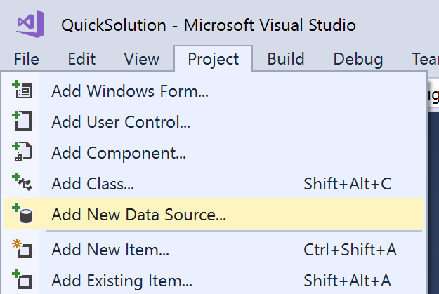
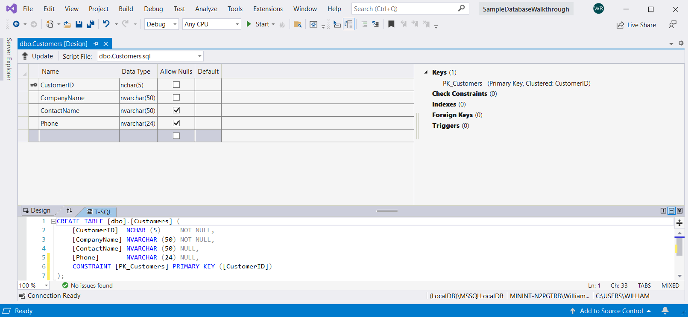
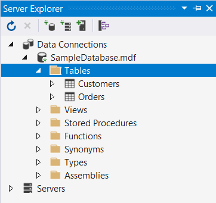
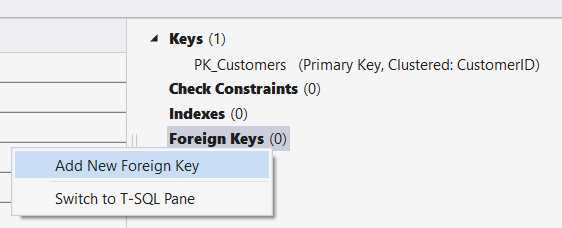

# Create a database and add tables in Visual Studio

You can use Visual Studio to create and update a local database file in SQL Server Express LocalDB. You can also create a database by executing Transact-SQL statements in the **SQL Server Object Explorer** tool window in Visual Studio. In this topic, we'll create an *.mdf* file and add tables and keys by using the Table Designer.

## Prerequisites

To complete this walkthrough, you'll need the **.NET desktop development** and **Data storage and processing** workloads installed in Visual Studio. To install them, open **Visual Studio Installer** and choose **Modify** (or **More** > **Modify**) next to the version of Visual Studio you want to modify.

## Create a project and a local database file

1. Create a new **Windows Forms App** project and name it **SampleDatabaseWalkthrough**.

2. On the menu bar, select **Project** > **Add New Item**.

3. In the list of item templates, scroll down and select **Service-based Database**.

   

4. Name the database **SampleDatabase**, and then click **Add**.

### Add a data source

1. If the **Data Sources** window isn't open, open it by pressing **Shift**+**Alt**+**D** or selecting **View** > **Other Windows** > **Data Sources** on the menu bar.

1. In the **Data Sources** window, select **Add New Data Source**.

   

   The **Data Source Configuration Wizard** opens.

1. On the **Choose a Data Source Type** page, choose **Database** and then choose **Next**.

1. On the **Choose a Database Model** page, choose **Next** to accept the default (Dataset).

1. On the **Choose Your Data Connection** page, select the **SampleDatabase.mdf** file in the drop-down list, and then choose **Next**.

1. On the **Save the Connection String to the Application Configuration File** page, choose **Next**.

1. On the **Choose your Database Objects** page, you'll see a message that says the database doesn't contain any objects. Choose **Finish**.

### View properties of the data connection

You can view the connection string for the *SampleDatabase.mdf* file by opening the Properties window of the data connection:

- Select **View** > **SQL Server Object Explorer** to open the **SQL Server Object Explorer** window. Expand **(localdb)\MSSQLLocalDB** > **Databases**, and then right-click on *SampleDatabase.mdf* and select **Properties**.

- Alternatively, you can select **View** > **Server Explorer**, if that window isn't already open. Open the Properties window by expanding the **Data Connections** node, right-clicking on *SampleDatabase.mdf*, and then selecting **Properties**.

  > [!TIP]
  > If you can't expand the Data Connections node, or the SampleDatabase.mdf connection is not listed, select the **Connect to Database** button in the Server Explorer toolbar. In the **Add Connection** dialog box, make sure that **Microsoft SQL Server Database File** is selected under **Data source**, and then browse to and select the SampleDatabase.mdf file. Finish adding the connection by selecting **OK**.

## Create tables and keys by using Table Designer

In this section, you'll create two tables, a primary key in each table, and a few rows of sample data. You'll also create a foreign key to specify how records in one table correspond to records in the other table.

### Create the Customers table

1. In **Server Explorer**, expand the **Data Connections** node, and then expand the **SampleDatabase.mdf** node.

   If you can't expand the Data Connections node, or the SampleDatabase.mdf connection is not listed, select the **Connect to Database** button in the Server Explorer toolbar. In the **Add Connection** dialog box, make sure that **Microsoft SQL Server Database File** is selected under **Data source**, and then browse to and select the SampleDatabase.mdf file. Finish adding the connection by selecting **OK**.

2. Right-click on **Tables** and select **Add New Table**.

   The Table Designer opens and shows a grid with one default row, which represents a single column in the table that you're creating. By adding rows to the grid, you'll add columns in the table.

3. In the grid, add a row for each of the following entries:

   |Column name|Data type|Allow nulls|
   |-----------------|---------------|-----------------|
   |`CustomerID`|`nchar(5)`|False (cleared)|
   |`CompanyName`|`nvarchar(50)`|False (cleared)|
   |`ContactName`|`nvarchar (50)`|True (selected)|
   |`Phone`|`nvarchar (24)`|True (selected)|

4. Right-click on the `CustomerID` row, and then select **Set Primary Key**.

5. Right-click on the default row (`Id`), and then select **Delete**.

6. Name the Customers table by updating the first line in the script pane to match the following sample:

   ```sql
   CREATE TABLE [dbo].[Customers]
   ```

   You should see something like this:

   

7. In the upper-left corner of **Table Designer**, select **Update**.

8. In the **Preview Database Updates** dialog box, select **Update Database**.

   The Customers table is created in the local database file.

### Create the Orders table

1. Add another table, and then add a row for each entry in the following table:

   |Column name|Data type|Allow nulls|
   |-----------------|---------------|-----------------|
   |`OrderID`|`int`|False (cleared)|
   |`CustomerID`|`nchar(5)`|False (cleared)|
   |`OrderDate`|`datetime`|True (selected)|
   |`OrderQuantity`|`int`|True (selected)|

2. Set **OrderID** as the primary key, and then delete the default row.

3. Name the Orders table by updating the first line in the script pane to match the following sample:

   ```sql
   CREATE TABLE [dbo].[Orders]
   ```

4. In the upper-left corner of the **Table Designer**, select **Update**.

5. In the **Preview Database Updates** dialog box, select **Update Database**.

   The Orders table is created in the local database file. If you expand the **Tables** node in Server Explorer, you see the two tables:

   

### Create a foreign key

1. In the context pane on the right side of the Table Designer grid for the Orders table, right-click on **Foreign Keys** and select **Add New Foreign Key**.

   

2. In the text box that appears, replace the text **ToTable** with **Customers**.

3. In the T-SQL pane, update the last line to match the following sample:

   ```sql
   CONSTRAINT [FK_Orders_Customers] FOREIGN KEY ([CustomerID]) REFERENCES [Customers]([CustomerID])
   ```

4. In the upper-left corner of the **Table Designer**, select **Update**.

5. In the **Preview Database Updates** dialog box, select **Update Database**.

   The foreign key is created.

## Populate the tables with data

1. In **Server Explorer** or **SQL Server Object Explorer**, expand the node for the sample database.

2. Open the shortcut menu for the **Tables** node, select **Refresh**, and then expand the **Tables** node.

3. Open the shortcut menu for the Customers table, and then select **Show Table Data**.

4. Add whatever data you want for some customers.

    You can specify any five characters you want as the customer IDs, but choose at least one that you can remember for use later in this procedure.

5. Open the shortcut menu for the Orders table, and then select **Show Table Data**.

6. Add data for some orders.

    > [!IMPORTANT]
    > Make sure that all order IDs and order quantities are integers and that each customer ID matches a value that you specified in the **CustomerID** column of the Customers table.

7. On the menu bar, select **File** > **Save All**.

## See also

- [Accessing data in Visual Studio](accessing-data-in-visual-studio.md)
