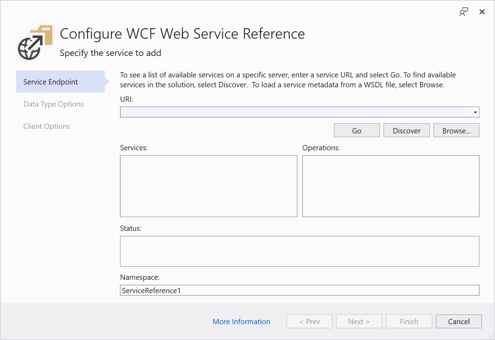

# Add, update, or remove a WCF data service reference

For .NET Framework projects, *service reference* enables a project to access one or more WCF Data Services. Use the **Add Service Reference** dialog box to search for WCF Data Services in the current solution, locally, on a local area network, or on the Internet.

For .NET Core projects, you can use the **Connected Services** node in **Solution Explorer** to access the **Microsoft WCF Web Service Reference Provider**, which lets you manage Windows Communication Foundation (WCF) data service references.

[!INCLUDE[note_settings_general](../data-tools/includes/note_settings_general_md.md)]

## Prerequisites

The WCF tools are not installed with the .NET workload; use the Visual Studio Installer to modify your installation. In the installer, choose **Windows Communication Foundation** under Individual Components. See [Modify Visual Studio](../install/modify-visual-studio.md).

## Add a WCF service reference

### To add a reference to an external service (.NET Framework projects)

1. In **Solution Explorer**, right-click the name of the project to which you want to add the service, and then select **Add Service Reference**.

   The **Add Service Reference** dialog box appears.

1. In the **Address** box, enter the URL for the service, and then select **Go** to search for the service. If the service implements user name and password security, you might be prompted for a user name and password. You can also choose a service in your own solution. Choose the **Discover** button, and then choose **Services in Solution**.

    > [!NOTE]
    > You should only reference services from a trusted source. Adding references from an untrusted source might compromise security.

     You can also select the URL from the **Address** list, which stores the previous 15 URLs at which valid service metadata was found.

     A progress bar displays when the search is being performed. You can stop the search at any time by clicking **Stop**.

1. In the **Services** list, expand the node for the service that you want to use and select an entity set.

1. In the **Namespace** box, enter the namespace that you want to use for the reference.

1. Click **OK** to add the reference to the project.

     A service client (proxy) is generated, and metadata that describes the service is added to the *app.config* file.

### To add a reference to an external service (.NET Core projects, including .NET 5 and later)

1. In **Solution Explorer**, double-click or tap the **Connected Services** node.

   The **Configure Services** tab opens.

1. Choose **Microsoft WCF Web Service Reference Provider**.

   The **Configure WCF Web Service Reference** dialog appears.

   

1. In the **URI** box, enter the URL for the service, and then select **Go** to search for the service. If the service implements user name and password security, you might be prompted for a user name and password.

    > [!NOTE]
    > You should only reference services from a trusted source. Adding references from an untrusted source might compromise security.

     You can also select the URL from the **URI** list, which stores the previous 15 URLs at which valid service metadata was found.

     A progress bar displays when the search is being performed. You can stop the search at any time by clicking **Stop**.

1. In the **Services** list, expand the node for the service that you want to use and select an entity set.

1. In the **Namespace** box, enter the namespace that you want to use for the reference.

1. Click **Finish** to add the reference to the project.

     A service client (proxy) is generated, and metadata that describes the service is added to the *app.config* file.

### To add a reference to a service in the current solution (.NET Framework projects)

1. In **Solution Explorer**, right-click the name of the project to which you want to add the service, and then select **Add Service Reference**.

    The **Add Service Reference** dialog box appears.

1. Click **Discover**.

    All services (both WCF Data Services and WCF services) in the current solution are added to the **Services** list.

1. In the **Services** list, expand the node for the service that you want to use and select an entity set.

1. In the **Namespace** box, enter the namespace that you want to use for the reference.

1. Click **OK** to add the reference to the project.

    A service client (proxy) generates, and metadata that describes the service is added to the *app.config* file.

### To add a reference to a service in the current solution (.NET Core projects)

1. In **Solution Explorer**, double-click or tap the **Connected Services** node.

   The **Configure Services** tab opens.

1. Choose **Microsoft WCF Web Service Reference Provider**.

   The **Configure WCF Web Service Reference** dialog appears.

1. Click **Discover**.

    All services (both WCF Data Services and WCF services) in the current solution are added to the **Services** list.

1. In the **Services** list, expand the node for the service that you want to use and select an entity set.

1. In the **Namespace** box, enter the namespace that you want to use for the reference.

1. Click **Finish** to add the reference to the project.

    A service client (proxy) generates, and metadata that describes the service is added to the *app.config* file.

## Update a service reference

The Entity Data Model for a WCF Data Services sometimes changes. When this happens, you must update the service reference.

### To update a service reference

:::moniker range="<=vs-2019"
- In **Solution Explorer**, right-click the service reference, and then select **Update Service Reference**.

     A progress dialog box displays while the reference is updated from its original location, and the service client is regenerated to reflect any changes in the metadata.
:::moniker-end
:::moniker range=">=vs-2022"

For .NET Core projects, use the `dotnet-svcutil` tool. See [dotnet-svcutil](/dotnet/core/additional-tools/dotnet-svcutil-guide?tabs=dotnetsvcutil2x) for installation and instructions.

For .NET Framework projects:

- In **Solution Explorer**, expand the **Connected Services** node, right-click the service reference, and then select **Update Service Reference**.

     A progress dialog box displays while the reference is updated from its original location, and the service client is regenerated to reflect any changes in the metadata.
:::moniker-end

## Remove a service reference

If a service reference is no longer being used, you can remove it from your solution.

### To remove a service reference

- In **Solution Explorer**, right-click the service reference, and then select **Delete**.

     The service client will be removed from the solution, and the metadata that describes the service will be removed from the *app.config* file.

    > [!NOTE]
    > Any code that references the service reference must be removed manually.

## Related content

- [Windows Communication Foundation Services and WCF data services in Visual Studio](../data-tools/windows-communication-foundation-services-and-wcf-data-services-in-visual-studio.md)
