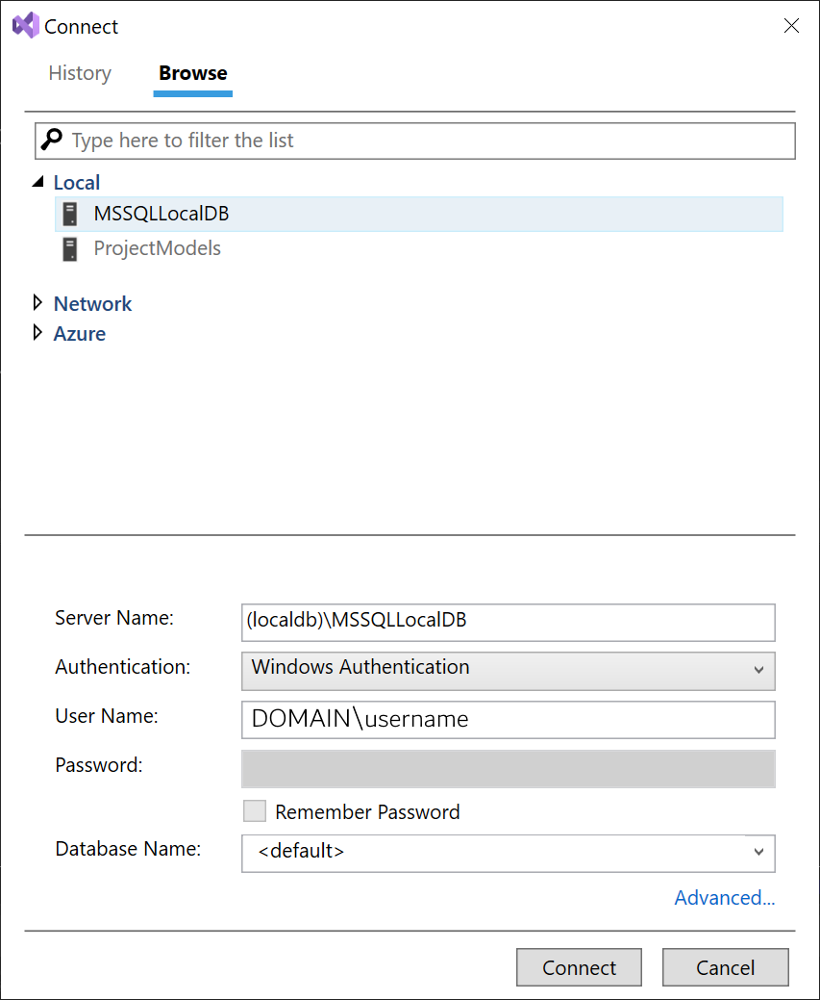

# Walkthrough: Create an n-tier data application with ADO.NET and the .NET Framework

[!INCLUDE [Data access tech note](./includes/data-technology-note.md)]

*N-tier* data applications are applications that access data and are separated into multiple logical layers, or *tiers*. Separating application components into discrete tiers increases the maintainability and scalability of the application. It does this by enabling easier adoption of new technologies that can be applied to a single tier without requiring you to redesign the whole solution. N-tier architecture includes a presentation tier, a middle-tier, and a data tier. The middle tier typically includes a data access layer, a business logic layer, and shared components such as authentication and validation. The data tier includes a relational database. N-tier applications usually store sensitive information in the data access layer of the middle-tier to maintain isolation from end users who access the presentation tier. For more information, see [N-tier data applications overview](../data-tools/n-tier-data-applications-overview.md).

One way to separate the various tiers in an n-tier application is to create discrete projects for each tier that you want to include in your application. Typed datasets contain a `DataSet Project` property that determines which projects the generated dataset and `TableAdapter` code should go into.

This walkthrough demonstrates how to separate dataset and `TableAdapter` code into discrete class library projects by using the **Dataset Designer**. After you separate the dataset and TableAdapter code, you create a [Windows Communication Foundation Services and WCF Data Services in Visual Studio](../data-tools/windows-communication-foundation-services-and-wcf-data-services-in-visual-studio.md) service to call into the data access tier. Finally, you create a Windows Forms application as the presentation tier. This tier accesses data from the data service.

During this walkthrough, you perform the following steps:

- Create a new n-tier solution that contains multiple projects.

- Add two class library projects to the n-tier solution.

- Create a typed dataset by using the **Data Source Configuration Wizard**.

- Separate the generated [TableAdapters](create-and-configure-tableadapters.md) and dataset code into discrete projects.

- Create a Windows Communication Foundation (WCF) service to call into the data access tier.

- Create functions in the service to retrieve data from the data access tier.

- Create a Windows Forms application to serve as the presentation tier.

- Create Windows Forms controls that are bound to the data source.

- Write code to populate the data tables.

## Prerequisites

To complete this tutorial, you need the **.NET desktop development** and **Data storage and processing** workloads installed in Visual Studio. To install them, open **Visual Studio Installer** and choose **Modify** (or **More** > **Modify**) next to the version of Visual Studio you want to modify. See [Modify Visual Studio](../install/modify-visual-studio.md).

This walkthrough uses SQL Server Express LocalDB and the Northwind sample database.

1. If you don't have SQL Server Express LocalDB, install it either from the [SQL Server Express download page](https://www.microsoft.com/sql-server/sql-server-downloads), or through the **Visual Studio Installer**. In the **Visual Studio Installer**, you can install SQL Server Express LocalDB as part of the **.NET desktop development** workload, or as an individual component.

2. Install the Northwind sample database by following these steps:

    :::moniker range="<=vs-2019"

    1. In Visual Studio, open the **SQL Server Object Explorer** window. (**SQL Server Object Explorer** is installed as part of the **Data storage and processing** workload in the Visual Studio Installer.) Expand the **SQL Server** node. Right-click on your LocalDB instance and select **New Query**.

       A query editor window opens.

    2. Copy the [Northwind Transact-SQL script](https://github.com/MicrosoftDocs/visualstudio-docs/blob/main/docs/data-tools/samples/northwind.sql?raw=true) to your clipboard. This T-SQL script creates the Northwind database from scratch and populates it with data.

    3. Paste the T-SQL script into the query editor, and then choose the **Execute** button.

       After a short time, the query finishes running and the Northwind database is created.
    ::: moniker-end
    ::: moniker range=">=vs-2022"
    1. In Visual Studio, open the **SQL Server Object Explorer** window. (**SQL Server Object Explorer** is installed as part of the **Data storage and processing** workload in the Visual Studio Installer.) Expand the **SQL Server** node. Right-click on your LocalDB instance and select **New Query**.

       If you don't see the LocalDB instance, use the toolbar button **Add SQL Server**. The dialog appears. In the dialog, expand **Local** and choose **MSSQLLocalDB**. Enter the appropriate credentials. You can leave the default choice for database.

       

    1. Choose **Connect**. A node is added for LocalDB in **SQL Server Object Explorer**.

    1. Right-click on your LocalDB instance and select **New Query**.

       A query editor window opens.

    2. Copy the [Northwind Transact-SQL script](https://github.com/MicrosoftDocs/visualstudio-docs/blob/main/docs/data-tools/samples/northwind.sql?raw=true) to your clipboard. This T-SQL script creates the Northwind database from scratch and populates it with data.

    3. Paste the T-SQL script into the query editor, and then choose the **Execute** button.

       After a short time, the query finishes running and the Northwind database is created.

    ::: moniker-end

## Create the n-tier solution and class library to hold the dataset (DataEntityTier)

The first step of this walkthrough is to create a solution and two class library projects. The first class library holds the dataset (the generated typed `DataSet` class and DataTables that hold the application's data). This project is used as the data entity layer of the application and is typically located in the middle tier. The dataset creates the initial dataset and automatically separates the code into the two class libraries.

> [!NOTE]
> Be sure to name the project and solution correctly before you click **OK**. Doing so will make it easier for you to complete this walkthrough.

### To create the n-tier solution and DataEntityTier class library

1. In Visual Studio, create a project using the **Windows Forms App (.NET Framework)** project template for C# or Visual Basic. .NET Core, .NET 5 and later are not supported.

4. Name the project **DataEntityTier**.

5. Name the solution **NTierWalkthrough**, and then choose **OK**.

     An NTierWalkthrough solution that contains the DataEntityTier project is created and added to **Solution Explorer**.

## Create the class library to hold the TableAdapters (DataAccessTier)

The next step after you create the DataEntityTier project is to create another class library project. This project holds the generated TableAdapters and is called the *data access tier* of the application. The data access tier contains the information that is required to connect to the database and is typically located in the middle tier.

### To create a separate class library for the TableAdapters

1. Right-click on the solution in **Solution Explorer** and choose **Add** > **New Project**.

2. Choose the **Class Library (.NET Framework)** project template.

3. Name the project **DataAccessTier** and choose **OK**.

     The DataAccessTier project is created and added to the NTierWalkthrough solution.

## Create the Dataset

The next step is to create a typed dataset. Typed datasets are created with both the dataset class (including `DataTables` classes) and the `TableAdapter` classes in a single project. (All classes are generated into a single file.) When you separate the dataset and TableAdapters into different projects, it is the dataset class that is moved to the other project, leaving the `TableAdapter` classes in the original project. Therefore, create the dataset in the project that will ultimately contain the TableAdapters (the DataAccessTier project). You create the dataset by using the **Data Source Configuration Wizard**.

> [!NOTE]
> You must have access to the Northwind sample database to create the connection. For information about how to set up the Northwind sample database, see [How to: Install sample databases](../data-tools/installing-database-systems-tools-and-samples.md).

### To create the dataset

1. Select the **DataAccessTier** in **Solution Explorer**.

2. On the **Data** menu, select **Show Data Sources**.

   The **Data Sources** window opens.

3. In the **Data Sources** window, select **Add New Data Source** to start the **Data Source Configuration Wizard**.

4. On the **Choose a Data Source Type** page, select **Database** and then select **Next**.

5. On the **Choose Your Data Connection** page, perform one of the following actions:

     If a data connection to the Northwind sample database is available in the dropdown list, select it.

      or

     Select **New Connection** to open the **Add Connection** dialog box.

6. If the database requires a password, select the option to include sensitive data, and then choose **Next**.

    > [!NOTE]
    > If you selected a local database file (instead of connecting to SQL Server) you might be asked if you want to add the file to the project. Choose **Yes** to add the database file to the project.

7. Select **Next** on the **Save the Connection String to the Application Configuration File** page.

8. Expand the **Tables** node on the **Choose Your Database Objects** page.

9. Select the checkboxes for the **Customers** and **Orders** tables, and then choose **Finish**.

     NorthwindDataSet is added to the DataAccessTier project and appears in the **Data Sources** window.

## Separate the TableAdapters from the Dataset

After you create the dataset, separate the generated dataset class from the TableAdapters. You do this by setting the **DataSet Project** property to the name of the project in which to store the separated out dataset class.

### To separate the TableAdapters from the Dataset

1. Double-click **NorthwindDataSet.xsd** in **Solution Explorer** to open the dataset in the **Dataset Designer**.

2. Select an empty area on the designer.

3. Locate the **DataSet Project** node in the **Properties** window.

4. In the **DataSet Project** list, select **DataEntityTier**.

5. On the **Build** menu, select **Build Solution**.

   The dataset and TableAdapters are separated into the two class library projects. The project that originally contained the whole dataset (`DataAccessTier`) now contains only the TableAdapters. The project designated in the **DataSet Project** property (`DataEntityTier`) contains the typed dataset: *NorthwindDataSet.Dataset.Designer.vb* (or *NorthwindDataSet.Dataset.Designer.cs*).

> [!NOTE]
> When you separate datasets and TableAdapters (by setting the **DataSet Project** property), existing partial dataset classes in the project will not be moved automatically. Existing dataset partial classes must be manually moved to the dataset project.

## Create a New Service Application

This walkthrough demonstrates how to access the data access tier by using a WCF service, so let's create a new WCF service application.

### To create a new WCF Service application

1. Right-click on the solution in **Solution Explorer** and choose **Add** > **New Project**.

2. In the **New Project** dialog box, in the left-hand pane, select **WCF**. In the middle pane, select **WCF Service Library**.

3. Name the project **DataService** and select **OK**.

     The DataService project is created and added to the NTierWalkthrough solution.

## Create methods in the data access tier to return the customers and orders data

The data service has to call two methods in the data access tier: `GetCustomers` and `GetOrders`. These methods return the Northwind `Customers` and `Orders` tables. Create the `GetCustomers` and `GetOrders` methods in the `DataAccessTier` project.

### To create a method in the data access tier that returns the Customers table

1. In **Solution Explorer**, double-click **NorthwindDataset.xsd** to open the dataset.

2. Right-click **CustomersTableAdapter** and click **Add Query**.

3. On the **Choose a Command Type** page, leave the default value of **Use SQL statements** and click **Next**.

4. On the **Choose a Query Type** page, leave the default value of **SELECT which returns rows** and click **Next**.

5. On the **Specify a SQL SELECT statement** page, leave the default query and click **Next**.

6. On the **Choose Methods to Generate** page, type **GetCustomers** for the **Method name** in the **Return a DataTable** section.

7. Click **Finish**.

### To create a method in the data access tier that returns the Orders table

1. Right-click **OrdersTableAdapter** and click **Add Query**.

2. On the **Choose a Command Type** page, leave the default value of **Use SQL statements** and click **Next**.

3. On the **Choose a Query Type** page, leave the default value of **SELECT which returns rows** and click **Next**.

4. On the **Specify a SQL SELECT statement** page, leave the default query and click **Next**.

5. On the **Choose Methods to Generate** page, type **GetOrders** for the **Method name** in the **Return a DataTable** section.

6. Click **Finish**.

7. On the **Build** menu, click **Build Solution**.

## Add a reference to the data entity and data access tiers to the data service

Because the data service requires information from the dataset and TableAdapters, add references to the **DataEntityTier** and **DataAccessTier** projects.

### To add references to the data service

1. Right-click **DataService** in **Solution Explorer** and click **Add Reference**.

2. Click the **Projects** tab in the **Add Reference** dialog box.

3. Select both the **DataAccessTier** and **DataEntityTier** projects.

4. Click **OK**.

## Add functions to the service to call the GetCustomers and GetOrders methods in the data access tier

Now that the data access tier contains the methods to return data, create methods in the data service to call the methods in the data access tier.

> [!NOTE]
> For C# projects, you must add a reference to the `System.Data.DataSetExtensions` assembly for the following code to compile.

### To create the GetCustomers and GetOrders functions in the data service

1. In the **DataService** project, double-click **IService1.vb** or **IService1.cs**.

2. Add the following code under the **Add your service operations here** comment:

    ### [C#](#tab/csharp)

    ```csharp
    [OperationContract]
    DataEntityTier.NorthwindDataSet.CustomersDataTable GetCustomers();

    [OperationContract]
    DataEntityTier.NorthwindDataSet.OrdersDataTable GetOrders();
    ```

    ### [VB](#tab/vb)

    ```vb
    <OperationContract()> _
    Function GetCustomers() As DataEntityTier.NorthwindDataSet.CustomersDataTable

    <OperationContract()> _
    Function GetOrders() As DataEntityTier.NorthwindDataSet.OrdersDataTable
    ```

    ---

   > [!NOTE]
   > The code for this tutorial is available in C# and Visual Basic. To switch the code language on this page between C# and Visual Basic, use the code language switcher at the top of the page on the right side.

3. In the DataService project, double-click **Service1.vb** (or **Service1.cs**).

4. Add the following code to the **Service1** class:

    ### [C#](#tab/csharp)

    ```csharp
    public DataEntityTier.NorthwindDataSet.CustomersDataTable GetCustomers()
    {
        DataAccessTier.NorthwindDataSetTableAdapters.CustomersTableAdapter
             CustomersTableAdapter1
            = new DataAccessTier.NorthwindDataSetTableAdapters.CustomersTableAdapter();
        return CustomersTableAdapter1.GetCustomers();
    }
    public DataEntityTier.NorthwindDataSet.OrdersDataTable GetOrders()
    {
        DataAccessTier.NorthwindDataSetTableAdapters.OrdersTableAdapter
             OrdersTableAdapter1
            = new DataAccessTier.NorthwindDataSetTableAdapters.OrdersTableAdapter();
        return OrdersTableAdapter1.GetOrders();
    }
    ```

    ### [VB](#tab/vb)

    ```vb
    Public Function GetCustomers() As DataEntityTier.NorthwindDataSet.CustomersDataTable Implements IService1.GetCustomers
        Dim CustomersTableAdapter1 As New DataAccessTier.NorthwindDataSetTableAdapters.CustomersTableAdapter
        Return CustomersTableAdapter1.GetCustomers()
    End Function

    Public Function GetOrders() As DataEntityTier.NorthwindDataSet.OrdersDataTable Implements IService1.GetOrders
        Dim OrdersTableAdapter1 As New DataAccessTier.NorthwindDataSetTableAdapters.OrdersTableAdapter
        Return OrdersTableAdapter1.GetOrders()
    End Function
    ```

    ---

5. On the **Build** menu, click **Build Solution**.

## Create a presentation tier to display data from the data service

Now that the solution contains the data service that has methods, which call into the data access tier, create another project that calls into the data service and present the data to users. For this walkthrough, create a Windows Forms application; this is the presentation tier of the n-tier application.

### To create the presentation tier project

1. Right-click on the solution in **Solution Explorer** and choose **Add** > **New Project**.

2. In the **New Project** dialog box, in the left-hand pane, select **Windows Desktop**. In the middle pane, select **Windows Forms App**.

3. Name the project **PresentationTier** and click **OK**.

    The PresentationTier project is created and added to the NTierWalkthrough solution.

## Set the PresentationTier project as the startup project

We'll set the **PresentationTier** project to be the startup project for the solution, because it's the actual client application that presents and interacts with the data.

### To set the new presentation tier project as the startup project

- In **Solution Explorer**, right-click **PresentationTier** and click **Set as StartUp Project**.

## Add References to the Presentation Tier

The client application, PresentationTier requires a service reference to the data service in order to access the methods in the service. In addition, a reference to the dataset is required to enable type sharing by the WCF service. Until you enable type sharing through the data service, code added to the partial dataset class is not available to the presentation tier. Because you typically add code, such as validation code to the row and column changing events of a data table, it's likely that you'll want to access this code from the client.

### To add a reference to the presentation tier

1. In **Solution Explorer**, right-click **PresentationTier** and select **Add Reference**.

2. In the **Add Reference** dialog box, select the **Projects** tab.

3. Select **DataEntityTier** and choose **OK**.

### To add a service reference to the presentation tier

1. In **Solution Explorer**, right-click **PresentationTier** and select **Add Service Reference**.

2. In the **Add Service Reference** dialog box, select **Discover**.

3. Select **Service1** and choose **OK**.

    > [!NOTE]
    > If you have multiple services on the current computer, select the service that you created previously in this walkthrough (the service that contains the `GetCustomers` and `GetOrders` methods).

## Add DataGridViews to the form to display the data returned by the data service

After you add the service reference to the data service, the **Data Sources** window is automatically populated with the data that is returned by the service.

### To add two data bound DataGridViews to the form

1. In **Solution Explorer**, select the **PresentationTier** project.

2. In the **Data Sources** window, expand **NorthwindDataSet** and locate the **Customers** node.

3. Drag the **Customers** node onto Form1.

4. In the **Data Sources** window, expand the **Customers** node and locate the related **Orders** node (the **Orders** node nested in the **Customers** node).

5. Drag the related **Orders** node onto Form1.

6. Create a `Form1_Load` event handler by double-clicking an empty area of the form.

7. Add the following code to the `Form1_Load` event handler.

    ### [C#](#tab/csharp)

    ```csharp
    ServiceReference1.Service1Client DataSvc =
        new ServiceReference1.Service1Client();
    northwindDataSet.Customers.Merge(DataSvc.GetCustomers());
    northwindDataSet.Orders.Merge(DataSvc.GetOrders());
    ```

    ### [VB](#tab/vb)

    ```vb
    Dim DataSvc As New ServiceReference1.Service1Client
    NorthwindDataSet.Customers.Merge(DataSvc.GetCustomers)
    NorthwindDataSet.Orders.Merge(DataSvc.GetOrders)
    ```

    ---

## Increase the maximum message size allowed by the service

The default value for `maxReceivedMessageSize` is not large enough to hold the data retrieved from the `Customers` and `Orders` tables. In the following steps, you'll increase the value to 6553600. You change the value on the client, which automatically updates the service reference.

> [!NOTE]
> The lower default size is intended to limit exposure to denial of service (DoS) attacks. For more information, see <xref:System.ServiceModel.WSHttpBindingBase.MaxReceivedMessageSize%2A>.

### To increase the maxReceivedMessageSize value

1. In **Solution Explorer**, double-click the **app.config** file in the **PresentationTier** project.

2. Locate the **maxReceivedMessageSize** attribute and change the value to `6553600`. If you don't see the `basicHttpBinding` entry, add one like the following example:

   ```xml
   <system.serviceModel>
    <bindings>
        <basicHttpBinding>
            <binding maxBufferSize="6553600" maxReceivedMessageSize="6553600" />
        </basicHttpBinding>
    </bindings>
   </system.serviceModel>
   ```

## Test the application

Run the application by pressing **F5**. The data from the `Customers` and `Orders` tables is retrieved from the data service and displayed on the form.

## Next steps

Depending on your application requirements, there are several steps that you might want to perform after you save related data in the Windows-based application. For example, you could make the following enhancements to this application:

- Add validation to the dataset.

- Add additional methods to the service for updating data back to the database.

## Related content

- [Work with datasets in n-tier applications](../data-tools/work-with-datasets-in-n-tier-applications.md)
- [Hierarchical update](../data-tools/hierarchical-update.md)
- [Accessing data in Visual Studio](../data-tools/accessing-data-in-visual-studio.md)
