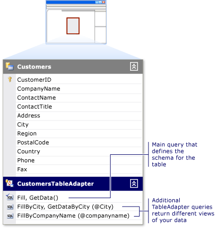

# Editing TableAdapters
Sometimes you might want to change the schema of the adapter's table. To do this, you modify the  adapter's primary `Fill` method. TableAdapters are created with a main `Fill` method that defines the schema of the associated data table. The main `Fill` method is based on the query or stored procedure you entered when you originally configured the TableAdapter; it is the first (topmost) method under the data table on the [Creating and Editing Typed Datasets](../datatools/creating-and-editing-typed-datasets.md).  
  
   
  
 Any changes that you make to the TableAdapter's main `Fill` method are reflected in the schema of the associated data table. For example, removing a column from the query in the main `Fill` method also removes the column from the associated data table. Additionally, removing the column from the main `Fill` method removes the column from any additional queries for that TableAdapter.  
  
 You can use the **TableAdapter Query Configuration Wizard** to create and edit additional queries for the TableAdapter. These additional queries must conform to the table schema, unless they return a scalar value.  The additional queries have a name that you specify (for example, `CustomersTableAdapter.FillByCity(NorthwindDataSet.Customers, "Seattle")`.)  
  
#### To start the TableAdapter Query Configuration wizard with a new query  
  
1.  Open your dataset in the **Dataset Designer**.  
  
2.  If you are creating a new query, drag a **Query** object from the **DataSet** tab of the **Toolbox** onto a \<xref:System.Data.DataTable>, or select **Add Query** from the TableAdapter's shortcut menu. You can also drag a **Query** object onto an empty area of the **Dataset Designer**, which creates a TableAdapter without an associated \<xref:System.Data.DataTable>. These queries are limited to returning single values (scalar), or executing UPDATE, INSERT, or DELETE commands against the database. For more information, see [How to: Add Global Queries to a TableAdapter](../datatools/how-to--add-global-queries-to-a-tableadapter.md).  
  
3.  On the **Choose Your Data Connection** page select or create the connection the query will use.  
  
    > [!NOTE]
    >  This page only appears when the designer cannot determine the proper connection to use, or when no connections are available.  
  
4.  On the **Choose a Command Type** page, select from the following methods of fetching data from the database:  
  
    -   **Use SQL statements** allows you to type a SQL statement to select the data from your database.  
  
    -   **Create new stored procedure** — Select this option to have the wizard create a new stored procedure (in the database) based on the specified SELECT statement.  
  
    -   **Use existing stored procedures** — Select this option to execute an existing stored procedure when running the query.  
  
#### To start the TableAdapter Query Configuration wizard on an existing query  
  
-   If you are editing an existing TableAdapter query, right-click the query, and choose **Configure** from the shortcut menu.  
  
    > [!NOTE]
    >  Right-clicking the main query of a TableAdapter reconfigures the TableAdapter and \<xref:System.Data.DataTable> schema, whereas right-clicking an additional query on a TableAdapter only configures the selected query. The **TableAdapter Configuration Wizard** reconfigures the TableAdapter definition; the **TableAdapter Query Configuration Wizard** reconfigures only the selected query.  
  
## Running the Wizard  
 Drag queries onto the **Dataset Designer**, or configure existing queries (any query listed below the first query).  
  
 The first query in a TableAdapter is the TableAdapter's main query. Editing this main query opens the **TableAdapter Configuration Wizard** and edits the schema of the TableAdapter's data table. All queries listed below the main query are additional queries and are configured using the **TableAdapter Query Configuration Wizard**. For more information on running the wizard, see [How to: Start the TableAdapter Query Configuration Wizard](../Topic/How%20to:%20Start%20the%20TableAdapter%20Query%20Configuration%20Wizard.md).  
  
## Choose Your Data Connection  
 Choose an existing connection from the list of connections or click **New Connection** to create a connection to your database.  
  
 Upon completion of the **Connection Properties** dialog box, the **Connection Details** area displays read-only information about the selected provider as well as the connection string.  
  
## Save the Connection String to the Application Configuration File  
 Choose **Yes, save the connection as** to store the connection string in the application configuration file. Type a name for the connection or use the provided default name.  
  
 Saving connection strings in the application configuration file simplifies the process of maintaining your application if the database connection changes. In the event of a change in the database connection, you can edit the connection string in the application configuration file. That way, you do not have to edit the source code and recompile your application. For information on editing a connection string in the application configuration file, see [How to: Save and Edit Connection Strings](../Topic/How%20to:%20Save%20and%20Edit%20Connection%20Strings.md).  
  
> [!IMPORTANT]
>  Information is stored in the application configuration file as plain text. To reduce the possibility of unauthorized access to sensitive information, you may want to encrypt your data. For more information, see [Encrypting and Decrypting Data](assetId:///22812ae8-e082-4eb1-a29b-21b6ee00c6b5).  
  
## Use SQL Statements  
 This section explains how to complete the **TableAdapter Query Configuration Wizard** when selecting the **Use SQL statements** option.  
  
## Choose a Query Type  
 The wizard creates several types of queries depending on the requirements of your application. You can choose SELECT queries that return rows of data (a data table) or SELECT queries that return a scalar value (a single value such as `Count` or `Sum`).  
  
 On the **Choose a Query Type** page, select the type of query to create from the list of available queries.  
  
> [!NOTE]
>  Creating an INSERT, UPDATE, or DELETE statement does not replace the TableAdapter's commands that are used when calling the TableAdapter's `Update` method. For example, selecting UPDATE as a query type will create a new query with a name you specify later in the wizard. You execute this query by calling this named method of the TableAdapter. Calling the TableAdapter's `Update` method will execute statements created when the original TableAdapter was configured.  
  
## Specify a SQL \<Query Type> Statement  
 On the **Specify a SQL Statement** page, type the SQL statement to execute when calling the query.  
  
> [!TIP]
>  The wizard provides access to the **Query Builder**, a visual tool for creating SQL queries. To open it, click the **Query Builder** button.  
  
## Choose Methods to Generate  
 This page provides options for selecting which methods the wizard generates for the query.  
  
 **Fill a DataTable**  
 Creates a method for filling the data table. You pass the name of the data table as a parameter when calling this method to fill the data table with the returned data.  
  
 Optionally, you can change the default name in the **Method Name** box. Providing a meaningful name can be helpful when working with this query in code.  
  
 **Return a DataTable**  
 Creates a method for returning a filled data table. In certain applications, it can be more desirable to return a filled data table as opposed to filling the existing data table with data.  
  
 Optionally, you can change the default name in the **Method Name** box.  
  
## Choose Function Name  
 Type a name for the function. Creating a TableAdapter query adds a method to the TableAdapter with the name provided here. Call this method to execute the query. Providing a meaningful name is helpful when working with this query in code.  
  
> [!NOTE]
>  When creating new stored procedures, you are asked for two names. The first name is the name of the stored procedure created in the database; the second name is the name of the method on the TableAdapter that executes the stored procedure when called.  
  
## Create New Stored Procedures  
 This section explains how to complete the **TableAdapter Query Configuration Wizard** when selecting the **Create new stored procedures** option.  
  
1.  In the **Generate the Stored Procedures** page, type the SQL statement to execute when calling the stored procedure.  
  
    > [!NOTE]
    >  The wizard provides access to the **Query Builder**, a visual tool for creating SQL queries. To open it, click the **Query Builder** button.  
  
2.  In the **Create the stored procedures** page, do the following:  
  
    1.  Type a name for the new stored procedure.  
  
    2.  Specify whether to create the stored procedure in the underlying database.  
  
        > [!NOTE]
        >  The ability to create a stored procedure in the database is determined by the security settings for the specific database.  
  
     The **View Wizard Results** page shows the results of creating the TableAdapter query. If the wizard encounters problems, this page provides the error information.  
  
## Use Existing Stored Procedures  
 This section explains how to complete the **TableAdapter Query Configuration Wizard** when selecting the **Use existing stored procedures** option.  
  
1.  Select an existing stored procedure from the drop-down list on the **Choose an existing stored procedure** page of the wizard.  
  
     The **Parameters** and **Results** for the selected stored procedure are displayed for reference.  
  
2.  Click **Next**.  
  
## Choose the Shape of Data Returned by the Stored Procedure  
 The type of data returned by the selected stored procedure determines how the wizard creates the TableAdapter methods.  
  
 Select the type of data returned by this query.  
  
-   Selecting **Tabular data** opens the **Choose Methods to Generate** page (described earlier on this Help page), which allows you to specify the types of methods, method names, and paging support to be created.  
  
-   Selecting **A single value** creates a typed method that returns a single value. This option opens the **Choose Function Name** page (described earlier on this Help page).  
  
-   Selecting **No value** creates a typed method that executes the stored procedure and expects no data to be returned. This option opens the **Choose Function Name** page (described earlier on this Help page).  
  
## View Wizards Results  
 The **View Wizard Results** page shows the results of creating the TableAdapter query. If the wizard encounters problems, the details are displayed on this page.  
  
## See Also  
 [TableAdapter Overview](../datatools/tableadapter-overview.md)   
 [How to: Edit TableAdapter Queries](../datatools/how-to--edit-tableadapter-queries.md)   
 [Data Walkthroughs](../Topic/Data%20Walkthroughs.md)   
 [Bind Windows Forms controls to data in Visual Studio](../datatools/bind-windows-forms-controls-to-data-in-visual-studio.md)   
 [Overview of Data Applications in Visual Studio](../datatools/overview-of-data-applications-in-visual-studio.md)   
 [Connecting to Data in Visual Studio](../datatools/connecting-to-data-in-visual-studio.md)   
 [Preparing Your Application to Receive Data](../Topic/Preparing%20Your%20Application%20to%20Receive%20Data.md)   
 [Fetching Data into Your Application](../datatools/fetching-data-into-your-application.md)   
 [Bind controls to data in Visual Studio](../datatools/bind-controls-to-data-in-visual-studio.md)   
 [Editing Data in Your Application](../datatools/editing-data-in-your-application.md)   
 [Validating Data](../Topic/Validating%20Data.md)   
 [Saving Data](../datatools/saving-data.md)