# Attach to a process running on a Docker container

You can debug apps running in either a Windows Docker Container or a Linux .NET Core Docker container using Visual Studio.

## Prerequisites

If it's not already present on the Linux server, you need to install SSH server, unzip and install with either curl or wget. For example, on Ubuntu you can do that by running:

```cmd
sudo apt-get install openssh-server unzip curl
```

Secure File Transfer Protocol (SFTP) must be enabled as well. Most SSH distributions install and enable SFTP by default, but that is not always the case.

## Attach to a process running on a Linux Docker container

You can attach the Visual Studio debugger to a process running in a Linux .NET Core Docker container on your local or remote machine using the **Attach to Process** dialog box.

> [!IMPORTANT]
> To use this feature, you must have local access to the source code.

> [!NOTE]
> You can use these instructions to attach to Linux Docker running in WSL over SSH, but your WSL instance must first run an SSH server. For example, you could install Open SSH Server (for example: `sudo apt-get install openssh-server`), configure the server by editing the configuration file (for example: /etc/ssh/sshd_config), and then start the server (for example: `sudo service ssh start`).

To attach to a running process in a Linux Docker container:

1. In Visual Studio, select **Debug > Attach to Process (CTRL+ALT+P)** to open the **Attach to Process** dialog box.

2. Set the **Connection type** to **Docker (Linux Container)**.

   ::: moniker range=">= vs-2022"
   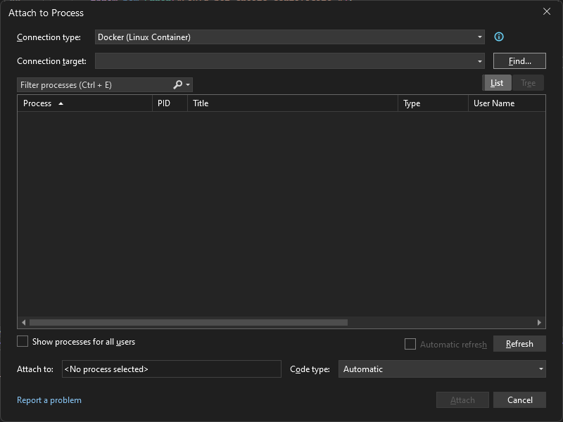
   ::: moniker-end
   ::: moniker range="vs-2019"
   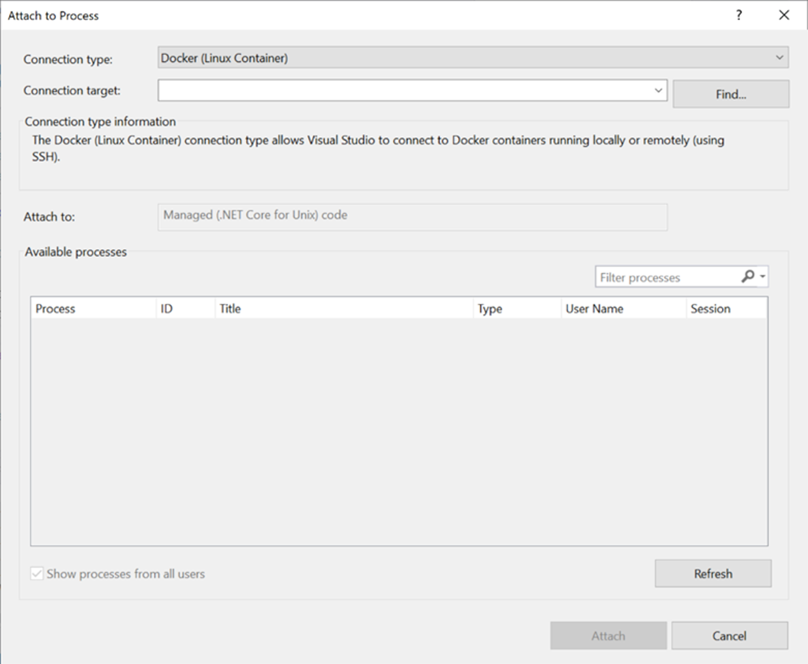
   ::: moniker-end

3. Select **Find...** to set the **Connection target** via the **Select Docker Container** dialog box.

    You can debug a Docker container process either locally or remotely.

    - To debug a Docker container process locally:

      1. Set **Docker CLI host** to **Local Machine**.
      1. Select a running container to attach to from the list and hit **OK**.

         ::: moniker range=">= vs-2022"
         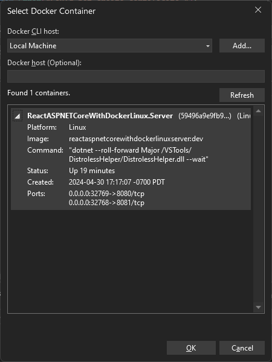
         ::: moniker-end
         ::: moniker range="vs-2019"
         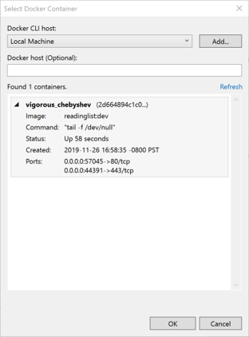
         ::: moniker-end

    - To debug a Docker container process remotely:

      You can connect to a running process in a Docker container using one of two options. The first option, to use SSH, is ideal if you don't have Docker tools installed on your local machine. If you do have Docker tools installed locally and you have a Docker daemon that's configured to accept remote requests, try the second option, using a Docker daemon.

      - To connect to a remote machine via SSH:

        1. Select **Add...** to connect to a remote system.
           ::: moniker range=">= vs-2022"
           
           ::: moniker-end
           ::: moniker range="vs-2019"
           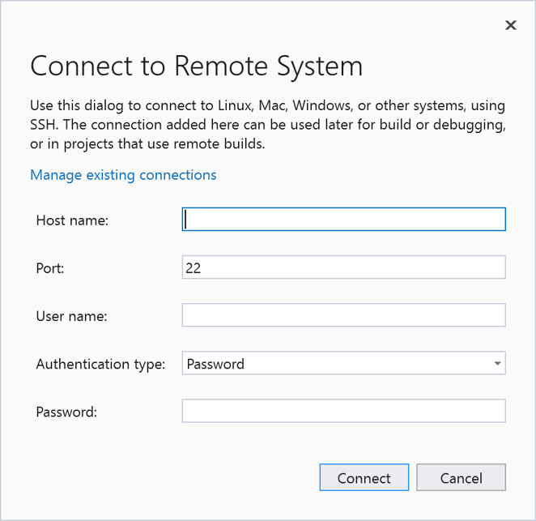
           ::: moniker-end
        1. Enter required connection information and choose **Connect**.
        1. After connecting to the SSH, select a running container to attach to, and then choose **OK**.

      - To set the target to a remote container running a process via a [Docker daemon](https://docs.docker.com/engine/reference/commandline/dockerd/):

        1. Specify the daemon address (that is, via TCP, IP, and so on) under **Docker host (Optional)**, and then choose **Refresh**.
        1. After connecting to the daemon successfully, select a running container to attach to, and then choose **OK**.

4. Choose the corresponding container process from the list of **Available processes** and select **Attach** to start debugging your C# container process in Visual Studio!

   ::: moniker range=">= vs-2022"

   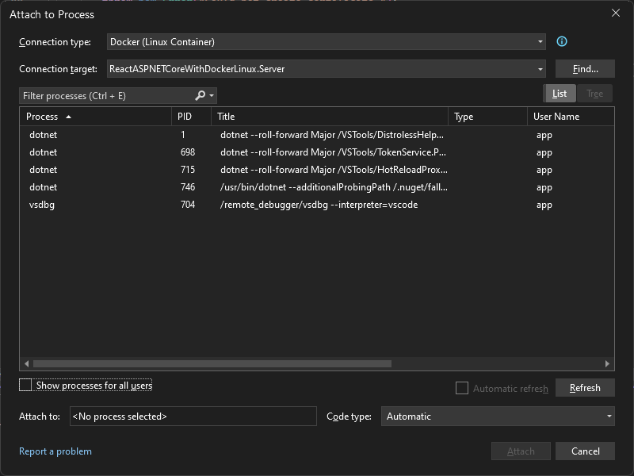
   ::: moniker-end
   ::: moniker range="vs-2019"

   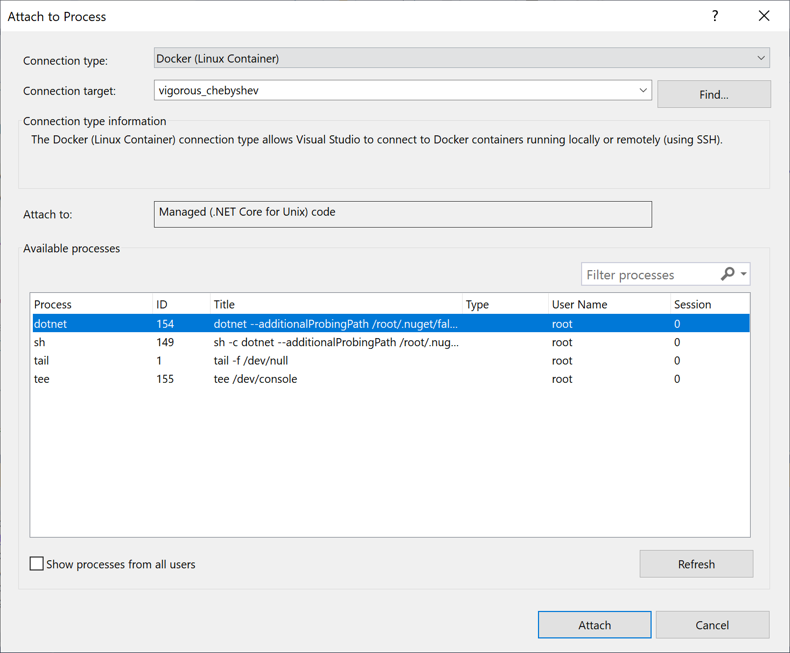
   ::: moniker-end

## Attach to a process running on a Windows Docker container

You can attach the Visual Studio debugger to a process running in a Windows Docker container on your local machine using the **Attach to Process** dialog box.

> [!IMPORTANT]
> To use this feature with a .NET Core process, you must install the .NET Core Cross-Platform Development workload and have local access to the source code.

To attach to a running process in a Windows Docker container:

1. In Visual Studio, select **Debug > Attach to Process** (or **CTRL+ALT+P**) to open the **Attach to Process** dialog box.

2. Set the **Connection type** to **Docker (Windows Container)**.

   ::: moniker range=">= vs-2022"

   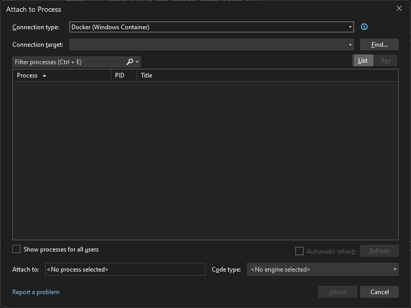
   ::: moniker-end
   ::: moniker range="vs-2019"

   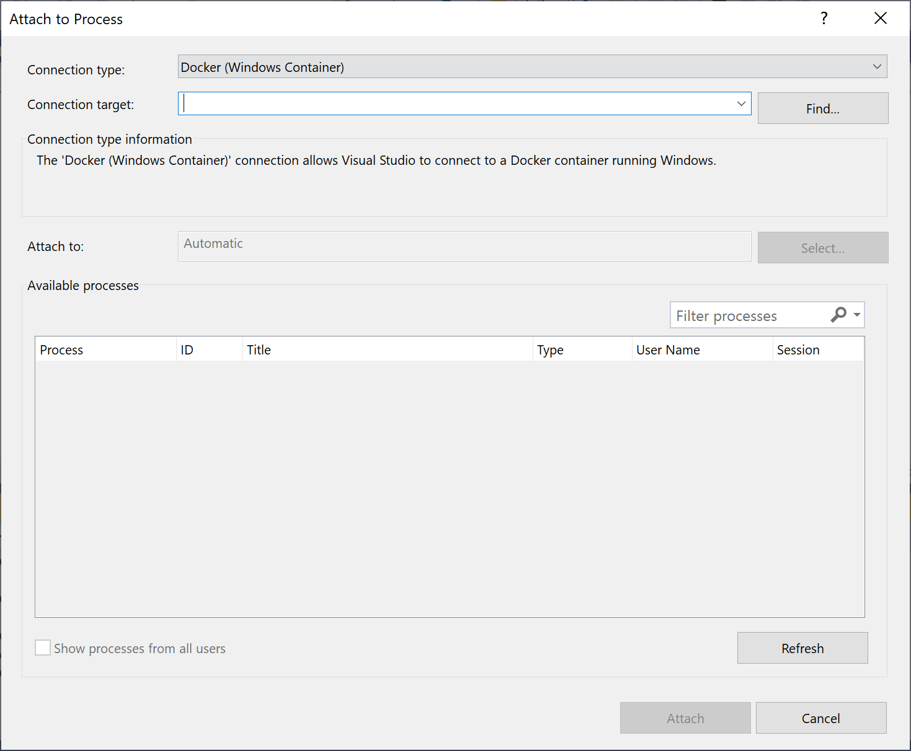
   ::: moniker-end

3. Select **Find...** to set the **Connection target** using the **Select Docker Container** dialog box.

   > [!IMPORTANT]
   > The target process must have the same processor architecture as the Docker Windows container it is running on.

   Setting the target to a remote container via SSH is currently unavailable and can only be done using a Docker daemon.

   To set the target to a remote container running a process via a [Docker daemon](https://docs.docker.com/engine/reference/commandline/dockerd/):

   1. Specify the daemon address (that is, via TCP, IP, and so on) under **Docker host (Optional)** and then choose **Refresh**.

   1. After connecting to the daemon successfully, select a running container to attach to, and then choose **OK**.

4. Choose the corresponding container process from the list of **Available processes** and select **Attach** to start debugging your C# container process.

   ::: moniker range=">= vs-2022"

   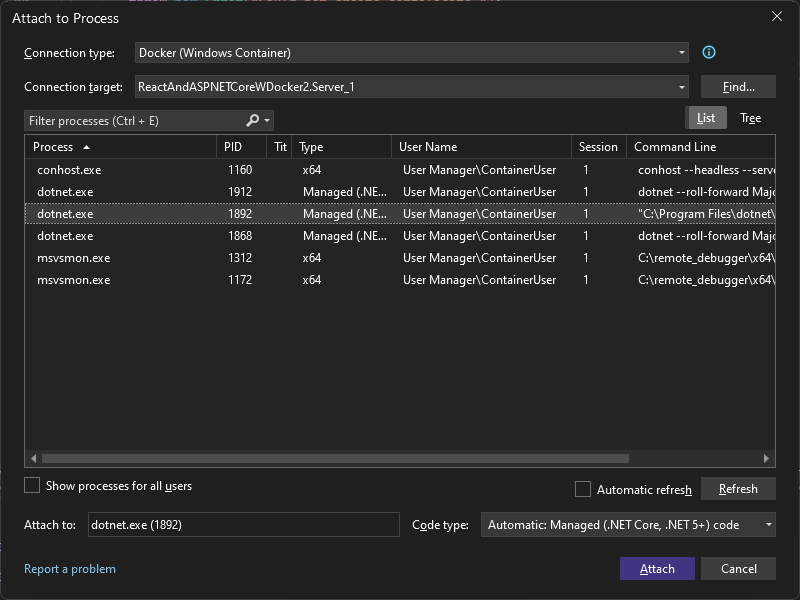
   ::: moniker-end
   ::: moniker range="vs-2019"

   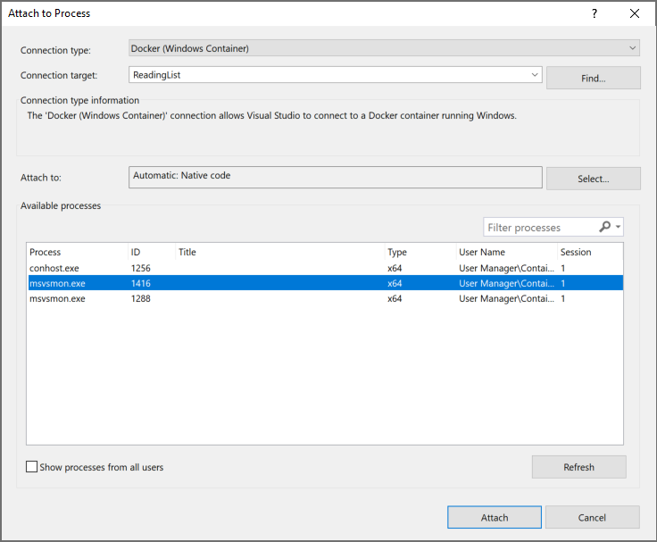
   ::: moniker-end
