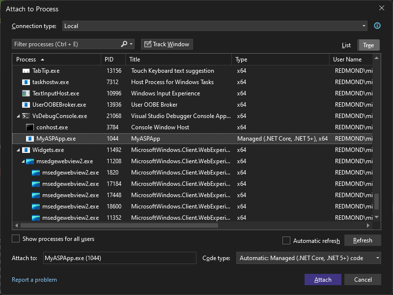

# Attach to running processes with the Visual Studio debugger

You can attach the Visual Studio debugger to a running process on a local or remote computer. After the process is running, select **Debug** > **Attach to Process** or press **Ctrl**+**Alt**+**p** in Visual Studio, and use the **Attach to Process** dialog to attach the debugger to the process.

You can use **Attach to Process** to debug running apps on local or remote computers, debug multiple processes simultaneously, debug apps that weren't created in Visual Studio, or debug any app you didn't start from Visual Studio with the debugger attached. For example, if you're running an app without the debugger and hit an exception, you can then attach the debugger to the process running the app and begin debugging.

> [!TIP]
> Not sure whether to use **Attach to Process** for your debugging scenario? See [Common debugging scenarios](#BKMK_Scenarios).

::: zone pivot="programming-language-dotnet,programming-language-dotnetf,programming-language-cpp,programming-language-all"
##  Attach to a running process on your local machine

To quickly reattach to a process you attached to previously, see [Reattach to a process](#BKMK_reattach).

::: moniker range=">= vs-2022"
Starting in Visual Studio 2022 version 17.10 Preview 2, the Attach to Process dialog box has changed. If you need instructions that match the older dialog box, switch to the Visual Studio 2019 view (upper left version selector in the article).
::: moniker-end

To attach to a process on your local computer:

::: moniker range=">= vs-2022"
1. In Visual Studio, select **Debug** > **Attach to Process** (or press **Ctrl**+**Alt**+**P**) to open the **Attach to Process** dialog box.

1. Set the **Connection type** to **Local**.

   In most local debugging scenarios, you can use **Local**. Some scenarios might require a different connection type. For more info, see other sections in this article or [Common debugging scenarios](#BKMK_Scenarios).

   

1. In the **Available processes** list, find, and select the process or processes you want to attach to.

   - To quickly select a process, type its name or first letter in the **Filter processes** box.
   - If you don't know the process name, browse through the list, or see [Common debugging scenarios](#BKMK_Scenarios) for some common process names.
   - Use the **Track Window** button to enable selecting a window on your computer, which sets the process.

   > [!TIP]
   > Processes can start and stop in the background while the **Attach to Process** dialog box is open, so the list of running processes might not always be current. You can select **Refresh** at any time to see the current list.

1. In the **Code type** field, make sure the type of code you plan to debug is listed.

   The default **Automatic** setting works for most app types, but you can select a specific code type to manually specify the debugger type.

1. Select **Attach**.

> [!TIP]
> In the scenario where you have multiple identical processes, use the Command Line column or the w3wp process details from the Title column to identify the right process.

::: moniker-end

::: moniker range="vs-2019"
1. In Visual Studio, select **Debug** > **Attach to Process** (or press **Ctrl**+**Alt**+**P**) to open the **Attach to Process** dialog box.

1. Check the **Connection type**.

   In most scenarios, you can use **Default**. Some scenarios might require a different connection type. For more info, see other sections in this article or [Common debugging scenarios](#BKMK_Scenarios).

1. Set the **Connection target** to your local machine name.

   

1. In the **Available processes** list, find, and select the process or processes you want to attach to.

   - To quickly select a process, type its name or first letter in the **Filter processes** box.

   - If you don't know the process name, browse through the list, or see [Common debugging scenarios](#BKMK_Scenarios) for some common process names.

   > [!TIP]
   > Processes can start and stop in the background while the **Attach to Process** dialog box is open, so the list of running processes might not always be current. You can select **Refresh** at any time to see the current list.

1. In the **Attach to** field, make sure the type of code you plan to debug is listed. The default **Automatic** setting works for most app types.

   If you are using the **Default** connection type, you can manually select the type of code you want to attach to. Otherwise, the **Select** option might be disabled.

   To select code types manually:
   1. Click **Select**.
   1. In the **Select Code Type** dialog box, select **Debug these code types**.
      If you experience a failure when you try to attach to a process in the list, you can use the [Select Code Type](../debugger/select-code-type-dialog-box.md) dialog box to help [troubleshoot](#BKMK_Troubleshoot_attach_errors) the issue.
   1. Select the code types you want to debug.
   1. Select **OK**.

1. Select **Attach**.

::: moniker-end

> [!NOTE]
> You can be attached to multiple apps for debugging, but only one app is active in the debugger at a time. You can set the active app in the Visual Studio **Debug Location** toolbar or **Processes** window.
::: zone-end

##  Attach to a process on a remote computer

You can also select a remote computer in the **Attach to Process** dialog box, view a list of available processes running on that computer, and attach to one or more of the processes for debugging. The remote debugger (*msvsmon.exe*) must be running on the remote computer. For more information, see [Remote debugging](../debugger/remote-debugging.md).

::: moniker range=">= vs-2022"
Starting in Visual Studio 2022 version 17.10 Preview 2, the Attach to Process dialog box has changed. If you need instructions that match the older dialog box, switch to the Visual Studio 2019 view (upper left version selector in the article).
::: moniker-end

To attach to a running process on a remote computer:

::: moniker range=">= vs-2022"
1. In Visual Studio, select **Debug** > **Attach to Process** (or press **Ctrl**+**Alt**+**P**) to open the **Attach to Process** dialog box.

1. Set the **Connection type** to a remote connection type such as **Remote (Windows)**.

   In most scenarios for remote debugging on Windows, you can use **Remote (Windows)**. Some scenarios, such as debugging Linux or a containerized app, require a different connection type. For more info, see other sections in this article or [Common debugging scenarios](#BKMK_Scenarios).

   The **Connection target** option appears.

1. In the **Connection target** box, select the remote computer, using one of the following methods:

   - Select the dropdown list arrow next to **Connection target**, and select the computer name from the dropdown list.
   - Type the computer name in the **Connection target** box and press **Enter**.
   - Select the **Find** button next to the **Connection target** box to open the **Remote Connections** dialog box. The **Remote Connections** dialog box lists all the devices that are on your local subnet or directly attached to your computer. You might need to [open outbound UDP port 3702](../debugger/remote-debugger-port-assignments.md) on the server to discover remote devices. Select the computer or device you want, and then close the dialog box.

   Verify that Visual Studio adds the required port to the computer name, which appears in the format: **\<remote computer name>:port**

   > [!NOTE]
   > If you can't connect using the remote computer name, try using the IP and port address (for example, `123.45.678.9:4026`). 4026 is the default port for the Visual Studio 2022 remote debugger. For other remote debugger port assignments, see [Remote debugger port assignments](remote-debugger-port-assignments.md).

   The **Connection type** setting persists between debugging sessions. The **Connection target** setting persists between debugging sessions only if a successful debugging connection occurred with that target.

1. Click **Refresh** to populate the **Available processes** list.

    > [!TIP]
    > Processes can start and stop in the background while the **Attach to Process** dialog box is open, so the list of running processes might not always be current. You can select **Refresh** at any time to see the current list.

1. In the **Available processes** list, find, and select the process or processes you want to attach to.

   - To quickly select a process, type its name or first letter in the processes search box.

   - If you don't know the process name, browse through the list, or see [Common debugging scenarios](#BKMK_Scenarios) for some common process names.

   - To find processes running under all user accounts, select the **Show processes from all users** checkbox.

     > [!NOTE]
     > If you try to attach to a process owned by an untrusted user account, a security warning dialog box confirmation will appear. For more information, see [Security Warning: Attaching to a process owned by an untrusted user can be dangerous. If the following information looks suspicious or you are unsure, do not attach to this process](../debugger/security-warning-attaching-to-a-process-owned-by-an-untrusted-user.md).

1. In the **Code type** field, make sure the type of code you plan to debug is listed.

   The default **Automatic** setting works for most app types, but you can select a specific code type to manually specify the debugger type.

1. Select **Attach**.
::: moniker-end

::: moniker range="vs-2019"
1. In Visual Studio, select **Debug** > **Attach to Process** (or press **Ctrl**+**Alt**+**P**) to open the **Attach to Process** dialog box.

1. Check the **Connection type**.

   In most scenarios, you can use **Default**. Some scenarios, such as debugging Linux or a containerized app, require a different connection type. For more info, see other sections in this article or [Common debugging scenarios](#BKMK_Scenarios).

1. In the **Connection target** box, select the remote computer, using one of the following methods:

   - Select the dropdown list arrow next to **Connection target**, and select the computer name from the dropdown list.
   - Type the computer name in the **Connection target** box and press **Enter**.
   - Select the **Find** button next to the **Connection target** box to open the **Remote Connections** dialog box. The **Remote Connections** dialog box lists all the devices that are on your local subnet or directly attached to your computer. You might need to [open outbound UDP port 3702](../debugger/remote-debugger-port-assignments.md) on the server to discover remote devices. Select the computer or device you want, and then select **Select**.

   Verify that Visual Studio adds the required port to the computer name, which appears in the format: **\<remote computer name>:port**

   > [!NOTE]
   > If you can't connect using the remote computer name, try using the IP and port address (for example, `123.45.678.9:4022`). 4024 is the default port for the Visual Studio 2019 remote debugger. For other remote debugger port assignments, see [Remote debugger port assignments](remote-debugger-port-assignments.md).

   The **Connection type** setting persists between debugging sessions. The **Connection target** setting persists between debugging sessions only if a successful debugging connection occurred with that target.

1. Click **Refresh** to populate the **Available processes** list.

    > [!TIP]
    > Processes can start and stop in the background while the **Attach to Process** dialog box is open, so the list of running processes might not always be current. You can select **Refresh** at any time to see the current list.

1. In the **Available processes** list, find, and select the process or processes you want to attach to.

   - To quickly select a process, type its name or first letter in the **Filter processes** box.

   - If you don't know the process name, browse through the list, or see [Common debugging scenarios](#BKMK_Scenarios) for some common process names.

   - To find processes running under all user accounts, select the **Show processes from all users** checkbox.

     > [!NOTE]
     > If you try to attach to a process owned by an untrusted user account, a security warning dialog box confirmation will appear. For more information, see [Security Warning: Attaching to a process owned by an untrusted user can be dangerous. If the following information looks suspicious or you are unsure, do not attach to this process](../debugger/security-warning-attaching-to-a-process-owned-by-an-untrusted-user.md).

1. In the **Attach to** field, make sure the type of code you plan to debug is listed. The default **Automatic** setting works for most app types.

   If you are using the **Default** connection type, you can manually select the type of code you want to attach to. Otherwise, the **Select** option might be disabled.

   To select code types manually:
   1. Click **Select**.
   1. In the **Select Code Type** dialog box, select **Debug these code types**.
      If you experience a failure when you try to attach to a process in the list, you can use the [Select Code Type](../debugger/select-code-type-dialog-box.md) dialog box to help [troubleshoot](#BKMK_Troubleshoot_attach_errors) the issue.
   1. Select **OK**.

1. Select **Attach**.
::: moniker-end

> [!NOTE]
> You can be attached to multiple apps for debugging, but only one app is active in the debugger at a time. You can set the active app in the Visual Studio **Debug Location** toolbar or **Processes** window.

In some cases, when you debug in a Remote Desktop (Terminal Services) session, the **Available processes** list won't display all available processes. If you are running Visual Studio as a user who has a limited user account, the **Available processes** list won't show processes that are running in Session 0. Session 0 is used for services and other server processes, including *w3wp.exe*. You can solve the problem by running Visual Studio under an administrator account or by running Visual Studio from the server console instead of a Remote Desktop session.

If neither of those workarounds is possible, a third option is to attach to the process by running `vsjitdebugger.exe -p <ProcessId>` from the Windows command line. You can determine the process ID using *tlist.exe*. To obtain *tlist.exe*, download and install Debugging Tools for Windows, available at [WDK and WinDbg downloads](/windows-hardware/drivers/download-the-wdk).

::: zone pivot="programming-language-dotnet"
::: moniker range=">= vs-2022"

## Attach to a .NET Core process running on Azure App Service (Windows)

If you're publishing to Azure App Service (Windows), see [Remote debug ASP.NET Core on Azure](../debugger/remote-debugging-azure-app-service.md) or [Debugging Azure App Service](/azure/vs-azure-tools-debug-cloud-services-virtual-machines#debugging-azure-app-services) for instructions.
::: moniker-end

::: moniker range="vs-2019"

## Attach to a .NET Core process running on Azure App Service (Windows)

If you're publishing to Azure App Service (Windows), you'll find the **Attach Debugger** option under the **...** menu under **Hosting** in the publish profile. Visual Studio attempts to attach the remote debugger to the instance of Azure App Service (Windows) that the profile is publishing to.

:::image type="content" source="../debugger/media/attach-debugger-publish-profile.png" alt-text="Screenshot of the Attach Debugger option from within the Publish summary page.":::
::: moniker-end

## Attach to a .NET Core process running on Linux using SSH

For more information, see [Remote debug .NET Core running on Linux using SSH](../debugger/remote-debugging-dotnet-core-linux-with-ssh.md).
::: zone-end

##  Attach to a process running on a Docker container

Starting in Visual Studio 2019, you can attach the Visual Studio debugger to a process running on a Docker container. For a Linux .NET Core Docker container, see [Attach to a process running on a Linux Docker container](../debugger/attach-to-process-running-in-docker-container.md#attach-to-a-process-running-on-a-linux-docker-container). For a Windows Docker container, see [Attach to a process running on a Windows Docker container](../debugger/attach-to-process-running-in-docker-container.md#attach-to-a-process-running-on-a-windows-docker-container).

##  Reattach to a process

You can quickly reattach to processes that you were previously attached to by choosing **Debug** > **Reattach to Process** (**Shift**+**Alt**+**P**). When you choose this command, the debugger will immediately try to attach to the last processes you attached to by first attempting to match the previous process ID and if that fails, by matching to the previous process name. If no matches are found, or if several processes have the same name, the **Attach to Process** dialog box will open so you can select the correct process.

> [!NOTE]
> The **Reattach to Process** command is available starting in Visual Studio 2017.

##  Common debugging scenarios

To help you determine whether to use **Attach to Process** and what process to attach to, the following table shows a few common debugging scenarios, with links to more instructions where available. (The list is not exhaustive.)

To quickly select a running process to attach to, in Visual Studio, type **Ctrl**+**Alt**+**P**, and then type the first letter of the process name.

For the debugger to attach to code written in C++, the code needs to emit `DebuggableAttribute`. You can add this to your code automatically by linking with the [/ASSEMBLYDEBUG](/cpp/build/reference/assemblydebug-add-debuggableattribute) linker option.

::: moniker range=">= vs-2022"
For client-side script debugging, script debugging must be enabled in the browser. For debugging client-side script on Chrome, choose **JavaScript or TypeScript** as the code type, and depending on your app type, you might need to close all Chrome instances and start the browser in debugging mode (type `chrome.exe --remote-debugging-port=9222` from a command line).
::: moniker-end

::: moniker range="vs-2019"
For client-side script debugging, script debugging must be enabled in the browser. For debugging client-side script on Chrome, choose **JavaScript (Chrome)** or **JavaScript (Microsoft Edge - Chromium)** as the code type, and depending on your app type, you might need to close all Chrome instances and start the browser in debugging mode (type `chrome.exe --remote-debugging-port=9222` from a command line). In earlier versions of Visual Studio, the script debugger for Chrome was **Web kit**.
::: moniker-end

|Scenario|Debug method|Process name|Notes and links|
|-|-|-|-|
|ASP.NET Core - Remote debug on Internet Information Services (IIS) server|Use remote tools and **Attach to Process**|*w3wp.exe* or *dotnet.exe*|Starting in .NET Core 3, the *w3wp.exe* process is used for the default [in-app hosting model](/aspnet/core/host-and-deploy/aspnet-core-module?view=aspnetcore-3.1&preserve-view=true#hosting-models). For app deployment, see [Publish to IIS](/aspnet/core/host-and-deploy/iis/). For more detailed information, see [Remote debugging ASP.NET Core on a remote IIS computer](../debugger/remote-debugging-aspnet-on-a-remote-iis-computer.md#BKMK_attach)|
|ASP.NET Core - Debug on the local machine after you start the app without the debugger|Use **Attach to Process**|*appname.exe* or *iisexpress.exe*|This might be helpful to make your app load faster, such as (for example) when profiling. The default local server (kestrel) process for ASP.NET Core is *appname.exe*.|
|ASP.NET 4 or 4.5 - Remote debug on an IIS server|Use remote tools and **Attach to Process**|*w3wp.exe*|See [Remote debugging ASP.NET on a remote IIS computer](../debugger/remote-debugging-aspnet-on-a-remote-iis-7-5-computer.md)|
|Client-side script - Debug on a local IIS server, for supported app types |Use **Attach to Process**|*chrome.exe* or *msedge.exe*|Script debugging must be enabled. For Chrome, you must also run Chrome in debug mode (type `chrome.exe --remote-debugging-port=9222` from a command line) and select **JavaScript or TypeScript** in the **Attach to** field.|
|C#, Visual Basic, or C++ app - Debug on the local machine|Use either standard debugging (**F5**) or **Attach to Process**|*{appname}.exe*|In most scenarios, use standard debugging and not **Attach to Process**.|
|Windows desktop app - Remote debug|Remote tools|N/A| See [Remote debug a C# or Visual Basic app](../debugger/remote-debugging-csharp.md) or [Remote debug a C++ app](../debugger/remote-debugging-cpp.md)|
|.NET Core on Linux - Debug|Use **Attach to Process**|*dotnet.exe* or a unique process name|To use SSH, see [Remote debug .NET Core running on Linux using SSH](../debugger/remote-debugging-dotnet-core-linux-with-ssh.md). For containerized apps, see [Attach to a process running in a Docker container](../debugger/attach-to-process-running-in-docker-container.md#attach-to-a-process-running-on-a-linux-docker-container).|
|Containerized app - Debug|Use **Attach to Process**|*dotnet.exe* or a unique process name|See [Attach to a process running in a Docker container](../debugger/attach-to-process-running-in-docker-container.md)|
|Python on Linux - Remote debug|Use **Attach to Process**|*debugpy*|See [Attach remotely from Python Tools](../python/debugging-python-code-on-remote-linux-machines.md#attach-remotely-from-python-tools)|
|Other supported app types - Debug on a server process|If server is remote, use remote tools, and **Attach to Process**|*chrome.exe*, *msedge.exe*, or other processes|If necessary, use Resource Monitor to help identify the process. See [Remote debugging](../debugger/remote-debugging.md).|
|Universal Windows Platform (UWP) App, OneCore, HoloLens, or IoT app - Remote debug|Debug installed app package|N/A|See [Debug an installed app package](debug-installed-app-package.md) instead of using **Attach to Process**|
|UWP App, OneCore, HoloLens, or IoT - Debug an app that you didn't start from Visual Studio|Debug installed app package|N/A|See [Debug an installed app package](debug-installed-app-package.md) instead of using **Attach to Process**|

## Use debugger features

To use the full features of the Visual Studio debugger (like hitting breakpoints) when attaching to a process, the app must exactly match your local source and symbols. That is, the debugger must be able to load the correct [symbol (.pdb) files](../debugger/specify-symbol-dot-pdb-and-source-files-in-the-visual-studio-debugger.md). By default, this requires a debug build.

For remote debugging scenarios, you must have the source code (or a copy of the source code) already open in Visual Studio. The compiled app binaries on the remote machine must come from the same build as on the local machine.

In some local debugging scenarios, you can debug in Visual Studio with no access to the source if the correct symbol files are present with the app. By default, this requires a debug build. For more information, see [Specify symbol and source files](../debugger/specify-symbol-dot-pdb-and-source-files-in-the-visual-studio-debugger.md).

##  Troubleshoot attach errors

::: moniker range=">= vs-2022"
In some scenarios, the debugger might need help to correctly identify the type of code to debug. If the connection values are set correctly (you can view the correct process in the **Available processes** list), but the debugger fails to attach, try to select the most appropriate debugger in the **Code type** list, which might be required, for example, if you are debugging a Linux or Python app.
::: moniker-end

::: moniker range="vs-2019"
In some scenarios, the debugger might need help to correctly identify the type of code to debug. If the connection values are set correctly (you can view the correct process in the **Available processes** list), but the debugger fails to attach, try to select the most appropriate connection type in the **Connection type** list, which might be required, for example, if you are debugging a Linux or Python app. If you are using the Default connection type, then you can alternatively select the specific type of code to connect to, as described later in this section.

When the debugger attaches to a running process, the process can contain one or more types of code. The code types the debugger can attach to are displayed and selected in the [Select Code Type](../debugger/select-code-type-dialog-box.md) dialog box.
::: moniker-end

Sometimes, the debugger can successfully attach to one code type, but not to another code type. Typically, this occurs when:

- You try to attach to a process that is running on a remote computer. The remote computer might have remote debugging components installed for some code types but not for others.
- You try to attach to two or more processes for direct database debugging. SQL debugging supports attaching to a single process only.

If the debugger is able to attach to some, but not all, code types, you see a message identifying which types failed to attach.

If the debugger successfully attaches to at least one code type, you can proceed to debug the process. You will be able to debug only the code types that were successfully attached. The unattached code in the process will still run, but you won't be able to set breakpoints, view data, or perform other debugging operations on that code.

If you want more specific information about why the debugger failed to attach to a code type, try to reattach to only that code type.

### Obtain specific information about why a code type failed to attach

::: moniker range=">= vs-2022"
1. Detach from the process. On the **Debug** menu, select **Detach All**.

1. Reattach to the process, selecting only the code type that failed to attach.

    1. In the **Attach to Process** dialog box, select the process in the **Available processes** list.

    2. In the **Code type** option, select the code type that failed to attach. Deselect the other code types.

    3. In the **Attach to Process** dialog box, select **Attach**.

    This time, the attach will fail completely, and you will get a specific error message.
::: moniker-end

::: moniker range="vs-2019"
1. Detach from the process. On the **Debug** menu, select **Detach All**.

1. Reattach to the process, selecting only the code type that failed to attach.

    1. In the **Attach to Process** dialog box, select the process in the **Available processes** list.

    2. Select **Select**.

    3. In the **Select Code Type** dialog box, select **Debug these code types** and the code type that failed to attach. Deselect the other code types.

    4. Select **OK**.

    5. In the **Attach to Process** dialog box, select **Attach**.

    This time, the attach will fail completely, and you will get a specific error message.
::: moniker-end

## Related content

- [Debug multiple processes](../debugger/debug-multiple-processes.md)
- [Just-In-Time debugging](../debugger/just-in-time-debugging-in-visual-studio.md)
- [Remote debugging](../debugger/remote-debugging.md)
