# Inspect variables and return values in the Visual Studio debugger

When you try to debug an issue, you're often attempting to find out whether variables are storing the values that you expect them to have in a particular app state. Some of the most useful features of the debugger are those that allow you to inspect variables.

This article shows you how to inspect variables and view return values using the debugger in Visual Studio. The debugger provides several convenient ways to perform these tasks, including the following:

- In the code editor, you can view data tips and inline return values
- In debugger windows (Autos, Locals, and Watch windows), you can view variable values
- In visualizers, you can view large strings or complex .NET objects

These features are only available while debugging. To learn how to start a debugging session, see [Start debugging and enter break mode](../debugger/navigating-through-code-with-the-debugger.md#start-debugging-and-enter-break-mode).

> [!NOTE]
> If this is the first time that you've tried to debug code, you might want to read [Debugging for absolute beginners](../debugger/debugging-absolute-beginners.md) and [Debugging techniques and tools](../debugger/write-better-code-with-visual-studio.md) before going through this article.

## View variables in the code editor

Often, when debugging, you want a quick way to check property values on objects in the code editor, and the data tips are a good way to do it.

While paused in the debugger, hover over an object with the mouse and you see its value, or its default property value.

::: moniker range=">= vs-2022"
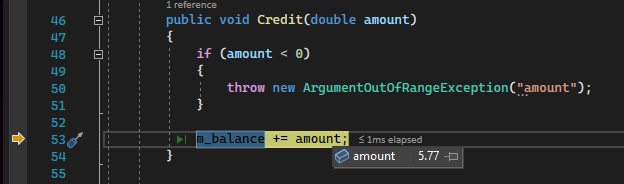
::: moniker-end
::: moniker range="<= vs-2019"
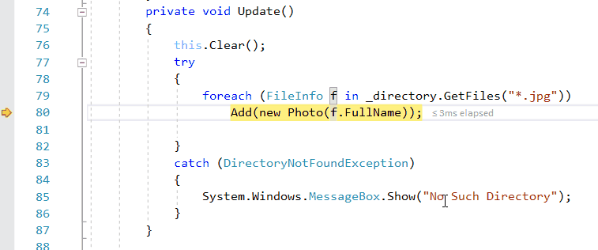
::: moniker-end

If the variable has properties, you can expand the object to see all its properties.

For detailed information on using data tips, see [View data values in data tips](../debugger/view-data-values-in-data-tips-in-the-code-editor.md).

::: moniker range=">= vs-2022"
## View inline return values of method calls in the code editor

In .NET and C++ code, you can examine return values when you step over or out of a method call, which can be useful when the return value isn't stored in a local variable. A method could be used as a parameter, or as the return value of another method.

Starting in Visual Studio 2022 version 17.12, you can view return values of method calls inline and not just in the [Autos window](#view-return-values-in-the-autos-window).

[ 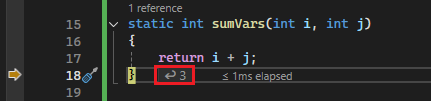 ](../debugger/media/vs-2022/view-return-values.png#lightbox)

With Copilot enabled, you can also get targeted assistance related to the inline return value by using the Ask Copilot button that appears in the data tip for the return value.

[ 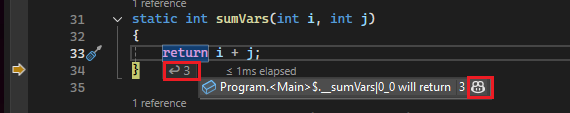 ](../debugger/media/vs-2022/view-return-values-copilot.png#lightbox)
::: moniker-end

## Set a watch on variables

You can use a **Watch** window to specify a variable (or an expression) that you want to keep an eye on.

While debugging, right-click an object and choose **Add Watch**. A Watch window opens.

::: moniker range=">= vs-2022"
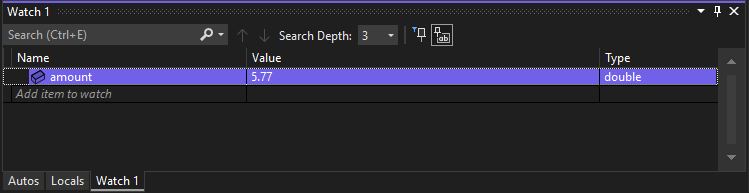
::: moniker-end
::: moniker range="<= vs-2019"
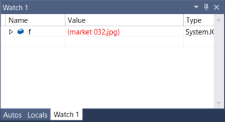
::: moniker-end

In this example, you've a watch set on the object, and you can see its value change as you move through the debugger. Unlike the other variable windows, the **Watch** windows always show the variables that you're watching (they're grayed out when out of scope).

For detailed information, see [Set a Watch using the Watch and QuickWatch Windows](../debugger/watch-and-quickwatch-windows.md).

::: moniker range=">= vs-2022"
## Get AI assistance

If you have [Copilot](../ide/visual-studio-github-copilot-extension.md), you can get AI assistance while you're looking at variables in the Autos or Locals windows, or in data tips in the code editor. Right-click on a variable and use the **Ask Copilot** 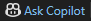 button. In this scenario, Copilot already knows the context for your question, so you don't need to provide context yourself in chat. For more information, see [Debug with Copilot](../debugger/debug-with-copilot.md).
::: moniker-end

## Inspect variables in debugger windows (Autos and Locals)

The **Autos** and **Locals** windows show variable values while you're debugging. The windows are only available during a debugging session. The **Autos** window shows variables used around the current statement where the debugger is paused. The **Locals** window shows variables defined in the local scope, which is usually the current function or method.

- To open the **Autos** window, while debugging, select **Debug** > **Windows** > **Autos**, or press **Ctrl**+**Alt**+**V** > **A**.

  The **Autos** window is available for C#, Visual Basic, C++, and Python code, but not for JavaScript or F#.

- To open the **Locals** window, while debugging, select **Debug** > **Windows** > **Locals**, or press **Alt**+**4**.

Expandable arrays and objects show up in the **Autos** and **Locals** windows. Select the arrow to the left of a variable name to expand the view to show fields and properties. Here is an example of a <xref:System.IO.FileStream?displayProperty=fullName> object in the **Locals** window:

::: moniker range=">= vs-2022"
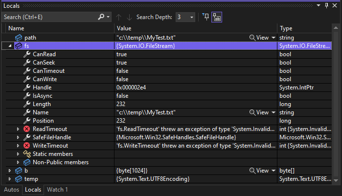
::: moniker-end
::: moniker range="vs-2019"

::: moniker-end

A red value in the **Locals** or **Autos** window means the value has changed since the last evaluation. The change could be from a previous debugging session, or because you have changed the value in the window.

The default numeric format in debugger windows is decimal. To change it to hexadecimal, right-click in the **Locals** or **Autos** window and select **Hexadecimal Display**. This change affects all debugger windows.

## Edit variable values in the Autos or Locals window

To edit the values of most variables in the **Autos** or **Locals** windows, double-click the value and enter the new value.

You can enter an expression for a value, for example `a + b`. The debugger accepts most valid language expressions.

In native C++ code, you might have to qualify the context of a variable name. For more information, see [Context operator (C++)](../debugger/context-operator-cpp.md).

>[!CAUTION]
> Make sure you understand the consequences before you change values and expressions. Some possible issues are:
>
>- Evaluating some expressions can change the value of a variable or otherwise affect the state of your program. For example, evaluating `var1 = ++var2` changes the value of both `var1` and `var2`. These expressions are said to have [side effects](https://en.wikipedia.org/wiki/Side_effect_\(computer_science\)). Side effects can cause unexpected results if you're not aware of them.
>
>- Editing floating-point values can result in minor inaccuracies because of decimal-to-binary conversion of fractional components. Even a seemingly harmless edit can result in changes to some of the bits in the floating-point variable.

## Search in the Autos or Locals window

You can search for keywords in the Name, Value, and Type columns of the **Autos** or **Locals** window using the search bar above each window. Hit ENTER or select one of the arrows to execute a search. To cancel an ongoing search, select the "x" icon in the search bar.

Use the left and right arrows (Shift+F3 and F3, respectively) to navigate between found matches.

::: moniker range=">= vs-2022"
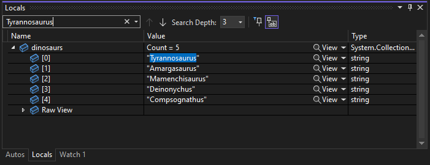
::: moniker-end
::: moniker range="vs-2019"
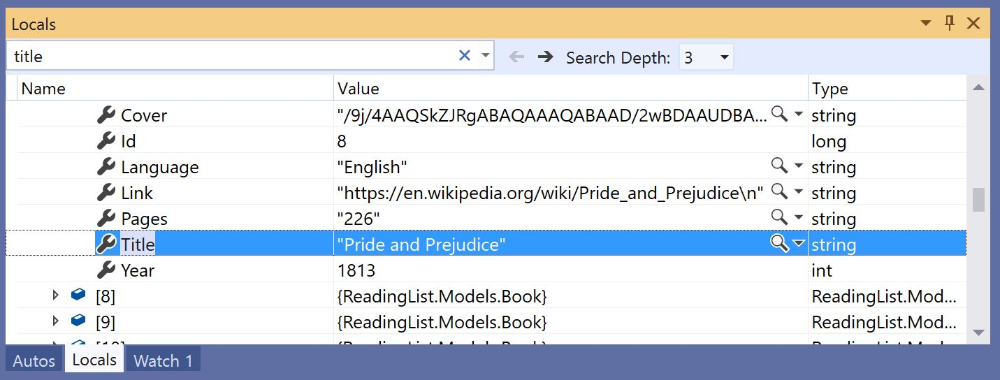
::: moniker-end

To make your search more or less thorough, use the **Search Deeper** dropdown list at the top of the **Autos** or **Locals** window to select how many levels deep you want to search into nested objects.

## Pin properties in the Autos or Locals window

> [!NOTE]
> This feature is supported for .NET Core 3.0 or higher.

You can quickly inspect objects by their properties in the Autos and Locals windows with the **Pinnable Properties** tool. To use this tool, hover over a property and select the pin icon that appears or right-click and select the **Pin Member as Favorite** option in the resulting context menu. This bubbles up that property to the top of the object's property list, and the property name and value are displayed in the **Value** column. To unpin a property, select the pin icon again or select the **Unpin Member as Favorite** option in the context menu.

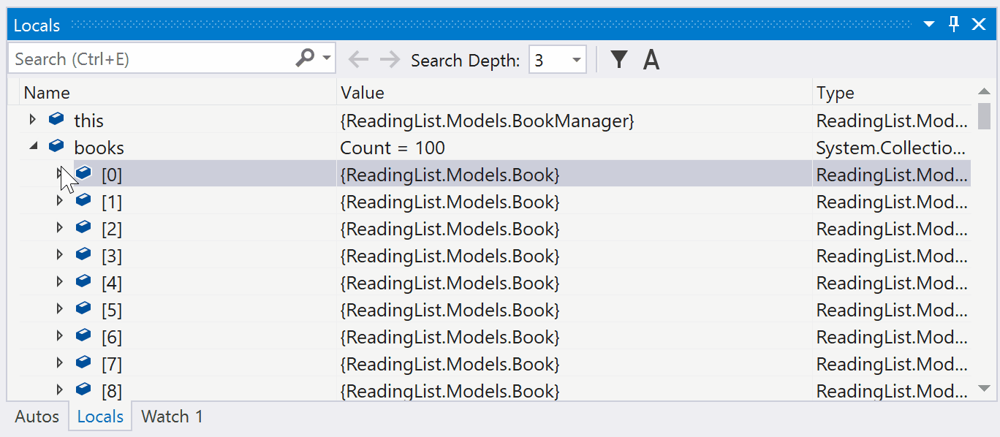

You can also toggle property names and filter out non-pinned properties when viewing the object's property list in the Autos or Locals windows. You can access each option by selecting the buttons in the toolbar above the Autos or Locals windows.

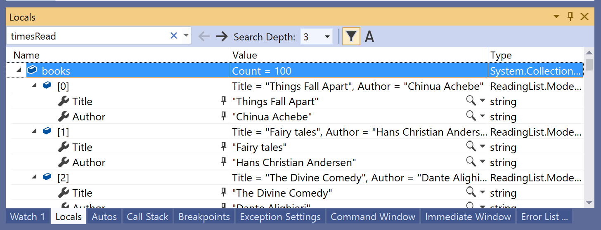

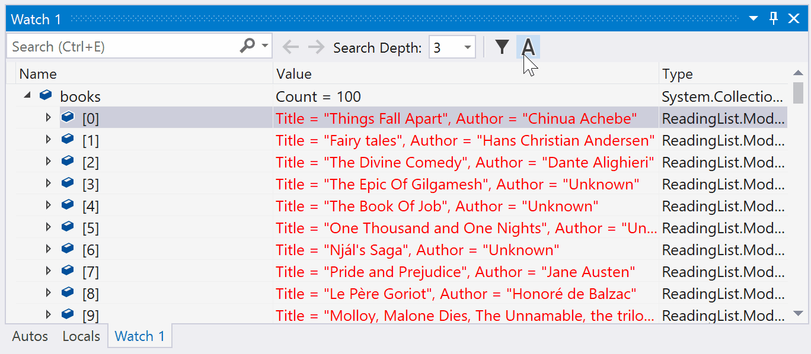

## Change the context for the Autos or Locals window

You can use the **Debug Location** toolbar to select a desired function, thread, or process, which changes the context for the **Autos** and **Locals** windows.

To enable the **Debug Location** toolbar, click in an empty part of the toolbar area and select **Debug Location** from the dropdown list, or select **View** > **Toolbars** > **Debug Location**.

Set a breakpoint and start debugging. When the breakpoint is hit, execution pauses and you can see the location in the **Debug Location** toolbar.

::: moniker range=">= vs-2022"
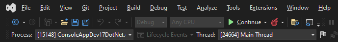
::: moniker-end
::: moniker range="vs-2019"
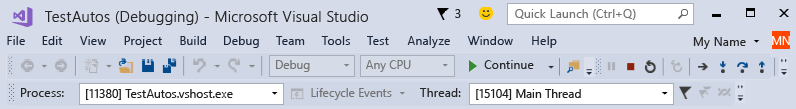
::: moniker-end

## <a name="bkmk_whatvariables"></a> Language differences in the Autos window (C#, C++, Visual Basic, Python)

Different code languages display different variables in the **Autos** window.

- In C# and Visual Basic, the **Autos** window displays any variable used on the current or preceding line. For example, in C# or Visual Basic code, declare the following four variables:

   ```csharp
       public static void Main()
       {
          int a, b, c, d;
          a = 1;
          b = 2;
          c = 3;
          d = 4;
       }
   ```

   Set a breakpoint on the line `c = 3;`, and start the debugger. When execution pauses, the **Autos** window will display:

   ::: moniker range=">= vs-2022"
   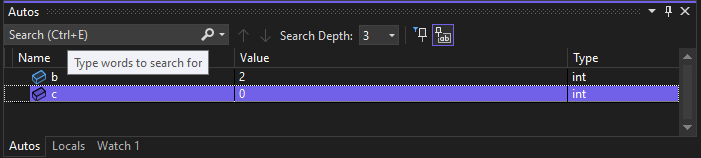
   ::: moniker-end
   ::: moniker range="vs-2019"
   
   ::: moniker-end

   The value of `c` is 0, because the line `c = 3` has not yet been executed.

- In C++, the **Autos** window displays the variables used in at least three lines before the current line where execution is paused. For example, in C++ code, declare six variables:

   ```cpp
       void main() {
           int a, b, c, d, e, f;
           a = 1;
           b = 2;
           c = 3;
           d = 4;
           e = 5;
           f = 6;
       }
   ```

    Set a breakpoint on the line `e = 5;` and run the debugger. When execution stops, the **Autos** window will display:

    ::: moniker range=">= vs-2022"
    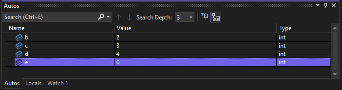
    ::: moniker-end
    ::: moniker range="vs-2019"
    
    ::: moniker-end

    The variable `e` is uninitialized, because the line `e = 5` has not yet been executed.

## View return values in the Autos window

In the following example, this C# code adds the return values of two functions:

```csharp
static void Main(string[] args)
{
    int a, b, c, d;
    a = 1;
    b = 2;
    c = 3;
    d = 4;
    int x = sumVars(a, b) + subtractVars(c, d);
}

private static int sumVars(int i, int j)
{
    return i + j;
}

private static int subtractVars(int i, int j)
{
    return j - i;
}
```

To see the return values of the `sumVars()` and `subtractVars()` method calls in the Autos window:

1. Set a breakpoint on the `int x = sumVars(a, b) + subtractVars(c, d);` line.

1. Start debugging, and when execution pauses at the breakpoint, select **Step Over** or press **F10**. You should see the following return values in the **Autos** window:

   ::: moniker range=">= vs-2022"
   [ 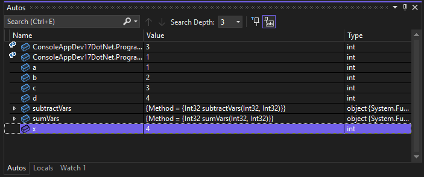](../debugger/media/vs-2022/autos-return-value-csharp-2.png#lightbox)
   ::: moniker-end
   ::: moniker range="vs-2019"
   
   ::: moniker-end

## Open a visualizer to inspect variables

While you're debugging in Visual Studio, you can view large strings or complex objects with built-in visualizers that make the data easier to inspect. For example:

- The string visualizer shows text, XML, HTML, and JSON strings that are too long for a data tip or debugger window. It can also help you identify malformed strings. For more information, see [View strings in a string visualizer](../debugger/view-strings-visualizer.md). 
- The DataSet and IEnumerable visualizers show .NET collection objects in a tabular visualizer. For more information, see [Tabular visualizers in Visual Studio](../debugger/view-data-in-tabular-visualizer.md)) objects.

The visualizers appear in the **Autos** windows, data tips, and other debugger windows.

> [!NOTE]
> If you need to inspect XAML or WPF UI elements in a visualizer, see or [Inspect XAML properties while debugging](../xaml-tools/inspect-xaml-properties-while-debugging.md) or [How to use the WPF tree visualizer](../debugger/how-to-use-the-wpf-tree-visualizer.md).

To open a visualizer, you must be paused during debugging. Hover over a variable that has a supported visualizer value, and select the magnifying glass icon 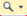.

::: moniker range=">= vs-2022"
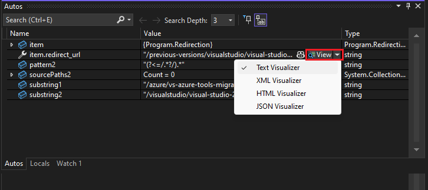
::: moniker-end
::: moniker range="vs-2019"
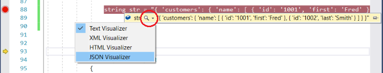
::: moniker-end

## Related content

- [What is debugging?](../debugger/what-is-debugging.md)
- [Debugging techniques and tools](../debugger/write-better-code-with-visual-studio.md)
- [First look at debugging](../debugger/debugger-feature-tour.md)
- [Debugger windows](../debugger/debugger-windows.md)
